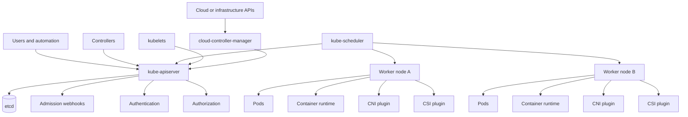

# 2.1 Cluster Architecture Overview

## Purpose of This Section

This section introduces Kubernetes cluster architecture from the point of view of an SRE responsible for production reliability.

A Kubernetes cluster is not only a collection of servers running containers. It is a distributed control system with an API, a strongly
consistent state store, controllers, schedulers, node agents, networking plugins, storage integrations, identity systems, and provider
interfaces.

For an engineer operating Kubernetes in production, cluster architecture matters because most incidents are not isolated to a single
component. A failed rollout, a stuck Pod, a slow API server, a broken node, a missing endpoint, or a cloud-provider outage often reflects a
chain of dependencies across the cluster.

The goal of this section is to build the mental model needed to answer four questions during design reviews and incidents:

- Which component owns this decision?
- Where is the desired state stored?
- Which process is supposed to reconcile actual state?
- Which dependency is preventing the cluster from converging?

## What a Kubernetes Cluster Is

A Kubernetes cluster consists of a control plane and one or more worker nodes.

The control plane exposes the Kubernetes API, stores cluster state, makes scheduling decisions, and runs controllers that reconcile desired
state. Worker nodes run application Pods and the local agents needed to make those Pods function.

At production scale, the cluster also depends on external systems:

- cloud or data center infrastructure
- identity providers
- container registries
- DNS
- load balancers
- storage platforms
- observability systems
- certificate authorities
- policy engines
- CI/CD systems

Kubernetes coordinates these systems through APIs and controllers, but it does not remove the need to understand their failure modes.

## Reference Architecture

A simplified production cluster looks like this:



This diagram is intentionally simplified. Real clusters may include multiple API server instances, multiple control-plane nodes, external
etcd members, dedicated node pools, gateway controllers, service meshes, autoscalers, policy controllers, backup controllers, and managed
provider integrations.

The important point is that Kubernetes is API-centered. Most components do not coordinate by directly calling each other. They observe and
update state through the API server.

## Control Plane Responsibilities

The control plane is responsible for cluster-level decisions and state management.

| Component | Primary responsibility | Production concern |
| --- | --- | --- |
| kube-apiserver | Serves the Kubernetes API and handles request flow. | Availability, latency, authentication, authorization, admission, and request pressure. |
| etcd | Stores Kubernetes API state. | Quorum, disk latency, backup, restore, compaction, defragmentation, and corruption recovery. |
| kube-scheduler | Assigns unscheduled Pods to suitable nodes. | Pending Pods, constraints, resource requests, topology, taints, tolerations, and scheduling latency. |
| kube-controller-manager | Runs built-in controllers that reconcile cluster state. | Controller lag, failed reconciliation, workqueue pressure, and event storms. |
| cloud-controller-manager | Integrates Kubernetes with provider APIs where applicable. | Node lifecycle, load balancers, routes, volumes, identity, and provider API throttling. |

The control plane does not run application containers in the normal worker-node sense. It coordinates cluster behavior and records desired and
observed state.

## Node Responsibilities

Worker nodes are where application workloads run. A node can be a virtual machine, a bare-metal server, or another supported compute
substrate depending on the environment.

| Node component | Primary responsibility | Production concern |
| --- | --- | --- |
| kubelet | Ensures assigned Pods are running and reports node and Pod status. | Node readiness, pod lifecycle, probes, image pulls, volume mounts, and eviction behavior. |
| Container runtime | Runs containers for Pods. | Runtime availability, image handling, container start latency, and sandbox failures. |
| kube-proxy or dataplane equivalent | Implements Service traffic behavior in many clusters. | Service routing, endpoint updates, iptables/IPVS/eBPF behavior, and node-local traffic issues. |
| CNI plugin | Configures Pod networking and network policy behavior. | Pod IP allocation, routing, DNS reachability, network policy enforcement, and dataplane health. |
| CSI plugin | Integrates storage systems with Kubernetes. | Volume attach, mount, resize, snapshot, node plugin health, and storage topology. |

An SRE should treat node health as application health. A node can be `Ready` while still causing user-visible problems if DNS, CNI, CSI,
runtime, disk, or kernel behavior is degraded.

## Desired State, Observed State, and Convergence

Kubernetes is built around declarative desired state.

A user or automation submits an object to the API server. The API server validates and persists the object in etcd. Controllers, schedulers,
and kubelets observe the object and take action. The system continues working until observed state moves closer to desired state.

A basic Deployment flow looks like this:

```text
User applies Deployment
        |
        v
kube-apiserver authenticates, authorizes, admits, and stores object
        |
        v
Deployment controller creates or updates ReplicaSet
        |
        v
ReplicaSet controller creates Pods
        |
        v
Scheduler assigns unscheduled Pods to Nodes
        |
        v
kubelet starts containers through the runtime
        |
        v
kubelet reports Pod and container status back to API server
```

This explains why production troubleshooting is often a convergence problem. The question is rarely only, "What command failed?" The better
question is, "Which control loop cannot make progress, and why?"

## Communication Model

Kubernetes uses the API server as the central coordination point.

Node components, controllers, schedulers, users, automation, and operators use the API server to read or change cluster state. The API server
is the main authenticated and authorized endpoint for cluster control.

From an operations perspective, this has important implications:

- API server health affects almost every cluster operation.
- API server latency can delay rollouts, scheduling, autoscaling, and incident response.
- Authorization or admission failures can look like workload failure when automation is blocked.
- Watch pressure and client behavior can affect control-plane load.
- Control-plane-to-node communication paths must be understood and secured.

In managed Kubernetes, the provider may operate the control plane, but the workload impact of API latency or provider integration failure is
still visible to the customer.

## High Availability Model

Production clusters usually use more than one control-plane node and more than one worker node.

High availability does not mean every component can fail without impact. It means the architecture is designed so that common failures can be
absorbed within defined limits.

Important high-availability boundaries include:

- API server replica availability
- etcd quorum and storage latency
- scheduler and controller-manager leader election
- worker node redundancy
- zone and rack distribution
- network and DNS dependency availability
- storage backend redundancy
- cloud provider API availability
- load balancer health and failover

A cluster may be highly available at the control plane and still fragile at the workload layer if all replicas run in one zone, depend on one
storage backend, or share one external dependency.

## Managed Kubernetes Responsibility Boundaries

Managed Kubernetes changes the operating model but not the architecture model.

In EKS, AKS, GKE, and similar platforms, the provider usually manages some or all control-plane operations. Depending on the product mode, the
provider may also manage node provisioning, upgrades, networking defaults, or operational automation.

The customer still needs to understand:

- Kubernetes API behavior
- workload architecture
- node pool design
- identity and RBAC
- networking policy
- storage class behavior
- upgrade impact
- observability signals
- incident response boundaries
- provider-specific support escalation paths

A managed control plane reduces operational burden. It does not eliminate platform engineering ownership.

## Real Production Example

A team reports that a critical API Deployment is stuck during a rollout. The Deployment shows new Pods in `Pending` state.

A shallow investigation may stop at:

```bash
kubectl get pods
```

A production investigation follows the architecture path:

```bash
kubectl describe pod <pending-pod-name>
kubectl get nodes
kubectl describe node <candidate-node-name>
kubectl get events --sort-by=.lastTimestamp
kubectl get deployment <deployment-name> -o yaml
```

Possible causes map to different components:

| Symptom | Likely owner | Architectural area |
| --- | --- | --- |
| No node satisfies CPU or memory requests | Scheduler | Scheduling and capacity planning |
| Pod requires a zone-specific volume | Scheduler and CSI | Storage topology |
| Node is `NotReady` | kubelet and node controller | Node lifecycle |
| Image pull fails | kubelet and runtime | Registry and runtime path |
| Admission webhook rejects the Pod | API server and admission | Policy path |
| Cloud API cannot attach a volume | cloud-controller-manager or CSI | Provider integration |

This is why SREs learn the architecture. It turns symptoms into a search path.

## SRE Operating Checklist

Use this checklist when reviewing a cluster architecture:

- Identify who operates the control plane.
- Identify where etcd responsibility sits.
- Confirm whether the cluster spans zones, racks, or failure domains.
- Confirm node pool purpose, labels, taints, and upgrade strategy.
- Confirm CNI, CSI, ingress, DNS, and load balancer ownership.
- Confirm API server latency, error, and saturation alerts.
- Confirm node readiness, pressure, and churn alerts.
- Confirm etcd backup and restore expectations for self-managed clusters.
- Confirm provider responsibility boundaries for managed clusters.
- Confirm the escalation path for provider-side failures.

## Common Anti-Patterns

Avoid these early architecture mistakes:

| Anti-pattern | Why it is risky |
| --- | --- |
| Treating managed Kubernetes as zero-ops Kubernetes | Customers still own workloads, policies, capacity, observability, and incidents. |
| Ignoring API server latency | Slow API operations delay rollouts, scheduling, controllers, and emergency changes. |
| Running all replicas in one failure domain | A single zone, rack, or node-pool failure can take down the service. |
| Designing only around Pod count | Reliability also depends on topology, dependencies, readiness, disruption, and data safety. |
| Not documenting CNI and CSI behavior | Networking and storage are common incident paths and vary by implementation. |
| Depending on one cluster for every critical function | Cluster-level failures can become business-level failures without isolation or recovery plans. |

## Section Review Questions

1. What are the two major parts of a Kubernetes cluster?
2. Why is the API server central to Kubernetes architecture?
3. What does etcd store?
4. What is the scheduler responsible for?
5. What does the kubelet do on a worker node?
6. Why can a managed Kubernetes cluster still require deep architecture knowledge?
7. What is the difference between desired state and observed state?
8. Why should SREs investigate convergence instead of only command output?
9. Which components are involved when a Pod is stuck in `Pending`?
10. Which architecture boundaries should be reviewed before calling a cluster production-ready?

## Key Takeaways

- Kubernetes is an API-centered distributed control system.
- The control plane owns cluster state and decisions; nodes execute assigned workload state.
- Production incidents often happen when reconciliation cannot converge.
- Managed Kubernetes changes responsibility boundaries but does not remove architecture ownership.
- SREs need to map symptoms to the component, controller, or dependency responsible for progress.

## Official References

- [Kubernetes Components](https://kubernetes.io/docs/concepts/overview/components/)
- [Cluster Architecture](https://kubernetes.io/docs/concepts/architecture/)
- [Nodes](https://kubernetes.io/docs/concepts/architecture/nodes/)
- [Communication between Nodes and the Control Plane](https://kubernetes.io/docs/concepts/architecture/control-plane-node-communication/)
- [Scheduling, Preemption and Eviction](https://kubernetes.io/docs/concepts/scheduling-eviction/)
- [Operating etcd clusters for Kubernetes](https://kubernetes.io/docs/tasks/administer-cluster/configure-upgrade-etcd/)
