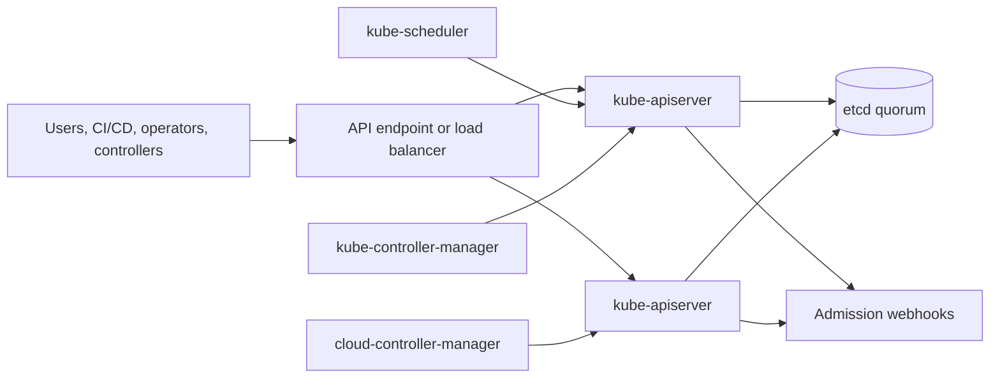

# 2.2 Control Plane Architecture

## Purpose of This Section

This section explains the Kubernetes control plane as a production system.

The control plane is the decision and coordination layer of a Kubernetes cluster. It accepts API requests, stores cluster state, schedules
Pods, runs controllers, integrates with infrastructure providers, and exposes the state that operators depend on during incidents.

For an SRE, the control plane is not an abstract box behind `kubectl`. It is a set of components with availability limits, latency paths,
leader election behavior, storage dependencies, certificate dependencies, admission dependencies, and provider integration risks.

By the end of this section, you should be able to:

- Describe the purpose of each major control-plane component.
- Explain how API requests move through the control plane.
- Understand why etcd quorum and API server latency are reliability-critical.
- Explain how leader election affects controllers and schedulers.
- Identify common control-plane failure modes.
- Review a control-plane architecture for production readiness.

## Control Plane Mental Model

The control plane exists to make cluster state converge.

Users and automation submit desired state. The API server validates and stores that state. Controllers and schedulers observe the state and
make decisions. Nodes act on assigned work and report observed state back to the API.

A simplified control-plane model looks like this:



The API server is horizontally replicated in highly available clusters. etcd is a quorum-based data store. The scheduler and controller
manager are commonly replicated for availability, but only one active leader performs the main work at a time for many control loops.

## Major Components

The main control-plane components are:

| Component | Primary role | Reliability question |
| --- | --- | --- |
| kube-apiserver | Serves the Kubernetes API. | Can clients read and write cluster state with acceptable latency and errors? |
| etcd | Stores Kubernetes API state. | Does the cluster have quorum, durable storage, and tested backup and restore? |
| kube-scheduler | Assigns unscheduled Pods to suitable nodes. | Can new Pods be placed quickly and correctly? |
| kube-controller-manager | Runs built-in controllers. | Are control loops keeping actual state close to desired state? |
| cloud-controller-manager | Integrates with provider APIs. | Are cloud resources, nodes, routes, and load balancers reconciling correctly? |

Some clusters also run admission controllers, policy engines, aggregated API servers, extension API servers, certificate controllers,
autoscalers, and provider-specific controllers. Those are not always core control-plane binaries, but they may become control-plane-critical
for your environment.

## kube-apiserver

The API server is the front door of the cluster.

All normal Kubernetes control operations pass through it:

- `kubectl` commands
- CI/CD deployments
- controller reads and writes
- scheduler binding decisions
- kubelet status updates
- admission webhook calls
- custom controllers and operators
- autoscaler decisions

The API server handles request flow through stages such as authentication, authorization, admission, validation, persistence, and watch
notification.

Production API server concerns include:

- availability of the API endpoint
- request latency by resource and verb
- HTTP error rate
- authentication and authorization failures
- admission webhook latency and failures
- watch cache behavior
- client request volume
- API Priority and Fairness configuration
- connection balancing across API server replicas
- certificate expiry and trust configuration

A slow API server can make the whole cluster feel broken even when nodes and workloads are still running. Rollouts slow down, autoscalers lag,
controllers fall behind, and incident responders cannot reliably observe or change state.

## etcd

etcd is the strongly consistent key-value store used by Kubernetes to persist API server data.

If etcd cannot make progress, the Kubernetes API cannot safely persist state. Reads, writes, watches, leader election, controller progress,
and cluster recovery can all be affected.

Production etcd concerns include:

- quorum health
- disk latency
- network latency between members
- member count and placement
- backup and restore procedure
- compaction and defragmentation
- certificate expiry
- database size
- corruption detection
- disaster recovery ownership

etcd should not be treated like a generic cache. It is the source of truth for Kubernetes cluster state.

For self-managed clusters, etcd backup and restore must be documented, tested, and owned. For managed Kubernetes, the provider usually owns
etcd operations, but SREs still need to understand customer-visible symptoms when the control plane is degraded.

## kube-scheduler

The scheduler watches for Pods that do not yet have a node assignment and chooses suitable nodes for them.

Scheduling decisions consider many inputs, including:

- resource requests
- node capacity and allocatable resources
- node selectors
- node affinity
- pod affinity and anti-affinity
- taints and tolerations
- topology spread constraints
- storage topology
- Pod priority and preemption
- scheduling plugins and profiles

The scheduler does not start containers. It writes a binding decision through the API server. The kubelet on the selected node then acts on
the assigned Pod.

Production scheduler concerns include:

- sustained Pending Pods
- scheduler queue latency
- unschedulable reasons
- inaccurate resource requests
- topology constraints that cannot be satisfied
- missing tolerations
- storage zone mismatch
- priority and preemption side effects
- node pool fragmentation

When Pods are stuck in `Pending`, the scheduler is part of the investigation, but it is rarely the only possible cause. Capacity, policy,
storage, taints, topology, and admission can all produce scheduling symptoms.

## kube-controller-manager

The controller manager runs built-in controllers that reconcile Kubernetes objects.

Examples include controllers for Deployments, ReplicaSets, StatefulSets, DaemonSets, Jobs, Nodes, endpoints, namespaces, service accounts,
and garbage collection.

Controllers follow the same core loop:

1. Watch current state.
2. Compare it with desired state.
3. Take action to reduce drift.
4. Record status, events, or follow-up work.

Production controller-manager concerns include:

- controller workqueue depth
- reconciliation latency
- leader election health
- API server connectivity
- excessive event generation
- stuck finalizers
- garbage collection delay
- namespace termination delay
- certificate and service account token controller behavior

A controller-manager failure does not usually stop already-running Pods immediately. The cluster may continue serving traffic while new
rollouts, scaling, garbage collection, node lifecycle handling, and status reconciliation degrade.

## cloud-controller-manager

The cloud controller manager separates cloud-provider-specific control loops from the generic Kubernetes control plane.

Depending on the provider and cluster design, it may participate in:

- node lifecycle integration
- cloud load balancer reconciliation
- route configuration
- provider metadata integration
- cloud-specific service behavior

In managed Kubernetes, provider-specific controllers may be hidden from the customer or split across provider-managed and customer-visible
components.

Production cloud-controller concerns include:

- provider API throttling
- cloud IAM failures
- load balancer provisioning delays
- node lifecycle drift
- subnet or route table limits
- regional provider degradation
- mismatched Kubernetes and provider object state

A cloud-controller issue often appears as a Kubernetes symptom: Services stay pending, nodes do not register correctly, routes do not update,
or load balancer targets become stale.

## Leader Election

Several control-plane components can run as multiple replicas for availability while only one replica actively performs a specific role.

Leader election prevents multiple schedulers or controller-manager instances from making conflicting decisions at the same time.

Common leader-election behavior includes:

- candidates use Kubernetes Lease objects for coordination
- one instance becomes leader
- non-leaders remain ready to take over
- the active leader renews its lease
- another instance takes leadership if renewal stops long enough

Leader election is not the same as zero interruption. During failover, there can be a short delay before another replica takes leadership.
That delay can affect scheduling and reconciliation latency.

SREs should monitor leader-election errors, restarts, and sustained controller or scheduler lag rather than assuming replicas always mean
instant failover.

## Control Plane High Availability

A production control plane needs redundancy across multiple layers.

Important HA design points include:

| Layer | Production requirement |
| --- | --- |
| API endpoint | Stable endpoint, load balancing, health checks, and certificate correctness. |
| API servers | Multiple healthy replicas where supported by the architecture. |
| etcd | Quorum-preserving member count, reliable disks, low-latency member network, and tested restore. |
| Scheduler | Replicated with leader election. |
| Controller manager | Replicated with leader election. |
| Admission webhooks | Highly available and failure policy reviewed. |
| DNS and certificates | Reliable name resolution and certificate lifecycle management. |
| Provider integrations | Documented provider limits, quotas, IAM, and escalation path. |

For kubeadm-based self-managed clusters, Kubernetes documents two common HA approaches:

- stacked control plane nodes, where etcd members run with control-plane nodes
- external etcd, where etcd members run on separate hosts

Stacked topology is simpler but couples etcd member failure with control-plane node failure. External etcd adds infrastructure but separates
the state store from the control-plane nodes.

## Control Plane Failure Modes

Control-plane incidents often show up as delayed convergence rather than immediate workload death.

| Failure mode | Common symptom | SRE interpretation |
| --- | --- | --- |
| API server unavailable | `kubectl` fails, controllers cannot update state. | Cluster coordination is impaired. Running workloads may continue briefly. |
| API server high latency | Slow rollouts, delayed autoscaling, stale watches. | Control loops are lagging behind desired state. |
| etcd quorum lost | Writes fail or API becomes unavailable. | Cluster state cannot be safely persisted. |
| etcd disk latency high | API writes and reads become slow. | Storage path is affecting the whole control plane. |
| scheduler leader unavailable | New Pods remain Pending. | Existing workloads may run, but placement stops or slows. |
| controller-manager leader unavailable | Deployments, nodes, endpoints, jobs, and garbage collection lag. | Reconciliation is delayed. |
| admission webhook unavailable | Creates or updates fail, depending on failure policy. | Policy dependency has become an availability dependency. |
| cloud provider API throttled | LoadBalancers, volumes, nodes, or routes lag. | Provider integration is blocking reconciliation. |

The key question is not only whether the control plane is up. The better question is whether every critical control loop can make progress
within the service's operational tolerance.

## Real Production Example

A platform team receives alerts that deployments are timing out across several namespaces. Existing application traffic still works, but new
rollouts are stuck.

Initial commands show:

```bash
kubectl get deployments -A
kubectl get pods -A --field-selector=status.phase=Pending
kubectl get events -A --sort-by=.lastTimestamp
```

Symptoms:

- new Pods remain Pending
- `kubectl` is slower than usual
- controller events appear delayed
- API server latency alerts are firing
- etcd disk latency is above baseline

The architecture path is:

1. Check API server availability and latency.
2. Check etcd quorum and disk latency.
3. Check scheduler health and leader election.
4. Check controller-manager health and workqueue lag.
5. Check admission webhook latency and errors.
6. Check provider API errors if volumes, nodes, or load balancers are involved.

The incident is not solved by restarting the application Deployment. The bottleneck is the control plane's ability to accept state, persist
state, and let control loops move forward.

## SRE Operating Checklist

Use this checklist when reviewing or operating a control plane:

- Is there a documented owner for each control-plane component?
- Is the API endpoint highly available and monitored?
- Are API server latency, errors, saturation, and request volume measured?
- Are admission webhooks highly available and tested under failure?
- Is etcd quorum healthy and spread across appropriate failure domains?
- Are etcd backups automated and restore-tested?
- Are control-plane certificates monitored before expiry?
- Are scheduler and controller-manager leader-election failures alerted?
- Are controller workqueue delays visible?
- Are cloud-provider API quotas, IAM permissions, and failure modes documented?
- Are managed Kubernetes support boundaries and escalation paths documented?
- Is there an emergency plan for API degradation during incidents?

## Common Anti-Patterns

| Anti-pattern | Why it is risky |
| --- | --- |
| Monitoring only node and Pod health | Control-plane degradation can block recovery even when workloads still run. |
| Treating etcd as invisible | etcd latency, quorum, and restore determine cluster recoverability in self-managed clusters. |
| Running admission webhooks without HA | A failed webhook can block cluster changes if failure policy requires it. |
| Assuming replicas mean instant control-plane failover | Leader election and client reconnection still take time. |
| Ignoring provider API limits | Cloud API throttling can break Kubernetes reconciliation paths. |
| Allowing every tool unlimited API access | Bad clients can overload the API server and hurt the whole platform. |
| Not testing restore | A backup that has never been restored is only an artifact, not a recovery plan. |

## Section Review Questions

1. What is the primary role of the Kubernetes control plane?
2. Why is the API server considered the front door of the cluster?
3. What does etcd store, and why does quorum matter?
4. What does the scheduler write after choosing a node for a Pod?
5. Why does controller-manager failure often appear as delayed reconciliation?
6. What is the purpose of leader election for schedulers and controllers?
7. Why can admission webhooks become an availability dependency?
8. What is the difference between stacked etcd and external etcd topology?
9. Why can cloud provider API throttling appear as a Kubernetes incident?
10. Which control-plane signals should an SRE alert on?

## Key Takeaways

- The control plane is the coordination and decision layer of Kubernetes.
- API server health affects almost every operational workflow.
- etcd durability, latency, and quorum are central to cluster recoverability.
- Scheduler and controller-manager replicas rely on leader election for active work.
- Admission and cloud-provider integrations can become production-critical dependencies.
- Control-plane incidents usually appear as delayed convergence, failed writes, or blocked recovery.

## Official References

- [Kubernetes Components](https://kubernetes.io/docs/concepts/overview/components/)
- [Production environment](https://kubernetes.io/docs/setup/production-environment/)
- [Creating a cluster with kubeadm](https://kubernetes.io/docs/setup/production-environment/tools/kubeadm/create-cluster-kubeadm/)
- [Creating Highly Available Clusters with kubeadm](https://kubernetes.io/docs/setup/production-environment/tools/kubeadm/high-availability/)
- [Set up a High Availability etcd Cluster with kubeadm](https://kubernetes.io/docs/setup/production-environment/tools/kubeadm/setup-ha-etcd-with-kubeadm/)
- [kube-apiserver reference](https://kubernetes.io/docs/reference/command-line-tools-reference/kube-apiserver/)
- [kube-controller-manager reference](https://kubernetes.io/docs/reference/command-line-tools-reference/kube-controller-manager/)
