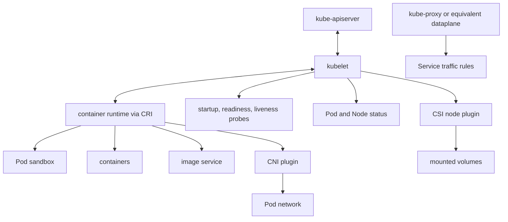

# 2.3 Worker Node Architecture

## Purpose of This Section

This section explains the Kubernetes worker node as a production runtime system.

A worker node is where application Pods actually run. The control plane decides what should happen, but the node is where containers start,
network interfaces are configured, volumes are mounted, probes run, logs are produced, resource pressure occurs, and user traffic is served.

For an SRE, node architecture matters because many Kubernetes incidents are node-local before they become cluster-wide. A Pod may be stuck
because the scheduler cannot place it, but it may also be stuck because the kubelet cannot pull an image, the runtime cannot create a sandbox,
the CNI plugin cannot attach networking, the CSI driver cannot mount storage, or the node is under memory, disk, or PID pressure.

By the end of this section, you should be able to:

- Describe the main components that run on a Kubernetes worker node.
- Explain how kubelet, the container runtime, CNI, CSI, and kube-proxy or an equivalent dataplane cooperate.
- Interpret node status, heartbeats, conditions, capacity, and allocatable resources.
- Identify common node-level failure modes.
- Use node architecture to guide production troubleshooting.

## Worker Node Mental Model

A worker node is a managed execution environment.

The node receives assigned Pod work from the Kubernetes API, prepares the local environment for those Pods, starts containers, reports status,
and enforces resource and lifecycle behavior.

A simplified node model looks like this:



The exact implementation varies by environment. Some clusters run kube-proxy. Others use a CNI dataplane that implements Service behavior
without kube-proxy. Some clusters use managed node agents or provider-specific add-ons. The architecture model remains the same: the node must
provide runtime, networking, storage, status, and resource enforcement for Pods.

## Main Node Components

| Component | Primary role | Production concern |
| --- | --- | --- |
| kubelet | Node agent that manages assigned Pods and reports status. | Node readiness, Pod lifecycle, probes, image pulls, volume mounts, and evictions. |
| Container runtime | Runs containers and manages images through CRI. | Runtime health, sandbox creation, image service, container start latency, and runtime upgrades. |
| kube-proxy or equivalent dataplane | Implements Kubernetes Service traffic behavior in many clusters. | Service reachability, endpoint updates, node-local network rules, and dataplane drift. |
| CNI plugin | Configures Pod networking and implements the cluster network model. | Pod IP allocation, routing, DNS reachability, NetworkPolicy enforcement, and plugin health. |
| CSI node plugin | Performs node-local storage operations for CSI volumes. | Volume stage, publish, mount, unmount, device discovery, and node plugin availability. |
| Operating system | Provides kernel, filesystem, networking, process, and cgroup behavior. | Kernel bugs, disk pressure, process limits, memory pressure, time sync, and security posture. |

A production node is only as reliable as the weakest part of this stack.

## kubelet

The kubelet is the node agent.

It communicates with the API server, watches for Pods assigned to its node, asks the container runtime to run containers, performs health
checks, manages volume setup with storage plugins, updates Pod status, and posts node status.

The kubelet is responsible for:

- registering the node when configured to self-register
- watching assigned Pods
- creating Pod sandboxes through the runtime
- starting and stopping containers
- running startup, readiness, and liveness probes
- reporting Pod and container status
- reporting node status and conditions
- coordinating volume mounts
- enforcing resource-related behavior with the node runtime and operating system
- performing node-pressure eviction when thresholds are met

The kubelet does not manage containers that were not created by Kubernetes.

Production kubelet concerns include:

- kubelet service health
- API server connectivity
- certificate validity
- node registration correctness
- Pod sandbox creation failures
- image pull failures
- probe failures
- volume mount failures
- runtime connection failures
- node condition transitions
- eviction behavior

When kubelet is unhealthy, the node may stop reporting accurate status and Pods may fail to start, stop, or update correctly.

## Container Runtime and CRI

The container runtime runs containers for Pods.

Kubernetes uses the Container Runtime Interface, or CRI, as the main protocol between kubelet and the runtime. The kubelet acts as a CRI
client and communicates with runtime and image services over gRPC.

Common Kubernetes-compatible runtimes include containerd and CRI-O.

The runtime is responsible for:

- pulling container images
- creating Pod sandboxes
- starting containers
- stopping containers
- reporting container state
- managing image state
- integrating with low-level runtime, cgroup, and namespace behavior

Production runtime concerns include:

- runtime daemon health
- CRI socket availability
- image service availability
- image pull latency and failures
- container start latency
- sandbox creation errors
- runtime log growth
- cgroup driver consistency
- runtime version compatibility with Kubernetes

A common operational mistake is to investigate only Kubernetes objects when the root cause is the runtime. If kubelet cannot talk to the
runtime, the control plane may still be healthy while Pods fail on the node.

## CNI and Pod Networking

Kubernetes requires a network plugin to implement the cluster network model.

CNI plugins configure Pod networking on nodes. Depending on the implementation, the plugin may handle IP address management, routing,
overlays, eBPF datapaths, NetworkPolicy, encryption, and node-to-node reachability.

Production CNI concerns include:

- Pod IP allocation exhaustion
- CNI binary or configuration errors
- node routing failures
- DNS reachability symptoms caused by network failure
- NetworkPolicy enforcement gaps
- MTU mismatch
- overlay or tunnel failure
- eBPF program or map issues in eBPF-based dataplanes
- cloud network interface limits
- node security group or firewall drift

When CNI fails, Pods can be stuck in `ContainerCreating`, Services may have endpoints but still fail traffic, DNS may time out, or only some
nodes may be affected.

## kube-proxy and Service Dataplane

kube-proxy is an optional node component that implements part of the Kubernetes Service concept in many clusters.

It watches Services and EndpointSlices and maintains node-local forwarding behavior, often using operating system packet filtering or load
balancing mechanisms.

Some clusters do not run kube-proxy because the CNI dataplane provides equivalent Service behavior.

Production Service dataplane concerns include:

- stale Service rules
- missing EndpointSlice updates
- node-local packet filtering issues
- IPVS, iptables, nftables, or eBPF drift depending on implementation
- asymmetric routing
- source NAT behavior
- NodePort exposure
- load balancer health checks

When Service traffic fails, do not assume the Service object is wrong. The problem may be on one node's dataplane.

## CSI Node Plugin and Storage Path

CSI is the standard way for storage systems to integrate with Kubernetes.

Many CSI drivers include a node plugin that runs on each node where volumes may be used. The node plugin performs node-local work such as
staging, publishing, mounting, unmounting, and interacting with devices or filesystem paths.

Production CSI node concerns include:

- node plugin Pod availability
- privileged mount permissions
- volume attach and mount latency
- stale mount points
- device discovery failures
- cloud volume attachment limits
- filesystem corruption or read-only mounts
- snapshot and restore integration where supported
- Windows versus Linux node behavior

Storage failures often appear as Pods stuck in `ContainerCreating`, repeated mount errors, or workloads running without required data.

## Node Status, Heartbeats, and Leases

A Node object includes status information that helps the control plane and operators understand node health.

Important status areas include:

- addresses
- conditions
- capacity
- allocatable resources
- system information

Kubernetes uses node heartbeats to determine whether a node is available. Heartbeats are represented by Node status updates and Lease objects
in the `kube-node-lease` namespace.

Operationally, this means a node can fail in several ways:

| Situation | Likely symptom |
| --- | --- |
| kubelet cannot reach API server | Node heartbeat becomes stale. |
| API server cannot observe kubelet updates | Node may become `Unknown`. |
| kubelet is alive but runtime is unhealthy | Node may be `Ready` while Pods fail to start. |
| CNI is broken on one node | Pods may start but fail network communication. |
| CSI node plugin is broken | Pods requiring volumes may stay stuck. |

Node readiness is important, but it is not the whole health story.

## Node Conditions and Resource Pressure

Node conditions summarize important node health states.

Common conditions include:

| Condition | Meaning for SREs |
| --- | --- |
| `Ready` | Whether the node is healthy enough for the control plane to use. |
| `MemoryPressure` | Available memory has crossed an eviction threshold. |
| `DiskPressure` | Disk space or inodes have crossed an eviction threshold. |
| `PIDPressure` | Available process IDs have crossed an eviction threshold. |
| `NetworkUnavailable` | Network for the node is not correctly configured, depending on environment. |

The kubelet performs node-pressure eviction to reclaim resources when thresholds are met. This is different from API-initiated eviction and
may not respect PodDisruptionBudgets in the same way.

Resource pressure is often a symptom of workload design or node pool sizing:

- memory requests too low
- logs filling node filesystem
- image garbage collection not keeping up
- too many processes on the node
- noisy neighbors
- insufficient ephemeral storage requests
- runaway sidecars or agents

An SRE should investigate both the immediate pressure and the workload or platform pattern that created it.

## Capacity and Allocatable

Node capacity is the total resource amount reported by the node. Allocatable is the portion available for Pods after reservations and system
requirements.

Schedulers use allocatable resources and Pod requests to place workloads. If requests are missing or unrealistic, the cluster may appear to
have capacity while nodes are actually overloaded.

Review these signals during capacity work:

```bash
kubectl describe node <node-name>
kubectl top node
kubectl get pods -A -o wide --field-selector spec.nodeName=<node-name>
```

`kubectl top` requires metrics infrastructure. If metrics are missing or delayed, use node and workload telemetry from the monitoring stack.

## Node Maintenance: Cordon and Drain

Node maintenance usually starts by preventing new Pods from scheduling to the node:

```bash
kubectl cordon <node-name>
```

Then workloads are evicted using drain:

```bash
kubectl drain <node-name> --ignore-daemonsets
```

Drain attempts to safely evict Pods and respects PodDisruptionBudgets for evictions. DaemonSet Pods are normally ignored because the
DaemonSet controller is responsible for node-local agents.

After maintenance, scheduling can be restored:

```bash
kubectl uncordon <node-name>
```

Production node maintenance should account for:

- PodDisruptionBudgets
- StatefulSet behavior
- local persistent volumes
- DaemonSets
- critical add-ons
- topology spread
- node pool capacity
- autoscaler behavior
- provider drain automation

Draining a node is not just a command. It is a workload availability event.

## Real Production Example

A deployment rollout starts failing in one availability zone. New Pods are stuck in `ContainerCreating`, but only on nodes in one node pool.

Initial checks:

```bash
kubectl get pods -A -o wide
kubectl describe pod <pod-name>
kubectl describe node <node-name>
kubectl get events -A --sort-by=.lastTimestamp
```

The events show repeated CNI errors when creating the Pod sandbox.

Architecture-guided troubleshooting:

1. Confirm the control plane is accepting changes.
2. Confirm the scheduler assigned the Pod to a node.
3. Confirm kubelet is reporting status for that node.
4. Check container runtime health.
5. Check CNI plugin Pods and node-local CNI configuration.
6. Check cloud network interface limits or subnet IP exhaustion.
7. Compare affected and unaffected nodes.

The incident is not a Deployment bug. The failure is in the node networking path.

## SRE Operating Checklist

Use this checklist for worker node readiness reviews:

- Are kubelet health, restarts, and certificate expiry monitored?
- Is runtime health monitored separately from kubelet health?
- Are image pull errors and registry latency visible?
- Is CNI health visible per node and per node pool?
- Is NetworkPolicy enforcement behavior documented?
- Is CSI node plugin health visible per node?
- Are volume attach, mount, and unmount errors alerted?
- Are node conditions alerted with useful thresholds and routing?
- Are node filesystem, image filesystem, and container filesystem usage monitored?
- Are memory, disk, PID, and ephemeral-storage pressure patterns reviewed?
- Are node drains tested for critical workloads?
- Are node pool labels, taints, capacity, and upgrade behavior documented?

## Common Anti-Patterns

| Anti-pattern | Why it is risky |
| --- | --- |
| Treating `Ready` as complete node health | Runtime, CNI, CSI, DNS, or filesystem problems can exist while a node still reports Ready. |
| Ignoring daemonset agents | CNI, CSI, logging, monitoring, and security agents often determine node usefulness. |
| Running without realistic resource requests | The scheduler places Pods based on requests, not observed future peak usage. |
| Forgetting ephemeral storage | Logs, emptyDir, images, and writable layers can create DiskPressure and evictions. |
| Draining nodes without PDB review | Maintenance can become an application outage. |
| Assuming all nodes are equivalent | Labels, taints, zones, hardware, kernels, images, and provider limits can differ. |
| Debugging Services only from the control plane | Service dataplane issues can be node-local. |

## Section Review Questions

1. What is the primary role of the kubelet?
2. What is CRI, and why does Kubernetes use it?
3. Why does Kubernetes require a CNI plugin?
4. What does kube-proxy implement in many clusters?
5. Why might a cluster not run kube-proxy?
6. What node-local work does a CSI node plugin perform?
7. What are Node heartbeats used for?
8. Why is `Ready` not a complete node health signal?
9. How is node-pressure eviction different from API-initiated eviction?
10. What should an SRE check when Pods are stuck in `ContainerCreating` on only some nodes?

## Key Takeaways

- Worker nodes are where Kubernetes reliability becomes application reality.
- kubelet coordinates Pod lifecycle on the node but depends on runtime, networking, storage, and the operating system.
- CRI connects kubelet to the container runtime.
- CNI implements Pod networking and may also implement advanced dataplane behavior.
- CSI node plugins handle node-local volume operations.
- Node health requires more than checking the `Ready` condition.
- Many production incidents are node-local failures that look like workload or control-plane problems at first.

## Official References

- [Cluster Architecture](https://kubernetes.io/docs/concepts/architecture/)
- [Nodes](https://kubernetes.io/docs/concepts/architecture/nodes/)
- [Leases](https://kubernetes.io/docs/concepts/architecture/leases/)
- [Container Runtime Interface](https://kubernetes.io/docs/concepts/containers/cri/)
- [Network Plugins](https://kubernetes.io/docs/concepts/extend-kubernetes/compute-storage-net/network-plugins/)
- [Compute, Storage, and Networking Extensions](https://kubernetes.io/docs/concepts/extend-kubernetes/compute-storage-net/)
- [Volumes](https://kubernetes.io/docs/concepts/storage/volumes/)
- [Node-pressure Eviction](https://kubernetes.io/docs/concepts/scheduling-eviction/node-pressure-eviction/)
- [Safely Drain a Node](https://kubernetes.io/docs/tasks/administer-cluster/safely-drain-node/)
