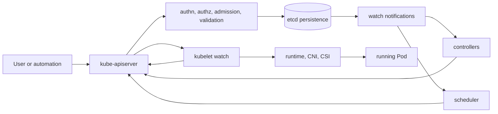
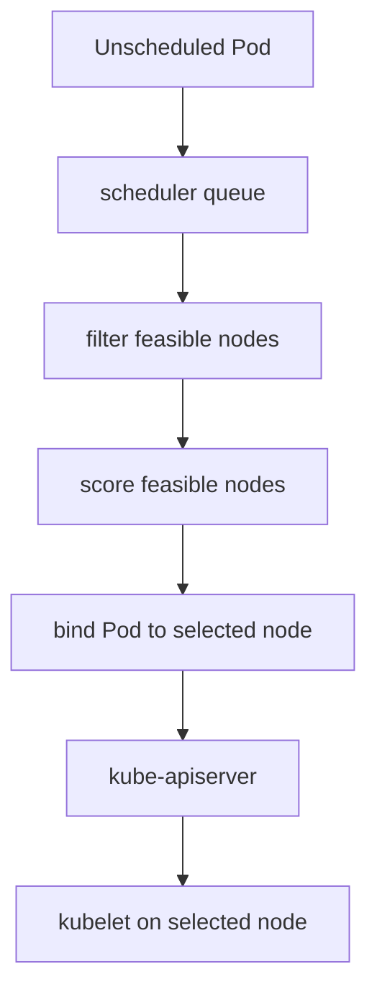
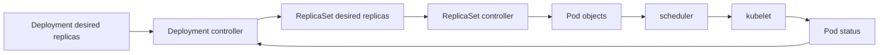

# 2.4 API Server, etcd, Scheduler, and Controllers

## Purpose of This Section

This section connects the major control-plane components into one operating model.

Sections 2.2 and 2.3 explained the control plane and worker nodes separately. This section shows how the API server, etcd, scheduler,
controllers, and kubelets work together when Kubernetes accepts desired state and turns it into running workloads.

For an SRE, this flow is more useful than memorizing component names. During incidents, the important question is usually not "Which binary
exists?" The important question is "Where did convergence stop?"

By the end of this section, you should be able to:

- Trace a workload change from API request to running Pod.
- Explain how API persistence, watches, scheduling, and reconciliation interact.
- Identify which component owns each stage of a common Kubernetes workflow.
- Distinguish API failures, scheduler failures, controller failures, kubelet failures, and provider failures.
- Use component boundaries to troubleshoot production incidents.

## The Control-Plane Chain

Kubernetes works through a chain of API-centered coordination.



Most components do not coordinate through direct private calls. They read from and write to the Kubernetes API. That design gives Kubernetes a
consistent object model, but it also means API health and etcd health affect the entire platform.

## Request to Reconciliation Flow

A typical Deployment rollout involves multiple control loops.

```text
1. User applies a Deployment.
2. kube-apiserver authenticates, authorizes, admits, validates, and stores the object.
3. etcd persists the Deployment state.
4. Deployment controller observes the Deployment through the API.
5. Deployment controller creates or updates a ReplicaSet.
6. ReplicaSet controller creates Pods.
7. kube-scheduler observes unscheduled Pods.
8. kube-scheduler filters and scores nodes, then binds each Pod to a node.
9. kubelet on the selected node observes the assigned Pod.
10. kubelet asks the container runtime to create the Pod sandbox and containers.
11. Runtime, CNI, and CSI perform node-local work.
12. kubelet reports Pod and container status back to the API server.
13. Controllers continue reconciling until observed state matches desired state.
```

This flow explains why one symptom can have many causes.

A Pod stuck in `Pending` may reflect scheduler constraints. A Pod stuck in `ContainerCreating` may reflect runtime, CNI, or CSI failure. A
Deployment stuck during rollout may reflect controller lag, admission rejection, missing capacity, image pull failure, or readiness failure.

## kube-apiserver as the Coordination Point

The API server is the coordination point for reads, writes, and watches.

It is responsible for serving the Kubernetes HTTP API and applying the request pipeline before objects are persisted or returned. In a normal
write request, that includes stages such as:

1. Authentication
2. Authorization
3. Admission
4. Schema and object validation
5. Persistence to etcd
6. Response to the client
7. Watch notifications to interested clients

From an SRE perspective, API server issues can affect every workflow:

| API issue | Operational effect |
| --- | --- |
| High latency | Controllers, schedulers, kubelets, and humans observe stale or delayed state. |
| Write failures | Desired state cannot be changed or status cannot be updated. |
| Watch instability | Controllers may relist, lag, or temporarily miss efficient change streams. |
| Admission latency | Object creation and updates block behind policy or mutation dependencies. |
| Authorization failures | Automation fails even though workload manifests are technically valid. |
| Request pressure | Noisy clients can reduce availability for critical control loops. |

When a production incident requires emergency changes, API availability is part of the recovery path.

## etcd as the State Store

etcd stores Kubernetes API state.

The API server depends on etcd for durable, consistent persistence. Controllers, schedulers, kubelets, and clients do not normally talk to
etcd directly. They use the API server, and the API server stores and retrieves state from etcd.

Important etcd realities for SREs:

- etcd latency becomes API latency.
- etcd quorum loss can prevent safe writes.
- etcd disk performance matters to the whole cluster.
- etcd backup and restore define cluster-state recovery for self-managed clusters.
- etcd compaction affects the history available for watches.
- etcd is not a place for application data.

In managed Kubernetes, the provider usually operates etcd. Even then, understanding etcd symptoms helps explain API slowness, write failures,
and support escalation urgency.

## List, Watch, and resourceVersion

Kubernetes clients commonly use a list-then-watch pattern.

A client lists objects to get current state. The response includes a `resourceVersion`. The client then starts a watch from that version to
receive changes that happened after the list.

This pattern matters because controllers and schedulers need efficient change detection.

```text
List current Pods
        |
        v
Receive PodList with resourceVersion
        |
        v
Watch changes from that resourceVersion
        |
        v
React to ADDED, MODIFIED, DELETED, or BOOKMARK events
```

If a watch is disconnected, a client can continue from the last observed resource version when possible. If the requested history is no longer
available, the API can return `410 Gone`, and the client must relist and start watching again.

Operationally, watch instability can create:

- controller relist storms
- higher API server load
- delayed reconciliation
- stale controller caches
- slower incident response

This is why API server and client behavior both matter in large clusters.

## Scheduler Binding Flow

The scheduler does not run Pods.

The scheduler watches for Pods that do not yet have a node assigned. For each unscheduled Pod, it filters nodes, scores feasible nodes, chooses
a node, and notifies the API server through binding.



Common scheduler blockers include:

- insufficient CPU or memory requests
- node selectors that match no nodes
- required node affinity that cannot be satisfied
- required pod affinity or anti-affinity that cannot be satisfied
- taints without matching tolerations
- topology spread constraints
- storage topology restrictions
- volume attachment limits
- Pod priority and preemption behavior

When a Pod is Pending, always read the scheduling events before changing application code.

## Controller Reconciliation Flow

Controllers are control loops.

A controller watches cluster state, compares observed state with desired state, and takes action to reduce the difference. Built-in
controllers usually act by writing new state to the API server.

Example: Deployment to Pod convergence.



Controllers do not make the cluster instantly correct. They make repeated attempts. That means the real question is whether the controller can
observe, decide, write, and retry successfully.

Controller progress can be blocked by:

- API server latency or errors
- authorization failures
- admission rejection
- invalid object references
- finalizers
- quota limits
- missing dependencies
- stale watches or cache lag
- provider API failure
- workqueue backlog

A controller may be healthy as a process but still unable to reconcile a specific object because an external dependency is failing.

## Kubelet Status Feedback

After the scheduler binds a Pod to a node, the kubelet becomes responsible for making the assigned Pod run on that node.

The kubelet observes assigned Pods through the API server, starts local work, and reports status back through the API server. This creates the
feedback loop that controllers and humans read.

Important feedback includes:

- Pod phase
- container state
- container restart count
- readiness condition
- initialized condition
- scheduled condition
- events
- node condition updates

If kubelet cannot report status, the control plane may have an incomplete or stale view of what is happening on the node.

## Component Ownership Map

Use this map when a workload does not converge.

| Symptom | First component to inspect | Why |
| --- | --- | --- |
| `kubectl apply` fails | API server | Request did not complete through the API path. |
| Object is rejected | Admission or validation | The object failed policy, mutation, or schema checks. |
| Deployment exists but no ReplicaSet appears | Controller manager | Deployment controller may not be reconciling. |
| ReplicaSet exists but no Pods appear | Controller manager | ReplicaSet controller may not be reconciling or quota may block creation. |
| Pod remains Pending | Scheduler | Pod has not been bound to a node. |
| Pod is scheduled but stuck in ContainerCreating | kubelet, runtime, CNI, or CSI | Node-local setup is not completing. |
| Pod runs but never becomes Ready | kubelet probes or application | Readiness feedback is failing. |
| Status is stale | kubelet or API path | Node status or Pod status updates may not be reaching the API server. |
| Service has no endpoints | EndpointSlice controller and readiness | Ready backend endpoints may not exist or labels may not match. |

This table is a starting point, not a substitute for reading events and conditions.

## Real Production Example

A team deploys a new version of a checkout service. The Deployment rollout times out.

Initial command:

```bash
kubectl rollout status deployment checkout -n payments
```

The command reports that the rollout is not progressing.

An SRE traces the convergence chain:

```bash
kubectl get deployment checkout -n payments -o wide
kubectl describe deployment checkout -n payments
kubectl get rs -n payments -l app=checkout
kubectl get pods -n payments -l app=checkout -o wide
kubectl describe pod <pod-name> -n payments
kubectl get events -n payments --sort-by=.lastTimestamp
```

The investigation finds:

- the Deployment created a new ReplicaSet
- the ReplicaSet created Pods
- the scheduler placed the Pods on nodes
- kubelet started the containers
- readiness probes failed because the new version cannot reach a dependency

The control plane did its job. The rollout failed at the application readiness stage. Restarting the controller manager or changing scheduler
settings would be noise.

Architecture-guided troubleshooting prevents that kind of wasted motion.

## Failure Scenario: API Writes Fail

If API writes fail, desired state cannot be changed.

Possible causes:

- API server unavailable
- authentication failure
- authorization denial
- admission webhook failure
- etcd quorum or latency issue
- object validation failure
- API Priority and Fairness limiting

SRE response:

1. Confirm whether reads work.
2. Confirm whether writes fail for all users or only one identity.
3. Inspect API server error rate and latency.
4. Inspect admission webhook failures.
5. Inspect etcd health for self-managed clusters.
6. Avoid repeated automation retries that amplify API pressure.

## Failure Scenario: Controllers Lag

If controllers lag, objects exist but actual state does not catch up.

Possible symptoms:

- Deployments do not create ReplicaSets.
- ReplicaSets do not create Pods.
- Jobs do not progress.
- namespaces remain terminating.
- garbage collection is delayed.
- endpoint updates lag behind readiness changes.

SRE response:

1. Identify the owning controller.
2. Check whether the object has conditions or events.
3. Check controller-manager health and leader election.
4. Check API server latency and errors.
5. Check quota, finalizers, admission, and dependency errors.
6. Determine whether the issue is object-specific or cluster-wide.

## Failure Scenario: Pods Stay Pending

Pending Pods usually require scheduler investigation.

Useful commands:

```bash
kubectl describe pod <pod-name> -n <namespace>
kubectl get nodes --show-labels
kubectl describe node <node-name>
kubectl get events -n <namespace> --sort-by=.lastTimestamp
```

Common causes:

- no node has enough allocatable resources
- required labels do not exist
- taints are not tolerated
- required topology spread cannot be satisfied
- required affinity or anti-affinity cannot be satisfied
- volume topology or attachment limits block placement
- Pod priority and preemption cannot make room

The scheduler can only choose among feasible nodes. If no feasible node exists, the Pod waits.

## SRE Operating Checklist

Use this checklist when tracing Kubernetes convergence:

- Did the API request succeed?
- Was the object admitted and persisted?
- Does the object have the expected spec?
- Which controller owns the next step?
- Did the controller create the next object in the chain?
- Did the scheduler bind the Pod to a node?
- Did kubelet observe the assigned Pod?
- Did runtime, CNI, and CSI complete node-local setup?
- Did kubelet report status back to the API server?
- Did readiness make the Pod eligible for traffic?
- Are watches, events, and status updates fresh?
- Is the failure namespace-specific, node-specific, cluster-wide, or provider-specific?

## Common Anti-Patterns

| Anti-pattern | Why it is risky |
| --- | --- |
| Debugging from the final symptom only | The root cause may be several control-loop steps earlier. |
| Restarting workloads before reading events | Events often identify scheduler, kubelet, admission, or volume errors. |
| Treating Pending as an application bug | Pending usually means scheduling or capacity constraints. |
| Treating ContainerCreating as a scheduler bug | The Pod is already scheduled; node-local setup is failing. |
| Ignoring API latency during incidents | Recovery actions depend on API reads and writes. |
| Assuming controllers are instant | Controllers are asynchronous and can lag or retry. |
| Ignoring stale watches and relists | Watch instability can increase API pressure and delay reconciliation. |

## Section Review Questions

1. Why is the API server the central coordination point for Kubernetes components?
2. What role does etcd play in the request and reconciliation flow?
3. What is the purpose of `resourceVersion` in list and watch behavior?
4. What should a client do when a watch can no longer continue from an old resource version?
5. What does the scheduler do after selecting a node for a Pod?
6. Why does the scheduler not start containers directly?
7. What does a controller compare during reconciliation?
8. Why can a Deployment rollout fail even when the control plane is healthy?
9. What is the difference between a Pod stuck in `Pending` and a Pod stuck in `ContainerCreating`?
10. Why should SREs trace convergence step by step during incidents?

## Key Takeaways

- Kubernetes components coordinate primarily through the API server.
- etcd persistence, API watches, scheduler binding, controller reconciliation, and kubelet status form one convergence chain.
- List and watch behavior lets clients observe changes efficiently, but watch failures can increase API pressure.
- The scheduler chooses nodes; kubelet and node-local components make assigned Pods run.
- Controllers are asynchronous control loops, not instant executors.
- Production troubleshooting should identify where convergence stopped.

## Official References

- [Kubernetes Components](https://kubernetes.io/docs/concepts/overview/components/)
- [Cluster Architecture](https://kubernetes.io/docs/concepts/architecture/)
- [Kubernetes API Concepts](https://kubernetes.io/docs/reference/using-api/api-concepts/)
- [Controllers](https://kubernetes.io/docs/concepts/architecture/controller/)
- [Kubernetes Scheduler](https://kubernetes.io/docs/concepts/scheduling-eviction/kube-scheduler/)
- [Scheduling, Preemption and Eviction](https://kubernetes.io/docs/concepts/scheduling-eviction/)
- [Assigning Pods to Nodes](https://kubernetes.io/docs/concepts/scheduling-eviction/assign-pod-node/)
