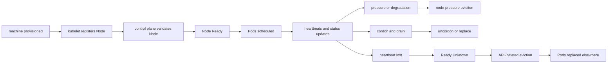

# 2.5 Node Lifecycle and Node Conditions

## Purpose of This Section

This section explains how Kubernetes understands worker node health over time.

A node is not simply present or absent. It has a lifecycle: registration, validation, scheduling eligibility, heartbeat updates, condition
changes, taints, maintenance, pressure events, failure detection, eviction, recovery, and deletion.

For SREs, node lifecycle matters because node symptoms often drive workload incidents. A node can be registered but not ready. It can be
ready but under pressure. It can stop heartbeating and become `Unknown`. It can be cordoned for maintenance. It can be tainted by the node
controller. It can evict Pods locally because of memory, disk, or PID pressure.

By the end of this section, you should be able to:

- Explain how nodes register with the control plane.
- Interpret node status, conditions, capacity, and allocatable resources.
- Explain node heartbeats and Lease objects.
- Distinguish `Ready`, `NotReady`, and `Unknown` states.
- Understand node-pressure eviction and API-initiated eviction differences.
- Use node conditions and events to troubleshoot production incidents.

## Node Lifecycle Overview

A worker node usually moves through these lifecycle stages:



The exact lifecycle depends on the cluster type. Managed node groups, autoscalers, bare-metal automation, and self-managed nodes all have
different provisioning and replacement mechanics. Kubernetes still represents node health through the Node object and related control-plane
behavior.

## Node Registration

Kubernetes supports two main ways to add a Node object to the API server:

- kubelet self-registration
- manual Node object creation by a user or controller

In most production clusters, kubelet self-registration is common. The kubelet starts on a machine, authenticates to the API server, and
registers a Node object that matches its configured node name.

Node registration is not the same as node readiness. After registration, the control plane still needs a valid, healthy node that can run Pods.
A registered node may be ignored for cluster activity until it becomes healthy.

Production registration concerns include:

- node name uniqueness
- kubelet identity and certificates
- cloud provider instance identity
- node labels and taints
- node pool ownership
- bootstrap configuration
- container runtime availability
- CNI readiness
- CSI node plugin readiness

A dangerous anti-pattern is reusing a node name for a different machine without fully understanding the state associated with the old Node
object. Kubernetes treats a Node name as identifying the same Node object.

## Node Status Fields

A Node object status includes several important areas.

| Status area | What it tells an SRE |
| --- | --- |
| Addresses | How the node is reachable or identified, such as hostname and internal IP. |
| Conditions | High-level health signals such as Ready, pressure states, and network availability. |
| Capacity | Total CPU, memory, ephemeral storage, Pods, and other resources reported by the node. |
| Allocatable | Resources available for Pods after system and Kubernetes reservations. |
| Info | Kernel, OS image, kubelet version, container runtime version, and architecture. |

Use this command often:

```bash
kubectl describe node <node-name>
```

For quick status:

```bash
kubectl get nodes -o wide
```

For capacity and placement review:

```bash
kubectl describe node <node-name>
kubectl get pods -A -o wide --field-selector spec.nodeName=<node-name>
```

`kubectl top node` is useful when metrics are installed, but it is not a replacement for node status, events, and monitoring telemetry.

## Node Conditions

Node conditions summarize important node health states.

| Condition | Meaning |
| --- | --- |
| `Ready` | `True` when the node is healthy and ready to accept Pods, `False` when unhealthy, and `Unknown` when the node controller has not heard from the node within the grace period. |
| `MemoryPressure` | `True` when available memory is low enough to trigger pressure behavior. |
| `DiskPressure` | `True` when disk space or inodes are low. |
| `PIDPressure` | `True` when too many process IDs are consumed. |
| `NetworkUnavailable` | `True` when the node network is not correctly configured, depending on the environment. |

Do not confuse `SchedulingDisabled` with a node condition. Command-line tools may show it next to node status for cordoned nodes, but it is
not a condition in the Node object.

## Ready, NotReady, and Unknown

The `Ready` condition deserves careful interpretation.

| State | Meaning | Typical SRE interpretation |
| --- | --- | --- |
| `Ready=True` | The node is healthy enough to accept Pods. | Good starting signal, but still inspect runtime, CNI, CSI, disk, and workload symptoms. |
| `Ready=False` | The node is known to be unhealthy. | kubelet is reporting a problem or the node is not currently usable. |
| `Ready=Unknown` | The node controller has not heard from the node within the grace period. | The control plane cannot confirm node health; network partition, kubelet failure, or machine failure is possible. |

A node becoming `Unknown` is not proof that the machine is powered off. It means the control plane is no longer receiving expected node
health updates.

During an incident, ask:

- Can the kubelet reach the API server?
- Can the API server observe kubelet status updates?
- Is the node network partitioned?
- Is the machine still running?
- Are Pods still serving traffic from that node?
- Are replacement Pods being created elsewhere?

## Node Heartbeats and Leases

Kubernetes uses heartbeats from nodes to determine node availability.

There are two heartbeat forms:

- updates to the `.status` field of the Node object
- Lease objects in the `kube-node-lease` namespace

Each node has a Lease object with a matching name. The kubelet updates the Lease renew time, and the control plane uses that timestamp to help
determine node availability.

Useful commands:

```bash
kubectl get lease -n kube-node-lease
kubectl get lease <node-name> -n kube-node-lease -o yaml
```

Operationally, Leases are important because they reduce the cost of node heartbeats compared with frequent full Node status updates.

If Lease updates stop, the control plane may eventually mark the node as unhealthy or unknown, depending on timing and configuration.

## Node Controller Behavior

The node controller is part of the control plane and manages several node lifecycle responsibilities.

It is responsible for:

- keeping the controller's internal node list current
- assigning Pod CIDR blocks when configured
- monitoring node health
- updating the `Ready` condition when nodes become unreachable
- coordinating API-initiated eviction for Pods on unreachable nodes
- adding taints for node problems such as unreachable or not ready

By default, if a node becomes unreachable, the node controller sets the `Ready` condition to `Unknown`. If the node remains unreachable, it can
trigger API-initiated eviction for Pods on that node after a delay.

Kubernetes defaults include important timing and rate behavior:

- node controller checks node state periodically
- the default node monitor grace period for `Ready=Unknown` is 50 seconds
- the node controller waits before starting evictions from unreachable nodes
- eviction rate is limited to avoid destabilizing the cluster
- eviction behavior changes when many nodes in a zone are unhealthy

These details matter during zone failures. Kubernetes tries to avoid making a network partition worse by evicting too aggressively when a
large fraction of a zone or cluster appears unhealthy.

## Taints Added for Node Problems

Kubernetes can add taints that reflect node health problems.

Common node-related taints include:

| Taint | Typical meaning |
| --- | --- |
| `node.kubernetes.io/not-ready` | Node is not ready. |
| `node.kubernetes.io/unreachable` | Node is unreachable from the control plane. |
| `node.kubernetes.io/memory-pressure` | Node has memory pressure. |
| `node.kubernetes.io/disk-pressure` | Node has disk pressure. |
| `node.kubernetes.io/pid-pressure` | Node has PID pressure. |
| `node.kubernetes.io/network-unavailable` | Node network is unavailable. |
| `node.kubernetes.io/unschedulable` | Node is marked unschedulable, commonly by cordon or drain workflows. |

Taints influence scheduling and eviction behavior when combined with Pod tolerations.

SRE warning: tolerating health-related taints broadly can keep workloads running or scheduling onto nodes that Kubernetes is trying to protect
or isolate.

## Node-Pressure Eviction

Node-pressure eviction is kubelet behavior on a node.

The kubelet monitors resources such as memory, disk, filesystem inodes, and PID availability. When configured thresholds are crossed, kubelet
can proactively terminate Pods to reclaim resources and protect node stability.

Node-pressure eviction is not the same as API-initiated eviction.

| Eviction type | Initiator | PDB behavior | Typical cause |
| --- | --- | --- | --- |
| Node-pressure eviction | kubelet | Does not respect PodDisruptionBudgets | Local resource pressure. |
| API-initiated eviction | API request through eviction subresource | Respects PodDisruptionBudgets where applicable | Drain, maintenance, or controller action. |

Hard eviction thresholds can terminate Pods immediately. Soft eviction thresholds can allow grace behavior up to configured limits.

Common pressure sources:

- memory limits missing or too high
- requests too low for actual usage
- logs filling node filesystem
- image filesystem full
- too many process IDs consumed
- `emptyDir` usage growth
- high sidecar or agent overhead
- noisy workloads packed on one node

During node pressure, focus on both immediate recovery and the placement or workload pattern that created the pressure.

## Cordon, Drain, and Maintenance Lifecycle

A node can be marked unschedulable with cordon:

```bash
kubectl cordon <node-name>
```

Cordon prevents normal scheduler placement of new Pods on that node. It does not evict existing Pods.

Drain evicts Pods for maintenance:

```bash
kubectl drain <node-name> --ignore-daemonsets
```

Drain uses eviction where possible and respects PodDisruptionBudgets. DaemonSet Pods are ignored by default when `--ignore-daemonsets` is
used because the DaemonSet controller manages those node-local Pods.

After maintenance, restore scheduling:

```bash
kubectl uncordon <node-name>
```

Production drain planning must account for:

- PodDisruptionBudgets
- local storage
- StatefulSets
- DaemonSets
- critical node agents
- topology spread constraints
- autoscaler capacity
- zone balance
- graceful termination
- load balancer target deregistration

A successful drain is not only a Kubernetes success. It is an application availability event that must be validated at the service level.

## Real Production Example: Node Unknown During Zone Network Partition

A platform team sees alerts for several nodes becoming `Unknown` in one availability zone.

Initial checks:

```bash
kubectl get nodes
kubectl describe node <node-name>
kubectl get lease <node-name> -n kube-node-lease -o yaml
kubectl get pods -A -o wide --field-selector spec.nodeName=<node-name>
kubectl get events -A --sort-by=.lastTimestamp
```

Findings:

- affected nodes have stale Lease renew times
- `Ready` is `Unknown`
- Pods on affected nodes still appear in API output, but status is stale
- replacement Pods are delayed because capacity in other zones is limited
- some workloads lack topology spread and PDB configuration

SRE interpretation:

The incident is not only node failure. It is a failure-domain and capacity problem. Kubernetes can detect that the control plane lost contact
with nodes, but replacement success depends on available capacity, scheduling constraints, workload disruption budgets, and dependency health.

## Real Production Example: DiskPressure Causes Evictions

A node starts reporting `DiskPressure=True`.

Useful checks:

```bash
kubectl describe node <node-name>
kubectl get pods -A -o wide --field-selector spec.nodeName=<node-name>
kubectl get events -A --sort-by=.lastTimestamp
```

Node telemetry shows the image filesystem and container logs are consuming most disk space.

SRE response:

1. Identify Pods with high ephemeral storage or log output.
2. Confirm whether image garbage collection is working.
3. Check node filesystem and image filesystem telemetry.
4. Move or evict non-critical workloads if needed.
5. Review ephemeral storage requests and limits.
6. Review log rotation and sidecar behavior.
7. Decide whether node replacement is safer than cleanup.

The permanent fix is not only deleting files. The permanent fix is controlling workload disk behavior and node image/log lifecycle.

## SRE Operating Checklist

Use this checklist for node lifecycle and condition reviews:

- Are node readiness transitions alerted with useful routing?
- Are `Ready=False` and `Ready=Unknown` handled differently in runbooks?
- Are node Lease renew times monitored or visible during incidents?
- Are memory, disk, PID, and network conditions monitored per node and node pool?
- Are node-related taints visible in troubleshooting dashboards?
- Are workloads protected by realistic PodDisruptionBudgets?
- Are drains tested before upgrade windows?
- Are node pools spread across failure domains?
- Is spare capacity available outside each failure domain?
- Are node bootstrap, labels, taints, and certificates documented?
- Are node replacement and rollback procedures tested?
- Are log growth, image garbage collection, and ephemeral storage monitored?

## Common Anti-Patterns

| Anti-pattern | Why it is risky |
| --- | --- |
| Treating `Ready=True` as full node health | Runtime, CNI, CSI, DNS, disk, or workload issues can still exist. |
| Ignoring `Ready=Unknown` | Unknown means the control plane cannot confirm node health; stale status can mislead responders. |
| Broadly tolerating node health taints | Workloads may stay on or schedule to unhealthy nodes. |
| Draining nodes without PDB and capacity review | Maintenance can become an outage. |
| Ignoring DiskPressure until evictions happen | Filesystem pressure can terminate Pods and destabilize nodes. |
| Assuming PDBs protect against all evictions | Node-pressure eviction does not respect PodDisruptionBudgets. |
| Reusing node names carelessly | Kubernetes assumes the same node name represents the same node object. |

## Section Review Questions

1. What are the two main ways a Node object can be added to the API server?
2. Why is node registration different from node readiness?
3. What information is included in Node status?
4. What does `Ready=Unknown` mean?
5. What are Node Lease objects used for?
6. What does the node controller do when a node becomes unreachable?
7. Why do node-related taints matter for scheduling and eviction?
8. How is node-pressure eviction different from API-initiated eviction?
9. Why can `kubectl drain` be blocked by PodDisruptionBudgets?
10. What should an SRE check when a node reports `DiskPressure=True`?

## Key Takeaways

- Nodes have a lifecycle, not just an up or down state.
- Node registration, readiness, heartbeats, conditions, taints, and evictions are separate signals.
- Leases provide lightweight node heartbeat updates through the Kubernetes API.
- `Ready=Unknown` means the control plane lost timely contact with the node.
- Node-pressure eviction is kubelet-driven and does not respect PodDisruptionBudgets.
- Safe node maintenance requires drain planning, capacity planning, PDBs, and service-level validation.

## Official References

- [Nodes](https://kubernetes.io/docs/concepts/architecture/nodes/)
- [Node Status](https://kubernetes.io/docs/reference/node/node-status/)
- [Leases](https://kubernetes.io/docs/concepts/architecture/leases/)
- [Node-pressure Eviction](https://kubernetes.io/docs/concepts/scheduling-eviction/node-pressure-eviction/)
- [Taints and Tolerations](https://kubernetes.io/docs/concepts/scheduling-eviction/taint-and-toleration/)
- [Safely Drain a Node](https://kubernetes.io/docs/tasks/administer-cluster/safely-drain-node/)
