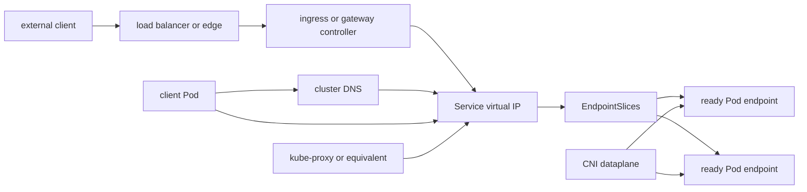

# 2.6 Cluster Networking Architecture

## Purpose of This Section

This section explains Kubernetes cluster networking as a production architecture.

Kubernetes networking is not one component. It is a layered system that includes Pod IP assignment, node routing, CNI plugins, Services,
EndpointSlices, DNS, kube-proxy or an equivalent dataplane, NetworkPolicy enforcement, ingress controllers, load balancers, and provider
networking.

For an SRE, networking matters because a workload can be healthy by Kubernetes object status while users still see failed requests. A Pod can
be `Running`, a Service can exist, and EndpointSlices can look correct, but traffic can still fail because of DNS, routing, NetworkPolicy,
load balancer health checks, node-local dataplane drift, MTU mismatch, cloud security rules, or application readiness.

By the end of this section, you should be able to:

- Explain the Kubernetes networking model at production level.
- Distinguish Pod-to-Pod, Pod-to-Service, and external-to-Service traffic paths.
- Explain how Services and EndpointSlices decouple clients from ephemeral Pods.
- Identify where CNI, kube-proxy, DNS, NetworkPolicy, Ingress, and load balancers fit.
- Troubleshoot networking incidents by following the packet and control-plane state.

## The Four Kubernetes Networking Problems

Kubernetes documentation frames cluster networking around four communication problems:

1. Container-to-container communication inside a Pod.
2. Pod-to-Pod communication.
3. Pod-to-Service communication.
4. External-to-Service communication.

Those problems map to different operational layers.

| Networking problem | Main mechanism | Common SRE failure path |
| --- | --- | --- |
| Container-to-container | Shared Pod network namespace and `localhost`. | Sidecar or app port mismatch. |
| Pod-to-Pod | Pod IPs and CNI routing. | CNI failure, route failure, MTU mismatch, policy denial. |
| Pod-to-Service | Service virtual IP, DNS, EndpointSlices, dataplane. | Wrong selector, stale endpoint, kube-proxy or eBPF dataplane issue. |
| External-to-Service | LoadBalancer, NodePort, Ingress, Gateway, or provider integration. | Load balancer health check, TLS, ingress rule, security group, DNS, or provider API issue. |

Good troubleshooting starts by naming which networking problem is failing.

## Cluster Networking Mental Model

A simplified production traffic path looks like this:



There are two things to track during incidents:

- Control-plane state: Service selectors, EndpointSlices, Ingress rules, NetworkPolicies, DNS records, and load balancer objects.
- Dataplane behavior: packets, routes, NAT, conntrack, eBPF maps, iptables/IPVS rules, cloud firewalls, node interfaces, and MTU.

Kubernetes objects can look correct while the dataplane is broken. The opposite can also happen: packets can flow temporarily while API state
is stale or wrong.

## Pod Network Model

Every Pod gets its own IP address.

Kubernetes expects Pods to communicate without needing explicit NAT between Pods. Containers inside the same Pod share a network namespace and
can communicate over `localhost`. Containers in different Pods communicate over Pod IPs, subject to routing and policy.

The Pod network model depends on the network plugin. Kubernetes defines the model; the CNI implementation makes it work.

Production Pod networking concerns include:

- Pod CIDR sizing
- Pod IP exhaustion
- node route programming
- overlay or underlay design
- MTU consistency
- IPv4, IPv6, or dual-stack support
- NetworkPolicy enforcement support
- node-to-node reachability
- cloud VPC or subnet limits
- Windows and Linux behavior differences

A Pod IP is not a durable service address. Pods are replaced frequently, and their IPs should be treated as lifecycle-bound.

## CNI Responsibilities

CNI plugins configure Pod networking on nodes.

Depending on the plugin, the CNI may handle:

- Pod interface creation
- IP address management
- routing between Pods and nodes
- overlays or tunnels
- eBPF dataplane behavior
- NetworkPolicy enforcement
- encryption
- cloud network interface integration
- service dataplane replacement for kube-proxy

The same Kubernetes object can behave differently depending on the CNI. This is why production documentation must name the CNI implementation,
version, operating mode, NetworkPolicy support, and provider integration.

Common CNI incident symptoms:

- Pods stuck in `ContainerCreating`
- CNI add or delete errors in events
- Pod-to-Pod traffic fails only on some nodes
- DNS timeouts from Pods
- NetworkPolicy works in one cluster but not another
- node-local route or eBPF map drift
- subnet IP exhaustion in cloud environments

## Services and Virtual IPs

A Service exposes a logical set of endpoints over the network.

Services solve the problem that Pods are ephemeral. Clients should not need to discover every backend Pod IP directly. A Service gives clients
a stable abstraction while the backing Pods change.

Common Service types include:

| Service type | Purpose | Production concern |
| --- | --- | --- |
| `ClusterIP` | Internal virtual IP for in-cluster access. | Selector accuracy, EndpointSlices, DNS, dataplane health. |
| `NodePort` | Exposes a port on each node. | Firewall exposure, node reachability, source IP behavior. |
| `LoadBalancer` | Requests an external load balancer where supported. | Provider integration, health checks, quotas, security rules. |
| `ExternalName` | Maps a Service name to a DNS name. | DNS behavior, no proxying, dependency ownership. |
| Headless Service | No cluster IP; DNS returns endpoint IPs. | Client-side discovery, StatefulSet behavior, direct Pod addressing. |

A Service with a selector normally results in EndpointSlices being created and updated for matching Pods.

## EndpointSlices

EndpointSlices are the scalable API used to track Service backends.

They store endpoint addresses, ports, address family, readiness-related conditions, node names, and topology information. The control plane
normally creates EndpointSlices for Services with selectors.

EndpointSlice conditions matter during production incidents:

| Condition | Operational meaning |
| --- | --- |
| `ready` | Shortcut for serving and not terminating, except for special cases such as `publishNotReadyAddresses`. |
| `serving` | Endpoint is currently serving responses. |
| `terminating` | Endpoint is terminating and may be treated differently by consumers. |

EndpointSlices are a better operational signal than the older Endpoints API. The legacy Endpoints API is deprecated and has scaling and
feature limitations.

Useful checks:

```bash
kubectl get service <service-name> -n <namespace> -o wide
kubectl get endpointslice -n <namespace> -l kubernetes.io/service-name=<service-name>
kubectl describe endpointslice -n <namespace> -l kubernetes.io/service-name=<service-name>
```

If a Service has no usable endpoints, check labels, selectors, Pod readiness, and EndpointSlice conditions before blaming DNS or ingress.

## DNS and Service Discovery

Kubernetes DNS lets workloads resolve Services and, in some cases, Pods.

A normal Service can be reached by DNS names such as:

```text
<service-name>.<namespace>.svc.cluster.local
```

Within the same namespace, clients commonly use the short Service name.

DNS is part of the request path for many applications, so DNS outages can look like application or Service failures.

Common DNS failure causes:

- CoreDNS or DNS add-on outage
- NetworkPolicy blocking DNS traffic
- node-local DNS cache failure
- CNI failure between Pod and DNS Service
- search path or namespace confusion
- Service name typo
- high DNS latency under load

Useful checks:

```bash
kubectl get svc -n kube-system
kubectl get pods -n kube-system -l k8s-app=kube-dns
kubectl exec -n <namespace> <pod-name> -- nslookup <service-name>
```

In production, use the DNS tooling that exists in your base images or a trusted debug image approved by the platform team.

## kube-proxy and Equivalent Dataplanes

kube-proxy implements Kubernetes Service traffic behavior in many clusters.

It watches Services and EndpointSlices and programs node-local forwarding behavior. Depending on mode and implementation, traffic may be
handled through iptables, IPVS, nftables, eBPF, or another dataplane.

Some clusters replace kube-proxy with CNI-provided service handling. In those clusters, the operational owner of Service routing may be the
CNI dataplane rather than kube-proxy.

Production dataplane concerns include:

- node-local rule drift
- stale EndpointSlice watches
- conntrack pressure
- source NAT behavior
- uneven load distribution
- health check path mismatch
- node-specific failures
- eBPF program or map issues
- kube-proxy or CNI agent restarts

When Service traffic fails only from some nodes, suspect node-local dataplane state.

## NetworkPolicy

NetworkPolicy defines allowed ingress and egress traffic for selected Pods.

NetworkPolicy enforcement depends on the network plugin. Creating NetworkPolicy objects in a cluster whose CNI does not enforce them will not
provide the intended isolation.

Important concepts:

- Policies select Pods using labels.
- Ingress and egress rules are independent.
- Policies are additive.
- A Pod becomes isolated for a direction when at least one policy selects it for that direction.
- DNS, metrics, health checks, and dependency traffic must be explicitly allowed when egress is restricted.

Common NetworkPolicy incident symptoms:

- application timeouts after a policy rollout
- DNS failures from selected Pods
- traffic works from one namespace but not another
- readiness probes fail because probe source is blocked
- external dependency access fails after egress policy changes

During policy troubleshooting, test both directions and confirm the labels used by the policy match the intended Pods.

## Ingress, Load Balancers, and Gateway Boundary

External traffic usually enters Kubernetes through a provider load balancer, ingress controller, Gateway implementation, NodePort, or some
combination of these.

Ingress is stable but frozen. Kubernetes recommends Gateway API for newer, more expressive traffic management. In production, however, many
clusters still rely on Ingress controllers and provider-specific load balancer integrations.

External request path example:

```text
client DNS
  -> external load balancer
  -> ingress or gateway controller
  -> Kubernetes Service
  -> EndpointSlice endpoint
  -> Pod
```

Common external traffic failure points:

- public DNS record points to the wrong target
- certificate expired or wrong SNI configuration
- load balancer health checks fail
- ingress class mismatch
- ingress rule host or path mismatch
- Service port or targetPort mismatch
- no ready EndpointSlice endpoints
- cloud firewall or security group blocks traffic
- node or Pod network unreachable from the load balancer

Do not debug external traffic only from inside the cluster. Test each boundary: DNS, load balancer, ingress, Service, EndpointSlice, and Pod.

## Dual-Stack and IP Family Design

Kubernetes supports IPv4-only, IPv6-only, and dual-stack networking depending on cluster and provider support.

Dual-stack affects Pods, Services, nodes, CNI support, kube-proxy or equivalent dataplane behavior, DNS records, load balancers, and security
controls.

Production dual-stack concerns include:

- whether the provider supports dual-stack networking
- whether the CNI supports dual-stack networking
- Service `ipFamilyPolicy` and `ipFamilies`
- primary IP family expectations
- DNS A and AAAA behavior
- firewall and security group parity
- observability across both families
- client behavior when both A and AAAA records exist

Do not enable dual-stack as a checkbox. Treat it as a network architecture decision with application, security, and operations impact.

## Real Production Example: Service Has No Endpoints

A team reports that in-cluster calls to `payments-api` fail.

Initial checks:

```bash
kubectl get svc payments-api -n payments -o wide
kubectl get endpointslice -n payments -l kubernetes.io/service-name=payments-api
kubectl get pods -n payments --show-labels
kubectl describe pod -n payments -l app=payments-api
```

Findings:

- Service selector is `app=payment-api`
- Pods are labeled `app=payments-api`
- EndpointSlices are empty
- DNS resolves the Service name correctly

The failure is not DNS, kube-proxy, or CNI. The Service selector does not match the Pods.

The fix is to correct the selector or labels, then verify that EndpointSlices include ready endpoints.

## Real Production Example: NetworkPolicy Blocks DNS

A namespace enables default-deny egress, and applications begin timing out.

Checks:

```bash
kubectl get networkpolicy -n checkout
kubectl describe networkpolicy -n checkout
kubectl exec -n checkout <pod-name> -- nslookup kubernetes.default.svc.cluster.local
```

Findings:

- Pods can connect to already-known IPs in allowed CIDRs
- DNS lookups fail
- egress policy forgot to allow DNS traffic to the cluster DNS Service

The policy rollout is technically valid, but operationally incomplete. The fix is to allow required DNS egress, then retest application
dependencies.

## SRE Troubleshooting Flow

Use this flow when debugging Kubernetes networking:

1. Identify the path: Pod-to-Pod, Pod-to-Service, or external-to-Service.
2. Confirm client DNS resolution.
3. Confirm the Service exists and has the expected ports.
4. Confirm EndpointSlices have ready endpoints.
5. Confirm Pod labels match Service selectors.
6. Confirm Pods are actually ready and listening on the target port.
7. Confirm NetworkPolicy permits the traffic.
8. Confirm node-local dataplane health on affected nodes.
9. Confirm CNI health, Pod IP allocation, and node routes.
10. Confirm load balancer, ingress, TLS, and provider firewall state for external paths.
11. Compare affected and unaffected namespaces, nodes, zones, and clients.

## SRE Operating Checklist

Use this checklist for cluster networking reviews:

- Is the CNI implementation, version, and operating mode documented?
- Are Pod, Service, and node CIDR ranges documented and non-overlapping?
- Is Pod IP exhaustion monitored?
- Is DNS availability and latency monitored?
- Is kube-proxy or equivalent service dataplane health monitored?
- Are EndpointSlice counts and endpoint readiness visible during incidents?
- Is NetworkPolicy enforcement confirmed in each cluster type?
- Are default-deny policies paired with tested allow policies for DNS, metrics, and dependencies?
- Are ingress and load balancer health checks documented?
- Are cloud firewall, security group, route table, and subnet limits documented?
- Is dual-stack support deliberately designed or explicitly out of scope?
- Are runbooks organized by traffic path rather than by component only?

## Common Anti-Patterns

| Anti-pattern | Why it is risky |
| --- | --- |
| Treating DNS failure as Service failure | DNS is a separate dependency and must be tested directly. |
| Debugging Service traffic without checking EndpointSlices | Services route to endpoint state, not intent. |
| Assuming NetworkPolicy is enforced everywhere | Enforcement depends on the CNI. |
| Allowing default-deny egress without DNS rules | Applications can fail before reaching their real dependencies. |
| Ignoring node-local dataplane failures | Service traffic can fail on only some nodes. |
| Treating Ingress as magic external access | Ingress requires a controller and correct class, rules, Service, endpoints, and load balancer path. |
| Enabling dual-stack without an operations plan | IPv4 and IPv6 must both be observable, secured, and tested. |

## Section Review Questions

1. What are the four networking problems Kubernetes documentation identifies?
2. Why is a Pod IP not a durable service address?
3. What responsibilities can a CNI plugin have?
4. What does a Service abstract for clients?
5. Why are EndpointSlices important for Service traffic?
6. What is the relationship between Pod readiness and Service endpoints?
7. Why can NetworkPolicy objects fail to enforce isolation in some clusters?
8. Why can DNS failures look like application failures?
9. What is the difference between Ingress and a Service?
10. What should an SRE check first when a Service resolves in DNS but has no working backends?

## Key Takeaways

- Kubernetes networking is a layered architecture, not a single component.
- Services and EndpointSlices decouple clients from changing Pod IPs.
- CNI implements the Pod network model and may also enforce policy or replace kube-proxy.
- DNS, NetworkPolicy, EndpointSlices, and node-local dataplanes are common incident paths.
- External traffic requires every boundary to work: DNS, load balancer, ingress or gateway, Service, EndpointSlice, Pod, and application.
- SREs should troubleshoot by following both control-plane state and dataplane behavior.

## Official References

- [Cluster Networking](https://kubernetes.io/docs/concepts/cluster-administration/networking/)
- [Service](https://kubernetes.io/docs/concepts/services-networking/service/)
- [EndpointSlices](https://kubernetes.io/docs/concepts/services-networking/endpoint-slices/)
- [DNS for Services and Pods](https://kubernetes.io/docs/concepts/services-networking/dns-pod-service/)
- [Network Policies](https://kubernetes.io/docs/concepts/services-networking/network-policies/)
- [Ingress](https://kubernetes.io/docs/concepts/services-networking/ingress/)
- [IPv4/IPv6 dual-stack](https://kubernetes.io/docs/concepts/services-networking/dual-stack/)
