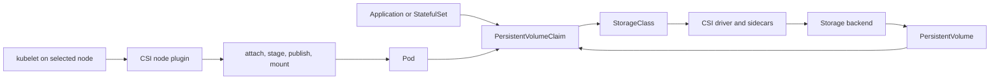
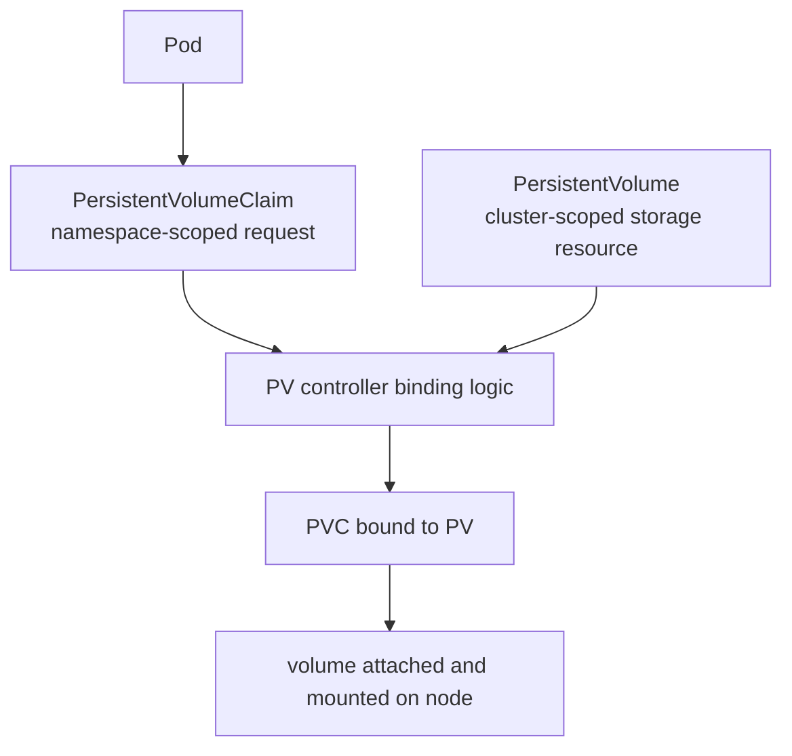
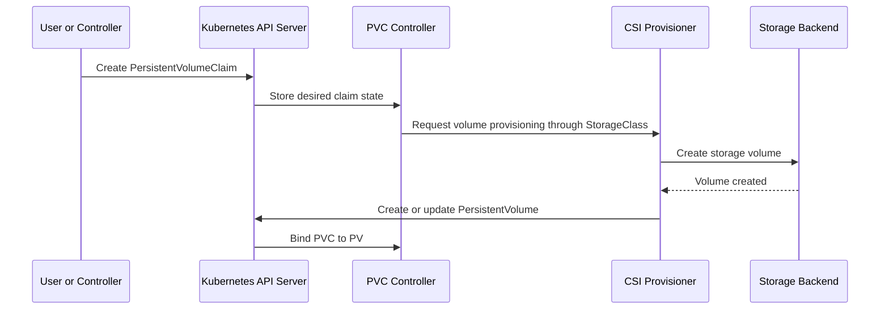
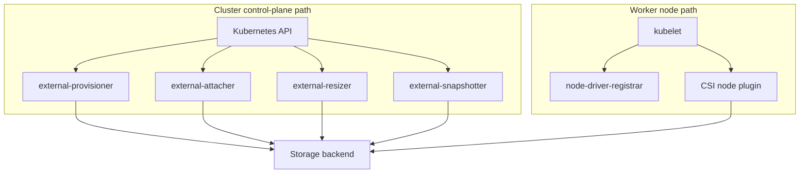
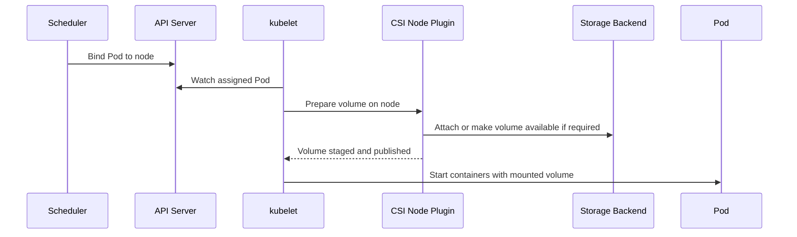

# 2.7 Cluster Storage Architecture

## Purpose of This Section

This section explains Kubernetes storage architecture from an SRE and platform engineering perspective.

Storage in Kubernetes is not only about mounting a disk into a Pod. It is a control-plane and node-level system that connects workload intent,
scheduling, storage provisioning, attachment, mounting, topology, capacity, snapshots, expansion, and failure recovery.

For production environments, storage is one of the fastest ways to turn a healthy-looking cluster into a user-facing incident. A Pod can remain
`Pending` because a volume cannot be provisioned. A StatefulSet can stall because a volume is bound to the wrong zone. A node can become
unavailable while a volume is still attached. A backup can exist but fail to restore because it captured a crash-consistent snapshot without the
application state required for recovery.

By the end of this section, you should be able to:

- Explain the difference between ephemeral volumes and persistent volumes.
- Describe the relationship between PersistentVolumes, PersistentVolumeClaims, StorageClasses, Pods, and CSI drivers.
- Explain how dynamic provisioning works.
- Identify where topology, volume binding mode, access modes, reclaim policy, expansion, snapshots, clones, and storage capacity fit.
- Troubleshoot common storage failures by following the control-plane state and node-level mount path.
- Review storage design decisions before a workload reaches production.

## Storage Architecture Mental Model

Kubernetes separates application intent from storage implementation.

An application usually asks for storage by creating a PersistentVolumeClaim. The claim describes what the workload needs, such as size, access
mode, volume mode, and optionally a StorageClass. Kubernetes and the storage integration then decide how that request maps to a real storage
backend.



This separation is intentional. Kubernetes should not need to know every vendor-specific storage API. Instead, Kubernetes represents storage
through portable objects and delegates backend-specific operations to storage drivers.

The important production idea is this:

> Kubernetes stores desired storage state in the API. The actual storage behavior is implemented by controllers, CSI drivers, node plugins,
> kubelet, and the external storage platform.

## Ephemeral and Persistent Storage

Kubernetes supports both ephemeral and persistent storage.

| Storage type | Typical lifetime | Common examples | Production use |
| --- | --- | --- | --- |
| Ephemeral volume | Tied to Pod lifetime or node lifetime. | `emptyDir`, projected volumes, ConfigMap volumes, Secret volumes. | Scratch space, injected configuration, certificates, service account tokens. |
| Persistent volume | Independent of individual Pod lifetime. | PVC-backed block or file storage. | Databases, queues, stateful services, durable application data. |
| Generic ephemeral volume | Tied to Pod lifetime but provisioned through normal volume mechanisms. | Ephemeral CSI-backed storage from a StorageClass. | Temporary per-Pod storage that still needs storage-class behavior. |

Ephemeral storage is useful, but it is not a durability boundary. If a Pod is deleted, rescheduled, or recreated, data stored only in ephemeral
volumes can disappear. Persistent storage exists so the workload can survive Pod replacement.

A production review should always ask:

- What data must survive Pod restart?
- What data must survive node failure?
- What data must survive zone failure?
- What data must be backed up and restored independently of Kubernetes objects?
- What data is intentionally temporary?

## PersistentVolume and PersistentVolumeClaim

PersistentVolumes and PersistentVolumeClaims form the core Kubernetes storage contract.

A PersistentVolume is a cluster resource that represents storage available to the cluster. A PersistentVolumeClaim is a namespace-scoped request
for storage by a workload or user.



The PVC is what application teams normally reference. The PV is the storage object that satisfies the claim.

A minimal PVC looks like this:

```yaml
apiVersion: v1
kind: PersistentVolumeClaim
metadata:
  name: app-data
spec:
  accessModes:
    - ReadWriteOnce
  resources:
    requests:
      storage: 100Gi
  storageClassName: fast-ssd
```

The Pod does not need to know which disk, file share, or backend volume is created. It references the PVC:

```yaml
apiVersion: v1
kind: Pod
metadata:
  name: app
spec:
  containers:
    - name: app
      image: example/app:1.0
      volumeMounts:
        - name: data
          mountPath: /var/lib/app
  volumes:
    - name: data
      persistentVolumeClaim:
        claimName: app-data
```

This is a useful abstraction, but it is not magic. The backend still decides what durability, latency, throughput, replication, encryption,
backup integration, and failure behavior are actually provided.

## StorageClass

A StorageClass describes a class of storage offered by the platform.

In production, StorageClasses are part of the platform contract. They should communicate operational behavior, not only vendor parameters.
A cluster may expose different classes for general-purpose SSD, high-throughput file storage, encrypted volumes, zone-aware disks, regional
volumes, or backup-integrated storage.

```yaml
apiVersion: storage.k8s.io/v1
kind: StorageClass
metadata:
  name: fast-ssd
provisioner: example.csi.driver
volumeBindingMode: WaitForFirstConsumer
allowVolumeExpansion: true
reclaimPolicy: Delete
parameters:
  type: fast
```

Important StorageClass fields include:

| Field | Why it matters |
| --- | --- |
| `provisioner` | Identifies the volume plugin or CSI driver responsible for provisioning. |
| `parameters` | Passes implementation-specific settings to the provisioner. |
| `reclaimPolicy` | Controls what happens to the backing volume after the PVC is deleted. |
| `allowVolumeExpansion` | Enables supported PVC expansion workflows. |
| `volumeBindingMode` | Controls whether volume binding happens immediately or waits for Pod scheduling context. |
| `mountOptions` | Adds mount options where supported by the storage backend. |

Kubernetes does not define what `fast`, `gold`, `standard`, or `premium` mean. Those names are platform choices. A production platform should
document every StorageClass so application teams understand durability, topology, performance, backup, restore, encryption, and support limits.

## Dynamic Provisioning

Dynamic provisioning allows Kubernetes to create storage on demand when a PVC is created.

Without dynamic provisioning, administrators must pre-create PersistentVolumes. With dynamic provisioning, a PVC references a StorageClass, and
the storage provisioner creates a matching backend volume.



Dynamic provisioning is powerful because it removes manual ticket-based storage allocation. It is risky when StorageClasses are poorly governed.
A typo or an unrestricted class can create expensive, under-protected, or non-compliant storage.

Production controls commonly include:

- Clearly named StorageClasses with documented behavior.
- ResourceQuotas for PVC count and requested storage.
- LimitRanges or admission policy for allowed storage sizes.
- Policy enforcement for approved StorageClasses.
- Monitoring for provisioning failures and excessive storage growth.
- Tagging or labeling conventions for cost and ownership.

## CSI in the Storage Stack

The Container Storage Interface is the standard interface used by most modern Kubernetes storage integrations.

A CSI deployment usually includes controller-side components and node-side components.



Common CSI responsibilities include:

- Provisioning volumes.
- Deleting volumes according to reclaim policy.
- Attaching and detaching volumes where the backend requires attachment.
- Staging and publishing volumes on nodes.
- Expanding volumes where supported.
- Creating snapshots where supported.
- Reporting storage capacity where supported.

An SRE does not need to memorize every CSI sidecar, but should know where to look during incidents. A PVC stuck in `Pending` usually starts at
the provisioner path. A Pod stuck in `ContainerCreating` with mount errors usually starts at kubelet, CSI node plugin, attachment state, or backend
availability.

## Volume Binding and Topology

Storage is often topology-constrained. A disk may exist only in one zone. A file system may be regional. A storage class may be available only
on specific node pools.

`volumeBindingMode` controls when binding and provisioning occur.

| Binding mode | Behavior | Production implication |
| --- | --- | --- |
| `Immediate` | PVC binding or provisioning occurs as soon as the PVC is created. | Can create a volume before the scheduler knows where the Pod will run. This can cause zone mismatch for topology-limited storage. |
| `WaitForFirstConsumer` | Binding or provisioning waits until a Pod using the PVC is scheduled. | Allows scheduling constraints, node topology, and storage topology to be considered together. Often safer for zonal storage. |

For zonal block storage, `WaitForFirstConsumer` is usually the safer default because the scheduler can consider Pod placement and storage
location together.

A common failure pattern looks like this:

```text
PVC created with Immediate binding
        |
        v
Volume provisioned in zone-a
        |
        v
Pod scheduling constraints prefer or require zone-b
        |
        v
Pod remains Pending or cannot mount volume
```

Storage topology must be reviewed together with node topology, StatefulSet placement, availability zones, Pod affinity, topology spread, and
failure-domain requirements.

## Access Modes and Volume Modes

Access modes describe how a volume may be mounted by nodes.

| Access mode | Meaning | Notes |
| --- | --- | --- |
| `ReadWriteOnce` | Read-write by a single node. | Common for block volumes used by databases or single-writer workloads. |
| `ReadOnlyMany` | Read-only by many nodes. | Useful for shared read-only data where the backend supports it. |
| `ReadWriteMany` | Read-write by many nodes. | Requires a backend that supports shared write access, commonly file or distributed storage. |
| `ReadWriteOncePod` | Read-write by a single Pod. | Useful when the platform needs a stricter single-Pod writer guarantee and the driver supports it. |

Access mode is not the same as application correctness. `ReadWriteMany` does not make an application safe for concurrent writes. The application
and storage backend still need a valid consistency model.

Volume mode controls whether the volume is exposed as a mounted filesystem or a raw block device.

| Volume mode | Use case |
| --- | --- |
| `Filesystem` | Most applications. Kubernetes mounts a filesystem into the container. |
| `Block` | Applications that manage the device directly. Requires careful operational ownership. |

Production teams should document which access modes and volume modes are supported per StorageClass.

## Reclaim Policy

The reclaim policy controls what happens to the backing volume when the claim is deleted.

| Reclaim policy | Behavior | Production guidance |
| --- | --- | --- |
| `Delete` | Kubernetes and the provisioner delete the backing storage when the PVC is deleted. | Useful for disposable or automatically protected data, but dangerous if users can delete PVCs accidentally. |
| `Retain` | The PV and backing storage are retained for manual recovery or cleanup. | Useful for high-value data, forensics, and controlled deletion workflows. Requires operational cleanup. |

Do not confuse reclaim policy with backup. `Retain` can preserve a backend volume after PVC deletion, but it does not protect against application
corruption, ransomware, operator mistakes inside the filesystem, region loss, or failed restore procedures.

A mature platform defines deletion behavior clearly:

- Which StorageClasses use `Delete`?
- Which StorageClasses use `Retain`?
- Who approves deletion of production PVCs?
- How are retained volumes discovered and cleaned up?
- How are backups tested before destructive operations?

## Expansion, Snapshots, Clones, and Volume Attributes

Storage architecture does not stop when the volume is created. Production systems need lifecycle operations.

### Volume Expansion

PVC expansion allows a claim to request a larger size when the StorageClass and driver support expansion.

Common operational checks include:

- `allowVolumeExpansion` is enabled on the StorageClass.
- The CSI driver supports expansion.
- The backend volume size changed successfully.
- The filesystem resize completed where a filesystem is used.
- The application can use the expanded space.

A PVC size increase may update the Kubernetes object before the filesystem is usable inside the container. Always verify from inside the workload
or from node-level mount state when debugging capacity incidents.

### Volume Snapshots

Volume snapshots are Kubernetes API objects that request a point-in-time copy through a snapshot-capable CSI driver.

```mermaid
flowchart LR
    pvc["PersistentVolumeClaim"] --> snap["VolumeSnapshot"]
    snap --> class["VolumeSnapshotClass"]
    class --> csi["CSI snapshotter and driver"]
    csi --> backend["Storage snapshot"]
```

Snapshots are useful, but they are not automatically a complete backup strategy. A snapshot may be crash-consistent rather than
application-consistent. A database may require quiescing, write-ahead log handling, backup tooling, or restore validation. A snapshot stored in
the same fault domain as the source volume may not satisfy disaster recovery requirements.

### Volume Cloning

Volume cloning allows a new PVC to be created from an existing PVC where the storage driver supports it.

Common use cases include:

- Creating test data from a production-like dataset.
- Fast recovery into a new claim.
- Preparing migration or validation environments.

Clone workflows must still follow data governance rules. Copying a production PVC can copy sensitive data.

### VolumeAttributesClass

VolumeAttributesClass provides a Kubernetes API mechanism for modifying supported volume attributes after provisioning when the CSI driver and
cluster support the feature.

This is useful for storage systems that allow operational changes such as performance profile changes. It should be treated as a controlled
operation because a storage attribute change can affect latency, throughput, cost, and availability.

## Storage Capacity Tracking

Storage capacity tracking allows CSI drivers to publish available storage capacity information for topology-aware scheduling decisions.

This matters when storage is not equally available everywhere. For example, a storage pool may have free capacity in one zone but not another.
The scheduler can use capacity information when choosing where to run a Pod that needs a PVC.

Storage capacity tracking is helpful, but it does not replace backend monitoring. Platform teams still need direct visibility into storage pools,
quotas, latency, saturation, error rates, replication health, and capacity forecasts.

## Node-Level Storage Path

When a Pod uses a persistent volume, several things must happen on the selected node.



A storage incident can happen at any layer:

- The PVC is not bound.
- The PV references the wrong backend object.
- The scheduler cannot find a node that satisfies storage topology.
- The attach operation fails.
- The CSI node plugin is unhealthy.
- The node cannot mount the filesystem.
- The application lacks permissions inside the mount.
- The backend is slow, saturated, degraded, or unavailable.

This is why storage troubleshooting must include both Kubernetes API state and backend storage health.

## Common Failure Modes

| Symptom | Likely area | First checks |
| --- | --- | --- |
| PVC remains `Pending`. | Provisioning, StorageClass, quota, topology, backend capacity. | `kubectl describe pvc`, StorageClass name, events, provisioner logs, quota, backend capacity. |
| Pod remains `Pending`. | Scheduling and volume topology. | Pod events, PVC binding mode, node selectors, topology constraints, zone labels. |
| Pod stuck in `ContainerCreating`. | Attach, mount, CSI node plugin, filesystem. | Pod events, kubelet logs, CSI node plugin logs, VolumeAttachment objects, node health. |
| Multi-attach error. | Single-writer volume attached to another node. | Previous Pod location, node status, volume attachment state, detach timing. |
| Application sees read-only filesystem. | Mount options, filesystem errors, backend protection mode. | Container logs, node kernel messages, mount state, backend health. |
| PVC expansion not visible in Pod. | Backend resize or filesystem resize. | PVC conditions, events, CSI resizer logs, filesystem size inside container. |
| Snapshot exists but restore fails. | Snapshot class, driver support, application consistency, restore process. | Snapshot status, driver logs, restore PVC events, application recovery procedure. |
| Storage latency increases. | Backend saturation, noisy neighbor, network path, node pressure. | Application latency, backend metrics, node I/O, cloud volume metrics, throttling indicators. |

## Production Design Review

Before approving a stateful workload, review these questions.

### Data Criticality

- What data is durable state, cache, scratch data, or rebuildable data?
- What is the recovery point objective?
- What is the recovery time objective?
- What data needs application-consistent backup?
- What data must be encrypted or retained for compliance?

### StorageClass Selection

- Which StorageClass is approved for this workload?
- Is the StorageClass zonal, regional, replicated, shared, or local?
- Does it support required access modes?
- Does it support expansion?
- Does it support snapshots or clones?
- What are the expected latency, IOPS, throughput, and cost characteristics?

### Scheduling and Topology

- Does the workload use zonal or topology-constrained storage?
- Does the StorageClass use `WaitForFirstConsumer` when needed?
- Are StatefulSet replicas spread across failure domains correctly?
- Are PodDisruptionBudgets and maintenance procedures compatible with storage failover limits?
- What happens if a node disappears while a volume is attached?

### Backup and Restore

- Are backups separate from snapshots when required?
- Has restore been tested into a clean namespace or cluster?
- Are database logs, transactions, and application consistency handled?
- Are restore credentials and runbooks available during an incident?
- Are backup objects protected from accidental deletion?

### Day-2 Operations

- Who owns volume expansion?
- Who approves PVC deletion?
- How are orphaned PVs and retained volumes handled?
- How are storage driver upgrades tested?
- What alerts exist for provisioning failures, mount failures, capacity, latency, and backend degradation?

## Real-Time Production Use Cases

### Stateful Application on Zonal Block Storage

A team runs a single-writer database on zonal block storage. Each replica uses its own PVC through a StatefulSet.

Recommended checks:

- Use a StorageClass with documented zone behavior.
- Prefer `WaitForFirstConsumer` for topology-aware provisioning.
- Use anti-affinity or topology spread for replicas.
- Test node failure and volume detach behavior.
- Validate backup and restore outside the original Pod.

### Shared Content on ReadWriteMany Storage

A content service needs many Pods to read and write shared files.

Recommended checks:

- Use a backend that actually supports `ReadWriteMany`.
- Validate application behavior under concurrent writes.
- Monitor metadata latency and lock behavior.
- Define backup and restore for the shared filesystem.
- Avoid assuming shared storage replaces application-level consistency controls.

### Temporary High-Performance Scratch Space

A batch job needs fast temporary storage but does not need durable data after completion.

Recommended checks:

- Consider ephemeral storage or generic ephemeral volumes.
- Set resource requests and limits where applicable.
- Monitor node ephemeral storage pressure.
- Ensure the job can be retried from source data.
- Do not store irreplaceable output only in ephemeral storage.

## Anti-Patterns

| Anti-pattern | Why it fails in production | Better approach |
| --- | --- | --- |
| Treating PVCs as backups. | A PVC is live storage, not a tested recovery copy. | Use backup tooling and restore validation. |
| Using one default StorageClass for everything. | Different workloads have different latency, topology, durability, and cost needs. | Publish documented workload-specific classes. |
| Ignoring topology for zonal volumes. | Pods can become unschedulable or unable to mount volumes. | Use `WaitForFirstConsumer` and review placement constraints. |
| Assuming snapshots are application-consistent. | Crash-consistent snapshots can fail application recovery. | Use application-aware backup or quiescing where required. |
| Allowing unrestricted PVC creation. | Teams can create uncontrolled cost and compliance risk. | Use quota, policy, approval, and documented classes. |
| Using `ReadWriteMany` to solve application concurrency. | Shared writes still require application correctness. | Validate locking, consistency, and application behavior. |
| Deleting PVCs during incident response without backup validation. | Data loss can become permanent. | Confirm recovery state and approval before destructive action. |

## SRE Runbook: PVC Pending

Use this path when a PersistentVolumeClaim does not bind.

1. Confirm the claim and StorageClass.

   ```bash
   kubectl get pvc -n <namespace>
   kubectl describe pvc -n <namespace> <claim-name>
   kubectl get storageclass
   ```

2. Read PVC events.

   Look for missing StorageClass, quota errors, provisioning errors, topology errors, or backend capacity failures.

3. Check the provisioner.

   ```bash
   kubectl get pods -A | grep -i csi
   kubectl logs -n <driver-namespace> <provisioner-pod>
   ```

4. Check quota and policy.

   ```bash
   kubectl get resourcequota -n <namespace>
   kubectl describe resourcequota -n <namespace>
   ```

5. Check storage topology.

   Review node selectors, affinity, topology spread constraints, allowed topologies, and volume binding mode.

6. Check the backend.

   Validate capacity, credentials, API health, rate limits, and provider-specific errors.

7. Decide remediation.

   Correct the StorageClass, quota, topology, backend issue, or workload request. Avoid deleting claims until data risk is understood.

## SRE Runbook: Pod Cannot Mount Volume

Use this path when the PVC is bound but the Pod is stuck in `ContainerCreating` or reports mount errors.

1. Describe the Pod.

   ```bash
   kubectl describe pod -n <namespace> <pod-name>
   ```

2. Check volume attachment state.

   ```bash
   kubectl get volumeattachment
   ```

3. Check kubelet and CSI node plugin logs on the target node.

4. Confirm the previous Pod or node is not still holding the volume.

5. Check backend attachment and node health.

6. Validate filesystem errors, permissions, and mount options.

7. Escalate to storage platform owners if the backend is degraded or attachment state is inconsistent.

## Lab: Trace a PVC from Claim to Mounted Volume

This lab is designed for a non-production Kubernetes cluster with a working default StorageClass.

### Goal

Trace the lifecycle of a dynamically provisioned volume from PVC creation to Pod mount.

### Steps

1. Identify available StorageClasses.

   ```bash
   kubectl get storageclass
   ```

2. Create a test namespace.

   ```bash
   kubectl create namespace storage-lab
   ```

3. Create a PVC.

   ```yaml
   apiVersion: v1
   kind: PersistentVolumeClaim
   metadata:
     name: lab-data
     namespace: storage-lab
   spec:
     accessModes:
       - ReadWriteOnce
     resources:
       requests:
         storage: 1Gi
   ```

4. Observe binding.

   ```bash
   kubectl get pvc -n storage-lab
   kubectl describe pvc -n storage-lab lab-data
   kubectl get pv
   ```

5. Create a Pod that mounts the PVC.

   ```yaml
   apiVersion: v1
   kind: Pod
   metadata:
     name: storage-lab-pod
     namespace: storage-lab
   spec:
     containers:
       - name: app
         image: busybox:1.36
         command: ["sh", "-c", "echo hello > /data/hello.txt && sleep 3600"]
         volumeMounts:
           - name: data
             mountPath: /data
     volumes:
       - name: data
         persistentVolumeClaim:
           claimName: lab-data
   ```

6. Confirm the file exists.

   ```bash
   kubectl exec -n storage-lab storage-lab-pod -- cat /data/hello.txt
   ```

7. Delete and recreate the Pod, then confirm data remains.

   ```bash
   kubectl delete pod -n storage-lab storage-lab-pod
   ```

8. Clean up only after confirming this is a lab namespace.

   ```bash
   kubectl delete namespace storage-lab
   ```

### Expected Learning

You should be able to map the PVC, PV, StorageClass, Pod volume reference, node mount behavior, and events involved in a simple persistent
storage workflow.

## Review Questions

1. What problem does a PersistentVolumeClaim solve for application teams?
2. Why is `WaitForFirstConsumer` often important for zonal storage?
3. What is the difference between a PersistentVolume and a StorageClass?
4. Why should snapshots not automatically be treated as a complete backup strategy?
5. What is the likely troubleshooting path for a Pod stuck in `ContainerCreating` with volume mount errors?
6. What risks come from allowing unrestricted PVC creation in production namespaces?
7. Why does `ReadWriteMany` not guarantee that an application is safe for concurrent writes?
8. What should be documented for every production StorageClass?

## Key Takeaways

- Kubernetes storage is a contract between workload intent, Kubernetes API objects, CSI drivers, nodes, and an external storage backend.
- PVCs are the normal application-facing abstraction for durable storage.
- StorageClasses are production platform contracts and must be documented carefully.
- Dynamic provisioning improves speed but requires quota, policy, and cost controls.
- Topology matters. Storage placement and Pod scheduling must be designed together.
- CSI moves backend-specific behavior out of Kubernetes, but SREs still need to understand the control-plane and node-level paths.
- Snapshots, clones, expansion, and VolumeAttributesClass are lifecycle features, not substitutes for tested backup and restore.
- Storage incidents require checking Kubernetes events, CSI components, kubelet behavior, node health, and backend storage state.

## Official References

- [Kubernetes Storage](https://kubernetes.io/docs/concepts/storage/)
- [Kubernetes Volumes](https://kubernetes.io/docs/concepts/storage/volumes/)
- [Persistent Volumes](https://kubernetes.io/docs/concepts/storage/persistent-volumes/)
- [Storage Classes](https://kubernetes.io/docs/concepts/storage/storage-classes/)
- [Dynamic Volume Provisioning](https://kubernetes.io/docs/concepts/storage/dynamic-provisioning/)
- [Volume Snapshots](https://kubernetes.io/docs/concepts/storage/volume-snapshots/)
- [Volume Snapshot Classes](https://kubernetes.io/docs/concepts/storage/volume-snapshot-classes/)
- [CSI Volume Cloning](https://kubernetes.io/docs/concepts/storage/volume-pvc-datasource/)
- [Storage Capacity](https://kubernetes.io/docs/concepts/storage/storage-capacity/)
- [VolumeAttributesClass](https://kubernetes.io/docs/concepts/storage/volume-attributes-classes/)
