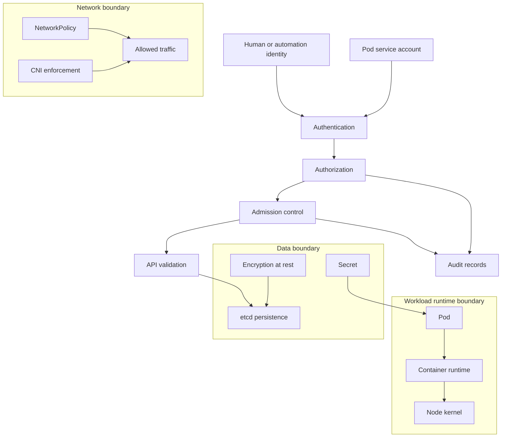
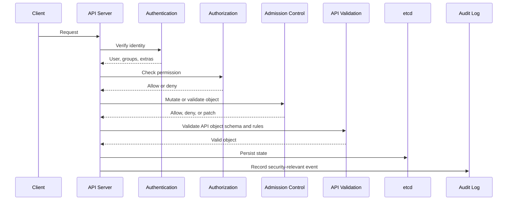
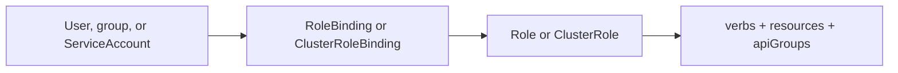
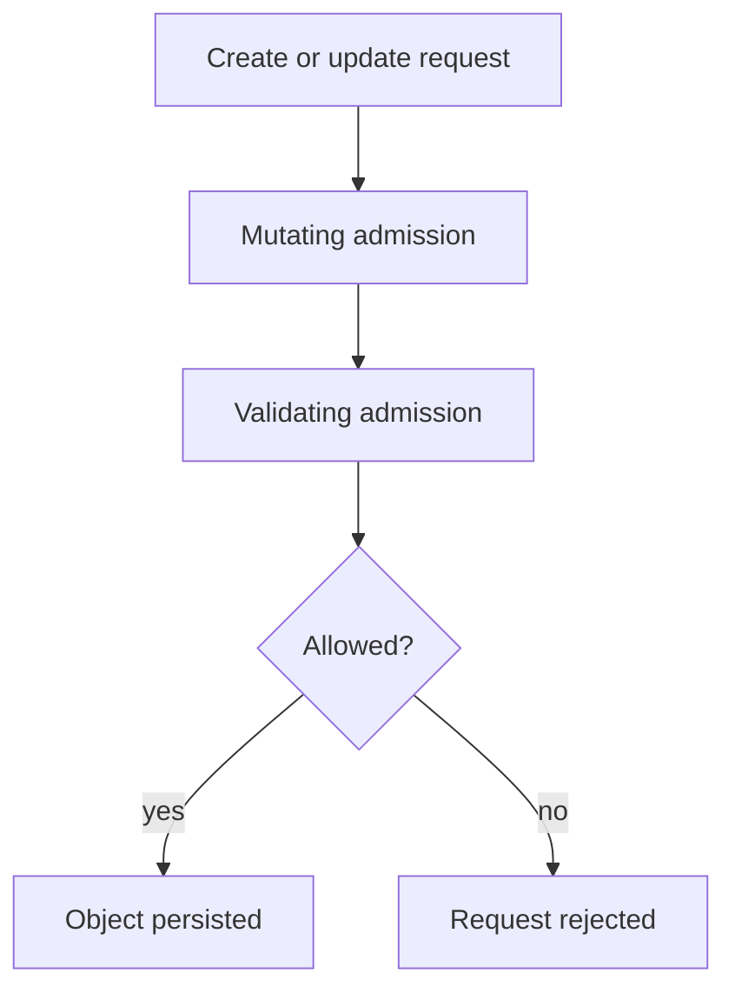
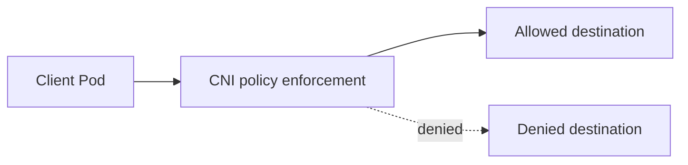

# 2.8 Cluster Security Architecture

## Purpose of This Section

This section explains Kubernetes cluster security architecture from a production SRE perspective.

Kubernetes security is not one feature. It is a layered architecture that protects the API server, identities, authorization decisions,
admission-time policy, workloads, networks, secrets, nodes, images, runtime behavior, audit records, and the external systems integrated with the
cluster.

For an SRE, cluster security matters because most serious Kubernetes incidents are not caused by one missing checkbox. They happen when several
small trust assumptions line up: an overpowered service account, a permissive namespace, a Pod that can mount the host filesystem, a missing
NetworkPolicy, a secret exposed through an environment variable, or an admission webhook that fails open during an outage.

By the end of this section, you should be able to:

- Explain the major security layers in Kubernetes.
- Describe the API access path: authentication, authorization, admission, validation, persistence, and audit.
- Understand how RBAC, service accounts, Pod Security Admission, NetworkPolicy, Secrets, and admission policy fit together.
- Identify common privilege escalation paths.
- Review a cluster security design before production use.
- Troubleshoot security incidents without destroying useful evidence.

## Security Architecture Mental Model

A production Kubernetes cluster has multiple security boundaries, and each boundary has different strength.



A good mental model is:

> Kubernetes security begins at the API server, but it does not end there. The cluster also depends on node hardening, runtime isolation,
> network enforcement, secret handling, supply-chain controls, auditability, and cloud or datacenter identity boundaries.

Security architecture should be reviewed as a chain. The weakest link often determines the incident path.

## The Kubernetes API Security Path

Most Kubernetes changes flow through the API server. That makes API access control the central security boundary.



Important production properties:

- Authentication proves who is making the request.
- Authorization decides whether that identity can perform the requested action.
- Admission can mutate or reject write requests before persistence.
- API validation checks object correctness before storage.
- Auditing records security-relevant activity.
- Read requests do not pass through admission control, so read access must be controlled by authorization.

During incidents, this path helps locate the failed or abused control. If an unauthorized change was accepted, investigate identity, RBAC,
admission policy, and audit evidence together.

## Identity and Authentication

Kubernetes authentication establishes the identity of users, workloads, and automation.

Common identity sources include:

- Client certificates.
- Bearer tokens.
- Service account tokens.
- OpenID Connect integrations.
- Webhook token authentication.
- Cloud-provider or enterprise identity integrations.

Kubernetes does not manage normal human users as first-class API objects. Production clusters usually integrate with an external identity
provider for human access. Workload identities are commonly represented by service accounts.

### Human Identity

Human access should be tied to individual identity, not shared kubeconfig files or shared admin certificates.

Production expectations:

- Use centralized identity where possible.
- Require multi-factor authentication at the identity provider.
- Avoid long-lived cluster-admin credentials.
- Use short-lived credentials where supported.
- Separate break-glass access from normal daily access.
- Log and review privileged operations.

### Workload Identity

Pods authenticate to the Kubernetes API through service accounts when they need API access.

A service account should represent a workload or controller identity, not an entire team by default. The identity should receive only the
permissions needed for that workload.

```yaml
apiVersion: v1
kind: ServiceAccount
metadata:
  name: app-reader
  namespace: payments
```

Pods that do not need Kubernetes API access should disable automatic token mounting.

```yaml
apiVersion: v1
kind: Pod
metadata:
  name: batch-worker
  namespace: payments
spec:
  automountServiceAccountToken: false
  containers:
    - name: worker
      image: example/worker:1.0
```

This reduces the value of a compromised Pod when the application does not need to call the Kubernetes API.

## Authorization and RBAC

Authorization decides whether an authenticated identity is allowed to perform an action.

RBAC is the most common Kubernetes authorization mechanism. RBAC permissions are built from verbs, resources, API groups, and scope.



A namespace-scoped read role looks like this:

```yaml
apiVersion: rbac.authorization.k8s.io/v1
kind: Role
metadata:
  name: pod-reader
  namespace: payments
rules:
  - apiGroups: [""]
    resources: ["pods"]
    verbs: ["get", "list", "watch"]
```

The role becomes effective only when bound to a subject.

```yaml
apiVersion: rbac.authorization.k8s.io/v1
kind: RoleBinding
metadata:
  name: app-reader-pod-read
  namespace: payments
subjects:
  - kind: ServiceAccount
    name: app-reader
    namespace: payments
roleRef:
  kind: Role
  name: pod-reader
  apiGroup: rbac.authorization.k8s.io
```

Production RBAC should follow least privilege.

| RBAC design choice | Production guidance |
| --- | --- |
| `RoleBinding` | Prefer for namespace-scoped access. |
| `ClusterRoleBinding` | Use carefully because it grants cluster-wide scope. |
| `cluster-admin` | Reserve for tightly controlled break-glass or platform administration. |
| Wildcard verbs or resources | Avoid unless the operational reason is documented and reviewed. |
| Access to Secrets | Treat as highly privileged because Secrets can contain credentials. |
| Ability to create Pods | Treat carefully because Pod creation can become access to service account tokens and node-level capabilities. |
| Ability to create PersistentVolumes | Treat carefully because arbitrary PVs can expose host paths when not constrained. |

RBAC mistakes are a common root cause of cluster compromise. A service account with broad permissions can turn a small application compromise into
cluster-wide impact.

## Admission Control and Policy

Admission control evaluates API requests after authorization and before persistence.

Admission controls are important because authorization answers, "Can this identity create a Pod?" Admission can answer, "Is this Pod acceptable
for this cluster or namespace?"

Admission mechanisms include:

- Built-in admission controllers.
- Mutating admission webhooks.
- Validating admission webhooks.
- ValidatingAdmissionPolicy using CEL.
- Pod Security Admission.
- Ecosystem policy engines, depending on the platform.



Admission policy is part of the control plane. Treat it like production code.

Production expectations:

- Test policy changes before enforcing them.
- Prefer audit or warn modes before hard enforcement when migrating existing workloads.
- Keep failure behavior intentional. A webhook set to fail open can allow unsafe objects during outages. A webhook set to fail closed can block
  deployments if the webhook is unavailable.
- Monitor admission latency and rejection rates.
- Document emergency bypass procedures.
- Avoid policy that depends on fragile external services unless the operational risk is accepted.

## Pod Security Architecture

Pod Security Standards define three policy levels: `privileged`, `baseline`, and `restricted`.

Pod Security Admission is the built-in admission controller that enforces Pod Security Standards at the namespace level.

| Level | Intent | Production interpretation |
| --- | --- | --- |
| `privileged` | Unrestricted policy. | Use only for trusted system workloads that require elevated node access. |
| `baseline` | Prevents known privilege escalations while allowing common workloads. | Reasonable minimum for many application namespaces. |
| `restricted` | Stronger hardening profile. | Preferred target for sensitive workloads when applications can meet the controls. |

Example namespace labels:

```yaml
apiVersion: v1
kind: Namespace
metadata:
  name: payments
  labels:
    pod-security.kubernetes.io/enforce: restricted
    pod-security.kubernetes.io/audit: restricted
    pod-security.kubernetes.io/warn: restricted
```

Pod security should not be treated as a complete container security solution. It is one layer. Runtime hardening, image policy, secrets handling,
network isolation, node security, and application security still matter.

### Dangerous Pod Capabilities

The following workload choices require careful review:

| Capability | Risk |
| --- | --- |
| `privileged: true` | Can break the normal container isolation model and reach node-level privileges. |
| `hostPath` volumes | Can expose host filesystem paths to a container. |
| `hostNetwork: true` | Places the Pod in the host network namespace. |
| `hostPID` or `hostIPC` | Exposes host process or IPC namespaces. |
| Added Linux capabilities | Can expand what the process can do inside the container. |
| Running as root | Increases impact of application compromise and filesystem mistakes. |
| Writable root filesystem | Makes persistence and tampering easier inside the container. |

These settings are sometimes necessary for platform components, but they should not be normal application defaults.

## Network Security Architecture

NetworkPolicy controls traffic to and from Pods at layer 3 and layer 4 when the cluster network plugin supports enforcement.

A key production point is that NetworkPolicy is implemented by the network plugin. Creating NetworkPolicy objects in a cluster without enforcement
does not provide isolation.



A default-deny ingress policy for a namespace looks like this:

```yaml
apiVersion: networking.k8s.io/v1
kind: NetworkPolicy
metadata:
  name: default-deny-ingress
  namespace: payments
spec:
  podSelector: {}
  policyTypes:
    - Ingress
```

A production network policy strategy usually includes:

- Default-deny ingress for sensitive namespaces.
- Egress controls where the CNI and platform support them.
- Explicit DNS access where required.
- Clear namespace labels for policy targeting.
- Tests that verify denied and allowed paths.
- Monitoring for CNI policy enforcement health.

NetworkPolicy does not replace authentication, authorization, TLS, or application-level access controls. It reduces reachable paths.

## Secrets and Sensitive Configuration

Kubernetes Secrets are the standard Kubernetes API resource for sensitive configuration, but using a Secret object does not automatically make the
secret safe in every operational path.

Production expectations:

- Enable encryption at rest for Kubernetes Secret data stored in etcd.
- Restrict RBAC access to Secrets.
- Avoid mounting service account tokens into Pods that do not need API access.
- Prefer file-based secret mounts over environment variables when practical.
- Rotate credentials and test rotation procedures.
- Avoid storing high-value long-lived credentials directly in application manifests.
- Consider external secret managers where the platform requires stronger lifecycle controls.

Example of a Pod consuming a Secret as files:

```yaml
apiVersion: v1
kind: Pod
metadata:
  name: app
  namespace: payments
spec:
  containers:
    - name: app
      image: example/app:1.0
      volumeMounts:
        - name: app-secret
          mountPath: /var/run/app-secret
          readOnly: true
  volumes:
    - name: app-secret
      secret:
        secretName: app-secret
```

Secrets are often exposed by surrounding systems, not only by Kubernetes. Watch for leaks through logs, crash dumps, CI pipelines, shell history,
metrics labels, application debug endpoints, and copied manifests.

## Node and Runtime Trust

Every Kubernetes cluster depends on node trust.

A node runs kubelet, the container runtime, CNI components, CSI components, system daemons, and workload containers. If a node is compromised, the
blast radius can include Pods scheduled on that node, mounted secrets, service account tokens, local storage, node credentials, and network paths.

Production node security includes:

- Minimal host operating system footprint.
- Timely security patching.
- Hardened kubelet configuration.
- Restricted node access through SSH or privileged management channels.
- Runtime isolation appropriate for the workload risk.
- Image provenance and vulnerability management.
- Host-level audit and detection.
- Separation of high-trust system workloads from tenant workloads.

Kubernetes scheduling can also help reduce risk. Taints, tolerations, node selectors, affinity, RuntimeClass, and dedicated node pools can separate
privileged platform components from normal application workloads.

## Multi-Tenancy and Namespace Boundaries

Namespaces are useful organizational and policy boundaries, but they are not strong isolation boundaries by themselves.

A production multi-tenant design should combine namespaces with:

- RBAC scoped to namespaces.
- ResourceQuota and LimitRange.
- Pod Security Admission labels.
- NetworkPolicy.
- Admission policy.
- Separate service accounts per workload.
- Separate node pools for workloads with different trust levels when needed.
- Clear ownership labels and operational contacts.

Weak namespace assumptions cause incidents. For example, if a user can create Pods in a namespace that contains a powerful service account, that
user may be able to run a Pod as that service account and use its permissions.

## Audit and Detection

Audit logging records security-relevant activity in the cluster.

Audit records help answer questions such as:

- Who created this ClusterRoleBinding?
- Which service account read this Secret?
- When was this privileged Pod created?
- Which client repeatedly received authorization failures?
- Which admission policy rejected a deployment?

Audit logging is most useful when it is shipped out of the cluster, retained according to policy, searchable during incidents, and correlated with
identity provider, cloud provider, container runtime, and application logs.

A production audit strategy should include:

- Coverage for high-risk resources such as Secrets, RBAC, service accounts, admission configuration, namespaces, Nodes, and workload controllers.
- Retention long enough for security investigations.
- Alerts for high-risk changes.
- Protection against local tampering.
- A documented process for audit review during incidents.

## Common Failure Modes

| Symptom | Likely area | First checks |
| --- | --- | --- |
| Deployment denied by policy. | Admission, Pod Security Admission, policy engine. | Events, admission error message, namespace labels, webhook health, policy bindings. |
| User receives `Forbidden`. | RBAC or authorization mode. | `kubectl auth can-i`, RoleBindings, ClusterRoleBindings, groups, target namespace. |
| Pod can reach unexpected service. | NetworkPolicy gap or CNI enforcement issue. | Policies selecting source and destination, namespace labels, CNI support, egress defaults. |
| Compromised Pod can list Secrets. | Overprivileged service account. | Pod service account, RoleBindings, ClusterRoleBindings, secret RBAC. |
| Privileged Pod appears in application namespace. | Missing or weak Pod Security enforcement. | Namespace labels, admission logs, creating identity, workload manifest. |
| Admission webhook outage blocks deploys. | Webhook availability or failure policy. | Webhook Pods, service endpoints, API server errors, `failurePolicy`. |
| Audit trail missing for security event. | Audit policy, retention, log shipping. | API server audit config, log pipeline, SIEM retention, timestamps. |
| Node compromise suspected. | Runtime, host, workload escape, credential exposure. | Node logs, kubelet logs, running Pods, mounted secrets, cloud instance activity. |

## Production Design Review

### API and Identity

- Are human users authenticated through an enterprise identity provider?
- Are shared admin credentials avoided?
- Are service accounts dedicated per workload or controller?
- Are service account tokens disabled where not needed?
- Is break-glass access documented, monitored, and tested?

### RBAC

- Are permissions namespace-scoped where possible?
- Are wildcard verbs and wildcard resources avoided?
- Are ClusterRoleBindings reviewed regularly?
- Can any application service account read Secrets unnecessarily?
- Can any user or service account create privileged Pods, hostPath volumes, or arbitrary PersistentVolumes?

### Admission and Pod Security

- Are Pod Security Admission labels applied to application namespaces?
- Are baseline or restricted levels used where practical?
- Are admission policies tested before enforcement?
- Are webhook failure policies intentional?
- Are policy exceptions documented with owners and expiration dates?

### Network and Data

- Is NetworkPolicy enforced by the CNI plugin?
- Are default-deny policies used for sensitive namespaces?
- Are Secrets encrypted at rest?
- Are secret access paths limited and audited?
- Are external secret managers integrated where required?

### Node and Runtime

- Are worker nodes patched and hardened?
- Are privileged platform components separated from normal applications?
- Are container images scanned and signed where required by the organization?
- Are runtime events monitored?
- Are incident isolation procedures defined for suspicious nodes?

## Real-Time Production Use Cases

### Platform Namespace With Privileged Components

A CNI, CSI, monitoring agent, or node-level security tool may require elevated permissions.

Recommended controls:

- Run the component in a dedicated platform namespace.
- Restrict who can deploy or modify the component.
- Use explicit service accounts and narrowly scoped RBAC.
- Document why elevated Pod settings are required.
- Monitor changes to the namespace, DaemonSets, RBAC, and Secrets.
- Keep application teams from deploying workloads into the namespace.

### Application Namespace With Restricted Workloads

A payments application runs normal stateless services and should not need host access.

Recommended controls:

- Enforce restricted or baseline Pod Security Admission.
- Use dedicated service accounts per application component.
- Disable service account token mounting for Pods that do not call the API.
- Apply default-deny ingress and explicit allow policies.
- Restrict Secret access to only required service accounts.
- Add admission policy for required labels, image registry rules, and resource requirements.

### Shared Cluster With Multiple Teams

A platform team operates one cluster for multiple internal teams.

Recommended controls:

- Separate teams into namespaces or stronger isolation units.
- Use namespace-scoped RBAC and avoid broad ClusterRoleBindings.
- Apply ResourceQuota and LimitRange.
- Enforce Pod Security Admission consistently.
- Use NetworkPolicy to reduce lateral movement.
- Review tenant access to service accounts, Secrets, and workload creation.
- Use separate node pools for workloads with different trust levels when needed.

## Anti-Patterns

| Anti-pattern | Why it fails in production | Better approach |
| --- | --- | --- |
| Giving application service accounts `cluster-admin`. | A single Pod compromise becomes cluster compromise. | Grant only required verbs and resources. |
| Treating namespaces as strong isolation by themselves. | Namespace boundaries are weak without RBAC, policy, network, and runtime controls. | Layer namespace controls with policy and node separation where needed. |
| Allowing privileged Pods in application namespaces. | Workloads can escape normal container isolation and affect nodes. | Enforce Pod Security Admission and exception review. |
| Assuming NetworkPolicy works without CNI support. | Policies may exist but not be enforced. | Verify the network plugin enforces NetworkPolicy. |
| Storing secrets in ConfigMaps or environment variables by habit. | Sensitive values can leak through logs, dumps, or broad read access. | Use Secrets, file mounts where practical, encryption at rest, and restricted RBAC. |
| Failing admission webhooks open without review. | Unsafe resources can be admitted during webhook outages. | Set failure behavior intentionally and monitor webhook health. |
| No audit retention outside the cluster. | Evidence can be missing or tampered with during incidents. | Ship audit logs to durable external storage. |
| Reusing one service account for many workloads. | Permissions accumulate and blast radius grows. | Use workload-specific service accounts. |

## SRE Runbook: Unexpected Privileged Pod

Use this path when a privileged or host-accessing Pod appears in an application namespace.

1. Preserve evidence before deletion when possible.

   ```bash
   kubectl get pod -n <namespace> <pod-name> -o yaml
   kubectl describe pod -n <namespace> <pod-name>
   ```

2. Identify the owner and creating identity.

   ```bash
   kubectl get pod -n <namespace> <pod-name> -o jsonpath='{.metadata.ownerReferences}'
   ```

3. Review audit logs for the create or update request.

4. Check namespace Pod Security Admission labels.

   ```bash
   kubectl get namespace <namespace> --show-labels
   ```

5. Check admission policy and webhook status.

6. Review RBAC for the identity that created or updated the workload.

7. Decide containment.

   Options may include scaling down the owning controller, isolating the namespace, cordoning affected nodes, or deleting the workload. Use the
   incident response process for the environment.

8. Fix the control gap.

   Apply or correct Pod Security Admission labels, admission policy, RBAC, and exception handling.

## SRE Runbook: Service Account Has Excessive Access

Use this path when a workload service account can read or modify resources it should not access.

1. Identify the service account used by the Pod.

   ```bash
   kubectl get pod -n <namespace> <pod-name> -o jsonpath='{.spec.serviceAccountName}'
   ```

2. Check effective permissions.

   ```bash
   kubectl auth can-i --as=system:serviceaccount:<namespace>:<service-account> list secrets -n <namespace>
   kubectl auth can-i --as=system:serviceaccount:<namespace>:<service-account> '*' '*' --all-namespaces
   ```

3. Find RoleBindings and ClusterRoleBindings that reference the service account.

4. Remove unnecessary bindings or replace broad roles with least-privilege roles.

5. Restart or rotate affected workloads if credentials may have been exposed.

6. Review audit logs for use of the excessive permissions.

7. Add a regression check or policy to prevent the same binding pattern.

## Lab: Build a Minimal Namespace Security Baseline

This lab is designed for a non-production cluster.

### Goal

Create a namespace with a basic security baseline: Pod Security Admission labels, a dedicated service account, minimal RBAC, and default-deny
NetworkPolicy.

### Steps

1. Create a namespace.

   ```bash
   kubectl create namespace security-lab
   ```

2. Apply Pod Security Admission labels.

   ```bash
   kubectl label namespace security-lab \
     pod-security.kubernetes.io/enforce=baseline \
     pod-security.kubernetes.io/audit=restricted \
     pod-security.kubernetes.io/warn=restricted
   ```

3. Create a service account.

   ```bash
   kubectl create serviceaccount app-reader -n security-lab
   ```

4. Create a minimal Role and RoleBinding for Pod read access.

   ```yaml
   apiVersion: rbac.authorization.k8s.io/v1
   kind: Role
   metadata:
     name: pod-reader
     namespace: security-lab
   rules:
     - apiGroups: [""]
       resources: ["pods"]
       verbs: ["get", "list", "watch"]
   ---
   apiVersion: rbac.authorization.k8s.io/v1
   kind: RoleBinding
   metadata:
     name: app-reader-pod-reader
     namespace: security-lab
   subjects:
     - kind: ServiceAccount
       name: app-reader
       namespace: security-lab
   roleRef:
     kind: Role
     name: pod-reader
     apiGroup: rbac.authorization.k8s.io
   ```

5. Add default-deny ingress policy.

   ```yaml
   apiVersion: networking.k8s.io/v1
   kind: NetworkPolicy
   metadata:
     name: default-deny-ingress
     namespace: security-lab
   spec:
     podSelector: {}
     policyTypes:
       - Ingress
   ```

6. Verify RBAC behavior.

   ```bash
   kubectl auth can-i --as=system:serviceaccount:security-lab:app-reader list pods -n security-lab
   kubectl auth can-i --as=system:serviceaccount:security-lab:app-reader list secrets -n security-lab
   ```

7. Clean up.

   ```bash
   kubectl delete namespace security-lab
   ```

### Expected Learning

You should be able to connect namespace labels, service accounts, RBAC, and NetworkPolicy into a small but realistic security baseline.

## Review Questions

1. Why is the Kubernetes API server the central security boundary for cluster changes?
2. What is the difference between authentication, authorization, and admission control?
3. Why is the ability to create Pods a sensitive permission?
4. Why should service account token mounting be disabled for Pods that do not need API access?
5. What does Pod Security Admission enforce, and at what scope is it commonly configured?
6. Why does NetworkPolicy require support from the CNI plugin?
7. Why is Secret RBAC considered high risk?
8. What should an SRE check when an admission webhook outage blocks deployments?
9. Why are namespaces not strong security boundaries by themselves?
10. What evidence should be preserved when an unexpected privileged Pod is discovered?

## Key Takeaways

- Kubernetes security is layered across API access, identity, authorization, admission, workloads, network, data, nodes, and audit records.
- Authentication identifies the caller; authorization decides permissions; admission controls object acceptability before persistence.
- RBAC should follow least privilege, especially for service accounts and Secret access.
- Pod Security Admission provides built-in enforcement of Pod Security Standards at namespace level.
- NetworkPolicy reduces reachable network paths only when the CNI plugin enforces it.
- Secrets require encryption at rest, tight RBAC, careful mounting, rotation, and leak-aware operations.
- Node compromise can expose workloads, tokens, local data, and infrastructure credentials.
- Audit logs are part of the security architecture, not an optional reporting feature.
- Production security depends on reviewable controls, tested exceptions, and practical incident runbooks.

## Official References

- [Kubernetes Security](https://kubernetes.io/docs/concepts/security/)
- [Controlling Access to the Kubernetes API](https://kubernetes.io/docs/concepts/security/controlling-access/)
- [Using RBAC Authorization](https://kubernetes.io/docs/reference/access-authn-authz/rbac/)
- [Role Based Access Control Good Practices](https://kubernetes.io/docs/concepts/security/rbac-good-practices/)
- [Service Accounts](https://kubernetes.io/docs/concepts/security/service-accounts/)
- [Pod Security Standards](https://kubernetes.io/docs/concepts/security/pod-security-standards/)
- [Pod Security Admission](https://kubernetes.io/docs/concepts/security/pod-security-admission/)
- [NetworkPolicy API](https://kubernetes.io/docs/reference/kubernetes-api/networking/network-policy-v1/)
- [Security Checklist](https://kubernetes.io/docs/concepts/security/security-checklist/)
- [Admission Controllers](https://kubernetes.io/docs/reference/access-authn-authz/admission-controllers/)
- [Validating Admission Policy](https://kubernetes.io/docs/reference/access-authn-authz/validating-admission-policy/)
