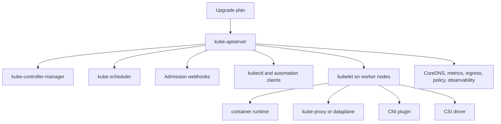
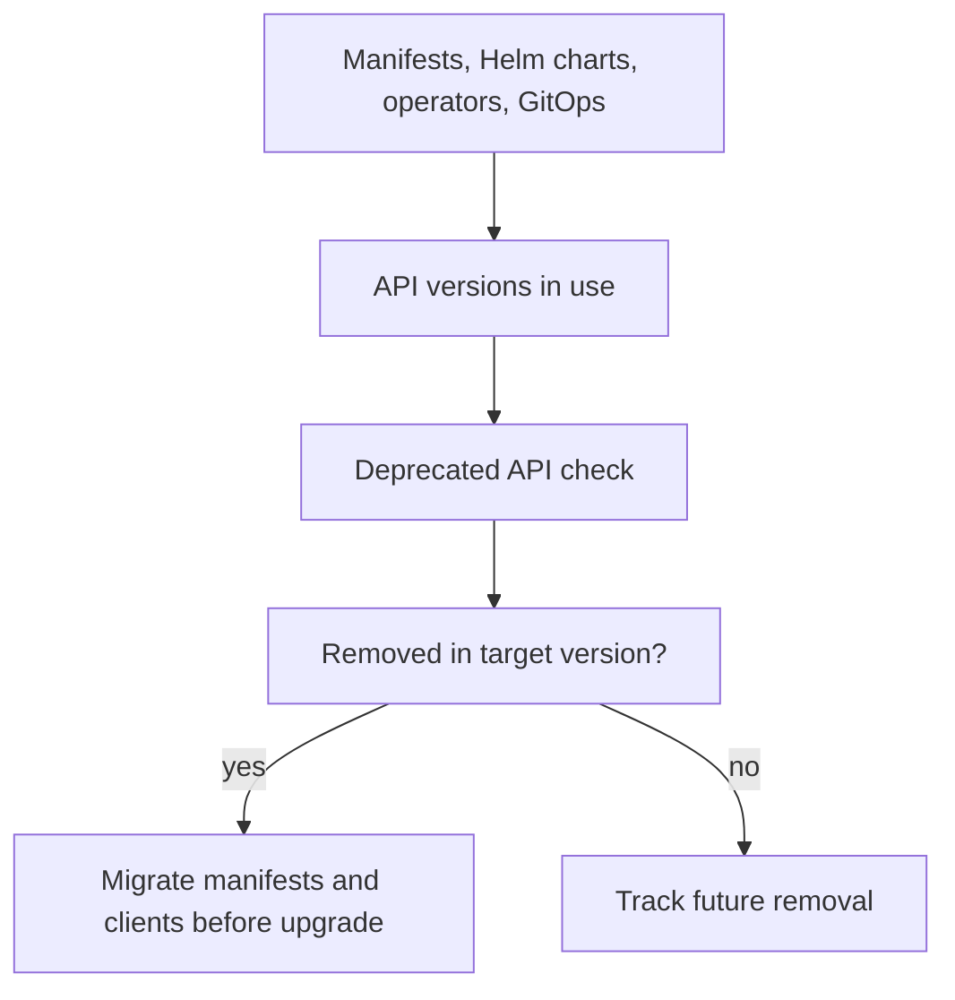
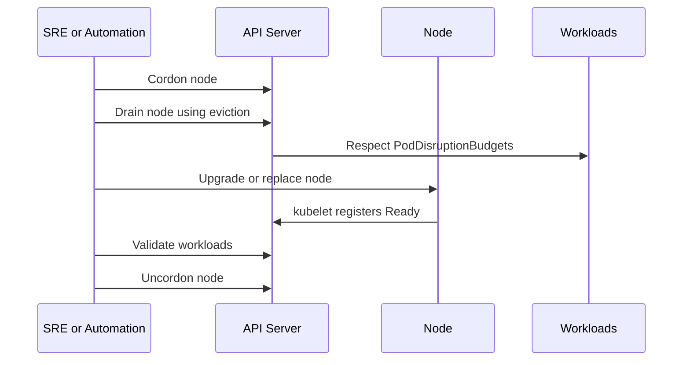

# 2.9 Cluster Upgrade and Version Skew Architecture

## Purpose of This Section

This section explains Kubernetes cluster upgrades as an architecture concern, not only an operational task.

A Kubernetes cluster is a distributed control-plane and node system. Upgrading it changes API server behavior, controller behavior, scheduler
behavior, kubelet behavior, kube-proxy or replacement dataplane behavior, admission behavior, add-on behavior, client behavior, and sometimes the
set of API versions available to workloads.

For an SRE, upgrades matter because they combine several risk domains at once:

- Control-plane availability.
- Node capacity and workload disruption.
- API compatibility.
- Admission webhook compatibility.
- CNI, CSI, CoreDNS, ingress, and observability compatibility.
- Cloud-provider or distribution-specific constraints.
- Rollback limits.
- Security patch urgency.

By the end of this section, you should be able to:

- Explain Kubernetes version skew rules at production level.
- Describe the safe upgrade order for control plane, nodes, clients, and add-ons.
- Identify API deprecation and removal risk before an upgrade.
- Plan node upgrades without violating availability targets.
- Use PodDisruptionBudgets, capacity buffers, and canaries during maintenance.
- Build a practical preflight, execution, and rollback plan.

## Upgrade Architecture Mental Model

A Kubernetes upgrade is a coordinated movement from one supported component set to another.



The upgrade must preserve compatibility while the cluster is temporarily mixed-version. That temporary mixed state is called version skew.
Version skew is normal during upgrades. Unsupported version skew is an outage or correctness risk.

A simple rule of thumb:

> Upgrade the API-serving control plane first, keep clients and node components within supported skew, then roll nodes and add-ons in a controlled
> sequence with enough capacity to absorb disruption.

## Kubernetes Version Skew

Kubernetes publishes a version skew policy that defines supported minor-version differences between components. Distribution and cloud-provider
platforms can add stricter rules, so always check both upstream Kubernetes and the platform-specific documentation.

| Component relationship | Production interpretation |
| --- | --- |
| HA `kube-apiserver` instances | Newest and oldest API server instances must be within one minor version. |
| `kubelet` to `kube-apiserver` | kubelet must not be newer than kube-apiserver. It can lag within the supported skew window. |
| `kube-proxy` to `kube-apiserver` | kube-proxy must not be newer than kube-apiserver. It can lag within the supported skew window. |
| `kube-controller-manager`, `kube-scheduler`, `cloud-controller-manager` | Expected to match the API server minor version, but can be one minor behind during upgrade. |
| `kubectl` to `kube-apiserver` | kubectl is supported within one minor version older or newer than kube-apiserver. |

The version skew policy is not a tuning suggestion. It is the supported compatibility boundary. Running outside it can produce behavior that is
hard to diagnose because individual components may still appear healthy.

### Why Skew Matters

During an upgrade, components may temporarily understand different API fields, feature gates, validation behavior, or protocol expectations.

Examples:

- A newer client may send fields that an older API server does not understand.
- An older kubelet may not support behavior expected by newer workloads.
- Admission webhooks may receive new object shapes after an API server upgrade.
- kube-proxy or CNI behavior may lag behind Service or EndpointSlice changes.
- Controllers may act on objects differently after a minor version change.

Version skew policy keeps this transition inside boundaries tested and supported by Kubernetes.

## Supported Upgrade Order

The safe upgrade order follows the direction of API compatibility.

```mermaid
flowchart LR
    prereq["Preflight and backups"] --> cp1["Upgrade first API server"]
    cp1 --> cpN["Upgrade remaining control-plane nodes"]
    cpN --> managers["Upgrade scheduler and controllers"]
    managers --> addons["Upgrade core add-ons"]
    addons --> nodes["Roll worker nodes and kubelet"]
    nodes --> clients["Update kubectl and automation clients"]
    clients --> validate["Post-upgrade validation"]
```



For kubeadm clusters, upstream guidance upgrades a primary control-plane node first, then additional control-plane nodes, then worker nodes.
Managed Kubernetes platforms may hide some of these steps, but the same architecture still exists underneath.

A production upgrade plan should include:

- Current version inventory.
- Target version and latest patch version.
- Supported skew check.
- API deprecation check.
- Add-on compatibility check.
- Backup and restore readiness.
- Capacity and disruption plan.
- Execution window.
- Validation plan.
- Rollback or recovery plan.
- Communications plan.

## Release and Patch Strategy

Kubernetes maintains release branches for the most recent three minor releases. Kubernetes 1.19 and newer receive approximately one year of patch
support.

A production cluster should not wait until end-of-life pressure to upgrade. Late upgrades are more dangerous because they combine security patch
urgency, API removals, add-on drift, and less rollback room.

Practical strategy:

- Stay on supported minor releases.
- Apply patch releases promptly after validation.
- Avoid skipping minor versions.
- Upgrade non-production clusters first.
- Maintain a recurring upgrade calendar.
- Track API removals and feature changes before they become urgent.
- Keep add-ons within their supported compatibility windows.

Patch upgrades are usually lower risk than minor upgrades, but they still need validation. Minor upgrades require deeper compatibility review.

## API Deprecation and Removal Risk

API deprecations are one of the most common hidden upgrade risks.

Kubernetes can deprecate an API version in one release and remove it in a later release. If workloads, Helm charts, operators, admission webhooks,
GitOps repositories, or automation still use a removed API version, deployments can fail after the upgrade.



Pre-upgrade API review should include:

- Static scan of manifests and Helm output.
- Live cluster scan of served and stored API versions.
- Audit log review for deprecated API usage where available.
- Operator and controller compatibility review.
- Admission webhook version compatibility review.
- GitOps repository validation against the target version.

An API migration should be completed before the cluster upgrade, not during the emergency maintenance window.

## Admission Webhooks During Upgrades

Admission webhooks sit directly in the API write path. During an API server upgrade, they can become a serious availability risk.

Webhook risks include:

- The webhook does not understand a new resource version or field shape.
- The webhook service is unavailable during node drains.
- The webhook has strict timeout or failure behavior.
- A failing webhook blocks deployments, controllers, or system add-ons.
- A webhook configured to fail open admits resources that should have been rejected.

Production checks:

- Confirm webhook deployments have multiple replicas when they are critical.
- Confirm webhook Pods have PodDisruptionBudgets where appropriate.
- Review `failurePolicy`, `timeoutSeconds`, and namespace selectors.
- Test the webhook against target-version API objects.
- Ensure webhooks can handle equivalent resource versions when needed.
- Document emergency disable or bypass procedures.

Admission webhooks should be upgraded and tested as part of the cluster upgrade plan, not as an afterthought.

## Node Upgrade Architecture

Node upgrades are where control-plane changes become workload disruption.

A node upgrade usually includes cordon, drain, operating system or image replacement, kubelet update, reboot or replacement, readiness check, and
uncordon. Managed Kubernetes platforms often replace nodes through node pools or machine groups, but the disruption model is the same.



Important production constraints:

- Drains should respect PodDisruptionBudgets through the eviction API.
- DaemonSet Pods are not removed by normal drain behavior.
- Static Pods and mirror Pods need special awareness on control-plane nodes.
- Local storage can block or complicate drain behavior.
- Stateful workloads may require application-specific failover checks.
- Capacity must remain sufficient after removing one or more nodes.

A node can be technically drained while the application still has an outage. SREs must validate workload availability, not only Kubernetes command
success.

## PodDisruptionBudgets and Capacity Buffers

PodDisruptionBudgets protect workloads from excessive voluntary disruption. They are important during node upgrades because `kubectl drain` and
many automation systems use the eviction API.

A simple PDB looks like this:

```yaml
apiVersion: policy/v1
kind: PodDisruptionBudget
metadata:
  name: api-pdb
  namespace: payments
spec:
  minAvailable: 2
  selector:
    matchLabels:
      app: payments-api
```

A PDB is not a capacity guarantee. It only limits voluntary eviction. A healthy upgrade also needs:

- Enough spare node capacity.
- Correct Pod requests.
- Horizontal or vertical scaling where required.
- Topology spread or anti-affinity for replicas.
- Load balancer and readiness behavior that removes unhealthy endpoints.
- Application readiness checks that represent real serving readiness.

If drains are blocked by PDBs, do not reflexively delete the PDB. The PDB may be correctly telling you that the cluster does not have enough safe
capacity or that the workload is already unhealthy.

## Add-On Compatibility

A cluster upgrade is not complete when `kube-apiserver` and `kubelet` versions change. Core add-ons must also be compatible.

Common add-ons to review:

| Add-on area | Examples | Upgrade concern |
| --- | --- | --- |
| DNS | CoreDNS, NodeLocal DNSCache. | API compatibility, configuration changes, scaling, latency. |
| Networking | CNI plugin, kube-proxy or eBPF dataplane, ingress controller. | Kernel, API, dataplane, NetworkPolicy, Service behavior. |
| Storage | CSI drivers and sidecars. | Attach, mount, provisioning, snapshots, expansion compatibility. |
| Observability | Metrics server, Prometheus stack, logging agents. | API versions, RBAC, scraping targets, node agent compatibility. |
| Policy and security | Admission controllers, policy engines, image policy. | Webhook compatibility, failure policy, new Pod Security behavior. |
| Autoscaling | Cluster autoscaler, Karpenter-like systems, HPA dependencies. | API compatibility, node pool behavior, scheduling assumptions. |

For managed Kubernetes, the cloud provider may define supported add-on versions for each cluster version. Follow the provider matrix instead of
assuming upstream compatibility is enough.

## Managed Kubernetes Upgrade Considerations

Managed Kubernetes changes the operating model but not the architecture.

The provider may manage the control plane, etcd, certificates, and some add-ons. The platform team still owns workload readiness, node pools,
add-on compatibility, API deprecation, security policy, and validation.

Common managed-cluster checks:

- Provider-supported target versions.
- Control-plane upgrade scheduling and maintenance windows.
- Node pool upgrade strategy and surge settings.
- Managed add-on version matrix.
- CNI and CSI driver compatibility.
- Deprecated API usage in workloads and controllers.
- Cloud IAM and admission integration behavior.
- Rollback limitations in the provider platform.

Do not assume a managed control-plane upgrade is automatically safe for workloads. It only means the provider performs part of the upgrade.

## Rollback and Recovery Reality

Rollback is not always symmetric with upgrade.

Many Kubernetes upgrades change control-plane state, component configuration, certificates, add-ons, node images, or API behavior. Some managed
platforms do not support control-plane downgrade. Even where partial recovery is possible, application state and API object compatibility can make
rollback risky.

A realistic recovery plan includes:

- etcd backup and restore process for self-managed clusters.
- Provider restore or support procedure for managed clusters.
- Ability to stop or pause node rollout.
- Ability to roll back add-ons where supported.
- Ability to restore previous manifests or Helm releases.
- Known emergency disable procedure for failing admission webhooks.
- Clear criteria for aborting the upgrade.
- Clear criteria for continuing despite non-critical warnings.

The safest rollback is often not a rollback. It may be pausing rollout, fixing a compatibility issue, restoring an add-on, or moving workloads to a
healthy node pool.

## Production Upgrade Runbook

### Phase 1: Plan

1. Confirm current and target Kubernetes versions.
2. Confirm the target is a supported version and patch release.
3. Read release notes and known issues.
4. Review Kubernetes version skew policy.
5. Review provider or distribution-specific restrictions.
6. Identify all control-plane components, node pools, add-ons, and automation clients.
7. Identify all critical workloads and availability requirements.

### Phase 2: Preflight

1. Check cluster health.

   ```bash
   kubectl get nodes
   kubectl get pods -A
   kubectl get componentstatuses 2>/dev/null || true
   ```

2. Check node and component versions.

   ```bash
   kubectl version
   kubectl get nodes -o wide
   ```

3. Check API deprecations using available platform tools, audit logs, or static manifest scans.

4. Verify backups.

   For self-managed clusters, confirm etcd backup and restore procedure. For managed clusters, confirm provider recovery options and support
   procedure.

5. Check workload disruption readiness.

   ```bash
   kubectl get pdb -A
   kubectl get pods -A --field-selector=status.phase!=Running
   ```

6. Check admission webhooks.

   ```bash
   kubectl get validatingwebhookconfigurations
   kubectl get mutatingwebhookconfigurations
   ```

7. Check add-on versions and compatibility.

8. Confirm monitoring, alerting, and dashboards for the upgrade window.

### Phase 3: Execute

1. Upgrade the first control-plane instance or start the managed control-plane upgrade.
2. Validate API server health and core controllers.
3. Upgrade remaining control-plane instances within supported skew.
4. Validate scheduler, controller manager, and cloud controller manager behavior.
5. Upgrade or validate core add-ons.
6. Roll worker nodes in small batches.
7. Drain nodes safely and respect PodDisruptionBudgets.
8. Validate workloads between batches.
9. Pause rollout if error budgets, capacity, or critical alerts are violated.

### Phase 4: Validate

1. Confirm node readiness and expected versions.

   ```bash
   kubectl get nodes -o wide
   ```

2. Confirm system namespaces are healthy.

   ```bash
   kubectl get pods -n kube-system
   ```

3. Confirm application availability and error rates.
4. Confirm admission webhooks are healthy.
5. Confirm CNI, CSI, DNS, ingress, metrics, logging, and autoscaling behavior.
6. Confirm no unexpected API errors or authorization failures.
7. Confirm deprecated API usage is not continuing after upgrade.

### Phase 5: Close

1. Record final versions.
2. Record incidents, warnings, or manual actions.
3. Update runbooks and known issues.
4. Schedule follow-up add-on or patch work.
5. Communicate completion to stakeholders.

## Common Failure Modes

| Symptom | Likely area | First checks |
| --- | --- | --- |
| API server upgrade fails. | Control-plane health, etcd, certificates, static Pods, provider issue. | Control-plane logs, etcd health, upgrade tool output, provider events. |
| Admission errors after upgrade. | Webhook compatibility or availability. | Webhook logs, API server audit/errors, `failurePolicy`, object versions. |
| Node drain hangs. | PDB, unmanaged Pod, local storage, DaemonSet behavior. | `kubectl drain` output, PDB status, Pod owner references, local volumes. |
| Workloads unavailable during node rollout. | Insufficient capacity, bad PDBs, readiness gaps, topology concentration. | Replica placement, requests, PDBs, endpoints, load balancer health. |
| CNI failure after node upgrade. | CNI compatibility, kernel, node image, configuration. | CNI Pods, node logs, Pod IP assignment, NetworkPolicy behavior. |
| CSI mounts fail after upgrade. | CSI driver or sidecar compatibility. | CSI controller logs, CSI node logs, VolumeAttachment, Pod events. |
| DNS failures after upgrade. | CoreDNS or NodeLocal DNS behavior. | CoreDNS Pods, config, query latency, Service endpoints. |
| Automation fails with API errors. | kubectl/client skew or removed APIs. | Client version, request errors, deprecated API usage, release notes. |
| Rollback not possible. | Provider limitation or state transition. | Provider docs, support process, etcd backup, add-on rollback options. |

## Real-Time Production Use Cases

### Managed Cluster Minor Upgrade

A platform team upgrades a managed Kubernetes cluster from one supported minor version to the next.

Recommended controls:

- Run deprecated API checks before scheduling the upgrade.
- Upgrade non-production clusters first.
- Confirm managed add-on compatibility.
- Upgrade or replace node pools in batches.
- Use surge capacity or temporary extra nodes.
- Monitor API errors, admission latency, DNS, CNI, CSI, and application SLOs.
- Keep the upgrade paused if node rollout causes workload instability.

### Self-Managed kubeadm Upgrade

A team operates an HA kubeadm cluster.

Recommended controls:

- Back up etcd and test the restore procedure.
- Upgrade one control-plane node first.
- Upgrade remaining control-plane nodes one at a time.
- Respect the version skew policy for API servers and node components.
- Drain nodes before minor kubelet upgrades.
- Validate CoreDNS, kube-proxy, CNI, CSI, and ingress after each stage.

### API Removal Migration

A GitOps repository still contains manifests using API versions removed in the target release.

Recommended controls:

- Block the cluster upgrade until manifests are migrated.
- Render Helm charts and scan output, not only source templates.
- Validate operators and CRDs against target-version behavior.
- Apply migrated manifests in non-production first.
- Watch audit logs or metrics for continued deprecated API usage.

## Anti-Patterns

| Anti-pattern | Why it fails in production | Better approach |
| --- | --- | --- |
| Skipping minor versions. | Unsupported and increases API removal and skew risk. | Upgrade one minor version at a time. |
| Upgrading nodes before the API server supports them. | kubelet must not be newer than kube-apiserver. | Upgrade control plane first, then nodes. |
| Treating managed control-plane upgrade as the whole upgrade. | Workloads, nodes, add-ons, and APIs still need validation. | Own the full cluster upgrade plan. |
| Deleting PDBs to make drains finish. | Can turn safe maintenance into application outage. | Fix capacity, health, or rollout strategy. |
| Ignoring admission webhooks. | Webhooks can block writes or fail open during upgrade. | Test and monitor webhooks as control-plane dependencies. |
| Upgrading without API deprecation checks. | Removed APIs can break deployments and operators. | Scan manifests, audit logs, and live resources first. |
| No capacity buffer during node rollout. | Workloads may be evicted without enough room to reschedule. | Add surge capacity and roll nodes in small batches. |
| Assuming rollback is simple. | Downgrade may be unsupported or unsafe. | Define realistic recovery and pause criteria. |

## Lab: Build a Cluster Upgrade Readiness Report

This lab is designed for a non-production cluster.

### Goal

Create a lightweight readiness report before a Kubernetes upgrade.

### Steps

1. Record cluster and client versions.

   ```bash
   kubectl version
   kubectl get nodes -o wide
   ```

2. Record workload and system health.

   ```bash
   kubectl get pods -A
   kubectl get events -A --sort-by=.lastTimestamp
   ```

3. Record disruption controls.

   ```bash
   kubectl get pdb -A
   ```

4. Record admission webhooks.

   ```bash
   kubectl get validatingwebhookconfigurations
   kubectl get mutatingwebhookconfigurations
   ```

5. Record API resources served by the cluster.

   ```bash
   kubectl api-resources
   ```

6. Record critical add-ons.

   ```bash
   kubectl get pods -n kube-system -o wide
   ```

7. Pick one node and simulate the drain decision without evicting Pods.

   ```bash
   kubectl drain <node-name> --ignore-daemonsets --dry-run=server
   ```

8. Write a short report that answers:

   - Which Kubernetes version is running?
   - Which target version is planned?
   - Are all nodes Ready?
   - Which PDBs could block drains?
   - Which webhooks are in the API write path?
   - Which add-ons require compatibility review?
   - What must be fixed before upgrade day?

### Expected Learning

You should be able to turn upgrade planning from a vague maintenance task into a concrete readiness checklist.

## Review Questions

1. Why is version skew expected during an upgrade but dangerous outside supported limits?
2. Why should the API server be upgraded before kubelet during a minor version upgrade?
3. What is the supported relationship between `kubectl` and `kube-apiserver` minor versions?
4. Why are admission webhooks a special upgrade risk?
5. Why can a successful node drain still cause an application incident?
6. What is the role of PodDisruptionBudgets during node upgrades?
7. Why should deprecated API checks happen before the upgrade window?
8. What add-ons should be included in a production upgrade plan?
9. Why is rollback often more complicated than the original upgrade?
10. What should be included in post-upgrade validation?

## Key Takeaways

- Kubernetes upgrades are architecture changes, not only package updates.
- Version skew policy defines the supported compatibility window during mixed-version operation.
- Control-plane components, nodes, clients, add-ons, admission webhooks, and workloads all participate in upgrade risk.
- API deprecations and removals should be resolved before upgrade day.
- Node rollouts require safe drains, PDB awareness, capacity buffers, and workload validation.
- Managed Kubernetes reduces some operational burden but does not remove workload, API, add-on, or node responsibilities.
- Rollback must be planned realistically because downgrade may be unsupported or unsafe.
- A professional upgrade process includes preflight, staged execution, validation, pause criteria, recovery plans, and a written closeout.

## Official References

- [Kubernetes Version Skew Policy](https://kubernetes.io/releases/version-skew-policy/)
- [Kubernetes Releases](https://kubernetes.io/releases/)
- [Upgrading kubeadm Clusters](https://kubernetes.io/docs/tasks/administer-cluster/kubeadm/kubeadm-upgrade/)
- [Safely Drain a Node](https://kubernetes.io/docs/tasks/administer-cluster/safely-drain-node/)
- [kubectl drain](https://kubernetes.io/docs/reference/kubectl/generated/kubectl_drain/)
- [Disruptions](https://kubernetes.io/docs/concepts/workloads/pods/disruptions/)
