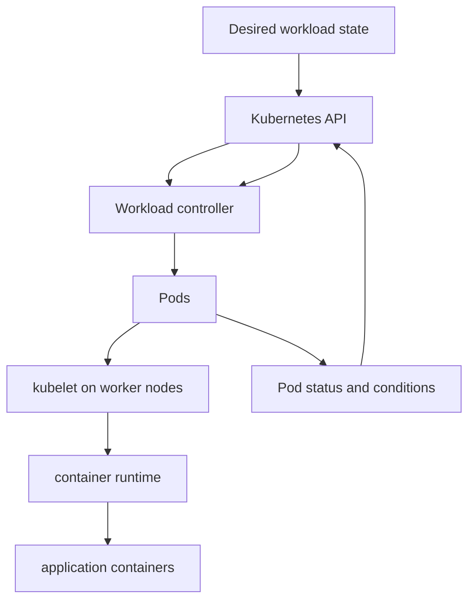
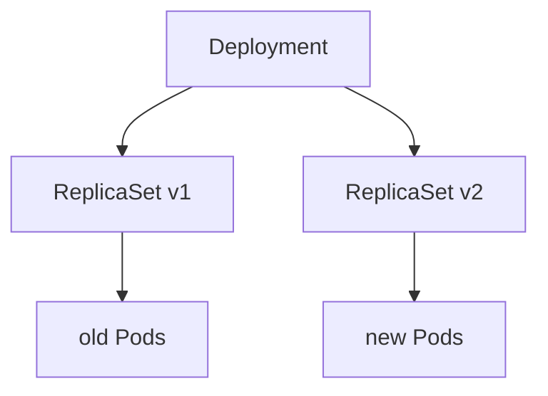
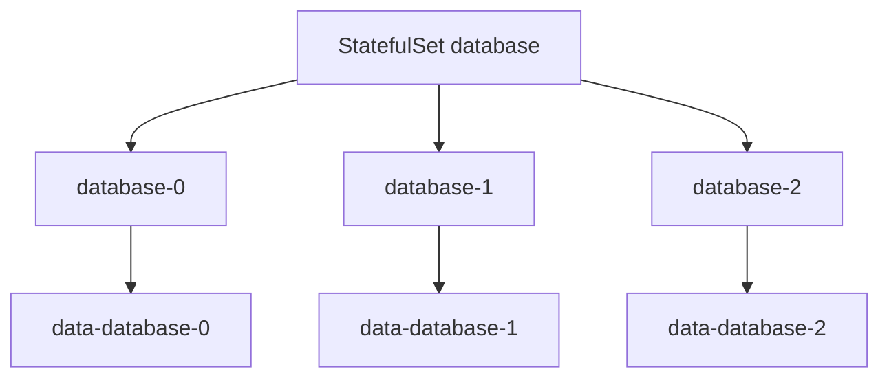
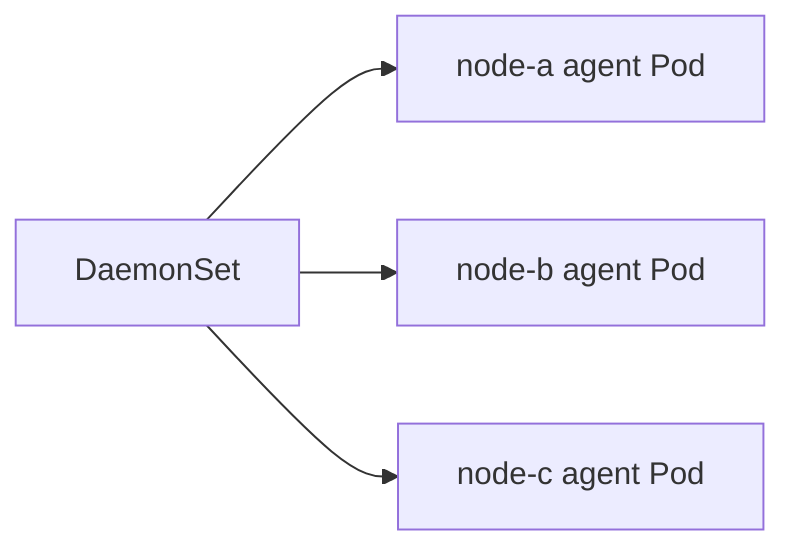

# 3.1 Workload Architecture Overview

## Purpose of This Section

This section introduces Kubernetes workload architecture from an SRE perspective.

In Kubernetes, applications do not run directly on nodes as loose processes. They run as Pods, and most production Pods are managed by higher-level
controllers such as Deployments, StatefulSets, DaemonSets, Jobs, and CronJobs. These controllers express workload intent and use reconciliation to
keep actual state aligned with desired state.

For production engineering, choosing the wrong workload controller can create avoidable incidents. A stateless API deployed as a Deployment can be
rolled safely. A database forced into a Deployment can lose identity and storage assumptions. A node agent deployed as a Deployment can miss nodes.
A batch job deployed as a long-running service can hide failure and retry behavior.

By the end of this section, you should be able to:

- Explain the relationship between Pods and workload controllers.
- Choose the correct controller for stateless, stateful, node-level, and batch workloads.
- Trace ownership from a high-level controller to ReplicaSets and Pods.
- Understand rollout, reconciliation, replacement, and failure recovery at a high level.
- Identify common workload architecture anti-patterns before they reach production.

## Workload Architecture Mental Model

A Pod is the smallest deployable unit in Kubernetes, but a Pod by itself is rarely the right production abstraction.

Production workloads are normally managed by controllers. Controllers watch the Kubernetes API, compare desired state with actual state, and make
changes until the workload matches the declared intent.



The important production idea is:

> Kubernetes does not simply start containers. It continuously reconciles workload objects toward declared state.

That reconciliation model is powerful, but it means SREs must understand which controller owns a Pod and what that controller will do when a Pod,
node, image, volume, or health check fails.

## Pods: The Unit of Execution

A Pod is a group of one or more containers that share a network namespace, lifecycle, and storage context.

A Pod can contain:

- One main application container.
- Sidecar containers.
- Init containers.
- Volumes.
- Probes.
- Resource requests and limits.
- Security context.
- Service account identity.
- Scheduling constraints.

A simple Pod manifest looks like this:

```yaml
apiVersion: v1
kind: Pod
metadata:
  name: example
spec:
  containers:
    - name: app
      image: nginx:1.27
      ports:
        - containerPort: 80
```

Bare Pods are useful for learning and some special cases, but they are not normally appropriate for production applications. If a manually created
Pod is deleted, no higher-level controller recreates it. For production, the usual question is not "How do I run this Pod?" but "Which controller
should own this Pod template?"

## Workload Controllers

Workload controllers manage Pods for different operating patterns.

| Controller | Primary use | Production question |
| --- | --- | --- |
| Deployment | Stateless services and rolling updates. | Can replicas be replaced in any order without preserving identity? |
| ReplicaSet | Maintaining a replica count for matching Pods. | Is this managed by a Deployment rather than directly by humans? |
| StatefulSet | Stateful or identity-aware workloads. | Does each replica need stable identity, ordered behavior, or stable storage? |
| DaemonSet | Node-level agents. | Should one Pod run on every matching node? |
| Job | Finite work that should run to completion. | Does success mean the task completes and exits? |
| CronJob | Scheduled finite work. | Should Jobs be created on a schedule with concurrency and missed-run rules? |

The controller is part of the application architecture. It defines how the workload is replaced, scaled, rolled out, recovered, and cleaned up.

## Deployment Architecture

A Deployment manages stateless replicated Pods through ReplicaSets.



Deployments are the common choice for stateless applications such as APIs, web services, workers, and many control-plane-style services.

A Deployment provides:

- Declarative updates for Pods and ReplicaSets.
- Rolling updates.
- Rollback through rollout history.
- Replica management.
- Availability controls through rollout strategy.

Example:

```yaml
apiVersion: apps/v1
kind: Deployment
metadata:
  name: api
spec:
  replicas: 3
  selector:
    matchLabels:
      app: api
  template:
    metadata:
      labels:
        app: api
    spec:
      containers:
        - name: api
          image: example/api:1.0
          ports:
            - containerPort: 8080
```

Production guidance:

- Use Deployments for stateless workloads that can tolerate replacement in any order.
- Define readiness probes so traffic only reaches ready Pods.
- Define resource requests so scheduling is realistic.
- Use rollout strategy intentionally.
- Avoid directly managing ReplicaSets owned by Deployments.
- Ensure rollback procedures are documented and tested.

## ReplicaSet Architecture

A ReplicaSet ensures that a specified number of matching Pod replicas are running.

ReplicaSets are usually created and managed by Deployments. SREs should understand ReplicaSets because they appear during troubleshooting, but
most teams should not manage them directly.

Typical ownership chain:

```text
Deployment -> ReplicaSet -> Pods
```

Useful commands:

```bash
kubectl get deployment -n <namespace>
kubectl get replicaset -n <namespace>
kubectl get pods -n <namespace> --show-labels
```

Production guidance:

- Treat ReplicaSets as Deployment implementation detail in normal application workflows.
- Investigate ReplicaSets when debugging rollout history or Pod ownership.
- Do not edit Deployment-owned ReplicaSets directly during routine operations.

## StatefulSet Architecture

A StatefulSet manages Pods that need stable identity and ordered behavior.

StatefulSets are used when each replica has meaning beyond being one of many identical Pods. Examples include databases, quorum systems, brokers,
and applications with stable network identity or per-replica storage.

StatefulSet identity commonly includes:

- Stable Pod names.
- Stable network identity through a headless Service.
- Stable storage using volume claim templates.
- Ordered creation, update, or deletion behavior depending on configuration.



Production guidance:

- Use StatefulSets when identity, stable storage, or ordered behavior matters.
- Understand application-level replication and failover before relying on Kubernetes replacement.
- Do not assume a StatefulSet makes a stateful application highly available by itself.
- Review storage class, backup, restore, and quorum behavior.
- Test node failure and volume reattachment behavior.

## DaemonSet Architecture

A DaemonSet ensures that a Pod runs on every matching node, or on a selected set of nodes.

DaemonSets are commonly used for node-level platform components such as:

- CNI agents.
- CSI node plugins.
- Log collectors.
- Monitoring agents.
- Security agents.
- Node-local proxies or caches.



Production guidance:

- Use DaemonSets for node-level responsibilities.
- Confirm scheduling rules match the intended node pools.
- Watch DaemonSet coverage during node upgrades.
- Review tolerations carefully; system DaemonSets often need to run on tainted nodes.
- Avoid using Deployments for one-Pod-per-node agents.

## Job Architecture

A Job manages Pods that run to completion.

Jobs are appropriate when success means the work completes and exits. The Job controller creates Pods and retries according to the Job
configuration until the desired completions are reached or failure conditions are met.

Examples:

- Data migration.
- Batch processing.
- One-time maintenance task.
- Report generation.
- Backfill.

```yaml
apiVersion: batch/v1
kind: Job
metadata:
  name: data-migration
spec:
  template:
    spec:
      restartPolicy: Never
      containers:
        - name: migrate
          image: example/migrator:1.0
```

Production guidance:

- Use Jobs for finite work, not long-running services.
- Define retry behavior intentionally.
- Set cleanup policy where appropriate.
- Make Jobs idempotent when possible.
- Capture logs and completion status.
- Avoid unlimited retries for destructive or non-idempotent operations.

## CronJob Architecture

A CronJob creates Jobs on a schedule.

CronJobs are appropriate for recurring finite work:

- Scheduled reports.
- Periodic reconciliation.
- Cleanup tasks.
- Batch imports.
- Certificate checks.

Production CronJob review should include:

- Schedule and timezone assumptions.
- Concurrency policy.
- Missed-run behavior.
- Job history limits.
- Retry behavior.
- Idempotency.
- Alerting on failed or missed runs.

A CronJob is not a general-purpose scheduler for long-running applications. Each scheduled run creates a Job, and each Job creates Pods.

## Controller Selection Guide

Use this decision table during design review.

| Workload behavior | Recommended controller | Why |
| --- | --- | --- |
| Stateless replicated API. | Deployment. | Pods can be replaced and rolled in any order. |
| Stateless worker consuming from a queue. | Deployment. | Replicas are interchangeable. |
| Database with stable storage per replica. | StatefulSet. | Identity and storage mapping matter. |
| Broker with quorum membership. | StatefulSet. | Ordered identity and stable network names may matter. |
| Log collector on every node. | DaemonSet. | One agent should run on each matching node. |
| CNI or CSI node plugin. | DaemonSet. | Node-level platform component. |
| One-time migration. | Job. | Work should complete and stop. |
| Scheduled cleanup. | CronJob. | Jobs should be created on a schedule. |
| Single manually created Pod. | Usually avoid. | No controller recreates it if it disappears. |

## Ownership and Garbage Collection

Kubernetes objects often have owner references. Owner references help Kubernetes understand relationships between resources and support garbage
collection.

For example:

```text
Deployment owns ReplicaSet
ReplicaSet owns Pods
CronJob owns Jobs
Job owns Pods
StatefulSet owns Pods and related controller state
DaemonSet owns node-level Pods
```

During troubleshooting, ownership answers an important question:

> If I delete this Pod, who will recreate it?

If a Pod is owned by a Deployment, ReplicaSet, StatefulSet, DaemonSet, or Job, the owning controller may create another Pod. If a Pod has no owner,
manual deletion may be permanent.

Useful command:

```bash
kubectl get pod -n <namespace> <pod-name> -o jsonpath='{.metadata.ownerReferences}'
```

## Workload Status and Conditions

Workload objects expose status that helps SREs understand whether desired state is being achieved.

Examples:

- Deployment desired replicas, updated replicas, available replicas, and conditions.
- StatefulSet ready replicas and current/update revision.
- DaemonSet desired, current, ready, updated, and unavailable counts.
- Job completions, failed Pods, active Pods, and completion state.
- CronJob last schedule time and active Jobs.

Status should be read together with Pod events, controller events, logs, metrics, and application SLOs. A controller may report progress while the
application is still unhealthy from the user perspective.

## Common Failure Modes

| Symptom | Likely area | First checks |
| --- | --- | --- |
| Deployment rollout stuck. | Readiness, image pull, ReplicaSet, insufficient capacity. | `kubectl rollout status`, Deployment events, ReplicaSets, Pod events. |
| Pods repeatedly restart. | Application crash, liveness probe, resource limit, dependency failure. | Pod logs, previous logs, events, probe configuration, resource usage. |
| StatefulSet Pod stuck during rollout. | Ordered update, storage, readiness, quorum. | StatefulSet status, Pod events, PVC/PV state, application replication health. |
| DaemonSet missing nodes. | Node selector, taints, tolerations, resource pressure. | DaemonSet status, node labels, taints, Pod events. |
| Job never completes. | Application error, retry loop, backoff, non-idempotent failure. | Job status, Pod logs, failed Pod count, backoff settings. |
| CronJob misses expected run. | Schedule, suspension, concurrency policy, controller delay. | CronJob status, active Jobs, events, schedule and timezone assumptions. |
| Manual Pod disappears permanently. | No owning controller. | Owner references, creation method, audit history. |

## Production Design Review

Before approving a workload, ask these questions.

### Controller Fit

- Does the controller match the workload lifecycle?
- Are replicas interchangeable or identity-aware?
- Should the workload run on every node?
- Is the workload finite or long-running?
- Does the workload need scheduled execution?

### Rollout and Recovery

- How does the workload roll forward?
- How does it roll back?
- What health signals control availability?
- What happens if a Pod is deleted?
- What happens if a node disappears?
- What happens if the image is bad?

### State and Identity

- Does each replica need stable identity?
- Does storage need to follow a specific replica?
- Is application-level replication understood?
- Are backup and restore tested?
- Can the workload tolerate replacement in any order?

### Operations

- Are resource requests defined?
- Are probes meaningful?
- Are labels and selectors stable?
- Is observability in place?
- Are alerts tied to user impact and controller health?
- Are SRE runbooks available for rollout, rollback, and stuck states?

## Anti-Patterns

| Anti-pattern | Why it fails in production | Better approach |
| --- | --- | --- |
| Running production apps as bare Pods. | No controller recreates the Pod after deletion or node loss. | Use the appropriate workload controller. |
| Using Deployment for identity-sensitive databases by default. | Pods are treated as interchangeable. | Use StatefulSet when identity and storage mapping matter. |
| Using Deployment for node agents. | It does not guarantee one Pod per node. | Use DaemonSet. |
| Using CronJob for long-running services. | CronJob creates finite Jobs, not continuously managed services. | Use Deployment or StatefulSet. |
| Editing ReplicaSets owned by Deployments. | The Deployment controller may overwrite or replace changes. | Edit the Deployment. |
| Ignoring owner references during incident response. | Deleted Pods may be recreated or cleanup may remove dependent objects. | Trace ownership before acting. |
| Treating controller status as user health. | Kubernetes availability does not always equal application availability. | Combine controller state with probes, metrics, logs, and SLOs. |

## SRE Runbook: Identify Workload Ownership

Use this path when investigating an unexpected Pod.

1. Find the Pod and namespace.

   ```bash
   kubectl get pod -A | grep <pod-name>
   ```

2. Inspect owner references.

   ```bash
   kubectl get pod -n <namespace> <pod-name> -o jsonpath='{.metadata.ownerReferences}'
   ```

3. Walk up the ownership chain.

   ```bash
   kubectl get replicaset -n <namespace>
   kubectl get deployment -n <namespace>
   kubectl get statefulset -n <namespace>
   kubectl get daemonset -n <namespace>
   kubectl get job -n <namespace>
   ```

4. Inspect events.

   ```bash
   kubectl describe pod -n <namespace> <pod-name>
   ```

5. Decide action based on the owner.

   Delete or restart through the owning controller when possible. Avoid treating the Pod as an isolated object unless it is truly unmanaged.

## Lab: Map Controllers to Pods

This lab is designed for a non-production cluster.

### Goal

Create a small Deployment and trace the ownership chain from Deployment to ReplicaSet to Pods.

### Steps

1. Create a namespace.

   ```bash
   kubectl create namespace workload-lab
   ```

2. Create a Deployment.

   ```bash
   kubectl create deployment web -n workload-lab --image=nginx:1.27 --replicas=3
   ```

3. Inspect the ownership chain.

   ```bash
   kubectl get deployment -n workload-lab web
   kubectl get replicaset -n workload-lab
   kubectl get pods -n workload-lab --show-labels
   ```

4. Inspect a Pod owner reference.

   ```bash
   kubectl get pod -n workload-lab <pod-name> -o jsonpath='{.metadata.ownerReferences}'
   ```

5. Delete one Pod and observe reconciliation.

   ```bash
   kubectl delete pod -n workload-lab <pod-name>
   kubectl get pods -n workload-lab -w
   ```

6. Clean up.

   ```bash
   kubectl delete namespace workload-lab
   ```

### Expected Learning

You should see that the Deployment owns a ReplicaSet, the ReplicaSet owns Pods, and deleting one Pod causes the controller chain to recreate a
replacement.

## Review Questions

1. Why are bare Pods usually a poor production abstraction?
2. What does a Deployment manage directly, and what does it manage indirectly?
3. Why should most teams avoid editing ReplicaSets owned by Deployments?
4. When should a StatefulSet be considered instead of a Deployment?
5. Why are DaemonSets used for many node-level platform components?
6. What makes a Job different from a Deployment?
7. What additional risks must be reviewed for CronJobs?
8. How do owner references help during troubleshooting?
9. Why can controller status differ from user-visible application health?
10. What controller would you choose for a log collector that must run on every node, and why?

## Key Takeaways

- Pods are the unit of execution, but controllers are the normal production abstraction.
- Deployments are the standard controller for stateless replicated workloads.
- ReplicaSets usually exist as Deployment-managed implementation details.
- StatefulSets are for workloads that need stable identity, stable storage, or ordered behavior.
- DaemonSets run node-level Pods on matching nodes.
- Jobs and CronJobs manage finite work, not continuously serving applications.
- SREs should trace owner references before deleting or modifying workload objects.
- The correct workload controller reduces operational risk before the application ever reaches production.

## Official References

- [Workloads](https://kubernetes.io/docs/concepts/workloads/)
- [Pods](https://kubernetes.io/docs/concepts/workloads/pods/)
- [Deployments](https://kubernetes.io/docs/concepts/workloads/controllers/deployment/)
- [ReplicaSet](https://kubernetes.io/docs/concepts/workloads/controllers/replicaset/)
- [StatefulSets](https://kubernetes.io/docs/concepts/workloads/controllers/statefulset/)
- [DaemonSet](https://kubernetes.io/docs/concepts/workloads/controllers/daemonset/)
- [Jobs](https://kubernetes.io/docs/concepts/workloads/controllers/job/)
- [CronJob](https://kubernetes.io/docs/concepts/workloads/controllers/cron-jobs/)
- [Apps API Reference](https://kubernetes.io/docs/reference/kubernetes-api/apps/)
- [kubectl rollout](https://kubernetes.io/docs/reference/kubectl/generated/kubectl_rollout/)
