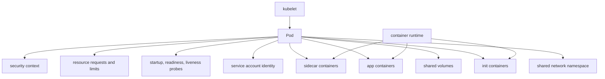
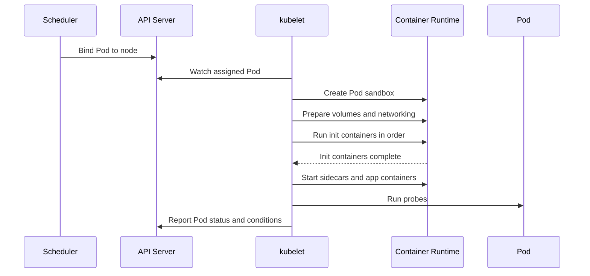

# 3.2 Pods, Containers, and Init Containers

## Purpose of This Section

This section explains the internal structure and lifecycle of Kubernetes Pods.

A Pod is the smallest deployable unit in Kubernetes, but it is not just a wrapper around one container. A Pod defines a shared execution context
for one or more containers, init containers, sidecar containers, volumes, network identity, service account identity, probes, resource settings,
security settings, and lifecycle behavior.

For production SRE work, Pod internals matter because many incidents begin below the controller level. A Deployment may look healthy at a high
level while individual Pods are stuck in `Init:CrashLoopBackOff`, `ImagePullBackOff`, `CrashLoopBackOff`, `ContainerCreating`, or `Terminating`.
Understanding Pod and container lifecycle lets you identify whether the failure belongs to image pulling, scheduling, volume mounting, init
ordering, application startup, probes, restart policy, sidecars, or node behavior.

By the end of this section, you should be able to:

- Explain the main parts of a Pod specification.
- Distinguish app containers, init containers, and sidecar containers.
- Explain Pod phases and container states without confusing them with friendly `kubectl` status strings.
- Understand restart policy behavior at a production level.
- Diagnose common Pod startup and runtime failure modes.
- Review multi-container Pod designs before production deployment.

## Pod Architecture Mental Model

A Pod is a shared runtime envelope for containers.



Containers inside the same Pod share key context:

- They share the same Pod IP address.
- They can communicate over `localhost`.
- They can share volumes declared in the Pod.
- They are scheduled together onto one node.
- They are managed by the kubelet on that node.

A Pod is not a mini virtual machine. It is an API object that describes one co-scheduled application unit.

## App Containers

App containers are the primary containers that run the workload.

Most simple Pods have one app container. Multi-container Pods are used when containers need to be tightly coupled, share lifecycle, share local
volumes, or communicate through localhost.

Example single-container Pod:

```yaml
apiVersion: v1
kind: Pod
metadata:
  name: api
spec:
  containers:
    - name: api
      image: nginx:1.27
      ports:
        - containerPort: 80
```

Production app containers should normally define:

- Image reference.
- Resource requests and limits.
- Ports where useful for documentation and discovery.
- Environment variables or mounted configuration.
- Volume mounts when needed.
- Readiness probe.
- Liveness probe only when it represents a real unrecoverable local failure.
- Security context.

## Multi-Container Pods

A multi-container Pod should be used only when the containers form one tightly coupled unit.

Common patterns include:

| Pattern | Description | Production caution |
| --- | --- | --- |
| Sidecar | Helper container supports the main container for the Pod lifetime. | Sidecar failure can affect application behavior and shutdown. |
| Adapter | Converts or normalizes output from the main application. | Keep adapter behavior observable. |
| Ambassador | Proxies local traffic to another service or endpoint. | Avoid hiding network failures from normal observability. |
| Log or metrics helper | Collects local files or exposes metrics. | Prefer platform-level agents when per-Pod helper is not necessary. |

Use separate Pods when components can be independently scaled, deployed, secured, or failed. Do not put unrelated services into one Pod because it
feels convenient.

## Init Containers

Init containers are specialized containers that run before app containers.

They are useful for setup work that must complete before the application starts.

Examples:

- Waiting for a dependency to become reachable.
- Rendering configuration.
- Running a database migration guard.
- Downloading startup assets.
- Preparing a shared volume.
- Performing permission or filesystem setup.

Key behavior:

- Init containers run before app containers.
- Multiple init containers run in order.
- Each init container must complete successfully before the next starts.
- A Pod cannot become Ready until init containers have succeeded.
- Init containers can use images or tools not included in the main app image.

Example:

```yaml
apiVersion: v1
kind: Pod
metadata:
  name: app-with-init
spec:
  initContainers:
    - name: init-config
      image: busybox:1.36
      command: ["sh", "-c", "echo ready > /work/ready.txt"]
      volumeMounts:
        - name: work
          mountPath: /work
  containers:
    - name: app
      image: nginx:1.27
      volumeMounts:
        - name: work
          mountPath: /usr/share/nginx/html
  volumes:
    - name: work
      emptyDir: {}
```

Production guidance:

- Keep init containers short and deterministic.
- Avoid long dependency waits that hide real readiness or dependency problems.
- Make init logic idempotent.
- Capture logs from failed init containers.
- Remember that init container resource requests affect Pod scheduling.

## Native Sidecar Containers

Kubernetes has a native sidecar model where a sidecar is specified in `initContainers` with a container-level `restartPolicy: Always`.

This can feel surprising because sidecars are written under `initContainers`, but they do not behave like regular init containers that run to
completion and exit. A native sidecar starts before the main application container and continues running through the Pod lifetime.

Simplified example:

```yaml
apiVersion: v1
kind: Pod
metadata:
  name: app-with-sidecar
spec:
  initContainers:
    - name: log-sidecar
      image: busybox:1.36
      restartPolicy: Always
      command: ["sh", "-c", "while true; do date; sleep 5; done"]
  containers:
    - name: app
      image: nginx:1.27
```

Production sidecar use cases include:

- Service mesh proxy.
- Log forwarding helper.
- Local credentials or token helper.
- Local adapter for protocol conversion.
- Supporting process that must be available with the app.

Production cautions:

- Sidecars can increase startup and shutdown complexity.
- Sidecars consume resources and should have requests and limits.
- Sidecar readiness may affect Pod readiness depending on configuration.
- Sidecar failure can cause noisy restarts or broken application behavior.
- During shutdown, sidecars are terminated after main containers and in reverse order.

## Pod Phases and Container States

Pod phase is a field in the Kubernetes API. It is not the same as every status string shown by `kubectl`.

Common Pod phases:

| Phase | Meaning |
| --- | --- |
| `Pending` | Pod accepted by the API, but one or more containers have not been created or started. This includes time before scheduling and image pulling. |
| `Running` | Pod is bound to a node and at least one primary container is running, starting, or restarting. |
| `Succeeded` | All containers terminated successfully and will not restart. |
| `Failed` | All containers terminated and at least one terminated in failure. |
| `Unknown` | Pod state cannot be obtained, often due to node communication issues. |

Container states are different:

| Container state | Meaning |
| --- | --- |
| `Waiting` | Container is not running or terminated yet, often because it is pulling an image or waiting on setup. |
| `Running` | Container is executing. |
| `Terminated` | Container ran and exited, either successfully or with failure. |

Friendly `kubectl` status values such as `CrashLoopBackOff`, `ImagePullBackOff`, `ContainerCreating`, and `Terminating` are useful operational
signals, but they are not Pod phases.

## Restart Policy

Pod restart policy controls how kubelet restarts containers in a Pod.

Pod-level restart policy values are:

| Policy | Behavior |
| --- | --- |
| `Always` | Restart containers after termination. This is common for Deployments. |
| `OnFailure` | Restart only when the container exits with non-zero status. This is common for Jobs. |
| `Never` | Do not restart terminated containers. |

Important behavior:

- Deployments normally use `restartPolicy: Always`.
- Jobs commonly use `OnFailure` or `Never`.
- Repeated container failures use exponential restart backoff.
- `CrashLoopBackOff` indicates the backoff mechanism is active for a repeatedly failing container.
- Native sidecars have their own container-level restart behavior with `restartPolicy: Always`.

SRE interpretation:

> A restart policy is not a fix for broken application startup. It only defines what kubelet should do after a container exits.

## Probes and Readiness

Probes are kubelet diagnostics against containers.

| Probe | Purpose | Production guidance |
| --- | --- | --- |
| Startup probe | Protects slow-starting applications from premature liveness or readiness checks. | Use when startup can take longer than normal probe timing. |
| Readiness probe | Determines whether a Pod should receive Service traffic. | Should represent whether the app can serve useful requests. |
| Liveness probe | Determines whether kubelet should restart a container. | Use only for local unrecoverable failure such as deadlock. |

Example:

```yaml
apiVersion: v1
kind: Pod
metadata:
  name: probed-api
spec:
  containers:
    - name: api
      image: example/api:1.0
      ports:
        - containerPort: 8080
      startupProbe:
        httpGet:
          path: /healthz
          port: 8080
        failureThreshold: 30
        periodSeconds: 10
      readinessProbe:
        httpGet:
          path: /ready
          port: 8080
        periodSeconds: 5
      livenessProbe:
        httpGet:
          path: /healthz
          port: 8080
        periodSeconds: 10
        failureThreshold: 3
```

Bad probes are a common production incident source. A liveness probe that fails under load can restart healthy but overloaded Pods, making the
outage worse. A readiness probe that returns success too early can send traffic to an application that is not actually ready.

## Resource Requests and Init Containers

Init containers affect scheduling because Kubernetes computes effective Pod resource requirements from both app containers and init containers.

At a high level:

- App container requests are summed.
- Init container requests are evaluated by the highest request for each resource across init containers.
- The effective Pod request is based on whichever is larger for each resource.

This means a short-lived init container with a large CPU or memory request can make the entire Pod harder to schedule, even if the main app uses
less.

Production guidance:

- Set init container requests deliberately.
- Avoid oversized init containers that block scheduling.
- Check `kubectl describe pod` events for scheduling failures tied to effective resource requests.
- Remember that quotas and limits account for effective Pod resource requirements.

## Pod Startup Sequence

A simplified startup flow looks like this:



Startup failures can occur at every step:

- Image pull failure.
- Secret or ConfigMap mount failure.
- Volume attach or mount failure.
- Init container failure.
- CNI setup failure.
- Runtime failure.
- Probe failure.
- Application crash.

## Common Failure Modes

| Symptom | Likely area | First checks |
| --- | --- | --- |
| Pod stuck `Pending`. | Scheduling, resources, taints, affinity, volume binding. | `kubectl describe pod`, events, node capacity, PVC status. |
| Pod stuck `ContainerCreating`. | Image, volume, CNI, runtime setup. | Pod events, kubelet logs, CNI/CSI health, Secret and ConfigMap references. |
| Pod stuck `Init:CrashLoopBackOff`. | Init container command, dependency, permissions, image. | Init container logs, exit code, events, resource limits. |
| Pod shows `ImagePullBackOff`. | Image name, registry auth, tag, network, rate limits. | Pod events, imagePullSecrets, registry access. |
| Pod shows `CrashLoopBackOff`. | App exits repeatedly or fails startup. | Current and previous logs, exit code, command, config, probes. |
| Pod is Running but not Ready. | Readiness probe, dependency, app startup. | Readiness probe output, logs, endpoints, app health. |
| Pod terminates slowly. | Grace period, preStop hook, sidecar shutdown, stuck process. | Pod events, container logs, termination grace settings. |
| Sidecar keeps restarting. | Sidecar command, dependency, resource limit, configuration. | Sidecar logs, restart count, resource usage, probe behavior. |

## Production Design Review

Before approving a Pod template, review these questions.

### Container Design

- Does each container have one clear responsibility?
- Are multi-container relationships truly tightly coupled?
- Can any helper run as a platform DaemonSet instead of per-Pod sidecar?
- Are image tags and registries controlled?
- Are commands and arguments explicit where needed?

### Init and Sidecar Behavior

- Are init containers short, deterministic, and idempotent?
- Do init containers hide dependency problems that should be readiness checks?
- Are sidecars required for the whole Pod lifetime?
- Are sidecar resources requested and limited?
- Is shutdown behavior tested with sidecars present?

### Health and Lifecycle

- Does readiness mean the app can serve traffic?
- Does liveness mean the app is locally unrecoverable?
- Is a startup probe needed for slow startup?
- Are termination grace periods appropriate?
- Are `preStop` hooks necessary and tested?

### Operations

- Are resource requests realistic?
- Are Secrets and ConfigMaps referenced correctly?
- Are logs available for init and app containers?
- Are restart counts and probe failures alerted appropriately?
- Can an SRE identify the failing container quickly?

## Anti-Patterns

| Anti-pattern | Why it fails in production | Better approach |
| --- | --- | --- |
| Putting unrelated services in one Pod. | They cannot scale, deploy, or fail independently. | Use separate Pods and Services. |
| Using init containers as long-running dependency wait loops. | Startup can hang and hide architecture problems. | Use readiness, retries, and proper dependency design. |
| Using liveness for dependency failures. | Dependency outage can restart healthy application Pods. | Use readiness for dependency availability. |
| No resource requests on init containers. | Scheduling and quota behavior becomes hard to predict. | Set deliberate requests and limits. |
| Treating `CrashLoopBackOff` as the root cause. | It is a symptom of repeated failure and restart backoff. | Inspect logs, exit code, config, and events. |
| Ignoring sidecar shutdown order. | Logs, proxies, or helpers may stop too early or too late. | Test termination behavior. |
| Reading only Pod phase during incident response. | Important container-level state can be missed. | Inspect container statuses and events. |

## SRE Runbook: Pod Startup Failure

Use this path when a Pod does not start cleanly.

1. Inspect Pod status and node assignment.

   ```bash
   kubectl get pod -n <namespace> <pod-name> -o wide
   ```

2. Describe the Pod.

   ```bash
   kubectl describe pod -n <namespace> <pod-name>
   ```

3. Check init container logs if init failed.

   ```bash
   kubectl logs -n <namespace> <pod-name> -c <init-container-name>
   ```

4. Check app container logs, including previous logs for restarts.

   ```bash
   kubectl logs -n <namespace> <pod-name> -c <container-name>
   kubectl logs -n <namespace> <pod-name> -c <container-name> --previous
   ```

5. Check referenced dependencies.

   Validate image, imagePullSecrets, ConfigMaps, Secrets, PVCs, service account, and volume mounts.

6. Check probe behavior.

   Confirm whether readiness, liveness, or startup probes are failing and whether they represent the correct health condition.

7. Decide remediation.

   Fix the workload spec, image, config, dependency, storage, policy, or node-level issue. Avoid deleting Pods repeatedly without understanding the
   owner and root cause.

## Lab: Observe Init and App Container Behavior

This lab is designed for a non-production cluster.

### Goal

Create a Pod with an init container and observe startup ordering.

### Manifest

```yaml
apiVersion: v1
kind: Pod
metadata:
  name: init-lab
  namespace: default
spec:
  initContainers:
    - name: init-message
      image: busybox:1.36
      command: ["sh", "-c", "echo initialized > /work/index.html"]
      volumeMounts:
        - name: work
          mountPath: /work
  containers:
    - name: web
      image: nginx:1.27
      ports:
        - containerPort: 80
      volumeMounts:
        - name: work
          mountPath: /usr/share/nginx/html
  volumes:
    - name: work
      emptyDir: {}
```

### Steps

1. Apply the manifest.

   ```bash
   kubectl apply -f init-lab.yaml
   ```

2. Watch Pod startup.

   ```bash
   kubectl get pod init-lab -w
   ```

3. Inspect init container status.

   ```bash
   kubectl describe pod init-lab
   ```

4. Read init container logs.

   ```bash
   kubectl logs init-lab -c init-message
   ```

5. Read app output.

   ```bash
   kubectl exec init-lab -c web -- cat /usr/share/nginx/html/index.html
   ```

6. Clean up.

   ```bash
   kubectl delete pod init-lab
   ```

### Expected Learning

You should see that the init container runs first, writes data to the shared volume, exits successfully, and then the app container starts with
that data available.

## Review Questions

1. What does a Pod provide beyond a single container definition?
2. Why should unrelated services not be placed in the same Pod?
3. How do init containers differ from app containers?
4. What makes a native sidecar different from a regular init container?
5. Why is `CrashLoopBackOff` a symptom rather than a root cause?
6. What is the difference between Pod phase and container state?
7. Why can a Pod be `Running` but not `Ready`?
8. How can an oversized init container affect scheduling?
9. When should a startup probe be used?
10. Why is using liveness probes for dependency failures dangerous?

## Key Takeaways

- A Pod is a shared execution context for containers, volumes, network identity, probes, resources, and security settings.
- App containers run the primary workload.
- Init containers run before app containers and must complete successfully in order.
- Native sidecars are represented as init containers with `restartPolicy: Always` and run for the Pod lifetime.
- Pod phase, container state, and friendly `kubectl` status strings are related but not identical.
- Restart policy defines kubelet behavior after container termination; it does not fix broken applications.
- Probes are powerful production controls and common incident sources when misused.
- SREs should diagnose Pod failures from events, container status, logs, probes, volumes, images, and node behavior together.

## Official References

- [Pods](https://kubernetes.io/docs/concepts/workloads/pods/)
- [Pod Lifecycle](https://kubernetes.io/docs/concepts/workloads/pods/pod-lifecycle/)
- [Init Containers](https://kubernetes.io/docs/concepts/workloads/pods/init-containers/)
- [Sidecar Containers](https://kubernetes.io/docs/concepts/workloads/pods/sidecar-containers/)
- [Liveness, Readiness, and Startup Probes](https://kubernetes.io/docs/concepts/workloads/pods/probes/)
