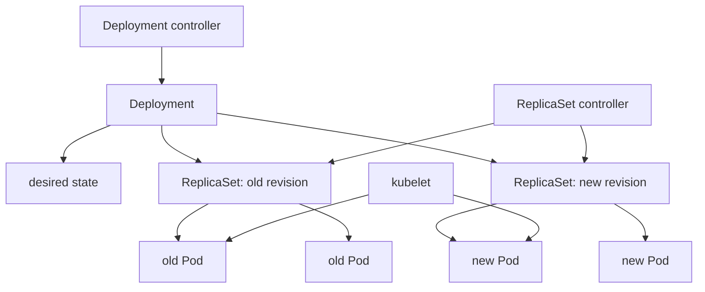

# 3.3 Deployments and ReplicaSets

## Purpose of This Section

This section explains how Kubernetes Deployments and ReplicaSets work together to run stateless workloads in production.

A Deployment is the most common controller used for long-running application Pods. It gives engineers a declarative way to describe the desired
state of an application, including the Pod template, replica count, rollout strategy, rollback history, and availability behavior during updates.

A ReplicaSet is the lower-level controller that keeps a stable number of matching Pods running. In normal production usage, engineers create and
operate Deployments, and the Deployment controller creates and manages ReplicaSets on their behalf.

For SRE work, this distinction matters. When a rollout fails, the Deployment may show a high-level condition such as `ProgressDeadlineExceeded`,
but the root cause usually appears in the new ReplicaSet, the new Pods, events, image pulls, readiness probes, scheduling decisions, resource
quotas, admission policies, or application logs.

By the end of this section, you should be able to:

- Explain the relationship between a Deployment, ReplicaSets, and Pods.
- Understand how rolling updates create and scale ReplicaSets.
- Read Deployment rollout state during incidents.
- Choose safe rollout settings for production services.
- Roll back failed Deployments without hiding the root cause.
- Review Deployment manifests for production readiness.

## Deployment and ReplicaSet Mental Model

A Deployment manages application revisions.

A ReplicaSet manages replica count for one Pod template.

Pods run the application containers.



A Deployment does not directly restart containers inside existing Pods when the Pod template changes. Instead, it creates a new ReplicaSet for the
new Pod template, scales the new ReplicaSet up, and scales older ReplicaSets down according to the configured rollout strategy.

This model is important because production troubleshooting often requires looking below the Deployment object:

```bash
kubectl get deployment api -n production
kubectl get rs -n production -l app=api
kubectl get pods -n production -l app=api -o wide
kubectl describe deployment api -n production
kubectl describe rs <replicaset-name> -n production
```

## What a Deployment Owns

A Deployment owns rollout intent.

The Deployment specification normally includes:

- The desired replica count.
- The selector used to identify matching Pods.
- The Pod template used to create Pods.
- The rollout strategy.
- The progress deadline.
- The revision history limit.
- Labels and annotations used by automation and observability systems.

Example Deployment:

```yaml
apiVersion: apps/v1
kind: Deployment
metadata:
  name: payments-api
  namespace: production
  labels:
    app.kubernetes.io/name: payments-api
    app.kubernetes.io/component: api
spec:
  replicas: 4
  revisionHistoryLimit: 5
  progressDeadlineSeconds: 600
  minReadySeconds: 20
  strategy:
    type: RollingUpdate
    rollingUpdate:
      maxSurge: 1
      maxUnavailable: 1
  selector:
    matchLabels:
      app.kubernetes.io/name: payments-api
      app.kubernetes.io/component: api
  template:
    metadata:
      labels:
        app.kubernetes.io/name: payments-api
        app.kubernetes.io/component: api
    spec:
      containers:
        - name: api
          image: registry.example.com/payments-api:1.4.2
          imagePullPolicy: IfNotPresent
          ports:
            - name: http
              containerPort: 8080
          readinessProbe:
            httpGet:
              path: /readyz
              port: http
            initialDelaySeconds: 5
            periodSeconds: 5
            failureThreshold: 3
          livenessProbe:
            httpGet:
              path: /healthz
              port: http
            initialDelaySeconds: 30
            periodSeconds: 10
            failureThreshold: 3
          resources:
            requests:
              cpu: 250m
              memory: 256Mi
            limits:
              memory: 512Mi
```

The selector is one of the most important fields. It determines which Pods belong to the Deployment through its ReplicaSets. Treat selectors as a
stable contract. Poor label design can cause controllers to adopt the wrong Pods or fail to manage the expected Pods.

## What a ReplicaSet Owns

A ReplicaSet keeps a specified number of matching Pods running.

Its core fields are:

- `spec.replicas`: the desired number of Pods.
- `spec.selector`: the label selector used to identify matching Pods.
- `spec.template`: the Pod template used when new Pods need to be created.

In normal application delivery, engineers do not create or edit ReplicaSets directly. A Deployment creates ReplicaSets and owns them through owner
references. ReplicaSets then own Pods through their own owner references.

A ReplicaSet can acquire Pods that match its selector if those Pods do not already have a controller owner. This is useful to understand during
forensics, but it is also why selectors must be precise.

Operationally, ReplicaSets are useful during rollout debugging:

```bash
kubectl get rs -n production -l app.kubernetes.io/name=payments-api
kubectl describe rs <replicaset-name> -n production
kubectl get pods -n production --show-labels
```

If a Deployment rollout is stuck, the new ReplicaSet often shows whether Pods are failing admission, waiting for capacity, failing image pulls, or
failing readiness.

## RollingUpdate and Recreate Strategies

Deployments support two strategy types:

| Strategy | Production meaning | Typical use |
| --- | --- | --- |
| `RollingUpdate` | Replace old Pods gradually while maintaining availability targets. | Default choice for most stateless services. |
| `Recreate` | Terminate existing Pods before creating replacement Pods. | Narrow cases where old and new versions cannot overlap. |

`RollingUpdate` is the default strategy. It is usually the right baseline for production APIs, workers, and stateless applications.

`Recreate` is disruptive because it intentionally allows downtime while the old Pods are removed and the new Pods are created. Use it only when the
application cannot tolerate concurrent old and new versions, and document the expected impact before applying it to a customer-facing service.

## Rolling Update Capacity Math

Rolling update behavior is controlled by `maxSurge` and `maxUnavailable`.

- `maxSurge` controls how many extra Pods may exist above the desired replica count during a rollout.
- `maxUnavailable` controls how many desired Pods may be unavailable during a rollout.

Both fields can be absolute numbers or percentages.

Kubernetes rounds percentage `maxSurge` values up and percentage `maxUnavailable` values down. The defaults are 25 percent for each field. Both
fields cannot be zero at the same time.

Example:

```yaml
spec:
  replicas: 4
  strategy:
    type: RollingUpdate
    rollingUpdate:
      maxSurge: 25%
      maxUnavailable: 25%
```

For four replicas:

| Setting | Result |
| --- | --- |
| `maxSurge: 25%` | One extra Pod may be created because surge percentage rounds up. |
| `maxUnavailable: 25%` | One desired Pod may be unavailable because unavailable percentage rounds down. |
| Desired replicas | Four Pods. |
| Maximum Pods during rollout | Five Pods. |
| Minimum available desired Pods during rollout | Three Pods. |

For critical services, these settings are capacity and reliability decisions, not just deployment syntax. If there is no spare node capacity, a
positive surge value may not help because new Pods still need somewhere to run. If `maxUnavailable` is too high, the application can violate its
availability target during a normal rollout.

## Pod Template Changes and Revisions

A Deployment creates a new rollout when the Pod template changes.

Common rollout-triggering changes include:

- Container image tag or digest changes.
- Environment variable changes.
- Volume or ConfigMap reference changes in the Pod template.
- Pod labels or annotations inside `spec.template.metadata`.
- Probe, resource, security context, or command changes.

Changing the Deployment replica count does not create a new revision by itself. Scaling changes desired replica count. Template changes create a new
ReplicaSet revision.

Use rollout history to inspect revisions:

```bash
kubectl rollout history deployment/payments-api -n production
kubectl rollout history deployment/payments-api -n production --revision=3
```

If your release tooling sets the `kubernetes.io/change-cause` annotation, rollout history can show a useful change cause. Do not assume the change
cause is present unless your delivery pipeline explicitly records it.

## Rollout Observation Commands

During a normal release, watch the Deployment, ReplicaSets, Pods, and events together.

```bash
kubectl rollout status deployment/payments-api -n production
kubectl get deployment payments-api -n production -w
kubectl get rs -n production -l app.kubernetes.io/name=payments-api
kubectl get pods -n production -l app.kubernetes.io/name=payments-api -o wide
kubectl get events -n production --sort-by=.lastTimestamp
```

For a rollback:

```bash
kubectl rollout history deployment/payments-api -n production
kubectl rollout undo deployment/payments-api -n production
kubectl rollout status deployment/payments-api -n production
```

To roll back to a specific revision:

```bash
kubectl rollout undo deployment/payments-api -n production --to-revision=3
```

To pause and resume a rollout:

```bash
kubectl rollout pause deployment/payments-api -n production
kubectl rollout resume deployment/payments-api -n production
```

Pausing can be useful when a rollout is partially deployed and you need time to inspect behavior before allowing more Pods to change. It is not a
substitute for progressive delivery, automated analysis, or canary controls.

## Progress Deadline and Stalled Rollouts

A Deployment uses `.spec.progressDeadlineSeconds` to decide when a rollout has failed to make progress. The default is 600 seconds.

When the deadline is exceeded, the Deployment reports a condition with `type: Progressing`, `status: False`, and reason
`ProgressDeadlineExceeded`.

Common reasons a rollout stops making progress include:

- The new image cannot be pulled.
- New Pods cannot be scheduled.
- New Pods fail admission.
- New Pods start but never become Ready.
- Readiness probes depend on an unavailable dependency.
- Resource quotas, limit ranges, or policy controls reject the Pod.
- Node capacity is insufficient for surge Pods.

A progress deadline does not automatically fix or roll back the workload. It gives operators and automation a clear signal that the rollout is not
progressing as expected.

## Readiness Is the Rollout Gate

Readiness determines whether a Pod is ready to serve traffic. During a rolling update, readiness directly affects whether Kubernetes can continue
scaling down older Pods while scaling up newer Pods.

A common production failure is a rollout where containers are running, but new Pods never become Ready. In that case, the Deployment may stall even
though the application process is alive.

Review readiness probes carefully:

- The readiness endpoint should confirm the application can serve its intended traffic.
- The readiness endpoint should not fail because of every downstream dependency unless that dependency is required for serving all traffic.
- Probe timeout and failure thresholds should reflect realistic startup and dependency behavior.
- `minReadySeconds` can require a Pod to remain Ready for a period before it is considered available.

Rollout success means Kubernetes reached the desired controller state. It does not prove that users are happy, latency is acceptable, or every
business path works. Always pair rollout status with service-level telemetry.

## Rollback Is Recovery, Not Root Cause Analysis

Rollback is an important recovery tool. It is not a complete incident analysis.

A safe rollback flow looks like this:

```bash
kubectl rollout history deployment/payments-api -n production
kubectl rollout undo deployment/payments-api -n production
kubectl rollout status deployment/payments-api -n production
kubectl get pods -n production -l app.kubernetes.io/name=payments-api
```

After the service is stable, preserve evidence:

```bash
kubectl describe deployment payments-api -n production
kubectl describe rs <failed-new-replicaset> -n production
kubectl get events -n production --sort-by=.lastTimestamp
kubectl logs <failed-pod> -n production --previous
```

If the failed Pods are deleted too quickly, the team may lose the evidence needed to understand whether the failure was caused by image content,
configuration, policy, capacity, dependency readiness, or application behavior.

## SRE Runbook: Investigate a Stalled Deployment

Use this runbook when a Deployment does not complete rollout.

1. Confirm rollout state.

   ```bash
   kubectl rollout status deployment/<name> -n <namespace>
   kubectl describe deployment <name> -n <namespace>
   ```

2. Identify old and new ReplicaSets.

   ```bash
   kubectl get rs -n <namespace> -l <selector-key>=<selector-value>
   ```

3. Inspect new Pods.

   ```bash
   kubectl get pods -n <namespace> -l <selector-key>=<selector-value> -o wide
   kubectl describe pod <pod-name> -n <namespace>
   ```

4. Check events.

   ```bash
   kubectl get events -n <namespace> --sort-by=.lastTimestamp
   ```

5. Classify the failure.

   | Symptom | Likely investigation path |
   | --- | --- |
   | `ImagePullBackOff` | Registry access, image name, tag, pull secret, network path. |
   | `Pending` | Scheduling constraints, node capacity, taints, affinity, quotas. |
   | `CreateContainerConfigError` | ConfigMap, Secret, environment, volume, admission mutation. |
   | Running but not Ready | Readiness endpoint, dependency behavior, startup time, port mismatch. |
   | `CrashLoopBackOff` | Application startup, config, permissions, missing files, bad arguments. |
   | Old Pods not terminating | Grace period, preStop hook, finalizers, node health, stuck volume detach. |

6. Decide recovery action.

   - Roll forward if the fix is safe and fast.
   - Roll back if user impact is active or risk is increasing.
   - Pause the rollout if partial state should be preserved during investigation.
   - Escalate to platform teams if the failure is admission, quota, node capacity, registry, or network related.

7. Validate service health after recovery.

   ```bash
   kubectl rollout status deployment/<name> -n <namespace>
   kubectl get deployment <name> -n <namespace>
   kubectl get pods -n <namespace> -l <selector-key>=<selector-value>
   ```

   Then check application telemetry, request success rate, latency, saturation, and error budget impact.

## Production Design Review Checklist

Before approving a production Deployment, review these items:

| Area | Review question |
| --- | --- |
| Replica count | Does the service have enough replicas for node failure, zone failure, and rollout availability? |
| Strategy | Are `maxSurge` and `maxUnavailable` appropriate for capacity and SLO targets? |
| Readiness | Does the readiness probe represent actual serving readiness? |
| Startup | Does startup behavior need a startup probe or longer readiness window? |
| Liveness | Could the liveness probe restart healthy-but-slow Pods during dependency incidents? |
| Resources | Are CPU and memory requests realistic enough for scheduling and autoscaling? |
| Images | Are images versioned predictably instead of relying on mutable tags such as `latest`? |
| Selectors | Are selectors stable, precise, and not shared with unrelated Pods? |
| History | Is `revisionHistoryLimit` large enough for operational rollback needs? |
| Deadline | Is `progressDeadlineSeconds` aligned with realistic startup and release expectations? |
| Observability | Can the team correlate Deployment revisions with metrics, logs, traces, and alerts? |
| Recovery | Is there a documented rollback or roll-forward procedure? |

## Common Anti-Patterns

Avoid these patterns in production:

| Anti-pattern | Why it causes risk |
| --- | --- |
| Editing ReplicaSets directly | The Deployment controller may overwrite or replace the change. |
| No readiness probe | Kubernetes may send traffic to Pods before they can serve correctly. |
| `maxUnavailable` too high | A normal rollout can cause avoidable user-visible outage. |
| `Recreate` for customer-facing APIs | The strategy intentionally creates downtime. |
| Mutable image tags | Rollbacks and forensic analysis become unreliable. |
| Broad selectors | Controllers may adopt or target the wrong Pods. |
| Treating rollout success as application success | Kubernetes state does not prove business transactions are healthy. |
| Ignoring old ReplicaSets | Old ReplicaSets explain rollout history and rollback behavior. |

## Lab: Break and Recover a Deployment Rollout

This lab shows how a failed image update appears through the Deployment, ReplicaSet, and Pod layers.

Create a namespace:

```bash
kubectl create namespace deployment-lab
```

Apply a healthy Deployment:

```yaml
apiVersion: apps/v1
kind: Deployment
metadata:
  name: web
  namespace: deployment-lab
spec:
  replicas: 3
  revisionHistoryLimit: 3
  progressDeadlineSeconds: 120
  strategy:
    type: RollingUpdate
    rollingUpdate:
      maxSurge: 1
      maxUnavailable: 1
  selector:
    matchLabels:
      app: web
  template:
    metadata:
      labels:
        app: web
    spec:
      containers:
        - name: nginx
          image: nginx:1.27
          ports:
            - containerPort: 80
```

Save the manifest as `web.yaml`, then apply it:

```bash
kubectl apply -f web.yaml
kubectl rollout status deployment/web -n deployment-lab
kubectl get deployment,rs,pods -n deployment-lab -l app=web
```

Trigger a bad rollout:

```bash
kubectl set image deployment/web nginx=nginx:this-tag-does-not-exist -n deployment-lab
kubectl rollout status deployment/web -n deployment-lab
```

Investigate the failure:

```bash
kubectl get deployment,rs,pods -n deployment-lab -l app=web
kubectl describe deployment web -n deployment-lab
kubectl get events -n deployment-lab --sort-by=.lastTimestamp
```

Roll back:

```bash
kubectl rollout history deployment/web -n deployment-lab
kubectl rollout undo deployment/web -n deployment-lab
kubectl rollout status deployment/web -n deployment-lab
kubectl get deployment,rs,pods -n deployment-lab -l app=web
```

Clean up:

```bash
kubectl delete namespace deployment-lab
```

Lab review questions:

1. Which object showed the high-level rollout failure?
2. Which object showed the new revision?
3. Which Pod condition or event explained the failed rollout?
4. Why did old Pods remain available during the failed update?
5. What telemetry would you check before declaring the service fully recovered?

## Review Questions

1. What does a Deployment manage that a ReplicaSet does not manage by itself?
2. Why should production teams normally avoid editing ReplicaSets directly?
3. What happens when the Pod template of a Deployment changes?
4. How do `maxSurge` and `maxUnavailable` affect production rollout risk?
5. Why can a rollout stall even when new containers are running?
6. What does `ProgressDeadlineExceeded` tell an operator?
7. Why is rollback not the same as root cause analysis?
8. What risks come from broad or unstable selectors?
9. Why should rollout status be paired with service-level telemetry?
10. When might `Recreate` be acceptable?

## Key Takeaways

- Deployments manage rollout intent and revision history for application Pods.
- ReplicaSets maintain the desired number of Pods for a specific Pod template.
- Production engineers normally operate Deployments, not ReplicaSets directly.
- Rolling updates are controlled by `maxSurge`, `maxUnavailable`, readiness, and available capacity.
- A stalled Deployment must be investigated through ReplicaSets, Pods, events, scheduling, admission, and application telemetry.
- Rollback is a recovery action, but evidence collection and root cause analysis still matter.

## Official References

- [Deployments](https://kubernetes.io/docs/concepts/workloads/controllers/deployment/)
- [ReplicaSet](https://kubernetes.io/docs/concepts/workloads/controllers/replicaset/)
- [Update a Deployment Without Downtime](https://kubernetes.io/docs/tasks/run-application/update-deployment-rolling/)
- [Deployment API reference](https://kubernetes.io/docs/reference/kubernetes-api/apps/deployment-v1/)
- [kubectl rollout](https://kubernetes.io/docs/reference/kubectl/generated/kubectl_rollout/)
