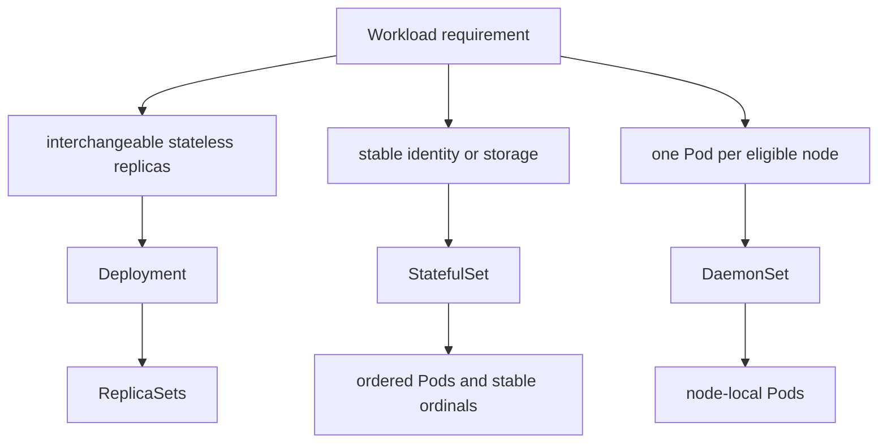
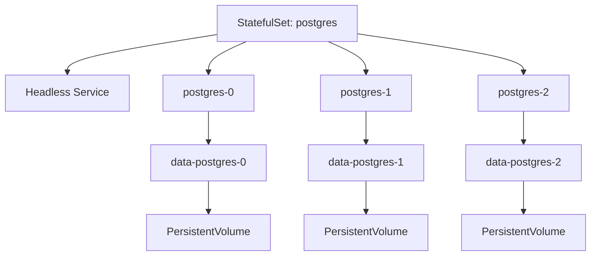
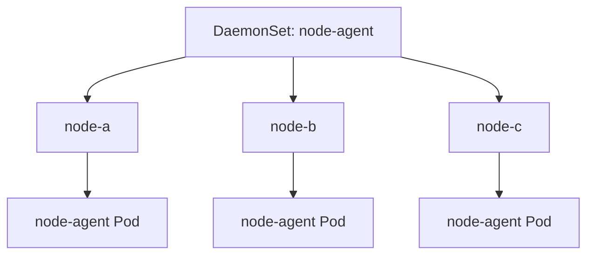

# 3.4 StatefulSets and DaemonSets

## Purpose of This Section

This section explains two workload controllers that solve problems Deployments are not designed to solve: StatefulSets and DaemonSets.

A Deployment is usually the right controller for stateless application replicas. StatefulSets and DaemonSets exist because some workloads need
stronger placement, identity, storage, or node coverage guarantees.

A StatefulSet manages Pods that need stable identity, stable network names, ordered rollout behavior, or persistent storage that follows a specific
Pod identity. Databases, quorum systems, brokers, and clustered services often need these properties.

A DaemonSet manages Pods that should run on every eligible node, or on a selected subset of nodes. Node agents, log collectors, metrics collectors,
networking components, storage agents, and security agents often use DaemonSets.

For SRE work, these controllers matter because they are common in the blast radius of production incidents. A broken StatefulSet update can block
on one ordinal. A DaemonSet rollout can degrade every node in a cluster. A storage mistake in a StatefulSet can threaten data. A scheduling mistake
in a DaemonSet can leave critical nodes without observability, networking, or policy enforcement.

By the end of this section, you should be able to:

- Explain when to use a StatefulSet instead of a Deployment.
- Explain when to use a DaemonSet instead of a Deployment.
- Understand StatefulSet identity, ordinal, storage, and update behavior.
- Understand DaemonSet node coverage, scheduling, and update behavior.
- Diagnose failed StatefulSet and DaemonSet rollouts.
- Review production manifests for controller-specific risk.

## Controller Selection Mental Model

Choose the controller based on the workload guarantee you need.



A simple rule helps:

| Need | Controller |
| --- | --- |
| Run N interchangeable replicas of an API or worker | Deployment |
| Run N replicas with stable identity, ordered rollout, and persistent volume identity | StatefulSet |
| Run one copy on every eligible node or selected node group | DaemonSet |
| Run finite batch work | Job or CronJob |

This section focuses on StatefulSets and DaemonSets. Jobs and CronJobs are covered in a later section.

## StatefulSet Production Model

A StatefulSet manages stateful applications by giving each Pod a stable identity.

The identity includes:

- A stable ordinal index.
- A stable Pod name.
- Stable network identity when paired with the required headless Service.
- Stable storage identity when using `volumeClaimTemplates`.
- Ordered deployment, scaling, and rolling update behavior by default.

For a StatefulSet named `postgres` with three replicas, the Pods are named:

```text
postgres-0
postgres-1
postgres-2
```

These names are not random. The ordinal is part of the workload contract.



The key production idea is that a StatefulSet Pod is not just one of many equivalent replicas. `postgres-0` and `postgres-1` can have different
storage, different cluster roles, different raft identities, different broker IDs, or different replication responsibilities depending on the
application.

## StatefulSet Identity and Ordinals

StatefulSet Pods receive stable ordinal indexes. By default, a StatefulSet with N replicas uses ordinals from `0` through `N-1`.

This matters because many clustered applications use ordinal identity to make membership decisions.

Examples:

| Workload | Why identity matters |
| --- | --- |
| PostgreSQL cluster | A Pod may be primary, standby, or replica with specific persistent data. |
| Kafka broker set | Brokers need stable storage and broker identity. |
| ZooKeeper or etcd-style quorum | Members often require stable peer identity. |
| Search clusters | Data shards and node identity affect recovery behavior. |
| Distributed caches | Identity may affect partition ownership and warmup strategy. |

Kubernetes also labels StatefulSet Pods with identity-related labels, including the Pod name label. In modern Kubernetes, StatefulSet Pods also
receive an ordinal index label that can be useful for metrics, logs, routing, or operational filtering.

For operations, inspect identity directly:

```bash
kubectl get pods -n <namespace> -l app=<name> --show-labels
kubectl get pod <statefulset-name>-0 -n <namespace> -o yaml
```

## Headless Service Requirement

StatefulSets require a headless Service to manage stable network identity for Pods. You are responsible for creating this Service.

A headless Service uses `clusterIP: None`.

Example:

```yaml
apiVersion: v1
kind: Service
metadata:
  name: postgres
  namespace: data
spec:
  clusterIP: None
  selector:
    app.kubernetes.io/name: postgres
  ports:
    - name: postgres
      port: 5432
      targetPort: postgres
```

With a StatefulSet named `postgres` using the Service name `postgres`, Pods can receive stable DNS names in the Service domain.

For production troubleshooting, validate both sides:

```bash
kubectl get service postgres -n data -o yaml
kubectl get endpointslices -n data -l kubernetes.io/service-name=postgres
kubectl get pods -n data -l app.kubernetes.io/name=postgres -o wide
```

Do not confuse stable network identity with application readiness. DNS identity can exist while the application is still starting, recovering data,
or not ready to serve traffic.

## StatefulSet Storage Behavior

StatefulSets often use `volumeClaimTemplates` to create persistent volume claims per Pod identity.

Example:

```yaml
apiVersion: apps/v1
kind: StatefulSet
metadata:
  name: postgres
  namespace: data
spec:
  serviceName: postgres
  replicas: 3
  selector:
    matchLabels:
      app.kubernetes.io/name: postgres
  template:
    metadata:
      labels:
        app.kubernetes.io/name: postgres
    spec:
      terminationGracePeriodSeconds: 60
      containers:
        - name: postgres
          image: postgres:17
          ports:
            - name: postgres
              containerPort: 5432
          volumeMounts:
            - name: data
              mountPath: /var/lib/postgresql/data
          readinessProbe:
            exec:
              command:
                - pg_isready
                - -U
                - postgres
            periodSeconds: 10
            failureThreshold: 6
  volumeClaimTemplates:
    - metadata:
        name: data
      spec:
        accessModes:
          - ReadWriteOnce
        storageClassName: fast-ssd
        resources:
          requests:
            storage: 100Gi
```

Each Pod receives its own claim. For example, `postgres-0` receives a different claim than `postgres-1`.

A critical production detail: scaling down or deleting a StatefulSet does not automatically delete associated volumes by default. Kubernetes is
conservative here because accidental data deletion is usually worse than leftover storage. Newer StatefulSet retention policy fields can control
PVC retention behavior, but the default is still designed around data safety.

SRE implications:

- Always know which PVC belongs to which Pod ordinal.
- Treat PVC deletion as a data operation, not a cleanup operation.
- Validate backup and restore before relying on StatefulSet rollout safety.
- Understand cloud provider volume attachment and zone constraints.
- Coordinate application-level replication with Kubernetes-level storage movement.

Useful commands:

```bash
kubectl get pvc -n data
kubectl describe pvc <claim-name> -n data
kubectl get pv
kubectl describe pod postgres-0 -n data
```

## StatefulSet Ordering Guarantees

By default, StatefulSets use ordered behavior.

For creation and scaling up, Kubernetes creates Pods in ordinal order and waits for each Pod to become Running and Ready before continuing.

For scaling down, Kubernetes terminates Pods in reverse ordinal order.

For rolling updates, Kubernetes updates Pods in reverse ordinal order. With the default behavior, it waits for an updated Pod to become Running and
Ready before moving to the next lower ordinal.

This makes StatefulSet rollouts safer for applications that depend on ordered membership, but it also means one broken Pod can block the rollout.

Example failure:

```text
postgres-2 updated but never becomes Ready
postgres-1 remains on the old revision
postgres-0 remains on the old revision
rollout waits at postgres-2
```

That blocked rollout is not a Kubernetes bug. It is the controller preserving ordering guarantees.

## StatefulSet Update Strategies

StatefulSets support two update strategies:

| Strategy | Behavior | Production use |
| --- | --- | --- |
| `RollingUpdate` | Automatically deletes and recreates Pods according to StatefulSet update rules. | Default for most managed stateful application updates. |
| `OnDelete` | Does not automatically update Pods after template changes. Pods update only when manually deleted. | Useful when operators or application automation must control each Pod replacement. |

`RollingUpdate` is the default.

StatefulSets also support partitioned rolling updates. A partition lets you update only Pods with ordinals greater than or equal to the partition.
This can be useful for staged updates or canary-style testing within an ordinal set.

Example partition:

```yaml
spec:
  updateStrategy:
    type: RollingUpdate
    rollingUpdate:
      partition: 2
```

For a three-replica StatefulSet with ordinals `0`, `1`, and `2`, a partition of `2` updates only `pod-2`. Lower ordinals remain on the previous
revision.

Use partitions carefully. They are powerful, but they also create mixed versions that application owners must understand and support.

## StatefulSet Forced Rollback Risk

StatefulSet rollback can require manual intervention.

If a bad template creates a Pod that never becomes Running and Ready, simply reverting the StatefulSet template may not be enough. With default
ordered rolling updates, the controller can continue waiting on the broken Pod. After reverting the template, operators may need to delete the Pods
that were created with the bad configuration so the controller can recreate them from the corrected template.

Incident runbook:

```bash
kubectl rollout status statefulset/<name> -n <namespace>
kubectl get pods -n <namespace> -l app=<name>
kubectl describe pod <name>-<ordinal> -n <namespace>
kubectl rollout undo statefulset/<name> -n <namespace>
kubectl delete pod <name>-<ordinal> -n <namespace>
kubectl rollout status statefulset/<name> -n <namespace>
```

Before deleting a StatefulSet Pod, understand what the application will do when that member restarts. For databases, quorum systems, and brokers,
Pod deletion can trigger leader election, replica catch-up, shard movement, or client disruption.

## DaemonSet Production Model

A DaemonSet ensures that every eligible node, or every selected eligible node, runs a copy of a Pod.

Typical DaemonSet workloads include:

- Log collection agents.
- Metrics collection agents.
- Node security agents.
- CNI or network helper components.
- Storage agents.
- Service mesh node proxies or node-local data plane helpers.
- Hardware or device plugin agents.

A DaemonSet is node-scoped by design.



As nodes are added to the cluster, DaemonSet Pods are added to eligible nodes. As nodes are removed, the corresponding DaemonSet Pods are garbage
collected. Deleting a DaemonSet cleans up Pods it created.

## DaemonSet Scheduling and Node Selection

DaemonSets can target all nodes or a subset of nodes.

Common selection controls include:

- `nodeSelector`
- node affinity
- taints and tolerations
- labels assigned to node pools
- operating system and architecture labels

Example DaemonSet for Linux nodes:

```yaml
apiVersion: apps/v1
kind: DaemonSet
metadata:
  name: node-log-agent
  namespace: observability
spec:
  selector:
    matchLabels:
      app.kubernetes.io/name: node-log-agent
  updateStrategy:
    type: RollingUpdate
    rollingUpdate:
      maxUnavailable: 1
  template:
    metadata:
      labels:
        app.kubernetes.io/name: node-log-agent
    spec:
      tolerations:
        - operator: Exists
      nodeSelector:
        kubernetes.io/os: linux
      containers:
        - name: agent
          image: registry.example.com/node-log-agent:2.8.0
          resources:
            requests:
              cpu: 100m
              memory: 128Mi
            limits:
              memory: 256Mi
          volumeMounts:
            - name: varlog
              mountPath: /var/log
              readOnly: true
      volumes:
        - name: varlog
          hostPath:
            path: /var/log
```

The broad toleration in this example is common for node agents that must run on tainted infrastructure nodes. It is also risky if used casually.
A DaemonSet that tolerates every taint may run on nodes where it was not intended, unless node affinity or node selectors narrow the target set.

## DaemonSet Update Strategies

DaemonSets support rolling updates. In the update task documentation, rolling update behavior can be configured with fields such as:

- `.spec.updateStrategy.type`
- `.spec.updateStrategy.rollingUpdate.maxUnavailable`
- `.spec.updateStrategy.rollingUpdate.maxSurge`
- `.spec.minReadySeconds`

For DaemonSets, `maxUnavailable` defaults to 1 and `maxSurge` defaults to 0.

This means a default DaemonSet rolling update may take down one DaemonSet Pod at a time across the cluster. For node-critical agents, that is often
safer than updating many nodes at once, but it may take longer on large clusters.

Use `kubectl rollout` for DaemonSet observation:

```bash
kubectl rollout status daemonset/node-log-agent -n observability
kubectl rollout history daemonset/node-log-agent -n observability
kubectl rollout undo daemonset/node-log-agent -n observability
```

Inspect placement and node coverage:

```bash
kubectl get daemonset node-log-agent -n observability -o wide
kubectl get pods -n observability -l app.kubernetes.io/name=node-log-agent -o wide
kubectl describe daemonset node-log-agent -n observability
```

## StatefulSet vs DaemonSet Operational Differences

| Topic | StatefulSet | DaemonSet |
| --- | --- | --- |
| Main purpose | Stable identity and storage for replicas. | Node-local coverage. |
| Pod naming | Stable ordinal names. | Generated names per node placement. |
| Storage model | Often uses per-Pod PVCs. | Often uses hostPath or node-local access. |
| Network model | Often requires a headless Service. | Usually node-local; Service may not be needed. |
| Scaling model | Replica count controls ordinal set size. | Node count and selectors control Pod count. |
| Update risk | Can block on one ordinal. | Can affect every node if poorly controlled. |
| Common workloads | Databases, brokers, quorum services. | Agents, collectors, node infrastructure. |

## SRE Runbook: Investigate a StatefulSet Rollout

Use this runbook when a StatefulSet rollout is blocked or risky.

1. Check rollout state.

   ```bash
   kubectl rollout status statefulset/<name> -n <namespace>
   kubectl describe statefulset <name> -n <namespace>
   ```

2. Identify ordinal status.

   ```bash
   kubectl get pods -n <namespace> -l app=<name> -o wide
   kubectl get controllerrevisions -n <namespace>
   ```

3. Inspect the stuck Pod.

   ```bash
   kubectl describe pod <name>-<ordinal> -n <namespace>
   kubectl logs <name>-<ordinal> -n <namespace> --all-containers
   kubectl get events -n <namespace> --sort-by=.lastTimestamp
   ```

4. Validate storage.

   ```bash
   kubectl get pvc -n <namespace>
   kubectl describe pvc <claim-name> -n <namespace>
   kubectl describe pv <pv-name>
   ```

5. Classify the failure.

   | Symptom | Likely investigation path |
   | --- | --- |
   | Pod stuck `Pending` | Volume binding, zone mismatch, node capacity, taints, affinity. |
   | Pod stuck not Ready | Application startup, quorum, data recovery, readiness probe, dependency behavior. |
   | Rollout stops at one ordinal | Ordered update waiting for that ordinal to become Running and Ready. |
   | PVC remains after scale down | Default data-safety behavior or retention policy. |
   | DNS name missing | Headless Service, selector, EndpointSlice, Pod readiness. |

6. Choose recovery.

   - Pause human action until application ownership is clear.
   - Roll back the template if the update is bad.
   - Delete affected Pods only when the application can tolerate replacement.
   - Verify quorum, replication health, and data durability before declaring recovery.

## SRE Runbook: Investigate a DaemonSet Rollout

Use this runbook when a node agent is missing, degraded, or rolling out poorly.

1. Check DaemonSet state.

   ```bash
   kubectl get daemonset <name> -n <namespace> -o wide
   kubectl describe daemonset <name> -n <namespace>
   ```

2. Check node coverage.

   ```bash
   kubectl get pods -n <namespace> -l app=<name> -o wide
   kubectl get nodes --show-labels
   ```

3. Compare desired nodes to actual Pods.

   Look for nodes excluded by:

   - missing labels
   - node selectors
   - node affinity
   - taints without matching tolerations
   - unsupported operating system or architecture
   - admission policies
   - resource pressure

4. Inspect a failing Pod.

   ```bash
   kubectl describe pod <pod-name> -n <namespace>
   kubectl logs <pod-name> -n <namespace> --all-containers
   kubectl get events -n <namespace> --sort-by=.lastTimestamp
   ```

5. Check rollout status.

   ```bash
   kubectl rollout status daemonset/<name> -n <namespace>
   kubectl rollout history daemonset/<name> -n <namespace>
   ```

6. Choose recovery.

   - Roll back if a new agent version breaks node functionality.
   - Narrow node selection if the DaemonSet is running on the wrong node pool.
   - Fix tolerations or affinity if the DaemonSet is missing from critical nodes.
   - Coordinate with platform owners before restarting node-critical agents cluster-wide.

## Production Design Review Checklist

| Area | StatefulSet review question | DaemonSet review question |
| --- | --- | --- |
| Controller fit | Does the app truly need stable identity or storage? | Does the app truly need node-local coverage? |
| Selectors | Are labels precise and stable? | Are labels precise and stable? |
| Rollout | Is the update strategy safe for the application? | Is `maxUnavailable` safe for node coverage? |
| Readiness | Does readiness reflect member health? | Does readiness reflect agent availability? |
| Storage | Are PVC retention and backup policies documented? | Are hostPath mounts minimized and justified? |
| Scheduling | Are zone, affinity, and storage constraints understood? | Are node selectors, affinity, and tolerations intentional? |
| Security | Are permissions scoped to the workload need? | Are host access and privileged settings justified? |
| Observability | Can each ordinal be monitored separately? | Can node coverage gaps be detected quickly? |
| Recovery | Is Pod deletion safe for the application? | Is rolling back safe across all affected nodes? |

## Common Anti-Patterns

Avoid these patterns in production:

| Anti-pattern | Why it causes risk |
| --- | --- |
| Running a database as a Deployment without understanding identity and storage needs | Replacement Pods may not preserve the application-level identity the system expects. |
| Deleting StatefulSet PVCs during cleanup without backup confirmation | This can cause irreversible data loss. |
| Setting `terminationGracePeriodSeconds: 0` for StatefulSet Pods | Fast termination can be unsafe for stateful applications. |
| Assuming StatefulSet rollback is as simple as Deployment rollback | Bad ordinal updates can require manual Pod deletion after reverting the template. |
| Running broad DaemonSet tolerations without node selectors | The agent may run on unintended nodes. |
| Updating node-critical DaemonSets too aggressively | Observability, networking, storage, or security coverage can be degraded cluster-wide. |
| Ignoring node coverage metrics | A DaemonSet can look mostly healthy while missing critical nodes. |
| Using hostPath casually | Host access increases security and operational blast radius. |

## Lab: Observe StatefulSet Identity

This lab demonstrates stable ordinals and PVC identity.

Create a namespace:

```bash
kubectl create namespace stateful-lab
```

Apply a headless Service and StatefulSet:

```yaml
apiVersion: v1
kind: Service
metadata:
  name: web
  namespace: stateful-lab
spec:
  clusterIP: None
  selector:
    app: web
  ports:
    - name: http
      port: 80
---
apiVersion: apps/v1
kind: StatefulSet
metadata:
  name: web
  namespace: stateful-lab
spec:
  serviceName: web
  replicas: 3
  selector:
    matchLabels:
      app: web
  template:
    metadata:
      labels:
        app: web
    spec:
      containers:
        - name: nginx
          image: nginx:1.27
          ports:
            - name: http
              containerPort: 80
```

Apply and inspect:

```bash
kubectl apply -f stateful-web.yaml
kubectl rollout status statefulset/web -n stateful-lab
kubectl get pods -n stateful-lab -l app=web -o wide
kubectl get pods -n stateful-lab -l app=web --show-labels
```

Scale down and observe reverse ordinal termination:

```bash
kubectl scale statefulset/web -n stateful-lab --replicas=1
kubectl get pods -n stateful-lab -w
```

Clean up:

```bash
kubectl delete namespace stateful-lab
```

Lab review questions:

1. Which Pod was created first?
2. Which Pod was terminated first during scale down?
3. Which labels identify StatefulSet Pod identity?
4. Why would this identity matter for a database or broker?

## Lab: Check DaemonSet Node Coverage

This lab demonstrates DaemonSet placement across eligible nodes.

Create a namespace:

```bash
kubectl create namespace daemon-lab
```

Apply a simple DaemonSet:

```yaml
apiVersion: apps/v1
kind: DaemonSet
metadata:
  name: node-info
  namespace: daemon-lab
spec:
  selector:
    matchLabels:
      app: node-info
  template:
    metadata:
      labels:
        app: node-info
    spec:
      nodeSelector:
        kubernetes.io/os: linux
      containers:
        - name: pause
          image: registry.k8s.io/pause:3.10
```

Inspect coverage:

```bash
kubectl apply -f node-info.yaml
kubectl get daemonset node-info -n daemon-lab -o wide
kubectl get pods -n daemon-lab -l app=node-info -o wide
kubectl get nodes -l kubernetes.io/os=linux
```

Clean up:

```bash
kubectl delete namespace daemon-lab
```

Lab review questions:

1. How many eligible nodes existed?
2. How many DaemonSet Pods were created?
3. Which node labels controlled eligibility?
4. What would happen if a new eligible node joined the cluster?

## Review Questions

1. Why is a StatefulSet more appropriate than a Deployment for many databases?
2. What is the purpose of a StatefulSet ordinal?
3. Why does a StatefulSet commonly require a headless Service?
4. What happens to StatefulSet PVCs by default when the StatefulSet is scaled down or deleted?
5. Why can one unhealthy StatefulSet Pod block a rollout?
6. What is the difference between `RollingUpdate` and `OnDelete` for StatefulSets?
7. What problem does a DaemonSet solve?
8. How can node selectors, affinity, and tolerations affect DaemonSet coverage?
9. Why can DaemonSet rollouts be high risk for platform infrastructure?
10. What metrics or alerts would you create to detect missing DaemonSet Pods on critical nodes?

## Key Takeaways

- StatefulSets are for workloads that need stable identity, ordered behavior, and often persistent storage.
- StatefulSet Pods have stable ordinal names and can be paired with per-Pod PVCs.
- StatefulSets require a headless Service for stable network identity.
- StatefulSet update behavior protects ordering but can block on one unhealthy ordinal.
- DaemonSets are for node-local workloads that must run on every eligible node or selected node groups.
- DaemonSet rollout settings affect node-wide infrastructure risk.
- Storage, identity, selectors, tolerations, and rollout strategy must be reviewed carefully before production use.

## Official References

- [StatefulSets](https://kubernetes.io/docs/concepts/workloads/controllers/statefulset/)
- [DaemonSet](https://kubernetes.io/docs/concepts/workloads/controllers/daemonset/)
- [Service](https://kubernetes.io/docs/concepts/services-networking/service/)
- [Persistent Volumes](https://kubernetes.io/docs/concepts/storage/persistent-volumes/)
- [Perform a Rolling Update on a DaemonSet](https://kubernetes.io/docs/tasks/manage-daemon/update-daemon-set/)
