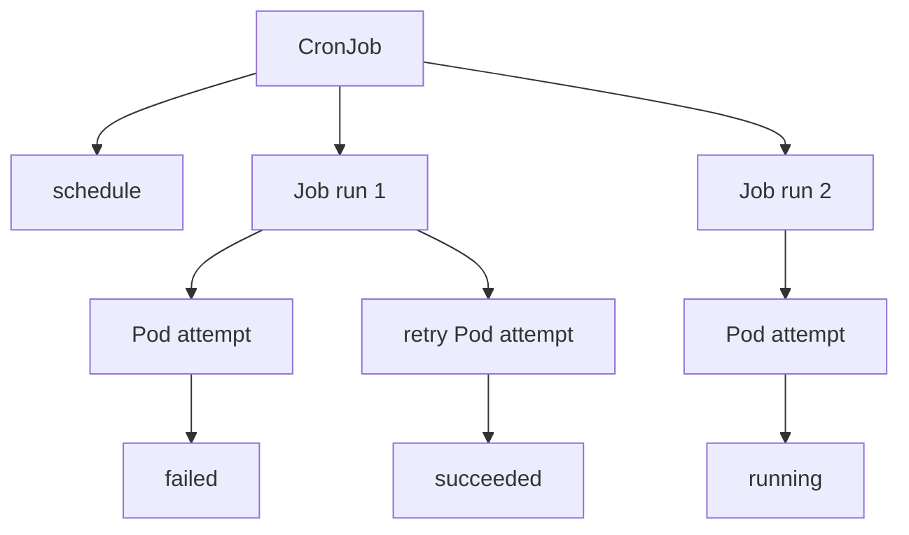

# 3.5 Jobs and CronJobs

## Purpose of This Section

This section explains Kubernetes Jobs and CronJobs from a production SRE perspective.

Deployments, StatefulSets, and DaemonSets run ongoing workloads. Jobs and CronJobs are different. They are designed for work that should run to
completion.

A Job creates Pods and tracks whether a specified amount of work has completed successfully. A CronJob creates Jobs on a repeating schedule.

This distinction matters in production because batch workloads often touch high-risk systems: backups, database migrations, report generation,
queue drains, data processing, certificate renewal, cleanup tasks, and operational automation. A failed Job can leave work incomplete. A runaway Job
can exhaust cluster capacity. A misconfigured CronJob can run too often, overlap with itself, or miss critical schedules.

By the end of this section, you should be able to:

- Explain when to use a Job instead of a Deployment.
- Explain when to use a CronJob instead of an external scheduler.
- Understand Job completions, parallelism, retries, deadlines, and cleanup.
- Understand CronJob schedules, time zones, concurrency policies, history limits, and missed runs.
- Diagnose failed, stuck, duplicated, or delayed batch workloads.
- Review production Job and CronJob manifests before release.

## Batch Workload Mental Model

A Job is a controller for finite work.

A CronJob is a scheduler for Jobs.



The controller responsibilities are different:

| Object | Responsibility |
| --- | --- |
| Job | Run a specified unit of work until success or failure criteria are met. |
| CronJob | Create Jobs according to a schedule. |
| Pod | Run the actual containers that perform the work. |

A Job is not a long-running service. If the work should stay running and serve traffic, use a Deployment, StatefulSet, or DaemonSet instead.

## Common Production Use Cases

Jobs and CronJobs are common in operational systems:

| Use case | Common controller |
| --- | --- |
| One-time database migration | Job |
| One-time data repair | Job |
| Backfill or reindex operation | Job |
| Queue drain or replay | Job |
| Nightly backup | CronJob |
| Scheduled report generation | CronJob |
| Certificate renewal helper | CronJob |
| Periodic cleanup task | CronJob |
| Synthetic check or reconciliation task | CronJob |

The controller does not make the task safe. It only controls execution. The application command still needs idempotency, observability, error
handling, and guardrails.

## Job Execution Model

A Job creates one or more Pods and tracks successful completion.

A basic Job looks like this:

```yaml
apiVersion: batch/v1
kind: Job
metadata:
  name: invoice-rebuild
  namespace: operations
spec:
  backoffLimit: 3
  activeDeadlineSeconds: 1800
  ttlSecondsAfterFinished: 86400
  template:
    spec:
      restartPolicy: Never
      containers:
        - name: rebuild
          image: registry.example.com/invoice-tools:1.8.0
          command:
            - /bin/sh
            - -c
            - ./rebuild-invoices --date=2026-08-01
          resources:
            requests:
              cpu: 500m
              memory: 1Gi
            limits:
              memory: 2Gi
```

Production details in this example:

- `backoffLimit` limits retry attempts before the Job is considered failed.
- `activeDeadlineSeconds` limits total active time for the Job.
- `ttlSecondsAfterFinished` allows automatic cleanup after completion.
- `restartPolicy` is set to `Never`, which makes each failed attempt visible as a failed Pod.
- Resource requests prevent the Job from being scheduled as best-effort background noise.

For Jobs, the Pod template restart policy must be `Never` or `OnFailure`. Use `Never` when you want each failed attempt to create clear Pod-level
forensics. Use `OnFailure` when retrying inside the same Pod is acceptable and logs/exit behavior remain understandable.

## Completions and Parallelism

Two fields shape Job execution:

- `completions`: how many successful completions are required.
- `parallelism`: how many Pods may run at the same time.

Example:

```yaml
apiVersion: batch/v1
kind: Job
metadata:
  name: shard-processor
  namespace: batch
spec:
  completions: 12
  parallelism: 3
  backoffLimit: 4
  template:
    spec:
      restartPolicy: Never
      containers:
        - name: processor
          image: registry.example.com/shard-processor:4.2.1
          command:
            - ./process-shard
```

This Job needs 12 successful completions and can run up to 3 Pods at a time.

Production implications:

| Field | Operational risk |
| --- | --- |
| `completions` too low | Work may finish before all required units are processed. |
| `completions` too high | The Job may run longer than expected or duplicate work. |
| `parallelism` too low | The Job may miss operational windows. |
| `parallelism` too high | The Job may overload databases, APIs, queues, storage, or cluster capacity. |

Do not tune `parallelism` only for cluster throughput. Tune it for the weakest downstream dependency.

## Indexed Jobs

Some batch systems need one Pod per work index. Kubernetes supports indexed completion mode for Jobs.

In an indexed Job, each completion receives an index. The application can use that index to process a specific shard, partition, file range, tenant
batch, or queue segment.

Example:

```yaml
apiVersion: batch/v1
kind: Job
metadata:
  name: tenant-backfill
  namespace: batch
spec:
  completionMode: Indexed
  completions: 10
  parallelism: 2
  backoffLimitPerIndex: 1
  maxFailedIndexes: 2
  template:
    spec:
      restartPolicy: Never
      containers:
        - name: backfill
          image: registry.example.com/tenant-backfill:3.1.0
          command:
            - /bin/sh
            - -c
            - ./backfill --index=${JOB_COMPLETION_INDEX}
```

Indexed Jobs are useful when work must be partitioned deterministically. They also require stronger application design. Each index should be
idempotent, observable, and safe to retry.

SRE review questions for indexed Jobs:

- What does each index represent?
- Can an index be retried safely?
- What happens when one index fails and others succeed?
- How is partial success reported?
- Can operators rerun only failed work without duplicating successful work?

## Retry and Failure Behavior

Jobs are often where production systems discover that retry behavior was not designed carefully.

Important controls include:

| Field | Purpose |
| --- | --- |
| `backoffLimit` | Limits retries before the Job is marked failed. |
| `backoffLimitPerIndex` | Limits retries for each index in indexed Jobs. |
| `maxFailedIndexes` | Limits how many indexes may fail before the Job fails overall. |
| `podFailurePolicy` | Allows policy-based handling of Pod failures. |
| `activeDeadlineSeconds` | Limits the total active duration of a Job. |
| `suspend` | Pauses Job execution when set to true. |

A retry is not automatically safe. Retrying a report generation task may be harmless. Retrying a payment adjustment or schema migration may be very
risky unless the command is idempotent and protected by application-level locks.

Design retries around these questions:

- Is the operation idempotent?
- Can the task resume from a checkpoint?
- What external side effects happen before failure?
- Are downstream APIs safe under concurrent retries?
- How will operators know whether the task partially succeeded?

## Job Status and Troubleshooting

Useful commands:

```bash
kubectl get jobs -n <namespace>
kubectl describe job <job-name> -n <namespace>
kubectl get pods -n <namespace> -l batch.kubernetes.io/job-name=<job-name>
kubectl logs job/<job-name> -n <namespace>
kubectl get events -n <namespace> --sort-by=.lastTimestamp
```

Common status paths:

| Symptom | Likely investigation path |
| --- | --- |
| Job stuck active | Pod still running, command hung, downstream dependency stuck, no deadline. |
| Job failed quickly | Bad command, image issue, missing Secret or ConfigMap, permission problem. |
| Job repeatedly retries | Non-idempotent failure, dependency outage, wrong input, application bug. |
| Pods pending | Scheduling constraints, quotas, resource requests, taints, capacity. |
| Job succeeded but output missing | Application success criteria do not match business success criteria. |
| Too many old Jobs | Missing TTL cleanup or overly generous CronJob history limits. |

When debugging Jobs, keep failed Pods long enough to inspect logs and termination messages. Automatic cleanup is useful, but cleanup settings should
not erase evidence before the team can understand failures.

## Automatic Cleanup with TTL

Kubernetes supports automatic cleanup for finished Jobs through `ttlSecondsAfterFinished`.

Example:

```yaml
spec:
  ttlSecondsAfterFinished: 86400
```

This keeps the finished Job object available for 24 hours after completion before cleanup.

Production guidance:

- Use TTL cleanup to avoid unbounded Job history.
- Keep failed Jobs long enough for incident review.
- Keep successful Jobs long enough for audit and operational traceability.
- Export metrics and logs outside the cluster before objects are cleaned up.
- Do not rely on Kubernetes object history as the only audit record.

## CronJob Execution Model

A CronJob creates Jobs on a repeating schedule.

Example:

```yaml
apiVersion: batch/v1
kind: CronJob
metadata:
  name: nightly-invoice-export
  namespace: operations
spec:
  schedule: "0 3 * * *"
  timeZone: "Etc/UTC"
  concurrencyPolicy: Forbid
  startingDeadlineSeconds: 1800
  successfulJobsHistoryLimit: 3
  failedJobsHistoryLimit: 3
  jobTemplate:
    spec:
      backoffLimit: 2
      activeDeadlineSeconds: 3600
      ttlSecondsAfterFinished: 172800
      template:
        spec:
          restartPolicy: Never
          containers:
            - name: exporter
              image: registry.example.com/invoice-exporter:2.5.0
              command:
                - /bin/sh
                - -c
                - ./export-nightly-invoices
              resources:
                requests:
                  cpu: 500m
                  memory: 1Gi
                limits:
                  memory: 2Gi
```

Production details in this example:

- The schedule is explicit.
- The time zone is explicit.
- Concurrent runs are forbidden.
- Delayed starts have a deadline.
- Success and failure history are retained.
- The created Jobs also have retry, deadline, TTL, and resource controls.

## Cron Schedule and Time Zones

CronJobs use cron-style schedules.

```text
# ┌───────────── minute (0 - 59)
# │ ┌───────────── hour (0 - 23)
# │ │ ┌───────────── day of the month (1 - 31)
# │ │ │ ┌───────────── month (1 - 12)
# │ │ │ │ ┌───────────── day of the week (0 - 6)
# │ │ │ │ │
# * * * * *
```

Examples:

| Schedule | Meaning |
| --- | --- |
| `0 3 * * *` | Every day at 03:00. |
| `*/15 * * * *` | Every 15 minutes. |
| `0 */6 * * *` | Every 6 hours. |
| `0 2 * * 1` | Every Monday at 02:00. |

For production, set `.spec.timeZone` explicitly when schedule meaning matters. If no time zone is set, the controller interprets the schedule
relative to the local time zone of the kube-controller-manager. Use `Etc/UTC` unless the business process truly requires a local time zone.

Do not put `TZ` or `CRON_TZ` inside the schedule field. Kubernetes supports the dedicated `.spec.timeZone` field instead.

## CronJob Concurrency Policy

CronJob concurrency controls what happens when a scheduled time arrives while a previous run is still active.

| Policy | Behavior | Production use |
| --- | --- | --- |
| `Allow` | Allows overlapping Jobs. | Safe only when repeated work is idempotent and downstream capacity is protected. |
| `Forbid` | Skips a new run if the previous run is still active. | Good default for backups, exports, migrations, and cleanup. |
| `Replace` | Replaces the currently running Job with a new run. | Useful only when the newest run is more important than finishing the previous one. |

Concurrency policy only applies to Jobs created by the same CronJob. Separate CronJobs can still overlap with each other.

For production systems, `Forbid` is often safer than `Allow`. But `Forbid` can create missed work if the task regularly runs longer than the
schedule interval. That is a signal to adjust the schedule, reduce workload duration, improve parallelism, or redesign the task.

## Starting Deadline and Missed Schedules

`startingDeadlineSeconds` controls how late a Job may start after missing its scheduled time.

If a scheduled run is missed and the delay is greater than the deadline, Kubernetes skips that occurrence and treats it as failed for scheduling
purposes.

Production examples:

| Workload | Deadline guidance |
| --- | --- |
| Backup | Allow a reasonable delay, but skip if the backup would overlap with business hours or the next backup window. |
| Certificate renewal | Allow enough time to recover from controller downtime before expiration risk increases. |
| Data export | Skip stale exports if a newer export will supersede them. |
| Cleanup | Usually allow delay unless cleanup causes load during peak hours. |

A missing `startingDeadlineSeconds` means occurrences have no deadline. That can be acceptable for some workloads, but it can also surprise teams
after controller downtime or schedule suspension.

## Suspending CronJobs

CronJobs can be suspended with `.spec.suspend: true`.

Suspension stops future Jobs from being started. It does not stop Jobs that already started.

```bash
kubectl patch cronjob nightly-invoice-export -n operations -p '{"spec":{"suspend":true}}'
kubectl patch cronjob nightly-invoice-export -n operations -p '{"spec":{"suspend":false}}'
```

Be careful when unsuspending. Missed schedules during suspension can count as missed Jobs. Without a starting deadline, missed Jobs may be scheduled
immediately after unsuspension.

Operationally, record why the CronJob was suspended, who owns it, and when it should be resumed.

## CronJob History Limits

CronJobs can retain a limited number of successful and failed Jobs.

Defaults:

| Field | Default |
| --- | --- |
| `successfulJobsHistoryLimit` | 3 |
| `failedJobsHistoryLimit` | 1 |

Set these intentionally.

For noisy frequent jobs, low history limits reduce object clutter. For critical operational jobs, retain enough failed and successful runs to debug
incidents and prove completion. Use external logs and metrics for long-term audit.

## SRE Runbook: Investigate a Failed Job

Use this runbook when a Job fails or does not complete.

1. Inspect Job status.

   ```bash
   kubectl get job <job-name> -n <namespace> -o wide
   kubectl describe job <job-name> -n <namespace>
   ```

2. Find Pods owned by the Job.

   ```bash
   kubectl get pods -n <namespace> -l batch.kubernetes.io/job-name=<job-name> -o wide
   ```

3. Inspect logs and termination state.

   ```bash
   kubectl logs job/<job-name> -n <namespace>
   kubectl describe pod <pod-name> -n <namespace>
   kubectl get events -n <namespace> --sort-by=.lastTimestamp
   ```

4. Classify the failure.

   | Failure class | Questions |
   | --- | --- |
   | Image or startup | Did the image pull? Did the command exist? Were arguments correct? |
   | Configuration | Were ConfigMaps, Secrets, service accounts, and environment variables valid? |
   | Scheduling | Did requests, quotas, taints, affinity, or capacity block the Pod? |
   | Application | Did the command exit with a known failure code? Was the input valid? |
   | Dependency | Did a database, API, queue, or storage dependency fail? |
   | Timeout | Did the Job hit `activeDeadlineSeconds` or an external timeout? |

5. Decide recovery.

   - Rerun only if the operation is safe to repeat.
   - Fix inputs or configuration before rerunning.
   - Preserve logs and failed Pods if the root cause is unclear.
   - For partial work, confirm whether cleanup, resume, or compensation is required.

## SRE Runbook: Investigate a CronJob That Missed or Duplicated Runs

Use this runbook when scheduled work did not happen as expected.

1. Inspect the CronJob.

   ```bash
   kubectl get cronjob <name> -n <namespace> -o wide
   kubectl describe cronjob <name> -n <namespace>
   ```

2. List Jobs created by the CronJob.

   ```bash
   kubectl get jobs -n <namespace> -l batch.kubernetes.io/cronjob-name=<name>
   ```

3. Check schedule controls.

   Review:

   - `.spec.schedule`
   - `.spec.timeZone`
   - `.spec.concurrencyPolicy`
   - `.spec.startingDeadlineSeconds`
   - `.spec.suspend`
   - job history limits

4. Inspect recent Job runs.

   ```bash
   kubectl describe job <job-name> -n <namespace>
   kubectl logs job/<job-name> -n <namespace>
   ```

5. Classify the issue.

   | Symptom | Likely investigation path |
   | --- | --- |
   | No recent Jobs | Suspended CronJob, schedule typo, controller issue, time zone misunderstanding. |
   | Skipped run | `Forbid` concurrency, missed starting deadline, previous run still active. |
   | Overlapping runs | `Allow` concurrency, long runtime, schedule too frequent. |
   | Old Jobs missing | History limit or TTL cleanup removed evidence. |
   | Jobs created late | Controller downtime, cluster load, starting deadline behavior. |

6. Validate external impact.

   Check whether the business task completed, not only whether Kubernetes created a Job. For backups, verify backup artifacts. For exports, verify
   delivered files. For cleanup, verify target resource counts. For migrations, verify schema state.

## Production Design Review Checklist

Before approving a production Job or CronJob, review these items:

| Area | Review question |
| --- | --- |
| Controller fit | Is this finite work, not a long-running service? |
| Idempotency | Can the command be safely retried or rerun? |
| Side effects | What external systems are modified? |
| Parallelism | Can downstream systems tolerate the configured concurrency? |
| Deadlines | Is `activeDeadlineSeconds` set where runaway execution is dangerous? |
| Retries | Is `backoffLimit` aligned with failure semantics? |
| Resources | Are CPU, memory, and storage requests realistic? |
| Scheduling | Are node selectors, affinity, tolerations, and quotas understood? |
| Cleanup | Are TTL and history limits appropriate for debugging and object hygiene? |
| Observability | Are logs, metrics, traces, and exit codes useful? |
| Ownership | Does the runbook identify the application owner and recovery process? |
| Cron schedule | Is the schedule and time zone explicit and reviewed? |
| Concurrency | Is `concurrencyPolicy` safe for the workload? |
| Missed starts | Is `startingDeadlineSeconds` intentional? |

## Common Anti-Patterns

Avoid these patterns in production:

| Anti-pattern | Why it causes risk |
| --- | --- |
| Running batch work as a Deployment | The controller tries to keep the Pod running instead of tracking completion. |
| No active deadline for risky Jobs | A stuck command can consume capacity indefinitely. |
| Retrying non-idempotent work | Duplicate side effects can corrupt data or trigger repeated external actions. |
| High parallelism without downstream limits | Databases, queues, storage, or APIs can be overloaded. |
| CronJob with default `Allow` when overlap is unsafe | Multiple runs can process the same data concurrently. |
| No explicit time zone | Schedule interpretation can surprise operators. |
| Very low history limits on critical jobs | Failed-run evidence disappears too quickly. |
| TTL cleanup without external logs | Debugging and audit trails are lost. |
| Assuming Job success means business success | The command may exit zero without validating downstream results. |

## Lab: Run and Inspect a Job

Create a namespace:

```bash
kubectl create namespace job-lab
```

Apply a Job:

```yaml
apiVersion: batch/v1
kind: Job
metadata:
  name: pi
  namespace: job-lab
spec:
  backoffLimit: 2
  ttlSecondsAfterFinished: 3600
  template:
    spec:
      restartPolicy: Never
      containers:
        - name: pi
          image: perl:5.34.0
          command:
            - perl
            - -Mbignum=bpi
            - -wle
            - print bpi(100)
```

Run and inspect:

```bash
kubectl apply -f pi-job.yaml
kubectl get jobs -n job-lab
kubectl get pods -n job-lab -l batch.kubernetes.io/job-name=pi
kubectl logs job/pi -n job-lab
kubectl describe job pi -n job-lab
```

Clean up:

```bash
kubectl delete namespace job-lab
```

Lab review questions:

1. How did Kubernetes show that the Job completed?
2. Which Pod label identified Pods created by the Job?
3. Where did you find command output?
4. What would happen if the command exited with a non-zero status?

## Lab: Create a Safe CronJob

Create a namespace:

```bash
kubectl create namespace cron-lab
```

Apply a CronJob:

```yaml
apiVersion: batch/v1
kind: CronJob
metadata:
  name: hello
  namespace: cron-lab
spec:
  schedule: "*/5 * * * *"
  timeZone: "Etc/UTC"
  concurrencyPolicy: Forbid
  startingDeadlineSeconds: 120
  successfulJobsHistoryLimit: 2
  failedJobsHistoryLimit: 2
  jobTemplate:
    spec:
      backoffLimit: 1
      ttlSecondsAfterFinished: 3600
      template:
        spec:
          restartPolicy: OnFailure
          containers:
            - name: hello
              image: busybox:1.36
              command:
                - /bin/sh
                - -c
                - date; echo hello from cron-lab
```

Inspect scheduled runs:

```bash
kubectl apply -f hello-cronjob.yaml
kubectl get cronjob hello -n cron-lab
kubectl get jobs -n cron-lab
kubectl describe cronjob hello -n cron-lab
```

Suspend and resume:

```bash
kubectl patch cronjob hello -n cron-lab -p '{"spec":{"suspend":true}}'
kubectl get cronjob hello -n cron-lab
kubectl patch cronjob hello -n cron-lab -p '{"spec":{"suspend":false}}'
```

Clean up:

```bash
kubectl delete namespace cron-lab
```

Lab review questions:

1. Which field controlled the schedule?
2. Which field controlled overlap behavior?
3. What did suspension affect?
4. How many successful and failed Jobs were retained?

## Review Questions

1. Why should finite batch work use a Job instead of a Deployment?
2. What is the difference between `completions` and `parallelism`?
3. Why is idempotency critical for Job retries?
4. What does `activeDeadlineSeconds` protect against?
5. Why might `restartPolicy: Never` be useful for debugging failed Jobs?
6. What does `ttlSecondsAfterFinished` clean up?
7. What does a CronJob create on each schedule?
8. Why should production CronJobs set `.spec.timeZone` explicitly?
9. What is the operational difference between `Allow`, `Forbid`, and `Replace` concurrency policies?
10. Why can Kubernetes Job success be different from business success?

## Key Takeaways

- Jobs are for finite work that should complete successfully or fail clearly.
- CronJobs create Jobs on a repeating schedule.
- Retry settings must match application idempotency and side-effect behavior.
- Parallelism should be limited by downstream system capacity, not only cluster capacity.
- CronJob schedules should include explicit time zone, concurrency, deadline, and history settings.
- TTL cleanup and history limits should balance object hygiene with operational forensics.
- SRE validation must check business outcomes, not only Kubernetes controller status.

## Official References

- [Jobs](https://kubernetes.io/docs/concepts/workloads/controllers/job/)
- [CronJob](https://kubernetes.io/docs/concepts/workloads/controllers/cron-jobs/)
- [Automatic Cleanup for Finished Jobs](https://kubernetes.io/docs/concepts/workloads/controllers/ttlafterfinished/)
- [Running Automated Tasks with a CronJob](https://kubernetes.io/docs/tasks/job/automated-tasks-with-cron-jobs/)
- [Job API reference](https://kubernetes.io/docs/reference/kubernetes-api/batch/job-v1/)
