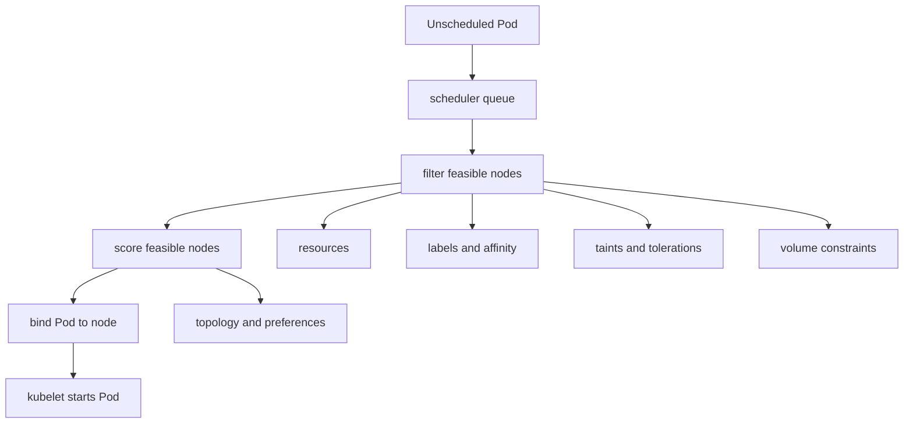

# 3.6 Scheduling Fundamentals and Placement Controls

## Purpose of This Section

This section explains how Kubernetes decides where Pods run.

Workload controllers create Pods, but the kube-scheduler assigns unscheduled Pods to nodes. That assignment is one of the most important production
control points in a cluster. A Pod can be perfectly defined and still never start if it cannot be scheduled.

Scheduling is not only about free CPU and memory. It also includes labels, selectors, affinity, anti-affinity, topology spread constraints, taints,
tolerations, storage constraints, node conditions, priority, preemption, resource requests, extended resources, admission policy, and sometimes
custom scheduler behavior.

For SRE work, scheduling explains many incidents that appear as `Pending` Pods, uneven zone distribution, noisy neighbors, failed rollouts, missing
DaemonSet coverage, unavailable batch capacity, or workloads landing on the wrong nodes.

By the end of this section, you should be able to:

- Explain the scheduling path from unscheduled Pod to bound node.
- Distinguish hard placement requirements from soft preferences.
- Use node selectors, node affinity, Pod affinity, Pod anti-affinity, topology spread constraints, taints, and tolerations safely.
- Understand how resource requests affect scheduling decisions.
- Diagnose why a Pod is stuck in `Pending`.
- Review production placement rules before they become availability risks.

## Scheduler Mental Model

The scheduler watches for Pods that do not have `.spec.nodeName` set. For each unscheduled Pod, it finds feasible nodes, scores them, and binds the
Pod to one selected node.



The scheduler does not start containers. The scheduler chooses a node. After binding, the kubelet on that node works with the container runtime,
volumes, networking, and image pulling to start the Pod.

This distinction matters during incidents:

| Symptom | Likely owner |
| --- | --- |
| Pod has no assigned node | Scheduler or scheduling constraints. |
| Pod has assigned node but containers are not created | Kubelet, runtime, image pull, volume mount, CNI, or node condition. |
| Pod runs but never becomes Ready | Application, probes, dependency, or startup behavior. |

## Scheduling Is Constraint Solving

Scheduling is best understood as constraint solving.

A Pod can express requirements and preferences. Nodes expose labels, capacity, allocatable resources, taints, conditions, topology, and device
availability.

The scheduler tries to find a node that satisfies all hard requirements. If no node satisfies them, the Pod stays `Pending`.

Hard constraints include examples such as:

- resource requests that must fit node allocatable capacity
- required node affinity
- node selector requirements
- taints without matching tolerations
- required Pod affinity or anti-affinity
- required topology spread behavior with `whenUnsatisfiable: DoNotSchedule`
- storage topology constraints
- unsupported operating system or architecture

Soft preferences influence scoring but do not block scheduling by themselves.

Production rule: every hard scheduling rule is a possible outage condition during failures, autoscaling lag, zone loss, or node pool changes.

## Resource Requests and Scheduling

The scheduler uses resource requests, not actual runtime usage, to decide whether a Pod fits on a node.

Example:

```yaml
apiVersion: v1
kind: Pod
metadata:
  name: worker
spec:
  containers:
    - name: worker
      image: registry.example.com/worker:1.0.0
      resources:
        requests:
          cpu: 500m
          memory: 512Mi
        limits:
          memory: 1Gi
```

If a Pod requests `500m` CPU and `512Mi` memory, the scheduler requires a node with at least that much unallocated requested capacity. It does not
wait to see whether the container actually uses less.

SRE implications:

- Overstated requests reduce scheduling density and can trigger unnecessary scale-up.
- Understated requests increase noisy-neighbor risk and node pressure risk.
- Missing requests make scheduling behavior less predictable and reduce autoscaling signal quality.
- Memory limits are enforced differently from CPU requests and can cause container termination under memory pressure.

When a Pod is `Pending`, always check requested resources and node allocatable capacity:

```bash
kubectl describe pod <pod-name> -n <namespace>
kubectl top nodes
kubectl describe node <node-name>
```

## Node Labels and Node Selectors

Node labels describe node properties. A Pod can use `nodeSelector` to require specific labels.

Example:

```yaml
apiVersion: v1
kind: Pod
metadata:
  name: gpu-worker
spec:
  nodeSelector:
    accelerator: nvidia
  containers:
    - name: worker
      image: registry.example.com/gpu-worker:2.1.0
```

This Pod can only schedule onto nodes labeled `accelerator=nvidia`.

`nodeSelector` is simple and strict. It is useful for clear, binary placement requirements, but it can be too blunt for complex production needs.
If the label is missing from all nodes, the Pod remains `Pending`.

Operational guidance:

- Keep production node label taxonomies documented.
- Avoid ad hoc labels that only one team understands.
- Do not rely on labels that autoscaling node pools fail to apply consistently.
- Use protected label prefixes where node isolation or compliance depends on labels.

## Node Affinity

Node affinity is more expressive than `nodeSelector`.

It supports hard requirements and soft preferences.

Example hard node affinity:

```yaml
apiVersion: v1
kind: Pod
metadata:
  name: zone-bound-api
spec:
  affinity:
    nodeAffinity:
      requiredDuringSchedulingIgnoredDuringExecution:
        nodeSelectorTerms:
          - matchExpressions:
              - key: topology.kubernetes.io/zone
                operator: In
                values:
                  - us-east-1a
                  - us-east-1b
  containers:
    - name: api
      image: registry.example.com/api:1.0.0
```

Example soft node affinity:

```yaml
apiVersion: v1
kind: Pod
metadata:
  name: preferred-spot-worker
spec:
  affinity:
    nodeAffinity:
      preferredDuringSchedulingIgnoredDuringExecution:
        - weight: 80
          preference:
            matchExpressions:
              - key: capacity-type
                operator: In
                values:
                  - spot
  containers:
    - name: worker
      image: registry.example.com/worker:1.0.0
```

The suffix `IgnoredDuringExecution` is important. It means the rule affects scheduling, but if node labels later change, Kubernetes does not evict
an already running Pod solely because the label no longer matches.

SRE review question: if the preferred node pool is unavailable, should the workload run elsewhere, or should it stay unscheduled? The answer
determines whether the rule should be required or preferred.

## Pod Affinity and Anti-Affinity

Pod affinity and anti-affinity place Pods relative to other Pods.

Use cases:

| Rule type | Example use |
| --- | --- |
| Pod affinity | Place cache side workload near application Pods in the same zone. |
| Pod anti-affinity | Avoid placing replicas of the same service on the same node. |

Example required anti-affinity by hostname:

```yaml
apiVersion: apps/v1
kind: Deployment
metadata:
  name: checkout-api
spec:
  replicas: 3
  selector:
    matchLabels:
      app: checkout-api
  template:
    metadata:
      labels:
        app: checkout-api
    spec:
      affinity:
        podAntiAffinity:
          requiredDuringSchedulingIgnoredDuringExecution:
            - labelSelector:
                matchLabels:
                  app: checkout-api
              topologyKey: kubernetes.io/hostname
      containers:
        - name: api
          image: registry.example.com/checkout-api:1.4.0
```

This prevents two `checkout-api` Pods from being scheduled on the same node.

Hard anti-affinity can protect availability, but it can also block rollouts when there are not enough eligible nodes. For many services,
topology spread constraints are easier to reason about than required Pod anti-affinity.

## Topology Spread Constraints

Topology spread constraints help distribute Pods across failure domains such as nodes, zones, or custom topology labels.

Example spreading across zones:

```yaml
apiVersion: apps/v1
kind: Deployment
metadata:
  name: payments-api
spec:
  replicas: 6
  selector:
    matchLabels:
      app: payments-api
  template:
    metadata:
      labels:
        app: payments-api
    spec:
      topologySpreadConstraints:
        - maxSkew: 1
          topologyKey: topology.kubernetes.io/zone
          whenUnsatisfiable: DoNotSchedule
          labelSelector:
            matchLabels:
              app: payments-api
      containers:
        - name: api
          image: registry.example.com/payments-api:2.0.0
```

Key fields:

| Field | Meaning |
| --- | --- |
| `maxSkew` | Maximum permitted difference in matching Pod counts across topology domains. |
| `topologyKey` | Node label key that defines the topology domain. |
| `whenUnsatisfiable` | Whether to block scheduling or schedule anyway with best effort. |
| `labelSelector` | Which Pods count toward the spread calculation. |

`DoNotSchedule` is a hard rule. `ScheduleAnyway` is a soft rule.

Production guidance:

- Use zone spread for user-facing services with multi-zone SLOs.
- Use hostname spread when node-level failure matters.
- Ensure node pools actually have the topology labels you reference.
- Avoid impossible spread rules for small replica counts or uneven node pools.
- Pair spread rules with realistic surge settings during rollouts.

## Taints and Tolerations

Taints repel Pods from nodes. Tolerations allow Pods to tolerate matching taints.

This is different from attraction. A toleration does not force a Pod onto a tainted node. It only allows the Pod to be scheduled there if other
constraints allow it.

Example node taint:

```bash
kubectl taint nodes node-a dedicated=platform:NoSchedule
```

Example Pod toleration:

```yaml
apiVersion: v1
kind: Pod
metadata:
  name: platform-agent
spec:
  tolerations:
    - key: dedicated
      operator: Equal
      value: platform
      effect: NoSchedule
  containers:
    - name: agent
      image: registry.example.com/platform-agent:1.0.0
```

Common taint effects:

| Effect | Meaning |
| --- | --- |
| `NoSchedule` | Pods without a matching toleration are not scheduled onto the node. |
| `PreferNoSchedule` | Kubernetes tries to avoid scheduling unmatched Pods onto the node. |
| `NoExecute` | Unmatched Pods may be evicted from the node, and new unmatched Pods are not scheduled. |

Production guidance:

- Use taints to reserve specialized or sensitive nodes.
- Combine tolerations with node selectors or affinity when Pods should target a specific node pool.
- Avoid broad `operator: Exists` tolerations unless the workload is truly node-infrastructure grade.
- Review DaemonSet tolerations carefully because they can expand blast radius across many nodes.

## Priority and Preemption

PriorityClass lets Kubernetes compare Pods when scheduling pressure exists. Higher-priority Pods can be scheduled before lower-priority Pods.

Preemption is the mechanism where the scheduler may evict lower-priority Pods to make room for a higher-priority pending Pod.

Example PriorityClass:

```yaml
apiVersion: scheduling.k8s.io/v1
kind: PriorityClass
metadata:
  name: production-critical
value: 100000
preemptionPolicy: PreemptLowerPriority
globalDefault: false
description: "Critical production workloads that may preempt lower-priority Pods."
```

Example Pod usage:

```yaml
apiVersion: v1
kind: Pod
metadata:
  name: critical-worker
spec:
  priorityClassName: production-critical
  containers:
    - name: worker
      image: registry.example.com/critical-worker:1.0.0
```

Preemption is not instant capacity magic. It can remove lower-priority Pods, but the higher-priority Pod still needs a node that satisfies all other
constraints. Pod disruption budgets are best-effort respected during preemption, but preemption can still disrupt lower-priority workloads.

SRE guidance:

- Use high priority sparingly.
- Define ownership and approval for new PriorityClasses.
- Do not use priority to hide capacity planning problems.
- Alert on preemption events and pending high-priority Pods.

## Scheduling Gates

Scheduling gates allow a Pod to be created but held back from scheduling until an external controller or workflow removes the gates.

This can be useful when an operator or controller must complete preparation before a Pod is eligible for scheduling.

Example:

```yaml
apiVersion: v1
kind: Pod
metadata:
  name: gated-workload
spec:
  schedulingGates:
    - name: example.com/approval-required
  containers:
    - name: app
      image: registry.example.com/app:1.0.0
```

A Pod with scheduling gates remains unschedulable until all gates are removed. This is not the same as a scheduler failure. It is intentional
scheduling readiness control.

Operationally, if a Pod is pending because of scheduling gates, find the controller or process responsible for removing the gate.

## Direct Node Assignment

A Pod can bypass normal scheduler placement by setting `.spec.nodeName`.

This is usually not appropriate for normal application workloads.

Example:

```yaml
apiVersion: v1
kind: Pod
metadata:
  name: debug-on-node-a
spec:
  nodeName: node-a
  containers:
    - name: debug
      image: busybox:1.36
      command:
        - sleep
        - "3600"
```

Direct node assignment can be useful for tightly controlled debugging or static-style workflows, but it skips scheduler decision-making. The kubelet
can still reject or fail the Pod later due to node conditions, admission, runtime, resources, or volume issues.

For production workloads, prefer declarative placement rules over hardcoding node names.

## SRE Runbook: Investigate a Pending Pod

Use this runbook when a Pod is stuck in `Pending`.

1. Describe the Pod.

   ```bash
   kubectl describe pod <pod-name> -n <namespace>
   ```

   Focus on Events. Scheduler messages often explain the constraint that blocked placement.

2. Check whether the Pod has a node assigned.

   ```bash
   kubectl get pod <pod-name> -n <namespace> -o wide
   kubectl get pod <pod-name> -n <namespace> -o jsonpath='{.spec.nodeName}'
   ```

3. Inspect resource requests.

   ```bash
   kubectl get pod <pod-name> -n <namespace> -o yaml
   kubectl describe nodes
   ```

4. Check placement rules.

   Review:

   - `nodeSelector`
   - node affinity
   - Pod affinity and anti-affinity
   - topology spread constraints
   - tolerations
   - priority class
   - runtime class
   - scheduler name
   - scheduling gates

5. Check node eligibility.

   ```bash
   kubectl get nodes --show-labels
   kubectl describe node <node-name>
   ```

   Look for taints, node conditions, allocatable resources, labels, pressure conditions, and zone labels.

6. Check storage constraints.

   ```bash
   kubectl get pvc -n <namespace>
   kubectl describe pvc <claim-name> -n <namespace>
   kubectl get storageclass
   ```

7. Classify the failure.

   | Scheduler symptom | Likely investigation path |
   | --- | --- |
   | Insufficient CPU or memory | Requests too high, no capacity, autoscaler lag, fragmented capacity. |
   | Node affinity mismatch | Required labels missing or node pool changed. |
   | Taint mismatch | Missing toleration or wrong node pool. |
   | Pod anti-affinity conflict | Not enough eligible topology domains. |
   | Topology spread violation | Spread rule impossible with current nodes and replicas. |
   | PVC binding issue | StorageClass, zone, volume binding mode, capacity, access mode. |
   | Scheduling gates present | External controller or approval flow has not released scheduling. |

8. Recover safely.

   - Fix the manifest if the placement rule is wrong.
   - Add capacity if the rule is correct but capacity is missing.
   - Adjust rollout settings if surge Pods cannot fit.
   - Avoid deleting evidence before saving events and Pod YAML.
   - Confirm whether cluster autoscaler is expected to add capacity.

## Production Design Review Checklist

Before approving production placement rules, review these items:

| Area | Review question |
| --- | --- |
| Resource requests | Are CPU, memory, ephemeral storage, and extended resource requests realistic? |
| Node labels | Are referenced labels documented and applied by all relevant node pools? |
| Hard vs soft rules | Is every hard rule truly required for correctness or compliance? |
| Zone spread | Will replicas survive zone or node failure as intended? |
| Rollout capacity | Can surge Pods fit with current placement constraints? |
| Tolerations | Are tolerations scoped, or do they allow placement on too many nodes? |
| Affinity | Could affinity or anti-affinity block scheduling during failure or scale-up? |
| Storage | Do volume topology and node placement rules agree? |
| Priority | Is the priority class approved and monitored? |
| Preemption | What lower-priority workloads may be disrupted? |
| Autoscaling | Will node autoscaling understand and satisfy the constraints? |
| Observability | Are Pending Pods and scheduling failures alerted quickly? |

## Common Anti-Patterns

Avoid these patterns in production:

| Anti-pattern | Why it causes risk |
| --- | --- |
| Hard node affinity for convenience | Workloads stay Pending when the preferred node pool is unavailable. |
| Broad tolerations without node selectors | Pods may land on dedicated or sensitive nodes unintentionally. |
| Required anti-affinity with too few nodes | Rollouts and scale-ups can block. |
| No topology spread for critical services | Replicas can concentrate in one failure domain. |
| Overstated requests | Cluster appears full while actual utilization is low. |
| Understated requests | Workloads schedule but later suffer contention or eviction risk. |
| Using priority as a capacity substitute | Lower-priority workloads are disrupted instead of solving capacity planning. |
| Hardcoding `nodeName` | The scheduler is bypassed and node replacement breaks placement. |
| Ignoring storage topology | Pods and volumes can be constrained to incompatible zones or nodes. |

## Lab: Diagnose a Pending Pod from Node Selector Mismatch

Create a namespace:

```bash
kubectl create namespace scheduling-lab
```

Create a Pod with an impossible node selector:

```yaml
apiVersion: v1
kind: Pod
metadata:
  name: impossible-selector
  namespace: scheduling-lab
spec:
  nodeSelector:
    example.com/node-pool: does-not-exist
  containers:
    - name: pause
      image: registry.k8s.io/pause:3.10
```

Apply and inspect:

```bash
kubectl apply -f impossible-selector.yaml
kubectl get pod impossible-selector -n scheduling-lab -o wide
kubectl describe pod impossible-selector -n scheduling-lab
kubectl get nodes --show-labels
```

Fix by changing the selector to a real node label or deleting the selector entirely in a lab environment.

Clean up:

```bash
kubectl delete namespace scheduling-lab
```

Lab review questions:

1. Which event explained why the Pod could not schedule?
2. Did the Pod have `.spec.nodeName` set?
3. Which labels existed on the actual nodes?
4. Why is this a useful test before deploying strict placement rules?

## Lab: Spread Pods Across Zones or Nodes

This lab works best in a cluster with multiple nodes or zones.

Create a Deployment with topology spread constraints:

```yaml
apiVersion: apps/v1
kind: Deployment
metadata:
  name: spread-demo
  namespace: scheduling-lab
spec:
  replicas: 4
  selector:
    matchLabels:
      app: spread-demo
  template:
    metadata:
      labels:
        app: spread-demo
    spec:
      topologySpreadConstraints:
        - maxSkew: 1
          topologyKey: kubernetes.io/hostname
          whenUnsatisfiable: ScheduleAnyway
          labelSelector:
            matchLabels:
              app: spread-demo
      containers:
        - name: pause
          image: registry.k8s.io/pause:3.10
```

Apply and inspect placement:

```bash
kubectl create namespace scheduling-lab
kubectl apply -f spread-demo.yaml
kubectl get pods -n scheduling-lab -l app=spread-demo -o wide
```

Clean up:

```bash
kubectl delete namespace scheduling-lab
```

Lab review questions:

1. Were Pods distributed across nodes?
2. Why does `ScheduleAnyway` differ from `DoNotSchedule`?
3. What would happen if the cluster had only one eligible node?
4. Which topology key would you use for zone-level distribution?

## Review Questions

1. What does the scheduler do, and what does it not do?
2. Why does Kubernetes use resource requests for scheduling decisions?
3. What is the difference between `nodeSelector` and node affinity?
4. When should a placement rule be required instead of preferred?
5. Why can hard Pod anti-affinity block rollouts?
6. What problem do topology spread constraints solve?
7. Why does a toleration not guarantee placement onto a tainted node?
8. What is the risk of using high PriorityClasses casually?
9. How do scheduling gates differ from scheduler failure?
10. What information should you collect before changing placement rules during an incident?

## Key Takeaways

- The scheduler assigns unscheduled Pods to nodes; kubelet starts containers after assignment.
- Scheduling is constraint solving across resources, labels, taints, topology, storage, and policy.
- Hard placement rules protect correctness but can become availability risks.
- Resource requests directly shape scheduling and autoscaling behavior.
- Taints repel Pods; tolerations only allow Pods to tolerate taints.
- Topology spread constraints help protect against node and zone concentration.
- Pending Pods should be investigated through events, node labels, taints, resources, storage, and scheduling gates.

## Official References

- [Kubernetes Scheduler](https://kubernetes.io/docs/concepts/scheduling-eviction/kube-scheduler/)
- [Assigning Pods to Nodes](https://kubernetes.io/docs/concepts/scheduling-eviction/assign-pod-node/)
- [Taints and Tolerations](https://kubernetes.io/docs/concepts/scheduling-eviction/taint-and-toleration/)
- [Pod Priority and Preemption](https://kubernetes.io/docs/concepts/scheduling-eviction/pod-priority-preemption/)
- [Pod Topology Spread Constraints](https://kubernetes.io/docs/concepts/scheduling-eviction/topology-spread-constraints/)
- [Resource Management for Pods and Containers](https://kubernetes.io/docs/concepts/configuration/manage-resources-containers/)
- [Pod Scheduling Readiness](https://kubernetes.io/docs/concepts/scheduling-eviction/pod-scheduling-readiness/)
