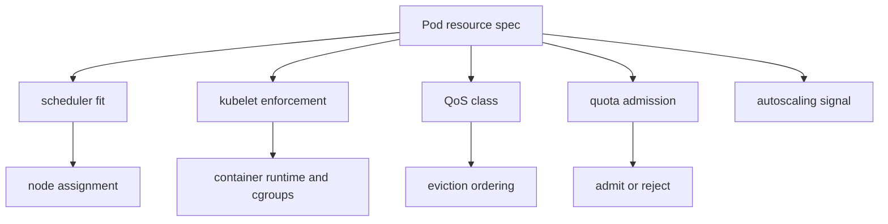

# 3.7 Resource Management, QoS, and Eviction

## Purpose of This Section

This section explains how Kubernetes manages compute resources for Pods and what happens when nodes run out of capacity.

Scheduling decides where a Pod can run. Resource management determines whether that Pod has a realistic amount of CPU, memory, and local ephemeral
storage once it gets there. Eviction determines which Pods may be removed when a node is under pressure.

For production SRE work, resource configuration is one of the highest-leverage parts of Kubernetes reliability. Bad requests can block scheduling or
overpack nodes. Bad limits can cause throttling, out-of-memory kills, or false confidence. Missing resource policy can let one team consume shared
cluster capacity. Poor eviction readiness can turn node pressure into a widespread incident.

By the end of this section, you should be able to:

- Explain requests, limits, and how they affect scheduling and runtime behavior.
- Distinguish CPU, memory, and local ephemeral storage resource behavior.
- Explain Kubernetes QoS classes and why they matter during node pressure.
- Diagnose OOMKilled containers, CPU throttling, and evicted Pods.
- Understand LimitRanges and ResourceQuotas as namespace guardrails.
- Review production workloads for resource reliability risk.

## Resource Management Mental Model

A Pod's resource configuration affects multiple control loops.



Resource settings are not just documentation. They are part of Kubernetes behavior.

| Setting | Used by | Production consequence |
| --- | --- | --- |
| Requests | Scheduler, kubelet, autoscalers, quota | Determines scheduling fit and reserved capacity. |
| Limits | Kubelet and runtime enforcement | Controls maximum allowed usage for selected resources. |
| QoS class | Kubelet eviction behavior | Influences which Pods are evicted first under pressure. |
| Quota | API admission | Prevents namespace-level overconsumption. |
| LimitRange | API admission | Applies defaults and min/max rules inside a namespace. |

## Requests and Limits

A resource request is the amount of resource Kubernetes reserves for a container.

A resource limit is the maximum amount of resource a container is allowed to use for resources that support enforcement.

Example:

```yaml
apiVersion: apps/v1
kind: Deployment
metadata:
  name: checkout-api
spec:
  replicas: 3
  selector:
    matchLabels:
      app: checkout-api
  template:
    metadata:
      labels:
        app: checkout-api
    spec:
      containers:
        - name: api
          image: registry.example.com/checkout-api:2.4.0
          resources:
            requests:
              cpu: 500m
              memory: 512Mi
              ephemeral-storage: 1Gi
            limits:
              cpu: "1"
              memory: 1Gi
              ephemeral-storage: 2Gi
```

The scheduler uses requests to decide whether a Pod can fit on a node. It does not use current application usage as the scheduling reservation.

The kubelet and container runtime use limits to enforce runtime boundaries. CPU and memory behave differently, which matters a lot in production.

## CPU Behavior

CPU is compressible.

When a container reaches its CPU limit, it can be throttled. It is not normally killed just because it asks for more CPU than its limit. CPU
throttling can still be serious because it increases latency, slows background work, delays readiness, and can make a healthy application appear
broken.

Example symptoms:

- API latency increases during traffic spikes.
- Pods stay Running but request duration rises.
- Readiness probes time out under CPU contention.
- Batch Jobs take longer than expected.
- Horizontal Pod Autoscaler reacts late because requests are unrealistic.

Useful checks:

```bash
kubectl top pod <pod-name> -n <namespace> --containers
kubectl describe pod <pod-name> -n <namespace>
kubectl top node
```

Cluster metrics should also track CPU throttling from container runtime or cgroup metrics. CPU usage alone is not enough to diagnose CPU limit
problems.

Production guidance:

- Set CPU requests based on measured baseline and required headroom.
- Be cautious with CPU limits on latency-sensitive services.
- Watch CPU throttling, not only CPU utilization.
- Avoid using very small CPU requests for workloads that need fast startup or low latency.

## Memory Behavior

Memory is not compressible in the same way CPU is.

When a container exceeds its memory limit, the kernel may terminate it with an out-of-memory kill. Kubernetes then reports container termination
state and reason such as `OOMKilled`.

Example symptoms:

- Container restarts with reason `OOMKilled`.
- Pod enters `CrashLoopBackOff` after repeated memory kills.
- Batch Jobs fail during peak input size.
- Stateful workloads restart during compaction, cache warmup, or recovery.

Useful checks:

```bash
kubectl describe pod <pod-name> -n <namespace>
kubectl get pod <pod-name> -n <namespace> -o yaml
kubectl logs <pod-name> -n <namespace> --previous
kubectl top pod <pod-name> -n <namespace> --containers
```

Production guidance:

- Set memory requests based on normal working set plus realistic headroom.
- Set memory limits carefully for workloads with caches, JVM heaps, compaction, or large request payloads.
- Align application memory configuration with container limits.
- Treat repeated `OOMKilled` events as reliability incidents, not routine restarts.

## Local Ephemeral Storage

Local ephemeral storage includes node-local writable storage consumed by containers and Pods, such as writable layers, logs, and `emptyDir` volumes
that use node storage.

Example:

```yaml
apiVersion: v1
kind: Pod
metadata:
  name: scratch-worker
spec:
  containers:
    - name: worker
      image: registry.example.com/scratch-worker:1.0.0
      resources:
        requests:
          ephemeral-storage: 2Gi
        limits:
          ephemeral-storage: 5Gi
      volumeMounts:
        - name: scratch
          mountPath: /scratch
  volumes:
    - name: scratch
      emptyDir: {}
```

Production risks:

- Application logs can fill node storage.
- Large temporary files can trigger node pressure.
- `emptyDir` usage can exceed expectations.
- Image layers and container writable layers can contribute to pressure.

SRE guidance:

- Set ephemeral storage requests and limits for workloads that write local data.
- Export logs instead of retaining unbounded local files.
- Use persistent volumes for data that must survive Pod replacement.
- Monitor node disk pressure and Pod ephemeral storage usage.

## Pod-Level Resources

Kubernetes supports Pod-level resource requests and limits in addition to container-level resources in newer Kubernetes versions. Pod-level budgets
can be useful when containers in the same Pod share a resource budget.

Production guidance:

- Prefer explicit container-level resources when each container has clear requirements.
- Consider Pod-level budgets when sidecars and application containers share workload behavior.
- Validate support in the Kubernetes version and provider environment before standardizing on Pod-level resource fields.
- Keep operational dashboards able to distinguish Pod-level and container-level usage.

## QoS Classes

Kubernetes assigns each Pod a Quality of Service class based on its resource requests and limits.

The QoS classes are:

| QoS class | Requirement summary | Production meaning |
| --- | --- | --- |
| `Guaranteed` | Every container has memory and CPU request equal to limit for both CPU and memory. | Strongest protection during node pressure. |
| `Burstable` | At least one container has a CPU or memory request or limit, but the Pod does not meet Guaranteed rules. | Common class for most production workloads. |
| `BestEffort` | No containers have CPU or memory requests or limits. | Lowest protection during node pressure. |

QoS is not an SLO by itself. It affects eviction decisions when nodes are under pressure.

Example Guaranteed Pod:

```yaml
apiVersion: v1
kind: Pod
metadata:
  name: guaranteed-example
spec:
  containers:
    - name: app
      image: registry.example.com/app:1.0.0
      resources:
        requests:
          cpu: "1"
          memory: 1Gi
        limits:
          cpu: "1"
          memory: 1Gi
```

Example BestEffort Pod:

```yaml
apiVersion: v1
kind: Pod
metadata:
  name: besteffort-example
spec:
  containers:
    - name: app
      image: registry.example.com/app:1.0.0
```

Useful check:

```bash
kubectl get pod <pod-name> -n <namespace> -o jsonpath='{.status.qosClass}'
```

## Node Pressure and Eviction

The kubelet monitors node resources and can evict Pods when a node is under pressure.

Common pressure signals include memory pressure, disk pressure, and PID pressure. When pressure crosses configured thresholds, kubelet tries to
reclaim resources and may evict Pods.

Eviction is not the same as a normal Deployment rollout. It is node-level protection.

Example symptoms:

- Pod status shows `Failed` with reason `Evicted`.
- Node shows `MemoryPressure`, `DiskPressure`, or `PIDPressure`.
- Events mention eviction thresholds or resource pressure.
- Multiple Pods disappear from the same node.

Useful checks:

```bash
kubectl get pod <pod-name> -n <namespace> -o wide
kubectl describe pod <pod-name> -n <namespace>
kubectl describe node <node-name>
kubectl get events -A --sort-by=.lastTimestamp
```

During eviction, QoS class and usage relative to requests matter. BestEffort Pods are the easiest to evict. Burstable Pods can be evicted when they
exceed requests and the node is under pressure. Guaranteed Pods have the strongest protection but can still be affected by severe node problems,
node drains, or other disruption mechanisms.

## API-Initiated Eviction and Disruptions

Kubernetes also supports API-initiated eviction. This is commonly used by tools such as `kubectl drain` and cluster automation to remove Pods from a
node while respecting workload disruption controls where possible.

This is different from kubelet node-pressure eviction.

| Eviction type | Initiator | Common scenario |
| --- | --- | --- |
| Node-pressure eviction | kubelet | Node is low on memory, disk, or PID capacity. |
| API-initiated eviction | API client or controller | Node drain, maintenance, upgrade, automation. |

PodDisruptionBudgets apply to voluntary disruptions such as API-initiated eviction. They do not prevent all forms of disruption, and they do not
turn an unsafe workload into a safe one.

SRE guidance:

- Use PodDisruptionBudgets for highly available workloads.
- Do not rely on PDBs to protect against node-pressure eviction.
- Test drain behavior before node upgrades.
- Monitor both disruption budget status and actual workload availability.

## LimitRanges

A LimitRange applies resource defaults, minimums, maximums, or request-to-limit ratios inside a namespace.

Example:

```yaml
apiVersion: v1
kind: LimitRange
metadata:
  name: default-container-resources
  namespace: team-a
spec:
  limits:
    - type: Container
      defaultRequest:
        cpu: 100m
        memory: 128Mi
      default:
        cpu: 500m
        memory: 512Mi
      min:
        cpu: 50m
        memory: 64Mi
      max:
        cpu: "2"
        memory: 4Gi
```

LimitRanges are guardrails. They are not capacity planning.

Production guidance:

- Use defaults to prevent BestEffort workloads where inappropriate.
- Use maximums to prevent accidental giant Pods.
- Use minimums carefully; they can block small utility workloads.
- Make defaults visible to application teams so mutation is not surprising.

## ResourceQuotas

A ResourceQuota limits aggregate resource usage in a namespace.

Example:

```yaml
apiVersion: v1
kind: ResourceQuota
metadata:
  name: team-a-quota
  namespace: team-a
spec:
  hard:
    requests.cpu: "20"
    requests.memory: 80Gi
    limits.cpu: "40"
    limits.memory: 160Gi
    pods: "100"
```

When a quota is exceeded, the API server rejects new or updated objects that would violate the quota.

Production guidance:

- Use quotas to prevent one namespace from consuming shared capacity unexpectedly.
- Pair quotas with monitoring so teams see quota pressure before releases fail.
- Align quotas with actual node pool capacity and business priority.
- Avoid quotas that force teams to game requests instead of sizing honestly.

Useful checks:

```bash
kubectl get resourcequota -n <namespace>
kubectl describe resourcequota <name> -n <namespace>
kubectl get limitrange -n <namespace>
kubectl describe limitrange <name> -n <namespace>
```

## SRE Runbook: Investigate OOMKilled Containers

Use this runbook when a container restarts with reason `OOMKilled`.

1. Confirm termination reason.

   ```bash
   kubectl describe pod <pod-name> -n <namespace>
   kubectl get pod <pod-name> -n <namespace> -o yaml
   ```

2. Collect previous logs.

   ```bash
   kubectl logs <pod-name> -n <namespace> --previous
   ```

3. Compare memory configuration and usage.

   ```bash
   kubectl top pod <pod-name> -n <namespace> --containers
   ```

4. Check application memory settings.

   Review heap sizes, cache limits, worker concurrency, request body limits, batch size, and file buffering.

5. Choose recovery.

   - Reduce input size or concurrency if the spike is workload-driven.
   - Increase memory limit only if node capacity and application behavior justify it.
   - Align application heap or cache settings with the container limit.
   - Preserve evidence before rolling out a new resource profile.

## SRE Runbook: Investigate Evicted Pods

Use this runbook when Pods are evicted.

1. Identify affected Pods and nodes.

   ```bash
   kubectl get pods -A --field-selector=status.phase=Failed
   kubectl describe pod <pod-name> -n <namespace>
   kubectl get pod <pod-name> -n <namespace> -o wide
   ```

2. Inspect node pressure.

   ```bash
   kubectl describe node <node-name>
   kubectl get events -A --sort-by=.lastTimestamp
   ```

3. Check QoS and requests.

   ```bash
   kubectl get pod <pod-name> -n <namespace> -o jsonpath='{.status.qosClass}'
   kubectl get pod <pod-name> -n <namespace> -o yaml
   ```

4. Classify the pressure.

   | Pressure signal | Investigation path |
   | --- | --- |
   | MemoryPressure | Memory requests, limits, node allocatable, application spikes, OOM events. |
   | DiskPressure | Logs, container writable layers, image garbage collection, `emptyDir`, ephemeral storage. |
   | PIDPressure | Process leaks, fork-heavy workloads, node PID limits. |

5. Recover safely.

   - Restart or reschedule affected workloads if controllers do not replace them automatically.
   - Reduce pressure source before scaling replicas back up.
   - Fix resource requests and limits before the next rollout.
   - Consider node cordon and drain if the node remains unhealthy.

## Production Design Review Checklist

Before approving production resource settings, review these items:

| Area | Review question |
| --- | --- |
| CPU request | Is the request based on observed baseline and target latency? |
| CPU limit | Could the limit cause harmful throttling under normal spikes? |
| Memory request | Does the request cover steady working set and realistic headroom? |
| Memory limit | Is the application configured to stay within the limit? |
| Ephemeral storage | Can logs, temp files, or `emptyDir` usage exceed local storage expectations? |
| QoS class | Is the resulting QoS class appropriate for workload criticality? |
| Namespace defaults | Will LimitRange defaults mutate missing values as intended? |
| Namespace quota | Will ResourceQuota reject releases during normal growth? |
| Autoscaling | Are requests compatible with HPA or cluster autoscaler behavior? |
| Observability | Are OOM kills, throttling, evictions, and quota failures visible? |
| Runbooks | Does the team know how to recover from OOM, throttling, and eviction incidents? |

## Common Anti-Patterns

Avoid these patterns in production:

| Anti-pattern | Why it causes risk |
| --- | --- |
| No requests on production Pods | Scheduling, QoS, and autoscaling behavior become unreliable. |
| Memory limits lower than application heap | Containers repeatedly OOMKill under normal operation. |
| CPU limits on latency-critical apps without throttling monitoring | Services can degrade while appearing healthy. |
| BestEffort production workloads | They are first in line for eviction during node pressure. |
| Quotas without visibility | Deployments fail at admission time with little warning. |
| LimitRange defaults nobody knows about | Teams debug mutated resource values after admission. |
| Unbounded local logs or temp files | Nodes hit disk pressure and evict unrelated Pods. |
| Increasing limits during incidents without checking node capacity | The fix can move the incident from one Pod to the node. |

## Lab: Compare QoS Classes

Create a namespace:

```bash
kubectl create namespace resource-lab
```

Create three Pods:

```yaml
apiVersion: v1
kind: Pod
metadata:
  name: besteffort
  namespace: resource-lab
spec:
  containers:
    - name: pause
      image: registry.k8s.io/pause:3.10
---
apiVersion: v1
kind: Pod
metadata:
  name: burstable
  namespace: resource-lab
spec:
  containers:
    - name: pause
      image: registry.k8s.io/pause:3.10
      resources:
        requests:
          memory: 64Mi
---
apiVersion: v1
kind: Pod
metadata:
  name: guaranteed
  namespace: resource-lab
spec:
  containers:
    - name: pause
      image: registry.k8s.io/pause:3.10
      resources:
        requests:
          cpu: 100m
          memory: 64Mi
        limits:
          cpu: 100m
          memory: 64Mi
```

Apply and inspect:

```bash
kubectl apply -f qos-pods.yaml
kubectl get pods -n resource-lab
kubectl get pod besteffort -n resource-lab -o jsonpath='{.status.qosClass}'
kubectl get pod burstable -n resource-lab -o jsonpath='{.status.qosClass}'
kubectl get pod guaranteed -n resource-lab -o jsonpath='{.status.qosClass}'
```

Clean up:

```bash
kubectl delete namespace resource-lab
```

Lab review questions:

1. Which Pod became BestEffort?
2. Which Pod became Burstable?
3. Which Pod became Guaranteed?
4. Why does QoS class matter during node pressure?

## Lab: Observe ResourceQuota Rejection

Create a namespace and quota:

```bash
kubectl create namespace quota-lab
```

```yaml
apiVersion: v1
kind: ResourceQuota
metadata:
  name: small-quota
  namespace: quota-lab
spec:
  hard:
    requests.cpu: "1"
    requests.memory: 1Gi
    pods: "2"
```

Apply the quota:

```bash
kubectl apply -f quota.yaml
kubectl describe resourcequota small-quota -n quota-lab
```

Create Pods until the quota blocks admission.

Clean up:

```bash
kubectl delete namespace quota-lab
```

Lab review questions:

1. Which quota field blocked the new object?
2. Was the failure a scheduler failure or API admission failure?
3. How would you alert application teams before they hit quota?

## Review Questions

1. Why does the scheduler use requests instead of current usage?
2. What is the practical difference between CPU and memory limits?
3. Why can CPU throttling cause latency incidents without killing containers?
4. What does `OOMKilled` usually indicate?
5. What local storage usage can contribute to DiskPressure?
6. What are the three Kubernetes QoS classes?
7. Why are BestEffort Pods risky in production?
8. How do LimitRanges and ResourceQuotas differ?
9. Why do PDBs not protect against every kind of disruption?
10. What evidence should you collect before changing resources during an incident?

## Key Takeaways

- Requests shape scheduling, reserved capacity, quota usage, and autoscaling signals.
- Limits enforce runtime boundaries, but CPU and memory behave differently.
- QoS classes influence eviction behavior during node pressure.
- Node-pressure eviction is a node protection mechanism, not a normal rollout.
- LimitRanges and ResourceQuotas are namespace guardrails, not substitutes for capacity planning.
- Production resource settings should be based on measurement, workload behavior, and failure-mode review.

## Official References

- [Resource Management for Pods and Containers](https://kubernetes.io/docs/concepts/configuration/manage-resources-containers/)
- [Pod Quality of Service Classes](https://kubernetes.io/docs/concepts/workloads/pods/pod-qos/)
- [Node-pressure Eviction](https://kubernetes.io/docs/concepts/scheduling-eviction/node-pressure-eviction/)
- [API-initiated Eviction](https://kubernetes.io/docs/concepts/scheduling-eviction/api-eviction/)
- [Limit Ranges](https://kubernetes.io/docs/concepts/policy/limit-range/)
- [Resource Quotas](https://kubernetes.io/docs/concepts/policy/resource-quotas/)
- [Disruptions](https://kubernetes.io/docs/concepts/workloads/pods/disruptions/)
