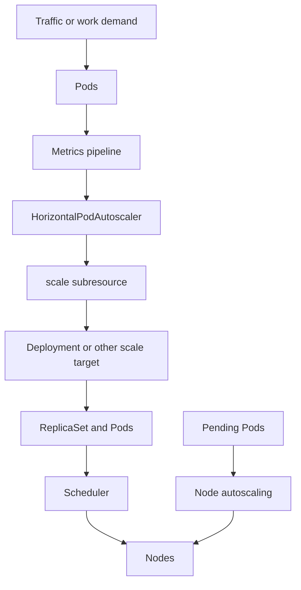

# 3.8 Workload Autoscaling and Capacity Signals

## Purpose of This Section

This section explains how Kubernetes workload autoscaling works and how SREs should reason about scaling signals in production.

Autoscaling is not magic capacity. It is a control loop. It observes metrics, compares them to desired targets, changes replica counts or resource
recommendations, and depends on the cluster having enough capacity to run the result.

Horizontal Pod Autoscaling scales the number of Pods. Vertical Pod Autoscaling adjusts or recommends resource requests. Node autoscaling adds or
removes nodes so Pods have somewhere to run. These systems interact with Deployments, ReplicaSets, resource requests, metrics pipelines, rollout
strategy, Pod readiness, scheduling constraints, and application startup behavior.

For production SRE work, autoscaling failures often show up as slow scale-out, replicas stuck Pending, overload during traffic spikes, oscillation,
missing metrics, bad resource requests, or node autoscaler lag. A service can have an HPA and still fail to scale if the metric is wrong, Pods start
too slowly, requests are unrealistic, or cluster capacity cannot be added quickly enough.

By the end of this section, you should be able to:

- Explain the role of Horizontal Pod Autoscaling.
- Understand why metrics quality and resource requests are critical for autoscaling.
- Diagnose HPA failures and slow scale-out.
- Explain how workload autoscaling interacts with node autoscaling.
- Review autoscaling configuration for production reliability.
- Build runbooks for traffic spikes, missing metrics, and capacity lag.

## Autoscaling Mental Model

Autoscaling is a set of feedback loops.



The key point: HPA changes desired replicas. It does not create node capacity, fix slow startup, repair broken metrics, or make an application safe
under concurrent load.

## Horizontal Pod Autoscaler

Horizontal Pod Autoscaler, usually called HPA, automatically updates workload scale based on observed metrics.

HPA commonly targets scalable workload objects such as Deployments, StatefulSets, or other resources with the scale subresource.

A basic CPU-based HPA looks like this:

```yaml
apiVersion: autoscaling/v2
kind: HorizontalPodAutoscaler
metadata:
  name: checkout-api
  namespace: production
spec:
  scaleTargetRef:
    apiVersion: apps/v1
    kind: Deployment
    name: checkout-api
  minReplicas: 3
  maxReplicas: 20
  metrics:
    - type: Resource
      resource:
        name: cpu
        target:
          type: Utilization
          averageUtilization: 60
```

This HPA tries to keep average CPU utilization near 60 percent across matching Pods, while keeping replicas between 3 and 20.

Production details:

- `minReplicas` controls baseline availability and warm capacity.
- `maxReplicas` caps blast radius and capacity consumption.
- Metrics determine whether scaling decisions are correct.
- CPU utilization targets depend on CPU requests.
- HPA scaling still depends on Pods becoming Ready and schedulable.

## Why CPU Requests Matter for HPA

CPU utilization in a resource-based HPA is calculated relative to CPU requests.

If CPU requests are too low, a workload may appear highly utilized and scale aggressively. If CPU requests are too high, the same workload may appear
underutilized and fail to scale soon enough.

Example:

| Actual CPU use | CPU request | Observed utilization |
| --- | --- | --- |
| 250m | 250m | 100 percent |
| 250m | 500m | 50 percent |
| 250m | 1000m | 25 percent |

The application did the same amount of work in every row. Only the request changed.

SRE guidance:

- Treat requests as part of autoscaling configuration.
- Tune HPA targets and resource requests together.
- Avoid copying HPA thresholds between services without understanding requests.
- Watch actual CPU, requested CPU, throttling, latency, and replica count together.

## Metrics Pipeline

HPA depends on metrics being available.

For CPU and memory resource metrics, Kubernetes commonly uses the resource metrics API, often backed by Metrics Server. For custom or external
metrics, the cluster must provide appropriate metrics APIs through adapters or provider integrations.

Useful checks:

```bash
kubectl get hpa -n <namespace>
kubectl describe hpa <name> -n <namespace>
kubectl top pods -n <namespace>
kubectl top nodes
kubectl get --raw /apis/metrics.k8s.io/v1beta1/nodes
```

Common metrics failures:

| Symptom | Likely investigation path |
| --- | --- |
| HPA shows unknown metrics | Metrics API unavailable, adapter failure, permissions, or scrape delay. |
| `kubectl top` fails | Metrics Server or resource metrics API problem. |
| HPA scales unexpectedly | Request values, metric target, wrong selector, stale metrics, or traffic pattern mismatch. |
| HPA does not scale during overload | Missing metrics, max replicas reached, low observed utilization, or bottleneck is not measured. |

Metrics are not only for dashboards. They are control-plane inputs. Bad metrics create bad scaling decisions.

## HPA Algorithm Intuition

HPA compares the current metric value with the target metric value and calculates the desired replica count.

A simplified mental model is:

```text
desiredReplicas = currentReplicas * currentMetric / desiredMetric
```

Example:

| Current replicas | Current CPU utilization | Target CPU utilization | Desired direction |
| --- | --- | --- | --- |
| 4 | 90 percent | 60 percent | Scale up. |
| 4 | 30 percent | 60 percent | Scale down. |
| 4 | 60 percent | 60 percent | Stay close to current size. |

The real controller includes safeguards, missing metric handling, readiness considerations, tolerance, stabilization, and behavior settings. The
simple formula is still useful for understanding why replica count changes.

## Scaling Behavior and Stabilization

Autoscaling should not flap up and down on every short spike. Kubernetes supports HPA behavior settings to control scale-up and scale-down behavior.

Example:

```yaml
apiVersion: autoscaling/v2
kind: HorizontalPodAutoscaler
metadata:
  name: checkout-api
  namespace: production
spec:
  scaleTargetRef:
    apiVersion: apps/v1
    kind: Deployment
    name: checkout-api
  minReplicas: 3
  maxReplicas: 30
  metrics:
    - type: Resource
      resource:
        name: cpu
        target:
          type: Utilization
          averageUtilization: 60
  behavior:
    scaleUp:
      stabilizationWindowSeconds: 0
      policies:
        - type: Percent
          value: 100
          periodSeconds: 60
        - type: Pods
          value: 4
          periodSeconds: 60
      selectPolicy: Max
    scaleDown:
      stabilizationWindowSeconds: 300
      policies:
        - type: Percent
          value: 50
          periodSeconds: 60
      selectPolicy: Max
```

Production guidance:

- Scale up fast enough to protect users.
- Scale down slowly enough to avoid oscillation.
- Keep `minReplicas` high enough for baseline resilience and warm capacity.
- Set `maxReplicas` high enough for peak demand but low enough to protect shared systems.
- Test scaling behavior before relying on it during an incident.

## Readiness and Startup Effects

New replicas only help after they are scheduled, started, initialized, and Ready.

Scale-out time includes:

1. Metrics collection delay.
2. HPA reconciliation delay.
3. Workload controller creating Pods.
4. Scheduling latency.
5. Node autoscaler latency if capacity is missing.
6. Image pull time.
7. Init container time.
8. Application startup time.
9. Readiness probe success.
10. Load balancer or Service endpoint propagation.

If application startup takes five minutes, an HPA cannot save a service from a spike that overloads it in thirty seconds unless there is enough warm
capacity already running.

SRE guidance:

- Measure time from traffic spike to Ready replica.
- Keep enough `minReplicas` for expected sudden load.
- Optimize image pull, init containers, startup, and readiness behavior.
- Use load shedding, queues, or rate limits for demand spikes faster than scale-out time.

## Autoscaling and Rollouts

HPA and Deployments both change replica behavior.

During a rollout, the Deployment manages old and new ReplicaSets. HPA manages the desired replica count of the scale target. This interaction is
normal, but it affects capacity planning.

Production risks:

- HPA scales up during a rollout, increasing surge capacity needs.
- Rollout surge Pods cannot schedule because node capacity is missing.
- New Pods are not Ready, so HPA continues reacting to high utilization on remaining Ready Pods.
- `maxReplicas` blocks scale-out during a release-related traffic spike.
- CPU requests changed in the new version, changing observed utilization behavior.

Review rollouts and HPA together:

```bash
kubectl get hpa -n production
kubectl describe hpa checkout-api -n production
kubectl get deployment checkout-api -n production
kubectl get rs -n production -l app=checkout-api
kubectl get pods -n production -l app=checkout-api -o wide
```

## Custom and External Metrics

HPA can scale on resource metrics, Pod metrics, object metrics, and external metrics when the cluster provides the required metrics APIs.

Examples of production scaling signals:

| Signal | When useful | Risk |
| --- | --- | --- |
| CPU utilization | CPU-bound APIs or workers. | Bad requests distort signal. |
| Memory | Some memory-correlated workloads. | Memory often does not fall quickly after load drops. |
| Queue depth | Async workers. | Needs ownership of backlog semantics and processing rate. |
| Requests per second | Request-driven APIs. | Does not directly measure saturation or latency. |
| Latency | User-facing services. | Can lag, be noisy, or scale after users are already affected. |
| External system metric | Cloud queues, brokers, or SaaS APIs. | Adapter and provider reliability become critical. |

SRE guidance:

- Scale on a signal that represents demand or saturation.
- Avoid scaling on metrics that are delayed, sparse, or easy to misinterpret.
- Use alerts for metric adapter failures.
- Document who owns each scaling metric.

## Vertical Pod Autoscaling

Vertical Pod Autoscaling, or VPA, adjusts or recommends Pod resource requests. It is useful when the question is not "how many replicas?" but
"how much CPU or memory should each Pod request?"

VPA can be used in recommendation-only mode or update modes depending on the installation and policy. Some VPA updates can require Pod recreation,
so production teams must understand disruption behavior before enabling automatic updates.

Use cases:

| Use case | VPA fit |
| --- | --- |
| Long-running services with unclear requests | Useful for recommendations. |
| Batch workloads with stable profiles | Useful for sizing insight. |
| Stateful systems with careful restart requirements | Use cautiously. |
| Workloads already controlled tightly by HPA on CPU | Review carefully to avoid conflicting control goals. |

Production guidance:

- Start with recommendations before automatic changes.
- Review VPA changes with rollout and disruption controls.
- Avoid uncontrolled request changes for critical workloads.
- Use VPA insights to improve requests even when automatic updates are not enabled.

## Node Autoscaling Interaction

Workload autoscaling creates demand for Pods. Node autoscaling creates supply of nodes.

If HPA increases replicas and the scheduler cannot place the new Pods, those Pods remain Pending until capacity appears or constraints change.

Common reasons node autoscaling may not help:

- The cluster has reached node group maximum size.
- Required labels, taints, or zones cannot be satisfied by available node groups.
- Pod requests are larger than any node type can fit.
- Quotas or cloud provider limits block new nodes.
- Image pulls or node initialization are slow.
- Pod disruption or rollout pressure creates capacity faster than nodes can join.

SRE guidance:

- Treat Pending Pods during HPA scale-out as a capacity incident.
- Align HPA `maxReplicas` with node pool maximums and quota.
- Ensure node pools can satisfy workload scheduling constraints.
- Test scale from baseline to peak, including node provisioning time.

## SRE Runbook: HPA Does Not Scale Up

Use this runbook when traffic is high but replicas do not increase.

1. Inspect HPA status.

   ```bash
   kubectl get hpa <name> -n <namespace>
   kubectl describe hpa <name> -n <namespace>
   ```

2. Check metrics availability.

   ```bash
   kubectl top pods -n <namespace>
   kubectl top nodes
   ```

3. Check target and limits.

   Review:

   - `minReplicas`
   - `maxReplicas`
   - metric type and target
   - current metric values
   - HPA conditions and events

4. Check workload resources.

   ```bash
   kubectl get deployment <name> -n <namespace> -o yaml
   kubectl get pods -n <namespace> -l app=<name> -o yaml
   ```

   Confirm CPU requests if using CPU utilization.

5. Check whether replicas are already capped.

   ```bash
   kubectl get hpa <name> -n <namespace>
   kubectl get deployment <name> -n <namespace>
   ```

6. Choose recovery.

   - Raise `maxReplicas` only if cluster and downstream capacity can support it.
   - Fix metrics if HPA cannot read them.
   - Add manual replicas temporarily if HPA is blocked and the service is at risk.
   - Add capacity or relax placement constraints if new Pods are Pending.

## SRE Runbook: HPA Scales Up but Service Still Fails

Use this runbook when HPA increases replicas but user impact continues.

1. Check whether new Pods are Ready.

   ```bash
   kubectl get pods -n <namespace> -l app=<name> -o wide
   kubectl describe pod <pod-name> -n <namespace>
   ```

2. Check scheduling and capacity.

   ```bash
   kubectl get pods -n <namespace> --field-selector=status.phase=Pending
   kubectl describe pod <pending-pod> -n <namespace>
   kubectl get nodes
   ```

3. Check startup path.

   Review image pulls, init containers, startup probes, readiness probes, and dependency connections.

4. Check load balancer and Service endpoints.

   ```bash
   kubectl get endpointslice -n <namespace>
   kubectl get service <service-name> -n <namespace>
   ```

5. Check the bottleneck.

   | Symptom | Likely bottleneck |
   | --- | --- |
   | New Pods Pending | Cluster capacity or placement constraints. |
   | New Pods Running but not Ready | Startup, readiness, dependency, or configuration. |
   | New Pods Ready but errors continue | Downstream dependency, database, queue, or application bottleneck. |
   | CPU low but latency high | I/O, lock contention, database, network, or external service. |
   | Replicas at max | HPA cap, cluster capacity, or service architecture limit. |

6. Recover safely.

   - Increase replicas manually only if it helps the actual bottleneck.
   - Protect downstream systems with rate limits or load shedding.
   - Roll back if the current version introduced scaling regression.
   - Capture metrics before changing requests or HPA targets.

## Production Design Review Checklist

Before approving autoscaling for production, review these items:

| Area | Review question |
| --- | --- |
| Scaling signal | Does the metric represent demand or saturation? |
| Metrics pipeline | What happens if metrics are missing or delayed? |
| Requests | Are CPU requests compatible with utilization-based HPA? |
| Min replicas | Is there enough warm capacity for sudden load? |
| Max replicas | Can the cluster and dependencies tolerate max scale? |
| Scale-up speed | Does scale-out complete before users are harmed? |
| Scale-down speed | Is scale-down stable enough to avoid oscillation? |
| Rollout interaction | Can rollouts and HPA scale-out happen at the same time? |
| Node capacity | Can node autoscaling satisfy max replica placement? |
| Startup time | Are image pull, init, startup, and readiness delays measured? |
| Downstream systems | Will databases, queues, and APIs survive replica growth? |
| Alerts | Are HPA failures, maxed replicas, missing metrics, and Pending Pods alerted? |

## Common Anti-Patterns

Avoid these patterns in production:

| Anti-pattern | Why it causes risk |
| --- | --- |
| HPA on CPU with unrealistic CPU requests | Scaling decisions become misleading. |
| `minReplicas: 1` for critical services | Cold scale-out may be too slow for real traffic spikes. |
| `maxReplicas` lower than real peak need | HPA reaches the cap while users still see errors. |
| Scaling only on CPU for I/O-bound systems | The workload may be saturated while CPU looks healthy. |
| No alert on missing metrics | HPA quietly stops making useful decisions. |
| No node capacity plan | HPA creates Pending Pods instead of serving capacity. |
| Fast scale-down with spiky traffic | Workload oscillates and repeatedly sheds useful capacity. |
| Autoscaling without downstream protection | More replicas overload databases, queues, or external APIs. |

## Lab: Inspect an HPA Configuration

This lab assumes Metrics Server or another resource metrics pipeline is available.

Create a namespace:

```bash
kubectl create namespace autoscaling-lab
```

Create a Deployment with CPU requests:

```yaml
apiVersion: apps/v1
kind: Deployment
metadata:
  name: php-apache
  namespace: autoscaling-lab
spec:
  replicas: 1
  selector:
    matchLabels:
      app: php-apache
  template:
    metadata:
      labels:
        app: php-apache
    spec:
      containers:
        - name: php-apache
          image: registry.k8s.io/hpa-example
          ports:
            - containerPort: 80
          resources:
            requests:
              cpu: 200m
```

Create an HPA:

```yaml
apiVersion: autoscaling/v2
kind: HorizontalPodAutoscaler
metadata:
  name: php-apache
  namespace: autoscaling-lab
spec:
  scaleTargetRef:
    apiVersion: apps/v1
    kind: Deployment
    name: php-apache
  minReplicas: 1
  maxReplicas: 10
  metrics:
    - type: Resource
      resource:
        name: cpu
        target:
          type: Utilization
          averageUtilization: 50
```

Apply and inspect:

```bash
kubectl apply -f deployment.yaml
kubectl apply -f hpa.yaml
kubectl get hpa -n autoscaling-lab
kubectl describe hpa php-apache -n autoscaling-lab
kubectl top pods -n autoscaling-lab
```

Clean up:

```bash
kubectl delete namespace autoscaling-lab
```

Lab review questions:

1. Which Deployment does the HPA target?
2. What metric does the HPA use?
3. Why does the container CPU request matter?
4. What would happen if Metrics Server were unavailable?

## Review Questions

1. What does HPA change, and what does it not change?
2. Why are CPU requests part of HPA behavior?
3. What is the risk of scaling on a metric that does not represent the real bottleneck?
4. Why can HPA scale up while the service continues to fail?
5. How does node autoscaling interact with HPA?
6. Why should `minReplicas` be treated as reliability configuration?
7. What alerts should exist for autoscaling failures?
8. When might VPA recommendations be useful even without automatic updates?
9. Why can autoscaling worsen downstream dependency incidents?
10. What should be tested before trusting autoscaling during peak traffic?

## Key Takeaways

- Autoscaling is a control loop based on metrics, targets, and capacity.
- HPA changes desired replica count; it does not create node capacity or fix application bottlenecks.
- CPU-based HPA depends heavily on accurate CPU requests.
- Scale-out time includes metrics delay, scheduling, node capacity, startup, readiness, and endpoint propagation.
- Autoscaling must be reviewed with rollout behavior, node autoscaling, and downstream system limits.
- Missing metrics, maxed replicas, Pending Pods, and slow readiness are all autoscaling incidents.

## Official References

- [Horizontal Pod Autoscaling](https://kubernetes.io/docs/concepts/workloads/autoscaling/horizontal-pod-autoscale/)
- [HorizontalPodAutoscaler Walkthrough](https://kubernetes.io/docs/tasks/run-application/horizontal-pod-autoscale-walkthrough/)
- [Autoscaling Workloads](https://kubernetes.io/docs/concepts/workloads/autoscaling/)
- [Node Autoscaling](https://kubernetes.io/docs/concepts/cluster-administration/node-autoscaling/)
- [Resource Management for Pods and Containers](https://kubernetes.io/docs/concepts/configuration/manage-resources-containers/)
