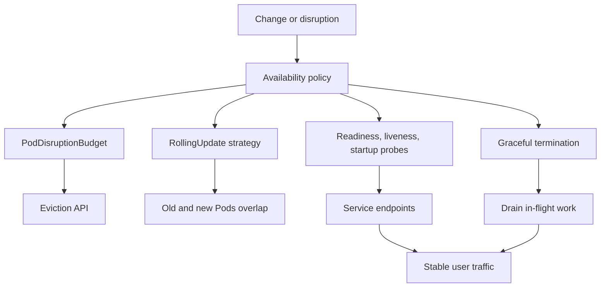

# 3.9 Workload Availability, Disruption, and Graceful Termination

## Purpose of This Section

This section explains how Kubernetes workloads stay available while Pods are restarted, evicted, drained, rescheduled, rolled out, or terminated.

Production availability is not only a replica count. A workload can have many replicas and still drop traffic if readiness is wrong, termination is abrupt, PodDisruptionBudgets are missing, rollout settings are unsafe, or node maintenance removes too much capacity at once.

Kubernetes provides building blocks for availability, but application teams and platform teams must configure them deliberately:

- Readiness probes decide whether a Pod should receive Service traffic.
- Liveness probes decide whether a container should be restarted.
- Startup probes protect slow-starting applications from premature liveness failures.
- Rolling updates control how old and new Pods overlap during a release.
- PodDisruptionBudgets constrain voluntary disruption.
- The Eviction API gives drain and maintenance workflows a policy-aware way to terminate Pods.
- Termination grace periods and lifecycle hooks give applications time to stop accepting work and finish in-flight requests.
- Node shutdown and node-pressure eviction create additional failure modes that SREs must understand.

By the end of this section, you should be able to:

- Explain the difference between voluntary and involuntary disruptions.
- Design a PodDisruptionBudget for stateless and stateful workloads.
- Diagnose why `kubectl drain` is blocked or why it removed too much capacity.
- Configure readiness, liveness, startup probes, and graceful termination safely.
- Review rollout settings for availability during deploys.
- Build runbooks for stuck drains, bad probes, and termination-related traffic loss.

## Availability Is a Control Surface

Kubernetes does not make an application highly available by itself. It exposes control surfaces that help an application remain available when change happens.



Availability fails when these controls disagree. For example, a Deployment may allow `maxUnavailable: 1`, but the workload may also have only two replicas, slow startup, weak readiness, and no capacity buffer. During a node drain and a rollout, that can become a user-visible outage.

## Disruption Types

Kubernetes documentation separates disruptions into two broad classes.

| Disruption type | Meaning | Examples | Can a PDB constrain it? |
| --- | --- | --- | --- |
| Voluntary disruption | A planned or operator-initiated action removes Pods | Node drain, cluster upgrade, node scale-down, policy-aware eviction | Usually, if the action uses the Eviction API |
| Involuntary disruption | A failure or resource condition removes Pods | Hardware failure, node failure, network partition, node-pressure eviction | No |

The distinction matters because PodDisruptionBudgets are not a general availability shield. They are primarily a contract for voluntary disruption workflows.

A PodDisruptionBudget cannot guarantee protection against every event. Direct Pod deletion, Deployment deletion, node failure, node-pressure eviction, and some preemption scenarios can still interrupt Pods even when a PDB exists.

## PodDisruptionBudget Fundamentals

A PodDisruptionBudget, or PDB, defines how many Pods in a selected application may be unavailable during voluntary disruptions.

A PDB uses a label selector to identify Pods and one of two availability policies:

- `minAvailable`: the minimum number or percentage of selected Pods that should remain available.
- `maxUnavailable`: the maximum number or percentage of selected Pods that may be unavailable.

Use one of these fields, not both.

### Stateless Service Example

```yaml
apiVersion: policy/v1
kind: PodDisruptionBudget
metadata:
  name: checkout-api
  namespace: production
spec:
  minAvailable: 80%
  selector:
    matchLabels:
      app.kubernetes.io/name: checkout-api
```

This PDB tells policy-aware eviction workflows to keep at least 80 percent of selected Pods available.

For a stateless service with many replicas, a percentage can work well. For a small replica count, absolute numbers are often easier to reason about.

### Small Replica Count Example

```yaml
apiVersion: policy/v1
kind: PodDisruptionBudget
metadata:
  name: payment-api
  namespace: production
spec:
  maxUnavailable: 1
  selector:
    matchLabels:
      app.kubernetes.io/name: payment-api
```

For a three-replica service, `maxUnavailable: 1` allows one Pod to be disrupted at a time. This is simple, but it assumes the remaining two replicas can handle production load.

### Quorum-Based Workload Example

```yaml
apiVersion: policy/v1
kind: PodDisruptionBudget
metadata:
  name: consensus-store
  namespace: data
spec:
  minAvailable: 2
  selector:
    matchLabels:
      app.kubernetes.io/name: consensus-store
```

For quorum-based systems, the PDB must preserve quorum. A three-member replicated system commonly needs at least two healthy members to preserve majority.

A PDB cannot make a quorum system safe if the application, storage layer, or failure domain placement is wrong. It only influences policy-aware voluntary disruptions.

## What Counts as Healthy for a PDB

For PDB status, Kubernetes considers Pods healthy when they are Ready. That means readiness probes directly influence disruption decisions.

If readiness is too optimistic, Kubernetes may count a Pod as healthy before it can safely serve traffic. Drains and rollouts may then remove other Pods too early.

If readiness is too strict or flaky, Kubernetes may think too few Pods are healthy. Drains can stall, node maintenance can fail, and automated upgrades can take much longer than expected.

Inspect PDB status during maintenance:

```bash
kubectl get pdb -n production
kubectl describe pdb checkout-api -n production
kubectl get pdb checkout-api -n production -o yaml
```

Important status fields include:

| Field | Meaning | SRE interpretation |
| --- | --- | --- |
| `currentHealthy` | Number of selected Pods currently considered healthy | Based on readiness |
| `desiredHealthy` | Number required by the budget | Evictions should not reduce below this |
| `disruptionsAllowed` | Number of Pods that may be evicted now | Zero means drain may block |
| `expectedPods` | Number of Pods matched by the selector | Check selector correctness |

## Eviction API and Node Drain

The Eviction API is a policy-aware way to ask Kubernetes to terminate a Pod. It behaves like a controlled delete request that checks disruption policy before allowing the Pod to terminate.

`kubectl drain` uses eviction for Pods when possible. This is why PDBs matter during node maintenance.

```text
operator runs kubectl drain
        |
        v
kubectl calls Eviction API
        |
        v
API server checks PDBs
        |
        +--> allowed: Pod receives deletion timestamp
        |
        +--> rejected: drain waits or fails
```

If a workload has no matching PDB, eviction is generally allowed. If a workload has a PDB and `disruptionsAllowed` is zero, the eviction can be rejected and the drain can wait.

This behavior is intentional. A blocked drain is often Kubernetes protecting availability.

## When PDBs Do Not Protect You

PDBs are useful, but they have boundaries.

| Scenario | PDB behavior | Production note |
| --- | --- | --- |
| `kubectl drain` using eviction | Respected | Normal maintenance path |
| Cluster autoscaler scale-down using eviction | Usually respected | Provider behavior still matters |
| Direct Pod delete | Not a complete safety mechanism | Avoid manual deletes in production workflows |
| Deployment template update | Rollout strategy matters more | PDB and rollout settings can interact |
| Node failure | Not preventable by PDB | Use replicas, spread, and recovery runbooks |
| Node-pressure eviction | PDB not respected by kubelet eviction | Fix requests, limits, and node capacity |
| Preemption | Best effort only | Higher priority workloads may still preempt |

SRE rule: treat PDBs as one layer, not the availability model.

## Readiness Probes

Readiness probes decide whether a Pod should receive traffic through Services.

A readiness probe should answer this question:

> Can this Pod successfully serve normal production requests now?

A readiness endpoint should usually verify local application readiness, important local dependencies, and enough warm state to avoid immediately failing user traffic.

Example:

```yaml
readinessProbe:
  httpGet:
    path: /readyz
    port: 8080
  periodSeconds: 5
  timeoutSeconds: 2
  failureThreshold: 3
  successThreshold: 1
```

When a Pod is not Ready, it should be removed from the Service endpoint set. This is the primary mechanism that keeps not-ready Pods out of normal traffic.

### Readiness Probe Anti-Patterns

| Anti-pattern | Why it is risky | Better approach |
| --- | --- | --- |
| Readiness always returns 200 | Sends traffic before the app is ready | Check real readiness conditions |
| Readiness checks every downstream service deeply | Causes cascading unready states | Check critical dependencies carefully and cheaply |
| Readiness depends on slow external calls | Creates false negatives under dependency latency | Use cached health state or local signals |
| Readiness flips during normal short pauses | Causes endpoint churn | Tune thresholds and design stable signals |
| Readiness equals liveness | Restarts and traffic removal become coupled | Separate restart health from traffic health |

## Liveness Probes

Liveness probes decide when Kubernetes should restart a container.

A liveness probe should answer this question:

> Is this container stuck in a state that only restart can fix?

Liveness is not a traffic-control mechanism. It is a restart mechanism. A bad liveness probe can create an outage by restarting every replica during overload.

Example:

```yaml
livenessProbe:
  httpGet:
    path: /livez
    port: 8080
  periodSeconds: 10
  timeoutSeconds: 2
  failureThreshold: 6
```

Use liveness probes carefully for applications that can recover internally. If the process exits on unrecoverable failure, the kubelet can restart it according to the Pod restart policy.

## Startup Probes

Startup probes protect slow-starting applications from premature liveness failures.

If a startup probe is configured, Kubernetes waits for it to succeed before running liveness and readiness checks normally.

Example:

```yaml
startupProbe:
  httpGet:
    path: /startupz
    port: 8080
  periodSeconds: 5
  failureThreshold: 24
```

This example gives the application up to about two minutes to start before Kubernetes treats startup as failed.

Startup probes are especially useful for:

- JVM services with warmup time.
- Applications loading large configuration or model files.
- Services that build local caches at startup.
- Stateful applications that need recovery before serving traffic.

## Graceful Pod Termination

When a Pod is deleted, Kubernetes does not immediately remove the container process in the normal graceful path. The API server marks the Pod with a deletion timestamp and grace period. The kubelet observes the change and begins local termination.

A simplified termination sequence looks like this:

```text
1. Pod receives deletion timestamp.
2. EndpointSlice state changes so normal traffic should stop using the Pod.
3. kubelet runs preStop hook if configured.
4. kubelet sends SIGTERM to containers.
5. application stops accepting new work and drains in-flight work.
6. grace period expires or process exits.
7. kubelet sends SIGKILL if the process is still running.
```

The exact behavior depends on configuration, container runtime behavior, application signal handling, Service and load balancer propagation, and external traffic routing.

### Termination Grace Period

`terminationGracePeriodSeconds` controls how long Kubernetes should wait before forcefully killing the container after termination begins.

```yaml
spec:
  terminationGracePeriodSeconds: 60
```

Choose this value based on real shutdown behavior:

- Maximum expected in-flight request duration.
- Consumer group rebalance behavior.
- Queue visibility timeout or message acknowledgement behavior.
- Database transaction behavior.
- Load balancer deregistration delay.
- Stateful flush or checkpoint time.

A grace period that is too short causes dropped work. A grace period that is too long slows drains, rollouts, and node maintenance.

### preStop Hook

A `preStop` hook can run before the container receives SIGTERM. Use it sparingly and keep it deterministic.

```yaml
lifecycle:
  preStop:
    httpGet:
      path: /drain
      port: 8080
```

A common production pattern is:

1. Mark the process as draining.
2. Fail readiness or stop being selected for new traffic.
3. Wait briefly for endpoint and load balancer propagation.
4. Allow in-flight requests to finish.
5. Exit on SIGTERM before the grace period expires.

Avoid using `sleep` as the only shutdown design. A fixed delay may hide a real lifecycle bug and may be wrong under different traffic or load balancer conditions.

## Rolling Update Availability

Deployments use rolling updates by default. Two fields control rollout overlap:

| Field | Meaning | Availability impact |
| --- | --- | --- |
| `maxUnavailable` | Maximum Pods unavailable during the update | Lower values protect capacity |
| `maxSurge` | Extra Pods allowed above desired replicas | Higher values add rollout buffer if capacity exists |

Example:

```yaml
apiVersion: apps/v1
kind: Deployment
metadata:
  name: checkout-api
spec:
  replicas: 6
  strategy:
    type: RollingUpdate
    rollingUpdate:
      maxUnavailable: 1
      maxSurge: 2
```

This allows Kubernetes to create up to two extra Pods during rollout and have at most one unavailable Pod from the desired count.

Rollout availability depends on more than these numbers:

- New Pods must schedule.
- Images must pull.
- Startup and readiness must succeed.
- The old Pods must remain available long enough.
- The cluster must have capacity for surge Pods.
- PDBs must not conflict with rollout and maintenance operations.

## Real Production Scenario: Node Drain During a Deployment

Consider a checkout service with six replicas, an HPA, a PDB, and a Deployment rolling update.

During a peak traffic window:

1. A new image rollout starts.
2. Two new Pods are created because `maxSurge: 2`.
3. One node begins draining for maintenance.
4. The PDB allows only one disruption.
5. New Pods take 90 seconds to become Ready.
6. HPA sees high CPU but new replicas are Pending due to capacity.

Symptoms:

- `kubectl rollout status` is slow.
- `kubectl drain` appears stuck.
- HPA increases desired replicas, but Pods remain Pending.
- Error rate increases because available ready capacity is too low.

SRE response:

```bash
kubectl get deploy checkout-api -n production
kubectl rollout status deploy/checkout-api -n production
kubectl get pods -n production -l app.kubernetes.io/name=checkout-api -o wide
kubectl get pdb checkout-api -n production -o yaml
kubectl describe hpa checkout-api -n production
kubectl get events -n production --sort-by=.lastTimestamp
```

Likely fixes:

- Pause the rollout if the new version is consuming capacity without becoming Ready.
- Delay node maintenance during peak traffic.
- Add temporary capacity or relax overly strict scheduling constraints.
- Verify readiness startup timing.
- Review whether PDB, surge, and HPA limits are compatible.

## SRE Runbook: Drain Is Blocked by a PDB

Use this runbook when node maintenance or cluster upgrade automation is stuck because evictions are rejected.

### 1. Identify the blocked Pod

```bash
kubectl drain <node-name> --ignore-daemonsets
kubectl get pods --all-namespaces -o wide --field-selector spec.nodeName=<node-name>
```

### 2. Inspect matching PDBs

```bash
kubectl get pdb --all-namespaces
kubectl describe pdb <pdb-name> -n <namespace>
```

Check:

- `disruptionsAllowed`
- `currentHealthy`
- `desiredHealthy`
- selector labels
- unhealthy Pods counted against the budget

### 3. Inspect workload health

```bash
kubectl get deploy,statefulset -n <namespace>
kubectl get pods -n <namespace> -l <selector> -o wide
kubectl describe pod <pod-name> -n <namespace>
```

### 4. Decide the safe action

| Finding | Action |
| --- | --- |
| Too few replicas for the budget | Scale up before maintenance |
| Pods not Ready due to real application issue | Fix application health first |
| PDB selector matches wrong Pods | Correct the PDB selector |
| Maintenance is urgent | Follow incident process before overriding safety |
| Stateful workload cannot tolerate disruption | Stop and use workload-specific procedure |

Do not bypass a PDB just to make automation green. A PDB blocking drain is often a useful safety signal.

## SRE Runbook: Traffic Drops During Pod Termination

Use this runbook when users see errors during deploys, drains, or scale-down events.

### 1. Confirm timing

```bash
kubectl get events -n <namespace> --sort-by=.lastTimestamp
kubectl describe pod <pod-name> -n <namespace>
```

Look for Pod deletion, readiness failures, preStop hooks, container exits, and endpoint changes.

### 2. Check readiness and termination settings

```bash
kubectl get deploy <name> -n <namespace> -o yaml
```

Inspect:

- `readinessProbe`
- `livenessProbe`
- `startupProbe`
- `terminationGracePeriodSeconds`
- `lifecycle.preStop`
- application signal handling

### 3. Check external routing

Kubernetes may remove the Pod from Service endpoints, but external load balancers, ingress controllers, sidecars, service meshes, and client connection pools may have their own propagation and drain behavior.

Check:

- Ingress controller drain timeout.
- Load balancer deregistration delay.
- Service mesh proxy drain duration.
- Client retry and connection reuse behavior.
- Application keep-alive handling.

### 4. Fix the lifecycle contract

A reliable shutdown contract usually has these properties:

- Readiness fails when the process begins draining.
- New requests stop quickly.
- In-flight requests can finish.
- Background workers stop pulling new work.
- The process exits before the grace period expires.
- Metrics expose shutdown and forced termination counts.

## Production Design Review Checklist

Use this checklist before approving a production workload.

| Area | Review question |
| --- | --- |
| Replicas | Does the workload have enough replicas for expected disruption? |
| PDB | Is there a PDB for critical replicated workloads? |
| PDB selector | Does the selector match only the intended Pods? |
| Readiness | Does readiness represent ability to serve real traffic? |
| Liveness | Does liveness detect unrecoverable stuck states without restarting during overload? |
| Startup | Are slow starts protected by startup probes? |
| Termination | Is the grace period based on real shutdown behavior? |
| preStop | Is preStop deterministic and short enough to fit the grace period? |
| Rollout | Are `maxUnavailable` and `maxSurge` safe for the replica count? |
| Capacity | Is there enough headroom for surge, drain, and autoscaling? |
| Spread | Are replicas spread across nodes or zones when required? |
| Runbooks | Are drain, rollout, and termination failures documented? |

## Common Anti-Patterns

| Anti-pattern | Consequence |
| --- | --- |
| One replica with a PDB | PDB cannot create high availability |
| `minAvailable: 100%` for every service | Drains and upgrades can stall indefinitely |
| No readiness probe | Traffic reaches Pods before they are ready |
| Aggressive liveness probe | Cascading restarts during load or dependency slowness |
| Very short termination grace period | In-flight work is killed |
| Very long termination grace period without reason | Maintenance and rollouts become slow |
| Surge configured without cluster headroom | New Pods remain Pending during rollout |
| PDB selector too broad | Unrelated Pods block each other's maintenance |
| Manual force deletion during maintenance | Bypasses safety and can cause outage |

## Lab: Validate Workload Disruption Behavior

This lab is designed for a non-production cluster.

### Objective

Observe how a PDB, readiness, and drain behavior interact.

### Steps

1. Deploy a three-replica test workload.

```bash
kubectl create deployment pdb-demo --image=nginx --replicas=3
kubectl expose deployment pdb-demo --port=80
kubectl rollout status deployment/pdb-demo
```

2. Add a PDB.

```yaml
apiVersion: policy/v1
kind: PodDisruptionBudget
metadata:
  name: pdb-demo
spec:
  maxUnavailable: 1
  selector:
    matchLabels:
      app: pdb-demo
```

Apply it:

```bash
kubectl apply -f pdb-demo-pdb.yaml
kubectl get pdb pdb-demo
```

3. Pick a node with one of the Pods and simulate a drain.

```bash
kubectl get pods -l app=pdb-demo -o wide
kubectl drain <node-name> --ignore-daemonsets --dry-run=server
```

4. Observe PDB status.

```bash
kubectl get pdb pdb-demo -o yaml
```

5. Scale down and observe how disruption allowance changes.

```bash
kubectl scale deployment pdb-demo --replicas=1
kubectl get pdb pdb-demo
```

### Expected Learning

- `disruptionsAllowed` changes with healthy replica count.
- A PDB can block voluntary disruption.
- A PDB does not replace replicas, readiness, or capacity planning.

### Cleanup

```bash
kubectl delete pdb pdb-demo
kubectl delete service pdb-demo
kubectl delete deployment pdb-demo
```

## Review Questions

1. What is the difference between voluntary and involuntary disruption?
2. Why does a PDB depend on Pod readiness?
3. When should you use `minAvailable` instead of `maxUnavailable`?
4. Why can `minAvailable: 100%` be dangerous for maintenance?
5. What is the role of the Eviction API during node drain?
6. Why is liveness not a substitute for readiness?
7. How does a startup probe protect slow-starting applications?
8. What should an application do after receiving SIGTERM?
9. Why can a rolling update still cause an outage with multiple replicas?
10. What signals would you inspect when traffic drops during Pod termination?

## Key Takeaways

- Availability during disruption is a system design, not a single Kubernetes object.
- PDBs constrain voluntary disruptions, but they do not protect against every failure.
- Readiness quality directly affects traffic routing and PDB health calculations.
- Liveness probes must be conservative because they restart containers.
- Startup probes protect slow-starting applications from premature liveness failure.
- Graceful termination requires coordination between Kubernetes, the application, and external traffic routing.
- Rolling update settings must match replica count, startup time, and cluster capacity.
- A blocked drain is often a useful availability signal, not just an operational annoyance.

## Official References

- Kubernetes documentation: Disruptions.
- Kubernetes documentation: Specifying a Disruption Budget for your Application.
- Kubernetes API reference: PodDisruptionBudget.
- Kubernetes documentation: API-initiated Eviction.
- Kubernetes documentation: Liveness, Readiness, and Startup Probes.
- Kubernetes documentation: Update a Deployment Without Downtime.
- Kubernetes documentation: Node Shutdowns.
- Kubernetes documentation: Node-pressure Eviction.
