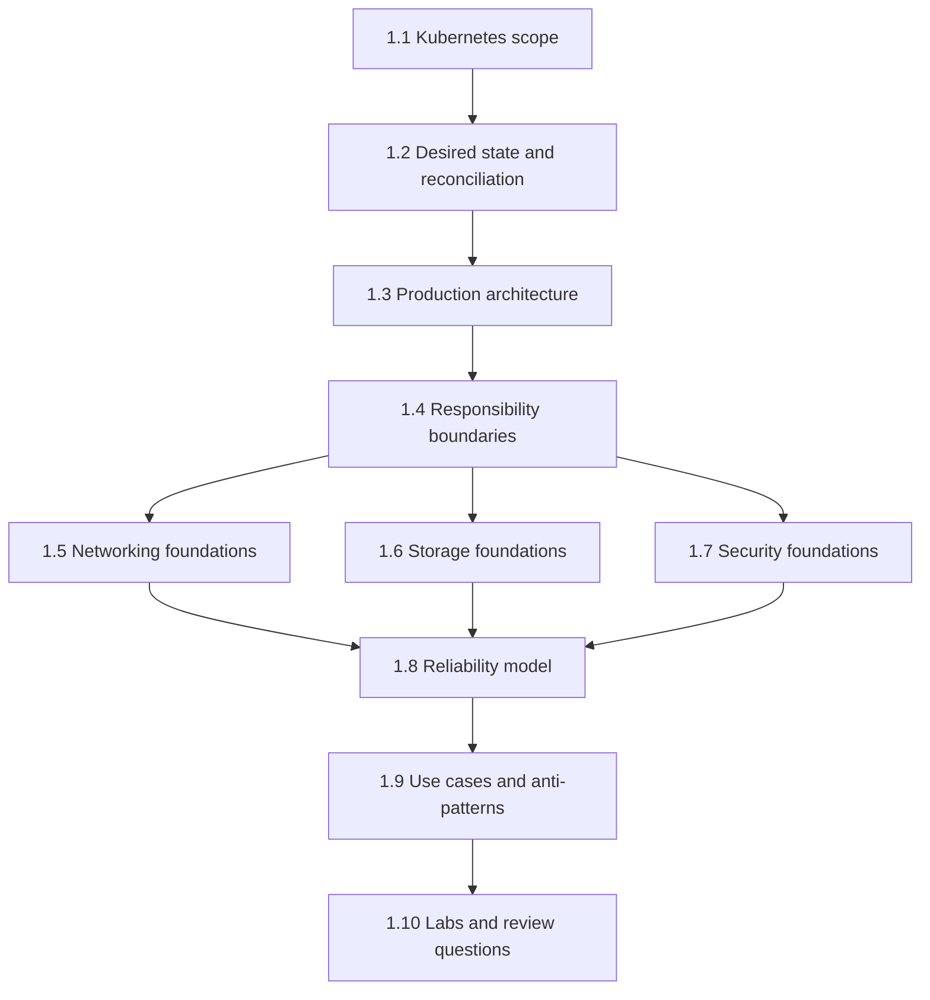

# Chapter 1 Production Reference

## Purpose

This page turns Chapter 1 into a production reference entry point.

The chapter explains the Kubernetes platform foundation. This page explains how to use that material safely in real engineering work: what has
been validated, where behavior depends on implementation, which questions to ask before production use, and how the major Chapter 1 concepts
connect.

## Version and Scope

| Item | Chapter 1 Position |
| --- | --- |
| Kubernetes baseline | Kubernetes v1.34 unless a section states otherwise. |
| Scope | Core Kubernetes concepts and SRE operating model. |
| Provider-specific behavior | Deferred to AWS, Azure, GCP, networking, storage, and security implementation chapters. |
| Publication state | Chapter 1 is published as foundation material. |
| Final-release gate | Labs, SRE practitioner review, and editorial review remain required before final release. |

The version baseline is a review target. It is not a claim that all production clusters run the same version or behave identically.
Kubernetes behavior can depend on the provider, CNI plugin, CSI driver, ingress controller, Gateway API implementation, admission policy,
feature gates, node operating system, and managed-service defaults.

## Production Trust Model

Use Chapter 1 as a production reference with this trust model:

| Trust Layer | Meaning |
| --- | --- |
| Core concept | The concept is grounded in Kubernetes documentation. |
| Operational guidance | The guidance reflects SRE practice built on top of Kubernetes primitives. |
| Provider caveat | Behavior may change across EKS, AKS, GKE, self-managed clusters, or on-prem platforms. |
| Lab caveat | Commands must be executed in a safe test namespace before being copied into production use. |
| Final release caveat | Human SRE review and editorial review are still required for final-release quality. |

## Chapter 1 Map

The chapter should be read as one operating model, not as isolated definitions. Networking, storage, security, and reliability are connected
through the same Kubernetes API, controller, scheduling, node, and provider boundaries.

## Reliability and Responsibility Flow

```mermaid
flowchart LR
  Author["Engineer declares desired state"] --> API["Kubernetes API"]
  API --> Admission["Authentication, authorization, admission"]
  Admission --> Store["etcd state"]
  Store --> Controllers["Controllers reconcile"]
  Controllers --> Scheduler["Scheduler places Pods"]
  Scheduler --> Kubelet["Kubelet runs Pods on nodes"]
  Kubelet --> Service["Services route to ready endpoints"]
  Service --> Users["Users experience service behavior"]
```

Production reliability depends on every step in this flow. Kubernetes can reconcile objects, but application teams still own correctness,
dependency behavior, data safety, and user-facing reliability.

## Production Caveat Matrix

| Area | What Kubernetes Provides | What Engineers Must Still Validate |
| --- | --- | --- |
| Desired state | API objects and controllers | Whether the declared state is safe and sufficient. |
| Architecture | Control-plane and node components | Availability, capacity, upgrades, backups, and ownership. |
| Networking | Services, DNS, EndpointSlices, NetworkPolicy API, Ingress and Gateway APIs | CNI behavior, load balancer behavior, policy enforcement, DNS scale, and ingress implementation. |
| Storage | Volumes, PVCs, PVs, StorageClasses, CSI integration, snapshots API | Driver behavior, reclaim policy, topology, backup, restore, and data consistency. |
| Security | Authentication, authorization, admission, Pod security, Secrets, service accounts | Identity lifecycle, least privilege, secret rotation, audit retention, node hardening, and provider IAM. |
| Reliability | Replicas, probes, rollouts, PDBs, scheduling, autoscaling APIs | Application semantics, dependency behavior, capacity headroom, graceful shutdown, and incident response. |
| Operations | Events, status, logs, metrics integrations | Runbooks, alert quality, escalation paths, and human review. |

## Production Readiness Checklist

Before a workload is treated as production-ready, verify these points.

| Category | Required Review |
| --- | --- |
| Ownership | Service owner, on-call path, escalation path, and business criticality are documented. |
| Kubernetes fit | The workload benefits from Kubernetes rather than only being moved into Kubernetes. |
| Desired state | Manifests describe intentional state, not copied defaults. |
| Rollout | Old and new versions can safely coexist during rollout. |
| Rollback | Rollback is safe after schema, data, or dependency changes. |
| Probes | Startup, readiness, and liveness checks have distinct meanings. |
| Resources | CPU, memory, and ephemeral storage requests are based on evidence. |
| Networking | Service, DNS, ingress, egress, and NetworkPolicy behavior are understood. |
| Storage | PVCs, reclaim policy, backups, restores, and topology are understood. |
| Security | ServiceAccount, RBAC, Pod security, Secrets, and admission controls are reviewed. |
| Reliability | Replicas, PDBs, topology spread, graceful termination, and autoscaling are reviewed. |
| Observability | Logs, metrics, traces, dashboards, alerts, and synthetic checks are available. |
| Dependencies | Database, queue, identity, DNS, registry, and provider dependencies are documented. |
| Recovery | Runbooks and recovery drills exist for common failure modes. |

## Incident Review Checklist

During an incident, do not stop at `kubectl get pods`.

Check these layers:

1. User impact: errors, latency, request volume, and business transactions.
2. Service routing: Service selectors, EndpointSlices, readiness, ingress, and load balancer state.
3. Workload state: Deployment, ReplicaSet, Pod conditions, restarts, and rollout status.
4. Events: scheduling failures, probe failures, image pull errors, admission failures, and evictions.
5. Node state: readiness, pressure, capacity, kernel or runtime symptoms, and zone placement.
6. Storage state: PVC, PV, StorageClass, CSI components, volume attachment, and reclaim risk.
7. Security state: RBAC, ServiceAccount tokens, Secrets, admission denials, and audit logs.
8. Dependencies: database, DNS, identity, registry, cloud APIs, and external services.

## Diagram Review Checklist

The diagrams in this page are intentionally high level. Use them as map views, not implementation diagrams.

| Diagram | Use It To Explain | Do Not Use It To Claim |
| --- | --- | --- |
| Chapter 1 Map | How the sections connect. | That the topics are complete implementation guides. |
| Reliability and Responsibility Flow | How desired state reaches user-facing service behavior. | That Kubernetes guarantees application reliability end to end. |

## Reader Path

For production reference use, read Chapter 1 in this order:

1. Read sections 1.1 through 1.4 to understand the platform model and responsibility boundaries.
2. Read sections 1.5 through 1.7 to understand networking, storage, and security foundations.
3. Read section 1.8 to connect Kubernetes behavior to reliability engineering.
4. Read section 1.9 before approving real workloads.
5. Use section 1.10 to test understanding through labs and review questions.

## Final Production Note

Chapter 1 is a foundation. It should help an engineer ask better production questions and avoid dangerous assumptions. It is not a substitute
for cluster-specific validation.

Before applying guidance to a live environment, confirm the Kubernetes version, provider behavior, CNI, CSI, ingress or Gateway implementation,
admission policy, node model, and operational ownership for that environment.
