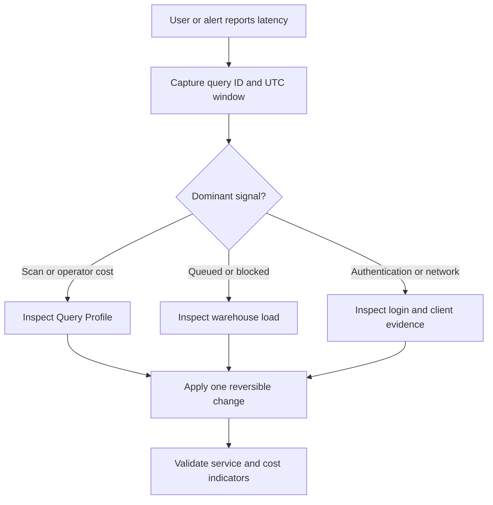
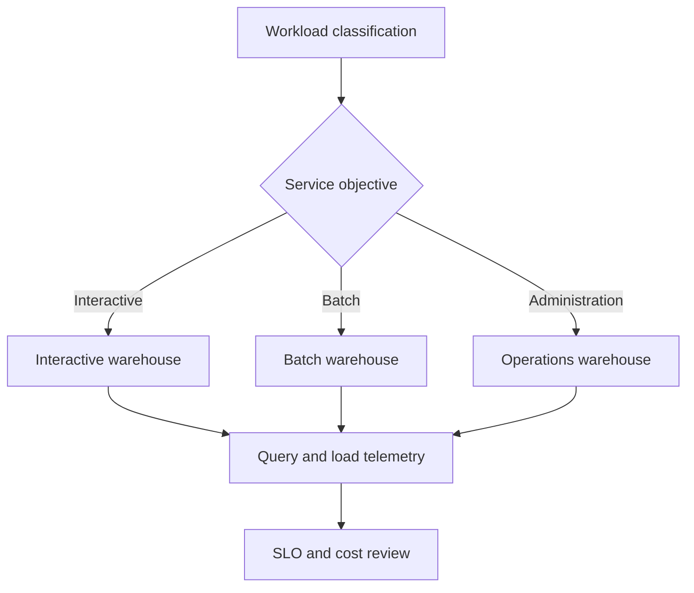
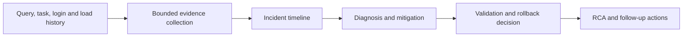
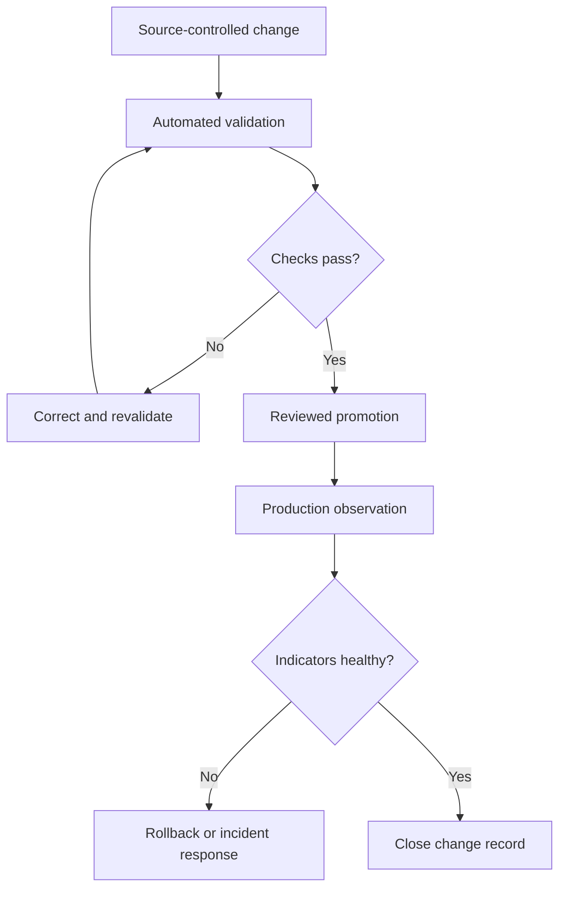

# Snowflake Operational Architecture Diagrams

Version: v1.1.0  
Status: Production Release  
Last reviewed: 2026-08-15

These diagrams are conceptual operating models. They do not describe Snowflake's undisclosed internal implementation and must be adapted to each account, cloud and network design.

## Query investigation flow

## Workload and warehouse isolation

Isolation reduces interference but increases the number of objects and cost controls that operators must govern. It is an engineering decision, not a universal requirement.

## Incident evidence pipeline

## Release and operational control

## Usage guidance

- Use the query flow with the performance-investigation template.
- Use workload isolation with Chapters 6, 9, 10 and 19.
- Use the incident evidence pipeline with every production runbook.
- Use release control with Chapters 12 and 18.
