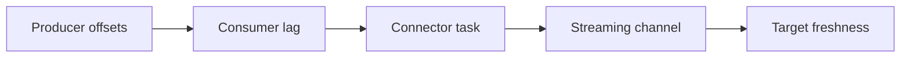

# Case Study: Kafka Ingestion Freshness Breach

Version: v1.5.0
Status: In development
Last vendor validation: 2026-08-16

Fictional composite; all names and measurements are illustrative.

## Incident

Order events remained available in Kafka, but Snowflake query-visible freshness grew from seconds to 24 minutes. Kafka producers were healthy. Connector task restarts increased and one partition accumulated consumer lag.

## Triage model

Responders compared the same partition across all five positions. Snowflake target counts were consistent through the last committed source offset; this established delay rather than silent loss. Connector logs showed repeated buffer-allocation failures after a worker configuration change assigned most host memory to the JVM.

## Root cause and contributors

Root cause: Kafka Connect workers had insufficient off-heap memory for the connector v4 streaming SDK after the JVM heap limit was increased. Contributors were missing host-memory telemetry, a rollout without a canary partition, and an alert based only on aggregate topic lag that hid one hot partition.

## Containment and recovery

The team stopped the rollout, restored the tested worker memory split, restarted one task at a time, and monitored partition offsets against Snowflake channel progress. It did not manually skip offsets. Reconciliation used unique event IDs, partition/offset ranges and target counts; poison records remained in the controlled dead-letter path.

## Corrective actions

- Monitor host, JVM and SDK/off-heap memory together.
- Alert on per-partition consumer lag and target event-time freshness.
- Canary connector upgrades and worker configuration changes.
- Preserve connector version, effective configuration and offset evidence.
- Test worker crash, rebalance, duplicate replay and malformed records before production.
- Define an SLO burn alert before the maximum acceptable replay window is exhausted.

## Validation

Recovery was accepted only when every partition caught up, target event IDs reconciled, no offset gap remained, malformed records were accounted for and freshness stayed within objective across a full peak interval.

## Official references

- [Snowflake Connector for Kafka](https://docs.snowflake.com/en/user-guide/kafka-connector/index)
- [Install and configure connector v4](https://docs.snowflake.com/en/user-guide/kafka-connector/setup-kafka)
- [Migrate v3 to v4](https://docs.snowflake.com/en/user-guide/kafka-connector/migrate-v3-to-v4)
- [Snowpipe Streaming channel history](https://docs.snowflake.com/en/sql-reference/account-usage/snowpipe_streaming_channel_history)
