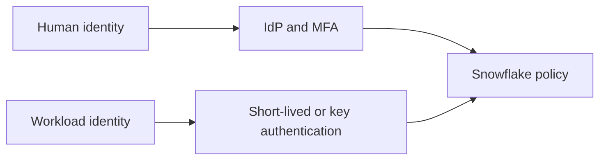

# Human and Workload Authentication Hardening

Version: v1.4.0
Status: In development
Last vendor validation: 2026-08-16

## Target state

- Human users authenticate through federated SSO and strong MFA according to policy.
- Service users use workload identity federation, OAuth, key-pair authentication or another approved programmatic method—not shared passwords.
- Network policies narrow reachable origins where appropriate.
- Break-glass access is isolated, monitored and exercised.



## Implementation sequence

1. Inventory users by `TYPE`, owner, last use, authentication method and network origin.
2. Create pilot authentication and network policies; do not begin with an account-wide enforcement.
3. Migrate human users to SSO/MFA and workloads to dedicated service identities.
4. Rotate key pairs with overlapping public-key slots so clients can transition without downtime.
5. Test permitted and blocked clients, then expand policy coverage in controlled waves.
6. Disable dormant and legacy credentials only after monitoring confirms migration.

```sql
CREATE AUTHENTICATION POLICY security.human_strong_auth
  AUTHENTICATION_METHODS = ('SAML', 'PASSWORD')
  MFA_AUTHENTICATION_METHODS = ('PASSWORD')
  CLIENT_TYPES = ('SNOWFLAKE_UI', 'DRIVERS');

ALTER USER example_person
  SET AUTHENTICATION POLICY security.human_strong_auth;
```

Use the current grammar and approved client list from official documentation; policy support changes over time.

## Controls and recovery

Monitor login history, failed authentication, dormant users, policy coverage, legacy service users and expiring keys. Maintain two separately controlled emergency administrators outside the normal IdP failure domain. If a rollout locks out clients, use the tested break-glass path to revert only the affected user policy, preserve evidence and correct the client before resuming rollout.

## Official references

- [Authentication overview](https://docs.snowflake.com/en/user-guide/security-authentication-overview)
- [Authentication policies](https://docs.snowflake.com/en/user-guide/authentication-policies)
- [Key-pair authentication and rotation](https://docs.snowflake.com/en/user-guide/key-pair-auth)
- [Network policies](https://docs.snowflake.com/en/user-guide/network-policies)

