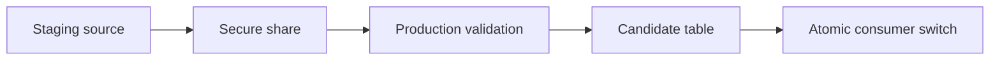

# Cross-Account Data Promotion

Version: v1.4.0
Status: Production Release
Last vendor validation: 2026-08-16

## Use when

Use this pattern to promote a bounded dataset from staging to production in the same region—for example, replacing a production reference table after validation. Prefer Secure Data Sharing for read-only validation before copying.



## Implementation sequence

1. Freeze the source snapshot or record a reproducible high-water mark.
2. Share a secure view to the production account and validate schema, counts, keys and control totals read-only.
3. Materialize into a new production candidate table; never truncate the active table first.
4. Apply production policies, ownership, tags, grants and retention settings to the candidate.
5. Run application and negative access tests.
6. Switch a stable view or approved table indirection atomically, then monitor.

```sql
CREATE TABLE prod.l1.user_permission_v2_candidate
  CLONE prod.l1.user_permission_v2;

TRUNCATE TABLE prod.l1.user_permission_v2_candidate;
INSERT INTO prod.l1.user_permission_v2_candidate
SELECT * FROM staging_import.public.user_permission;
```

Use an explicit column list in production. The abbreviated example emphasizes the staging pattern, not a safe schema-mapping shortcut.

## Controls and rollback

Record source snapshot ID, row count, distinct business keys, duplicates, null controls, hashes for stable partitions and policy/grant comparisons. Quiesce application writes if the table is writable. Roll back by restoring the stable consumer view or renaming the prior table according to the rehearsed procedure; keep both versions until the stabilization window closes.

## Official references

- [Secure Data Sharing](https://docs.snowflake.com/en/user-guide/data-sharing-intro)
- [Consuming shared data](https://docs.snowflake.com/en/user-guide/data-share-consumers)
- [Zero-copy cloning](https://docs.snowflake.com/en/user-guide/object-clone)
- [Transactions](https://docs.snowflake.com/en/sql-reference/transactions)
