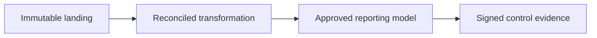

# Financial-Services Control Pipeline

Version: v1.4.0
Status: Production Release
Last vendor validation: 2026-08-16

## Use when

Use this pattern for financial reporting, transaction monitoring or regulatory data where completeness, lineage, approval and reproducibility are as important as query performance.

## Control chain



## Implementation controls

- Assign source, transformation, control and report owners with segregation of duties.
- Retain source batch IDs, file hashes, row counts, monetary control totals and transformation run IDs.
- Use fixed-point `NUMBER` mappings with explicit precision and scale; reject uncontrolled rounding.
- Make business rules versioned code and require peer approval before deployment.
- Apply least-privilege database roles, masking and row policies to account and customer data.
- Prevent report publication unless all critical reconciliations pass or an authorized exception exists.

```sql
SELECT batch_id,
       COUNT(*) AS row_count,
       SUM(transaction_amount) AS amount_total,
       COUNT_IF(account_id IS NULL) AS missing_accounts
FROM finance.landing.transactions
GROUP BY batch_id;
```

## Evidence and recovery

Store validation result, query ID, data timestamp, code version, approver and exception reference in an append-only control log. Reproduce a report from its source snapshot and code version during testing. If a control fails, stop publication, quarantine the batch, preserve evidence, correct and replay from immutable source; do not update the control result to hide the original failure.

## Official references

- [Access History](https://docs.snowflake.com/en/user-guide/access-history)
- [Object tagging](https://docs.snowflake.com/en/user-guide/object-tagging)
- [Time Travel](https://docs.snowflake.com/en/user-guide/data-time-travel)
- [Transactions](https://docs.snowflake.com/en/sql-reference/transactions)
