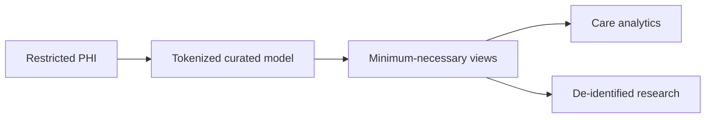

# Healthcare PHI Data Product

Version: v1.4.0
Status: In development
Last vendor validation: 2026-08-16

## Preconditions

Before storing protected health information (PHI), confirm the applicable Snowflake edition, supported region and a signed Business Associate Agreement with Snowflake. The organization remains responsible for its HIPAA risk analysis, policies, workforce controls, application security and evidence.

## Architecture



## Implementation controls

- Separate restricted, curated and published schemas with database roles and managed access.
- Tokenize direct identifiers and keep re-identification capability in a separately controlled boundary.
- Apply row access, masking, projection or aggregation policies according to approved use.
- Tag sensitive fields and monitor access through query and access history.
- Prohibit PHI from unsupported AI features, exports, logs and lower environments.
- Require purpose, owner, retention and minimum-necessary columns for every published product.

```sql
ALTER TABLE healthcare.restricted.patient
  MODIFY COLUMN member_id
  SET MASKING POLICY security.member_id_mask;

ALTER VIEW healthcare.serving.care_gap
  SET ROW ACCESS POLICY security.facility_access ON (facility_id);
```

## Validation and incident response

Test clinician, analyst, research, service and unauthorized roles, including indirect exposure through views and exports. Validate policy behavior after cloning and sharing. On suspected exposure, preserve access/query evidence, contain affected credentials and products, engage privacy/security response, determine notification obligations, and remediate the control before reopening.

## Official references

- [Regulatory compliance](https://docs.snowflake.com/en/user-guide/intro-compliance)
- [Snowflake editions and PHI prerequisite](https://docs.snowflake.com/en/user-guide/intro-editions)
- [Row access policies](https://docs.snowflake.com/en/user-guide/security-row-intro)
- [Column-level security](https://docs.snowflake.com/en/user-guide/security-column-intro)
