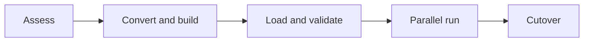

# Validated Enterprise Warehouse Migration

Version: v1.4.0
Status: In development
Last vendor validation: 2026-08-16

## Use when

Use this phased pattern to move a supported legacy warehouse or database to Snowflake while proving semantic and operational equivalence. Snowflake AIM and SnowConvert can accelerate supported migrations, but business acceptance and rollback remain customer responsibilities.

## Waves

1. Inventory objects, workloads, dependencies, security, SLAs, data volume and unsupported constructs.
2. Convert DDL and code, review data-type mappings and deploy dependency-ordered waves.
3. Bulk-load an immutable baseline and start incremental capture for the delta.
4. Validate schema, row counts, control totals, hashes or sampled rows, and representative query results.
5. Run performance, concurrency, security, cost and operations acceptance tests.
6. Freeze source changes, apply and reconcile the final delta, switch consumers, and monitor a defined hypercare period.

## Production controls

- Define numeric precision, time-zone, collation, null, empty-string and transaction-semantic mappings.
- Make every validation query source/target comparable and retain its evidence.
- Separate migration service roles from production owners.
- Rehearse cutover duration and rollback with production-scale volume.
- Declare point-of-no-return criteria, including where writes occur after cutover.
- Coordinate temporary dual-platform cost and decommission timing with FinOps.

## Acceptance and rollback

Require zero unexplained critical reconciliation differences, approved functional tests, workload SLO evidence, access-control tests and operational sign-off. If a stop condition occurs before point of no return, halt target writes, return consumers to the source, preserve target evidence and account for any accepted target writes. Retain the source read-only for the approved stabilization window before decommissioning.

## Official references

- [AIM Agent for Data Warehouses](https://docs.snowflake.com/en/migrations/aim-for-datawarehouses/overview)
- [Data Migration and Validation](https://docs.snowflake.com/en/migrations/aim-for-datawarehouses/data-migration-validation/overview)
- [Data migration](https://docs.snowflake.com/en/migrations/aim-for-datawarehouses/data-migration-validation/data-migration)
- [Data validation](https://docs.snowflake.com/en/migrations/aim-for-datawarehouses/data-migration-validation/data-validation)
