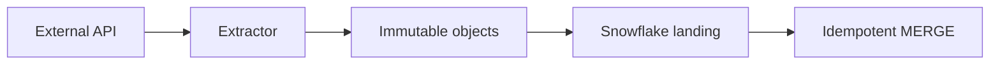

# API Extraction with Durable Micro-Batches

Version: v1.4.0  
Status: In development  
Last vendor validation: 2026-08-16

## Use when

Use this pattern for SaaS and partner APIs that expose pages, cursors or time windows and impose rate limits. The extractor writes immutable response batches to cloud storage; `COPY INTO` or Snowpipe performs the Snowflake load. This separates fragile external calls from database ingestion and makes replay auditable.

## Flow



## Source contract

Before coding, record pagination semantics, rate-limit headers, retryable status codes, cursor lifetime, update/delete representation, time-zone behavior and maximum lookback. Store secrets in a managed secret service and scope the token to read-only endpoints.

## Implementation outline

1. Read the last durable cursor or high-water mark.
2. Request a bounded window with exponential backoff and jitter for retryable responses.
3. Write each raw page to a unique key such as `source/entity/extract_date/run_id/page.json.gz`.
4. Write a manifest containing request window, page keys, hashes, counts and next cursor.
5. Load raw objects into a `VARIANT` landing table with source filename and ingestion timestamp.
6. Validate the manifest, then merge by stable source ID and source update version.
7. Advance the extraction checkpoint only after raw objects and manifest are durable.

```sql
MERGE INTO core.customers t
USING (
  SELECT payload:id::VARCHAR AS id,
         payload:updated_at::TIMESTAMP_TZ AS source_updated_at,
         payload
  FROM raw.api_customers
  QUALIFY ROW_NUMBER() OVER (
    PARTITION BY id ORDER BY source_updated_at DESC, loaded_at DESC
  ) = 1
) s
ON t.id = s.id
WHEN MATCHED AND s.source_updated_at >= t.source_updated_at THEN
  UPDATE SET payload = s.payload, source_updated_at = s.source_updated_at
WHEN NOT MATCHED THEN
  INSERT (id, payload, source_updated_at)
  VALUES (s.id, s.payload, s.source_updated_at);
```

## Production controls

- Monitor extraction age, API errors, rate-limit saturation, pages and rows per run, manifest reconciliation and merge lag.
- Overlap incremental windows when the source permits late updates; deduplicate by source version.
- Keep raw responses for the approved replay and retention period, with sensitive fields protected.
- Detect silent schema drift by comparing observed paths and types with an approved contract.
- Cap concurrency and requests per run so a retry storm cannot amplify source or Snowflake cost.

## Validation and rollback

Test an interrupted page sequence, expired cursor, late update, duplicate page and source deletion. A rerun with the same manifest must produce the same final state. Roll back the curated merge using Time Travel where available or a pre-change clone, while preserving raw objects and manifests for corrected replay.

## Official references

- [Overview of data loading](https://docs.snowflake.com/en/user-guide/data-load-overview)
- [Semi-structured data](https://docs.snowflake.com/en/user-guide/semistructured-concepts)
- [`MERGE`](https://docs.snowflake.com/en/sql-reference/sql/merge)
- [Storage integrations](https://docs.snowflake.com/en/user-guide/data-load-storage-config)

