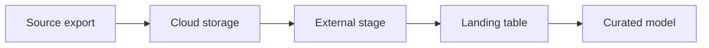

# Bulk Files with `COPY INTO`

Version: v1.4.0
Status: Production Release
Last vendor validation: 2026-08-16

## Use when

Use this pattern for scheduled exports, historical backfills and bounded file drops where minute-level latency is unnecessary. Prefer Snowpipe for continuously arriving files and Snowpipe Streaming when applications must write rows without staging files.

## Flow



## Prerequisites

- A storage integration and named external stage restricted to the required location.
- A dedicated load role with usage on database, schema, stage, file format and warehouse, plus insert on the target.
- A warehouse with auto-suspend and an appropriate resource or budget control.

## Implementation

```sql
CREATE OR REPLACE FILE FORMAT ingest.raw_orders_csv
  TYPE = CSV SKIP_HEADER = 1 FIELD_OPTIONALLY_ENCLOSED_BY = '"'
  ERROR_ON_COLUMN_COUNT_MISMATCH = TRUE;

CREATE OR REPLACE TABLE ingest.orders_landing (
  order_id NUMBER,
  customer_id NUMBER,
  amount NUMBER(18,2),
  source_file VARCHAR,
  loaded_at TIMESTAMP_LTZ
);

COPY INTO ingest.orders_landing
  (order_id, customer_id, amount, source_file, loaded_at)
FROM (
  SELECT $1, $2, $3, METADATA$FILENAME, CURRENT_TIMESTAMP()
  FROM @ingest.orders_stage/inbound/
)
FILE_FORMAT = (FORMAT_NAME = ingest.raw_orders_csv)
ON_ERROR = ABORT_STATEMENT;
```

Validate a new feed before loading it:

```sql
COPY INTO ingest.orders_landing
FROM @ingest.orders_stage/inbound/
FILE_FORMAT = (FORMAT_NAME = ingest.raw_orders_csv)
VALIDATION_MODE = RETURN_ALL_ERRORS;
```

## Production controls

- Write objects under unique, immutable keys; do not overwrite a previously delivered file.
- Reconcile file count, row count and an agreed control total for every batch.
- Quarantine malformed files instead of silently skipping unlimited errors.
- Record the batch ID and source filename in landing data.
- Monitor query history and `LOAD_HISTORY`; alert on failed or unexpectedly small loads.
- Size files and warehouse through measured tests. Avoid promises based on another environment.

`COPY INTO` records file load metadata to prevent the same files being loaded repeatedly into the same table. Do not use `FORCE = TRUE` as a routine replay mechanism; replay into an isolated table or use a controlled idempotent merge.

## Success criteria

1. Validation reports no unexpected parsing errors.
2. Manifest, file and row controls reconcile.
3. A repeat run does not duplicate accepted files.
4. The downstream merge is idempotent by business key and source position.

## Recovery and cleanup

Stop the scheduler, preserve rejected files and load evidence, correct the mapping, then replay only the failed batch. In a lab, drop the landing table, file format and stage only after confirming they are not shared.

## Official references

- [Overview of data loading](https://docs.snowflake.com/en/user-guide/data-load-overview)
- [`COPY INTO table`](https://docs.snowflake.com/en/sql-reference/sql/copy-into-table)
- [Load considerations](https://docs.snowflake.com/en/user-guide/data-load-considerations-load)
- [Transform data during a load](https://docs.snowflake.com/en/user-guide/data-load-transform)
