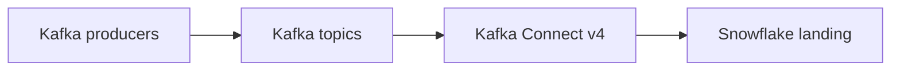

# Kafka Topics with the Snowflake Connector

Version: v1.4.0
Status: In development
Last vendor validation: 2026-08-16

## Use when

Use the Snowflake Connector for Kafka when Kafka Connect is the enterprise integration plane and topics must land in Snowflake with managed partition and offset handling. This guide targets connector v4, which uses the high-performance Snowpipe Streaming architecture. Treat v3-to-v4 as a migration, not an in-place configuration toggle.

## Flow



## Prerequisites

- Supported Kafka broker and Connect runtime versions.
- Connector plugin v4 installed on every worker.
- A Snowflake service identity, target database/schema and least-privilege role.
- An explicit topic-to-table contract, converter choice and schema-compatibility policy.
- Capacity for SDK off-heap buffering in addition to the JVM heap.

## Configuration skeleton

Property names and authentication options change across major releases. Start with the current v4 sample and inject secrets through the Connect secrets provider rather than source control:

```properties
name=snowflake-orders-v4
connector.class=<current v4 connector class>
tasks.max=4
topics=orders.v1
snowflake.url.name=<account-url>
snowflake.user.name=<service-user>
snowflake.database.name=RAW
snowflake.schema.name=KAFKA
snowflake.role.name=KAFKA_INGEST
<topic-to-table mapping>=orders.v1:ORDERS_RAW
```

The placeholders are deliberate: copy the exact v4 class name and property keys from the installed connector's official setup guide and versioned release notes. Validate the effective worker configuration before rollout.

## Production controls

- Pin and record connector version; test upgrades with representative topics and tombstones.
- Map topics explicitly to avoid unexpected table naming or collisions.
- Monitor consumer lag, task state, restart count, rejected records, Snowflake channel lag and target freshness.
- Configure a dead-letter path for records that cannot be converted, with restricted access and replay tooling.
- Decide whether schema evolution is allowed. If allowed, alert on every change and prevent incompatible type changes.
- Canary one connector task and one topic before expanding; keep the prior connector deployment available during migration.

## Validation and rollback

Publish unique test IDs across every partition, stop and restart a worker, introduce one malformed message, and compare Kafka offsets with target rows. Confirm ordered results within each partition and no lost accepted record. Roll back by stopping the new connector, recording committed offsets, restoring the tested prior deployment and replaying from the reconciled position; do not run competing writers against the same target without a designed deduplication key.

## Official references

- [Snowflake Connector for Kafka](https://docs.snowflake.com/en/user-guide/kafka-connector/index)
- [Install and configure the connector](https://docs.snowflake.com/en/user-guide/kafka-connector/setup-kafka)
- [Migrate connector v3 to v4](https://docs.snowflake.com/en/user-guide/kafka-connector/migrate-v3-to-v4)
- [Kafka connector release notes](https://docs.snowflake.com/en/release-notes/clients-drivers/kafka-connector-2026)
