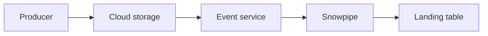

# Event-Driven Files with Snowpipe Auto-Ingest

Version: v1.4.0  
Status: In development  
Last vendor validation: 2026-08-16

## Use when

Use Snowpipe auto-ingest when immutable files arrive throughout the day and should load without a scheduled warehouse job. It uses cloud event notifications; the notification identifies files and does not contain their data.

## Flow



## Prerequisites

- External stage and storage integration scoped to one inbound prefix.
- Cloud notification configuration for S3, Azure Blob Storage or Google Cloud Storage.
- Pipe owner role with the privileges required by its `COPY` statement.
- Agreed freshness and completeness SLOs plus a backfill procedure.

## Implementation

Create and inspect the pipe after the cloud notification path is configured:

```sql
CREATE OR REPLACE PIPE ingest.orders_pipe
  AUTO_INGEST = TRUE
AS
COPY INTO ingest.orders_landing
FROM @ingest.orders_stage/inbound/
FILE_FORMAT = (FORMAT_NAME = ingest.raw_orders_json)
ON_ERROR = CONTINUE;

SHOW PIPES LIKE 'ORDERS_PIPE' IN SCHEMA ingest;
SELECT SYSTEM$PIPE_STATUS('INGEST.ORDERS_PIPE');
```

Use `ON_ERROR = CONTINUE` only with a monitored rejection policy. For a strict feed, abort and quarantine the file. Configure the cloud-specific event destination exactly as shown by `SHOW PIPES` and the applicable provider guide.

## Production controls

- Filter notifications and stage paths to the same dedicated prefix.
- Never overwrite object keys; duplicate or reordered cloud notifications must not change business results.
- Track arrival-to-visible latency, files queued, files loaded, load errors and row reconciliation.
- Query copy history and pipe status; retain source manifests outside Snowflake.
- Pause intentionally and backfill promptly. Snowflake documents a limited notification-retention period and treats long-paused pipes as stale.
- Estimate serverless ingestion cost from measured volume and file cadence; consolidate very small files upstream where practical.

## Failure playbook

1. Confirm the object exists under the stage prefix.
2. Check notification delivery and subscription permissions.
3. Inspect pipe status and copy history.
4. Validate the file format against the failed object.
5. Repair the event path, then use the documented refresh/backfill process for a bounded path and time window.
6. Reconcile before reopening downstream publication.

## Success criteria and rollback

Prove that new files load within the agreed objective, malformed files alert, a notification outage can be backfilled, and repeated events do not duplicate business rows. To retire the pipeline, stop producers, drain and reconcile the queue, unset auto-ingest or drop the pipe, then remove the cloud notification and integration grants in that order.

## Official references

- [Automate continuous loading with cloud messaging](https://docs.snowflake.com/en/user-guide/data-load-snowpipe-auto)
- [Automating Snowpipe for Amazon S3](https://docs.snowflake.com/en/user-guide/data-load-snowpipe-auto-s3)
- [Automating Snowpipe for Azure](https://docs.snowflake.com/en/user-guide/data-load-snowpipe-auto-azure)
- [Automating Snowpipe for Google Cloud Storage](https://docs.snowflake.com/en/user-guide/data-load-snowpipe-auto-gcs)
- [Monitor Snowpipe](https://docs.snowflake.com/en/user-guide/data-load-snowpipe-monitor)

