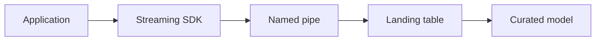

# Application Events with Snowpipe Streaming

Version: v1.4.0
Status: Production Release
Last vendor validation: 2026-08-16

## Use when

Use the high-performance Snowpipe Streaming architecture for applications that must ingest rows directly without creating staged files. Use batch `COPY` when a bounded file workflow is sufficient. Do not mix high-performance SDK examples with Snowpipe Streaming Classic APIs.

## Design



Partition source records into stable channels. Preserve one ordered writer per channel and attach monotonically meaningful source positions as offset tokens. Snowflake offset tokens support recovery and deduplication decisions, but the producer must define its source-of-truth and restart rules.

## Implementation outline

1. Create a narrow landing table and a named pipe using the current high-performance syntax in the official SDK quickstart.
2. Create a least-privilege service principal; prefer workload identity or OAuth where supported and rotate key material.
3. Initialize the supported Java, Python or Node.js SDK with bounded buffers and retry policy.
4. Open deterministic channels such as `orders-00` through `orders-31`.
5. Append validated rowsets with source offsets; persist the producer checkpoint only after confirmed commit.
6. Route conversion failures to an error workflow and expose channel progress as telemetry.

Pseudocode intentionally avoids pinning a fast-changing SDK signature:

```text
channel = open_channel(name = partition_name, offset = recovered_offset)
for batch in source.read_after(recovered_offset):
    validate_schema(batch)
    append_rows(channel, batch.rows, end_offset = batch.last_position)
    wait_for_commit_or_retry()
    checkpoint(batch.last_position)
```

## Production controls

- Track event time to query-visible time, accepted/rejected rows, channel lag, last committed offset, reconnects and throttling.
- Bound in-memory buffering and apply backpressure; do not acknowledge upstream data before a durable recovery position exists.
- Keep schema evolution behind compatibility checks and deployment review.
- Load-test with realistic row sizes and channel counts; documented performance is a design ceiling, not an SLO guarantee.
- Use the Snowpipe Streaming channel history and error facilities appropriate to the current architecture.

## Failure playbook

On restart, compare the producer checkpoint with Snowflake's last committed offset token. Resume from the last defensible position, quarantine conversion failures, and reconcile source-to-target counts and keys. Never skip an offset range merely because a later range committed.

## Success criteria and rollback

Demonstrate process crash recovery, transient network retry, duplicate replay, poison-record isolation and schema incompatibility handling. Roll back by stopping producers, waiting for channel commits, recording final offsets, disabling the client deployment and retaining the landing data for reconciliation.

## Official references

- [Snowpipe Streaming](https://docs.snowflake.com/en/user-guide/snowpipe-streaming/data-load-snowpipe-streaming-overview)
- [High-performance key concepts](https://docs.snowflake.com/en/user-guide/snowpipe-streaming/snowpipe-streaming-high-performance-overview)
- [High-performance best practices](https://docs.snowflake.com/en/user-guide/snowpipe-streaming/snowpipe-streaming-high-performance-best-practices)
- [Error handling](https://docs.snowflake.com/en/user-guide/snowpipe-streaming/snowpipe-streaming-high-performance-error-handling)
