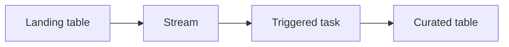

# Incremental Curation with Streams and Triggered Tasks

Version: v1.4.0
Status: In development
Last vendor validation: 2026-08-16

## Use when

Use a stream plus a triggered task when landed table changes should invoke incremental SQL processing without polling on a fixed schedule. Streams expose change-tracking offsets; they do not store a separate copy of table data. Use a dynamic table when a declarative freshness contract better fits the transformation.

## Flow



## Implementation

```sql
CREATE OR REPLACE STREAM ingest.orders_stream
  ON TABLE ingest.orders_landing;

CREATE OR REPLACE TASK ingest.curate_orders
  WAREHOUSE = transform_wh
  WHEN SYSTEM$STREAM_HAS_DATA('INGEST.ORDERS_STREAM')
AS
MERGE INTO core.orders t
USING (
  SELECT order_id, customer_id, amount, loaded_at
  FROM ingest.orders_stream
  WHERE METADATA$ACTION = 'INSERT'
  QUALIFY ROW_NUMBER() OVER (
    PARTITION BY order_id ORDER BY loaded_at DESC
  ) = 1
) s
ON t.order_id = s.order_id
WHEN MATCHED AND s.loaded_at >= t.loaded_at THEN UPDATE SET
  customer_id = s.customer_id,
  amount = s.amount,
  loaded_at = s.loaded_at
WHEN NOT MATCHED THEN INSERT
  (order_id, customer_id, amount, loaded_at)
VALUES
  (s.order_id, s.customer_id, s.amount, s.loaded_at);

ALTER TASK ingest.curate_orders RESUME;
```

Choose warehouse-managed or supported serverless task compute deliberately and apply its relevant cost controls. A triggered task must be resumed before it can run.

## Production controls

- Monitor stream staleness, task state and task history, failed and skipped runs, processing duration and landing-to-curated freshness.
- Make the merge idempotent and deterministic when several changes for one key occur in a batch.
- Define handling for updates and deletes; the insert-only example is insufficient for a full CDC contract.
- Keep enough source and Time Travel retention to prevent an unconsumed stream becoming stale.
- Suspend the task before incompatible table or stream changes.

## Failure playbook

Inspect task history and privileges, confirm the stream has data, validate the merge query in a transaction against cloned objects, then resume. If the stream is stale, rebuild the consumer position from a retained source snapshot or durable raw log—do not guess the missing range.

## Success criteria and rollback

Verify insert, duplicate, update, delete-policy and task-failure scenarios. Reconcile source keys and freshness after recovery. To roll back, suspend the task first, preserve the stream position and evidence, restore or clone the curated table as approved, correct the SQL and replay from the durable landing source.

## Official references

- [Introduction to streams](https://docs.snowflake.com/en/user-guide/streams-intro)
- [Triggered tasks](https://docs.snowflake.com/en/user-guide/tasks-triggered)
- [Task history](https://docs.snowflake.com/en/sql-reference/functions/task_history)
- [`SYSTEM$STREAM_HAS_DATA`](https://docs.snowflake.com/en/sql-reference/functions/system_stream_has_data)
- [`MERGE`](https://docs.snowflake.com/en/sql-reference/sql/merge)
