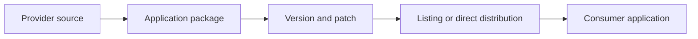

# Snowflake Native App Delivery

Version: v1.4.0
Status: In development
Last vendor validation: 2026-08-16

## Use when

Use the Native App Framework when application logic should be packaged, versioned and installed in a consumer account so consumer data remains under consumer control. The framework is generally available on supported platforms; verify regional and connectivity constraints.



## Delivery workflow

1. Define a minimal application package, manifest and idempotent setup script.
2. Request only privileges and references required for the stated function.
3. Add versions and patches through a controlled release channel.
4. Install and upgrade in a provider-owned test consumer account.
5. Run security review and resolve findings before external distribution.
6. Publish support, telemetry, upgrade and uninstall behavior with the listing.

```sql
CREATE APPLICATION PACKAGE analytics_app_pkg;
ALTER APPLICATION PACKAGE analytics_app_pkg
  ADD VERSION V1_0 USING '@app_src/v1_0';

CREATE APPLICATION analytics_app_test
  FROM APPLICATION PACKAGE analytics_app_pkg
  USING VERSION V1_0;
```

Syntax and manifest capabilities evolve; use Snowflake CLI templates and current official examples for the selected release-channel model.

## Production controls

- Include all reviewable code and dependencies in the package; prohibit plaintext consumer secrets.
- Explain every requested permission and reference in business terms.
- Separate provider development, release and consumer-test duties.
- Test install, upgrade, downgrade policy, revoked reference, partial setup and uninstall.
- Monitor app events only through approved telemetry and disclosure; avoid collecting consumer data unnecessarily.
- Define cost responsibility for warehouses, serverless features and containers.

## Rollback

Promote changes through release channels with a tested maintenance policy. If an upgrade fails, stop promotion, preserve consumer-visible evidence, execute the documented compatible recovery, and publish an advisory. Never assume provider access to a consumer account for repair.

## Official references

- [Native App Framework](https://docs.snowflake.com/en/developer-guide/native-apps/native-apps-about)
- [Native App workflow](https://docs.snowflake.com/en/developer-guide/native-apps/native-apps-workflow)
- [Application packages](https://docs.snowflake.com/en/developer-guide/native-apps/creating-app-package)
- [Security requirements](https://docs.snowflake.com/en/developer-guide/native-apps/security-app-requirements)
