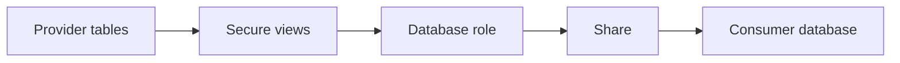

# Policy-Protected Secure Data Sharing

Version: v1.4.0
Status: In development
Last vendor validation: 2026-08-16

## Use when

Use Secure Data Sharing when another Snowflake account needs current provider data without copying it. The provider retains the stored data; the consumer supplies compute for queries. For strict exposure control, publish secure views or secure UDFs rather than base tables.



## Provider implementation

```sql
CREATE OR REPLACE SECURE VIEW shared_product.serving.v_orders AS
SELECT order_date, region_id, order_count, net_sales
FROM product_sales.model.daily_region_sales;

CREATE DATABASE ROLE shared_product.consumer_reader;
GRANT USAGE ON SCHEMA shared_product.serving
  TO DATABASE ROLE shared_product.consumer_reader;
GRANT SELECT ON VIEW shared_product.serving.v_orders
  TO DATABASE ROLE shared_product.consumer_reader;

CREATE SHARE orders_share;
GRANT DATABASE ROLE shared_product.consumer_reader TO SHARE orders_share;
ALTER SHARE orders_share ADD ACCOUNTS = <consumer_account_identifier>;
```

Use current account identifiers and validate the exact role/share syntax in a non-production provider and consumer pair. Future grants do not automatically add new objects to shares; add and review them intentionally.

## Production controls

- Publish a data contract covering columns, grain, freshness, support, retention and breaking changes.
- Apply row access or masking using sharing-aware policy functions and database roles where required.
- Test consumer access and deliberate denial for unauthorized roles, accounts and rows.
- Monitor provider object changes, share grants, consumer query patterns and support-impacting schema changes.
- Do not share streams; consumers can create streams on eligible shared tables or secure views.

## Validation and rollback

In a test consumer account, create the imported database, activate the intended role, reconcile results, and prove restricted data is invisible. To revoke, notify consumers, remove the account or database role from the share, confirm access loss, then retain evidence according to policy. Dropping provider objects before revocation creates an uncontrolled outage.

## Official references

- [Secure Data Sharing](https://docs.snowflake.com/en/user-guide/data-sharing-intro)
- [Share secure database objects](https://docs.snowflake.com/en/user-guide/data-sharing-gs)
- [Secure objects for sharing](https://docs.snowflake.com/en/user-guide/data-sharing-secure-views)
- [Share policy-protected data](https://docs.snowflake.com/en/user-guide/data-sharing-policy-protected-data)
