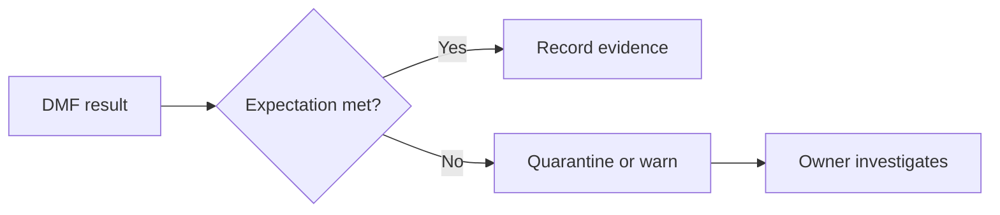

# Automated Data-Quality Contract

Version: v1.4.0
Status: In development
Last vendor validation: 2026-08-16

## Use when

Use Data Metric Functions (DMFs) when quality measurements should run and retain evidence inside Snowflake. Data Quality Monitoring requires Enterprise Edition. A DMF returns a measurement; an expectation or response policy determines whether it is an incident.

## Contract

For each critical data element, define owner, object, metric, evaluation cadence, threshold, severity, notification target, investigation query and replay boundary.

```sql
ALTER TABLE product_sales.model.daily_region_sales
  SET DATA_METRIC_SCHEDULE = 'USING CRON 0 * * * * UTC';

ALTER TABLE product_sales.model.daily_region_sales
  ADD DATA METRIC FUNCTION SNOWFLAKE.CORE.NULL_COUNT
    ON (region_id);
```

Use the exact current DMF association and expectation syntax from the account documentation because supported system functions and notification capabilities evolve.

## Production controls

- Begin with completeness, freshness, uniqueness and validity metrics tied to consumer impact.
- Evaluate after the upstream freshness window; an early check creates false incidents.
- Route failed-record evidence to a restricted location when it contains sensitive values.
- Monitor evaluation failures and missing results separately from expectation violations.
- Track DMF credit consumption in `ACCOUNT_USAGE.DATA_QUALITY_MONITORING_USAGE_HISTORY`.
- Retain an independent reconciliation for critical financial or regulated controls.

## Response flow



## Validation and rollback

Inject a controlled null, duplicate or stale batch in non-production; verify measurement, threshold, notification, evidence access and recovery. Before removing a DMF, preserve its results and replace its control coverage. Suspend or remove an incorrect association rather than lowering a threshold simply to silence alerts.

## Official references

- [Data-quality checks](https://docs.snowflake.com/en/user-guide/data-quality-intro)
- [System DMFs](https://docs.snowflake.com/en/user-guide/data-quality-system-dmfs)
- [Data-quality results](https://docs.snowflake.com/en/user-guide/data-quality-results)
- [Data-quality notifications](https://docs.snowflake.com/en/user-guide/data-quality-notifications)
