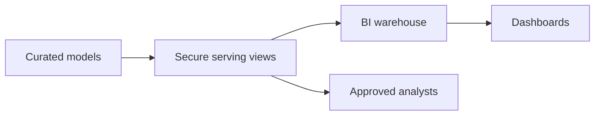

# Governed Dashboard Data Product

Version: v1.4.0
Status: In development
Last vendor validation: 2026-08-16

## Product boundary

A dashboard product owns its curated model, published metrics, secure access surface and operational SLO—not the BI workbook alone.



## Implementation

Publish only contract columns through a secure view where definition privacy is required:

```sql
CREATE OR REPLACE SECURE VIEW product_sales.serving.v_daily_region_sales AS
SELECT sales_date, region_id, net_sales, order_count, data_timestamp
FROM product_sales.model.daily_region_sales;

CREATE DATABASE ROLE product_sales.dashboard_reader;
GRANT USAGE ON SCHEMA product_sales.serving
  TO DATABASE ROLE product_sales.dashboard_reader;
GRANT SELECT ON VIEW product_sales.serving.v_daily_region_sales
  TO DATABASE ROLE product_sales.dashboard_reader;
```

Apply row access and masking policies at the authoritative layer when consumers require different row or column visibility. These controls require supported editions and careful policy-owner separation.

## Production controls

- Version metric definitions, grain, dimensions, accepted filters and time-zone behavior.
- Publish `data_timestamp` and expose freshness separately from dashboard-render time.
- Isolate BI compute, set auto-suspend and monitor queueing, spill, query errors and credits.
- Test every consumer role, including negative access tests and policy mapping failures.
- Define compatible-change, breaking-change and deprecation windows.
- Use query history to identify unused columns and expensive dashboard refresh patterns.

## SLO and recovery

Measure data freshness, successful refresh ratio, query latency, correctness checks and access-policy conformance. If a release fails, point the stable serving view back to the last validated model or restore the prior view definition; never make consumers switch directly to an unvalidated table.

## Official references

- [Secure views](https://docs.snowflake.com/en/user-guide/views-secure)
- [Row access policies](https://docs.snowflake.com/en/user-guide/security-row-intro)
- [Column-level security](https://docs.snowflake.com/en/user-guide/security-column-intro)
- [Database roles](https://docs.snowflake.com/en/user-guide/security-access-control-overview#database-roles)
