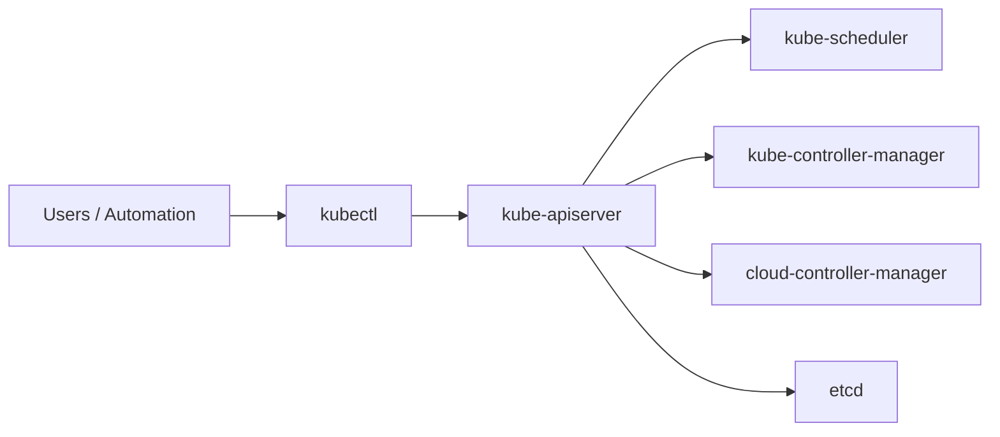
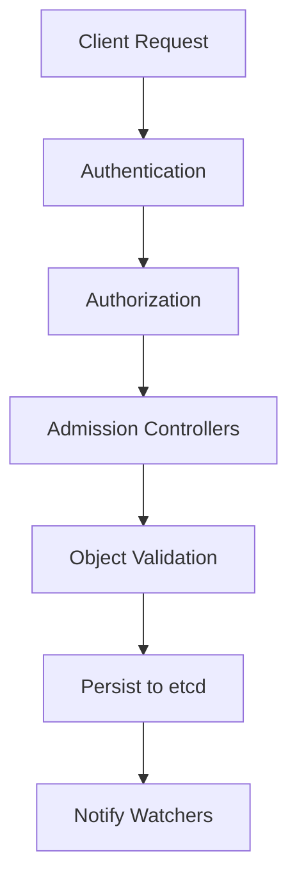

# 7.1 Introduction to the Kubernetes API Server

!!! abstract "Learning Objectives"

    After completing this section, you will be able to:

    - Explain the purpose of the Kubernetes API Server.
    - Understand why Kubernetes follows an API-first architecture.
    - Describe how every Kubernetes component communicates through the API Server.
    - Understand the API Server's role within the Kubernetes control plane.
    - Prepare for the detailed topics covered throughout this chapter.

---

## Introduction

The **Kubernetes API Server (`kube-apiserver`)** is the heart of the Kubernetes control plane. Every interaction with a Kubernetes cluster—whether initiated by a user, an application, an automation pipeline, or another Kubernetes component—ultimately flows through the API Server.

When you execute a command such as:

```bash
kubectl apply -f deployment.yaml
```

the command does **not** communicate directly with worker nodes, Pods, or etcd. Instead, it sends an HTTPS request to the Kubernetes API Server. The API Server authenticates the request, authorizes it, validates the submitted object, executes admission policies, persists the desired state in **etcd**, and notifies other control plane components about the change.

This centralized design provides Kubernetes with a secure, consistent, and extensible method for managing distributed systems at any scale.

---

## Why the API Server Exists

Modern distributed systems consist of many independent components that operate concurrently. Without centralized coordination, these components could make conflicting decisions, overwrite one another's changes, or maintain inconsistent views of the cluster.

Kubernetes solves this challenge by making the API Server the **single authoritative gateway** for all cluster operations.

Instead of allowing components to modify cluster state directly, Kubernetes requires every operation to pass through a common workflow where requests are validated, secured, and recorded before becoming part of the desired cluster state.

This design provides several important advantages:

- Centralized authentication and authorization
- Consistent validation of Kubernetes objects
- Enforcement of admission policies
- Reliable persistence through etcd
- Complete auditability
- Uniform APIs for humans and automation
- Simplified extension through Custom Resource Definitions (CRDs)

---

## The API Server in the Kubernetes Control Plane



**Figure 7.1:** The Kubernetes API Server acts as the communication hub for the control plane.

---

## API Request Lifecycle



---

## API-First Architecture

Everything in Kubernetes is ultimately an API operation. Creating, updating, deleting, scheduling, and monitoring resources all occur through the Kubernetes API Server, providing a consistent and extensible platform for both humans and automation.

---

## Why This Matters for Site Reliability Engineers

Understanding the API Server is essential for diagnosing authentication failures, RBAC issues, admission webhook failures, API latency, etcd bottlenecks, controller reconciliation delays, and other production control-plane problems.

---

## What You Will Learn in This Chapter

- Why Kubernetes Uses an API
- API Server Architecture
- Request Processing Pipeline
- Authentication
- Authorization
- Admission Controllers
- Object Validation
- Storage in etcd
- Watches and Informers
- API Aggregation
- CRDs
- High Availability
- Performance and Scalability
- Security Best Practices
- Monitoring and Observability
- Failure Scenarios and Troubleshooting

---

## Summary

The Kubernetes API Server is the central gateway to every Kubernetes cluster. It validates, secures, stores, and distributes every change made to cluster resources, making it the foundation of Kubernetes' API-driven architecture.

---

## Key Takeaways

- The API Server is the single entry point to the Kubernetes control plane.
- Every Kubernetes operation flows through the API Server.
- Kubernetes uses an API-first architecture.
- Understanding the API Server is fundamental for operating production Kubernetes clusters.

---

## References

- https://kubernetes.io/docs/reference/using-api/
- https://kubernetes.io/docs/reference/using-api/api-concepts/
- https://kubernetes.io/docs/reference/command-line-tools-reference/kube-apiserver/
- https://kubernetes.io/docs/reference/access-authn-authz/authentication/
- https://kubernetes.io/docs/reference/access-authn-authz/authorization/
- https://kubernetes.io/docs/reference/access-authn-authz/admission-controllers/
