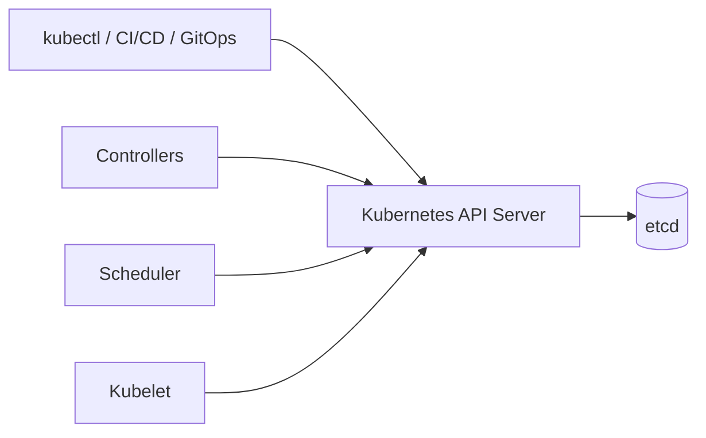

<!-- markdownlint-disable MD025 -->

# Chapter 7 – Kubernetes API Server

# Section 7.2 – Why Kubernetes Uses an API

> **Engineering Principle**
>
> Kubernetes is not a container orchestrator that happens to expose an API. Kubernetes is an **API-driven distributed systems platform** whose orchestration capabilities emerge from a collection of independent control loops coordinated through a single, authoritative API.

# Learning Objectives

- Explain why Kubernetes adopted an API-first architecture.
- Understand the distributed systems challenges that motivated this design.
- Describe how the Kubernetes API becomes the single source of truth.
- Explain desired state and reconciliation.
- Understand how the API enables scalability, extensibility, security, and automation.

# Executive Summary

The Kubernetes API is the heart of the Kubernetes control plane.

Every operation performed in a Kubernetes cluster ultimately passes through the Kubernetes API Server. Rather than allowing components to communicate directly, Kubernetes establishes a single, consistent interface through which all state changes are requested, validated, persisted, observed, and reconciled.

# 7.2.1 Introduction

Imagine managing thousands of Kubernetes nodes and hundreds of thousands of Pods. Every second, Pods start and stop, nodes join and leave, autoscalers react, certificates rotate, and controllers reconcile desired state.

How should every component coordinate these activities without corrupting cluster state?

Kubernetes answers this question by making the API the central coordination mechanism for the entire platform.

Instead of allowing components to modify state independently, every state change passes through the Kubernetes API Server.

## Why This Matters

Many engineers believe `kubectl` directly creates Pods. In reality, `kubectl` is simply an authenticated API client. It submits the desired state to the API Server, and independent controllers perform the orchestration asynchronously.

> **SRE Insight**
>
> `kubectl` performs almost no orchestration itself. It is an API client. The control plane performs the orchestration.

# 7.2.2 Business Motivation

Before Kubernetes, infrastructure teams struggled with:

- Configuration drift
- Manual deployments
- Inconsistent environments
- Slow recovery
- Limited automation
- Difficult scaling

An API-first architecture provided a stable contract between users, automation, and the control plane, enabling declarative infrastructure, extensibility, and large-scale automation.

# 7.2.3 Historical Evolution of Infrastructure Management

## Introduction

Modern Kubernetes did not appear in isolation. Its API-first architecture is the result of decades of lessons learned while operating increasingly complex computing environments. Each generation of infrastructure solved problems from the previous generation while exposing new operational challenges.

Understanding this evolution helps explain **why Kubernetes is designed around a central API instead of direct communication between components**.

---

## The Era of Physical Servers

Early enterprise applications ran directly on dedicated physical servers.

Typical operational workflow:

1. Procure hardware.
2. Install the operating system.
3. Configure networking.
4. Install middleware.
5. Deploy the application.
6. Operate the server manually.

This model worked for small environments but became increasingly difficult to scale.

### Operational Challenges

- Configuration drift between servers.
- Slow provisioning measured in days or weeks.
- Hardware underutilization.
- Manual recovery after failures.
- Difficult capacity planning.

> **Engineering Note**
>
> Physical infrastructure tightly coupled applications to hardware. Scaling usually meant buying more servers rather than dynamically reallocating resources.

---

## Configuration Management

Tools such as Puppet, Chef, CFEngine, and later Ansible introduced Infrastructure as Code concepts.

These tools improved consistency but remained primarily **configuration orchestration** systems. They converged machine configuration, not application state across an entire distributed platform.

They reduced operational effort but did not provide a continuously reconciling control plane.

---

## Virtualization Changed Provisioning

Hypervisors dramatically improved utilization by allowing multiple virtual machines to share a physical host.

Benefits included:

- Faster provisioning
- Better utilization
- Easier disaster recovery
- Snapshot capabilities

However, every virtual machine still required operating system management, patching, monitoring, and lifecycle operations.

Organizations could provision infrastructure faster, but operational complexity continued to grow.

---

## Cloud APIs Changed Expectations

Public cloud platforms introduced programmable infrastructure.

Instead of opening tickets, engineers could create infrastructure through APIs.

Examples included virtual machines, storage volumes, networking, and load balancers created programmatically.

This fundamentally changed infrastructure automation.

Infrastructure became software.

---

## Containers Changed Packaging

Containers standardized application packaging.

Developers could reliably run the same application across laptops, test environments, and production.

While containers solved packaging and portability, they did **not** solve:

- Scheduling
- High availability
- Self-healing
- Service discovery
- Rolling deployments
- Cluster-wide coordination

A higher-level orchestration platform was required.

---

## Borg and Omega

Google faced these problems years before Kubernetes existed.

Large internal clusters required automated scheduling, fault recovery, and coordinated state management.

Projects such as **Borg** and later **Omega** demonstrated that reliable large-scale orchestration required:

- Declarative desired state
- Automated reconciliation
- Central coordination
- Independent control loops
- Extensible APIs

Many architectural ideas from those systems directly influenced Kubernetes.

---

## Why an API Became Essential

As distributed systems grew, direct communication between every component became increasingly complex.

A central API provided several critical advantages:

- A single source of truth
- Consistent validation
- Authentication and authorization
- Optimistic concurrency control
- Event distribution through watches
- Stable contracts for clients and automation

Rather than every component maintaining its own view of the world, Kubernetes established one authoritative interface through the API Server.

> **SRE Insight**
>
> The API is more than an endpoint. It is the coordination layer that allows independent controllers to cooperate without tight coupling. When operating production clusters, API health is one of the strongest indicators of overall control plane health.

---

## Looking Ahead

The historical evolution explains **why Kubernetes needed an API**. The next section examines the distributed systems problems—coordination, consistency, desired state, and reconciliation—that shaped the API-first architecture in detail.
