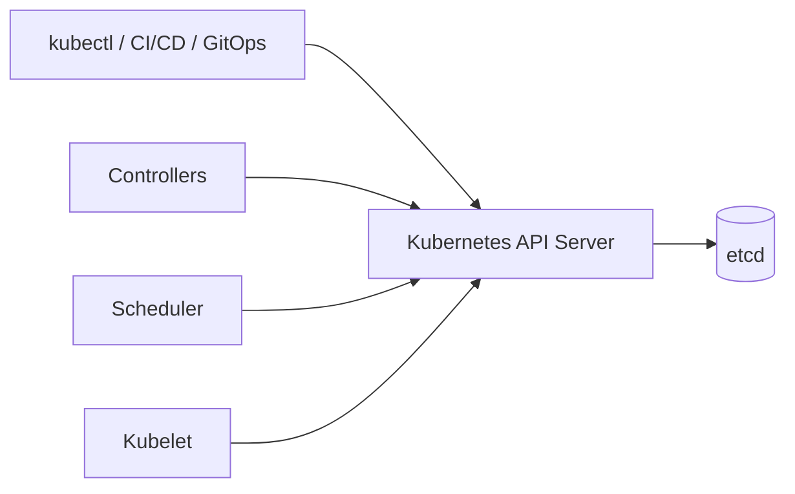
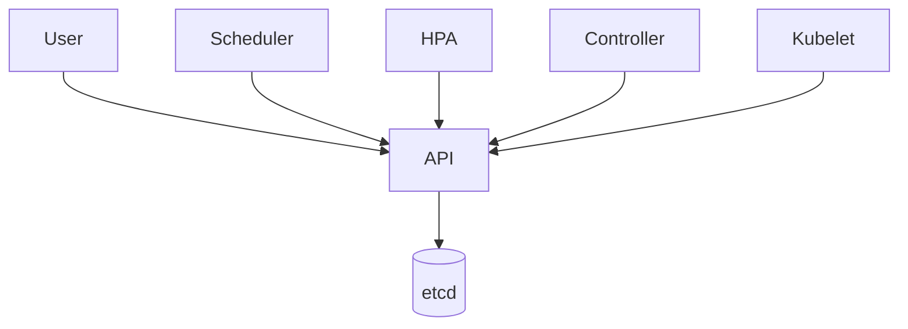
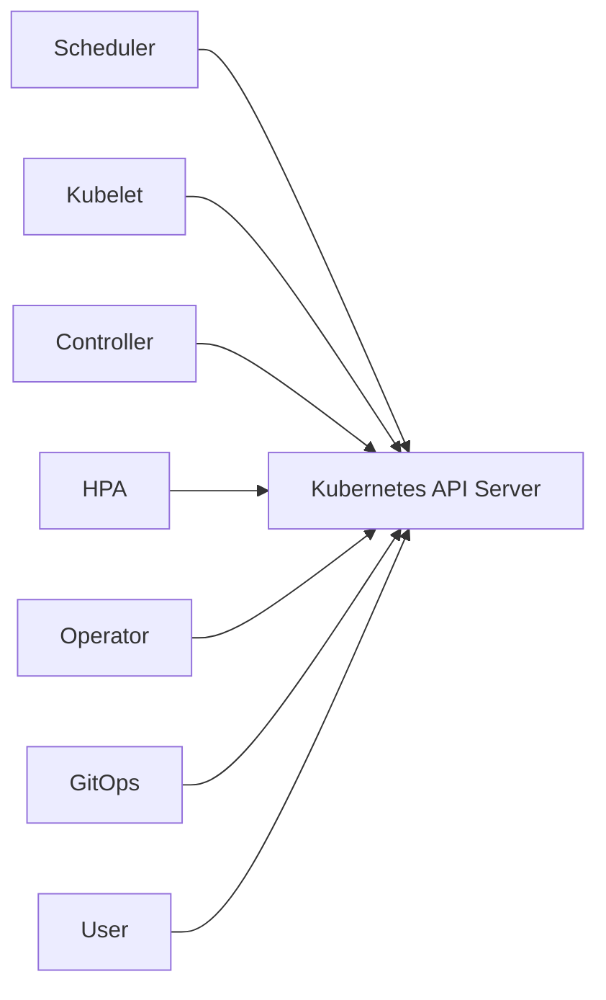
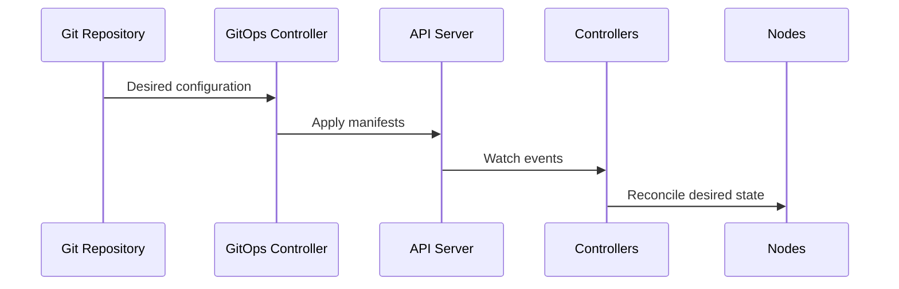

<!-- markdownlint-disable MD024 MD025 -->

# Chapter 7 – Kubernetes API Server

# Section 7.2 – Why Kubernetes Uses an API

> **Engineering Principle**
>
> Kubernetes is not a container orchestrator that happens to expose an API. Kubernetes is an **API-driven distributed systems platform** whose orchestration capabilities emerge from a collection of independent control loops coordinated through a single, authoritative API.

# Learning Objectives

- Explain why Kubernetes adopted an API-first architecture.
- Understand the distributed systems challenges that motivated this design.
- Describe how the Kubernetes API becomes the single source of truth.
- Explain desired state and reconciliation.
- Understand how the API enables scalability, extensibility, security, and automation.

# Executive Summary

The Kubernetes API is the heart of the Kubernetes control plane.

Every operation performed in a Kubernetes cluster ultimately passes through the Kubernetes API Server. Rather than allowing components to communicate directly, Kubernetes establishes a single, consistent interface through which all state changes are requested, validated, persisted, observed, and reconciled.

# 7.2.1 Introduction

Imagine managing thousands of Kubernetes nodes and hundreds of thousands of Pods. Every second, Pods start and stop, nodes join and leave, autoscalers react, certificates rotate, and controllers reconcile desired state.

How should every component coordinate these activities without corrupting cluster state?

Kubernetes answers this question by making the API the central coordination mechanism for the entire platform.

Instead of allowing components to modify state independently, every state change passes through the Kubernetes API Server.

## Why This Matters

Many engineers believe `kubectl` directly creates Pods. In reality, `kubectl` is simply an authenticated API client. It submits the desired state to the API Server, and independent controllers perform the orchestration asynchronously.

> **SRE Insight**
>
> `kubectl` performs almost no orchestration itself. It is an API client. The control plane performs the orchestration.

# 7.2.2 Business Motivation

Before Kubernetes, infrastructure teams struggled with:

- Configuration drift
- Manual deployments
- Inconsistent environments
- Slow recovery
- Limited automation
- Difficult scaling

An API-first architecture provided a stable contract between users, automation, and the control plane, enabling declarative infrastructure, extensibility, and large-scale automation.

# 7.2.3 Historical Evolution of Infrastructure Management

## Introduction

Modern Kubernetes did not appear in isolation. Its API-first architecture is the result of decades of lessons learned while operating increasingly complex computing environments. Each generation of infrastructure solved problems from the previous generation while exposing new operational challenges.

Understanding this evolution helps explain **why Kubernetes is designed around a central API instead of direct communication between components**.

---

## The Era of Physical Servers

Early enterprise applications ran directly on dedicated physical servers.

Typical operational workflow:

1. Procure hardware.
2. Install the operating system.
3. Configure networking.
4. Install middleware.
5. Deploy the application.
6. Operate the server manually.

This model worked for small environments but became increasingly difficult to scale.

### Operational Challenges

- Configuration drift between servers.
- Slow provisioning measured in days or weeks.
- Hardware underutilization.
- Manual recovery after failures.
- Difficult capacity planning.

> **Engineering Note**
>
> Physical infrastructure tightly coupled applications to hardware. Scaling usually meant buying more servers rather than dynamically reallocating resources.

---

## Configuration Management

Tools such as Puppet, Chef, CFEngine, and later Ansible introduced Infrastructure as Code concepts.

These tools improved consistency but remained primarily **configuration orchestration** systems. They converged machine configuration, not application state across an entire distributed platform.

They reduced operational effort but did not provide a continuously reconciling control plane.

---

## Virtualization Changed Provisioning

Hypervisors dramatically improved utilization by allowing multiple virtual machines to share a physical host.

Benefits included:

- Faster provisioning
- Better utilization
- Easier disaster recovery
- Snapshot capabilities

However, every virtual machine still required operating system management, patching, monitoring, and lifecycle operations.

Organizations could provision infrastructure faster, but operational complexity continued to grow.

---

## Cloud APIs Changed Expectations

Public cloud platforms introduced programmable infrastructure.

Instead of opening tickets, engineers could create infrastructure through APIs.

Examples included virtual machines, storage volumes, networking, and load balancers created programmatically.

This fundamentally changed infrastructure automation.

Infrastructure became software.

---

## Containers Changed Packaging

Containers standardized application packaging.

Developers could reliably run the same application across laptops, test environments, and production.

While containers solved packaging and portability, they did **not** solve:

- Scheduling
- High availability
- Self-healing
- Service discovery
- Rolling deployments
- Cluster-wide coordination

A higher-level orchestration platform was required.

---

## Borg and Omega

Google faced these problems years before Kubernetes existed.

Large internal clusters required automated scheduling, fault recovery, and coordinated state management.

Projects such as **Borg** and later **Omega** demonstrated that reliable large-scale orchestration required:

- Declarative desired state
- Automated reconciliation
- Central coordination
- Independent control loops
- Extensible APIs

Many architectural ideas from those systems directly influenced Kubernetes.

---

## Why an API Became Essential

As distributed systems grew, direct communication between every component became increasingly complex.

A central API provided several critical advantages:

- A single source of truth
- Consistent validation
- Authentication and authorization
- Optimistic concurrency control
- Event distribution through watches
- Stable contracts for clients and automation

Rather than every component maintaining its own view of the world, Kubernetes established one authoritative interface through the API Server.



> **SRE Insight**
>
> The API is more than an endpoint. It is the coordination layer that allows independent controllers to cooperate without tight coupling. When operating production clusters, API health is one of the strongest indicators of overall control plane health.

---

## Looking Ahead

The historical evolution explains **why Kubernetes needed an API**. The next section examines the distributed systems problems—coordination, consistency, desired state, and reconciliation—that shaped the API-first architecture in detail.

# 7.2.4 Distributed Systems Background

## Why Distributed Systems Matter

Kubernetes is fundamentally a distributed system. Its architecture was designed to coordinate thousands of independently running processes that may fail, restart, disconnect, or recover at any time.

Understanding the Kubernetes API requires understanding the problems it solves:

- Shared state
- Coordination
- Partial failures
- Concurrent updates
- Event ordering
- Consistency

Rather than allowing every component to communicate directly, Kubernetes introduces the API Server as the authoritative coordination point.

---

## The Coordination Problem

Consider a Deployment requesting ten replicas.

At the same moment:

- the Scheduler assigns Pods,
- kubelets report status,
- the Horizontal Pod Autoscaler evaluates metrics,
- a GitOps controller reconciles configuration,
- and a user edits the Deployment.

Without a central authority, components could overwrite each other's changes or act on stale information.

The API Server serializes state changes, validates requests, and stores the latest desired state in etcd.



---

## Desired State vs. Actual State

Kubernetes separates **desired state** from **actual state**.

Desired state is recorded in the API.

Actual state exists in the cluster.

Controllers continuously compare the two and reconcile differences.


> **Engineering Note**
>
> This reconciliation model is idempotent. Running the same reconciliation loop repeatedly should converge toward the same outcome without causing unintended side effects.

---

## Eventual Consistency

Kubernetes does not guarantee that every component observes changes at exactly the same instant.

Instead, it embraces **eventual consistency**.

A Deployment update is persisted first. Controllers, schedulers, and kubelets observe that change through watches and converge on the desired state over time.

This design favors scalability and resilience over instantaneous synchronization.

---

## Optimistic Concurrency

Multiple clients may update the same resource.

Kubernetes prevents accidental overwrites using object metadata such as `resourceVersion`.

If a client attempts to update an outdated object, the API rejects the request, requiring the client to retrieve the latest version before retrying.

This minimizes locking while preserving correctness.

---

## Watches Instead of Polling

Polling every few seconds wastes resources and increases API load.

Instead, Kubernetes components establish long-lived watch connections.

When an object changes:

1. The API records the update.
2. The change is written to etcd.
3. Watch events are streamed to interested clients.
4. Controllers reconcile the new state.

This event-driven approach scales significantly better than periodic polling.

> **SRE Insight**
>
> Excessive LIST requests often indicate inefficient clients or poorly designed controllers. Healthy production clusters rely primarily on watches backed by shared informers to reduce API load.

---

## Reconciliation Is Continuous

Unlike traditional deployment systems that execute a script once and exit, Kubernetes controllers never stop reconciling.

Every reconciliation loop asks the same question:

> "Does the actual state match the desired state?"

If not, corrective action is taken until convergence is achieved.

This continuous feedback loop is one of the defining characteristics of Kubernetes.

---

## Looking Ahead {#looking-ahead-distributed-systems}

With the distributed systems foundations established, the next section explains why Kubernetes deliberately adopted an API-first architecture and how that decision enables loose coupling, extensibility, and reliable operation at production scale.

# 7.2.5 Why Kubernetes Uses an API

## From Component-Oriented to API-Oriented Architecture

The defining architectural decision in Kubernetes is that **every meaningful state change flows through the Kubernetes API**.

The API is not merely a user interface for `kubectl`; it is the contract that binds the entire control plane together.

Every controller, scheduler, kubelet, cloud controller, admission webhook, Operator, GitOps engine, and automation platform communicates through this shared interface.

---

## Why Direct Communication Was Rejected

Imagine a cluster where every component communicates directly with every other component.

As the number of components grows, the communication paths increase rapidly:

- Scheduler ↔ kubelet
- Scheduler ↔ ReplicaSet controller
- ReplicaSet ↔ Deployment controller
- Deployment ↔ HPA
- HPA ↔ kubelet
- Cloud Controller ↔ Scheduler

This tightly coupled design becomes difficult to evolve, secure, and troubleshoot.

Kubernetes instead uses a hub-and-spoke model centered on the API Server.



The API becomes the single communication contract while each component remains independently deployable.

---

## Single Source of Truth

The API Server, backed by etcd, maintains the authoritative representation of cluster state.

Instead of every component maintaining private state, they all observe and reconcile the same objects.

Benefits include:

- Consistent validation
- Auditable changes
- Predictable reconciliation
- Centralized authentication
- Uniform authorization
- Stable APIs for automation

> **Engineering Note**
>
> Components should never bypass the API and write directly to etcd. Doing so bypasses validation, admission, auditing, and concurrency protections.

---

## Loose Coupling

Loose coupling allows components to evolve independently.

For example:

- A new scheduler implementation can be introduced without modifying kubelets.
- A custom Operator can manage new resource types without changing core Kubernetes code.
- GitOps platforms can reconcile resources without knowing controller internals.

Each component understands Kubernetes resources rather than proprietary interfaces.

---

## Declarative Infrastructure

Users declare the desired outcome instead of the execution steps.

Imperative example:

```text
Start container A
Attach volume
Expose port
Restart on failure
```

Declarative example:

```yaml
replicas: 3
image: nginx:latest
```

Kubernetes determines **how** to achieve that outcome.

This separation enables reconciliation, self-healing, and automation.

---

## Idempotency

API operations are designed around idempotent reconciliation.

Submitting the same desired state repeatedly should not create duplicate infrastructure or inconsistent behavior.

This property is essential for GitOps systems and continuously running controllers.

---

## Extensibility

The API model enables Kubernetes to grow without modifying the core platform.

Examples include:

- Custom Resource Definitions (CRDs)
- Operators
- Aggregated APIs
- Admission Webhooks

These extensions behave like native Kubernetes resources because they participate in the same API machinery.

---

## GitOps and Automation

GitOps platforms do not communicate directly with kubelets or controllers.

Instead, they update Kubernetes resources through the API.

The control plane observes those changes and performs reconciliation.



This architecture cleanly separates **desired configuration** from **execution**.

---

## Production Implications

For SRE teams, API availability directly influences cluster operability.

When the API Server experiences high latency or becomes unavailable:

- Deployments stall.
- Autoscaling slows.
- Controllers cannot reconcile.
- GitOps pipelines fail.
- New Pods may not be scheduled.

Monitoring API health is therefore a primary operational responsibility.

> **SRE Insight**
>
> Treat the Kubernetes API as critical infrastructure. Monitor request latency, error rates, watch performance, and API saturation before they impact the rest of the control plane.

---

## Engineering Trade-offs

The API-first model provides significant benefits but introduces trade-offs.

Advantages:

- Consistency
- Extensibility
- Security
- Loose coupling
- Automation
- Auditability

Trade-offs:

- API Server becomes a critical dependency.
- Poorly written clients can overload the API.
- Large clusters require careful control-plane sizing.
- Admission webhooks may increase request latency.

Successful production platforms recognize these trade-offs and engineer around them using high availability, capacity planning, caching, and efficient controller design.

---

## Looking Ahead {#looking-ahead-api-oriented-architecture}

Having established why Kubernetes centers its architecture around the API, the next section explores the internal design principles of the Kubernetes API, including resources, objects, metadata, versioning, and the mechanisms that enable reliable communication across the control plane.
