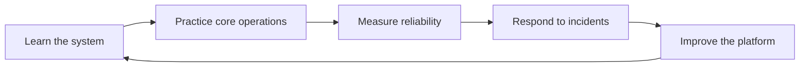

# SRE Academy

SRE Academy is a practical documentation hub for learning how reliable systems are designed, operated, and improved. It is organized around focused books that can grow from foundations into production-ready playbooks.

## Learning paths

<div class="grid cards" markdown>

- **Kubernetes**

    Build operational fluency for clusters, workloads, networking, storage, observability, and incident response.

- **Kafka**

    Learn how to operate event streaming platforms with attention to durability, scaling, lag, and recovery.

- **Elasticsearch**

    Understand search and analytics operations, from indexing strategy to shard health and query performance.

- **Snowflake**

    Capture patterns for warehouse reliability, cost controls, data pipelines, governance, and performance tuning.

- **Redis**

    Document cache, queue, and data structure patterns with clear guidance for persistence, replication, and failover.

- **PostgreSQL**

    Build database reliability practices for schema changes, backups, replication, failover, performance, and operations.

- **MongoDB**

    Learn document database operations for schema design, indexing, replication, backup, sharding, and incident response.

</div>

## Operating model



## Documentation standards

Every page should help readers answer three questions quickly:

1. What problem does this solve?
2. What should I do first?
3. How do I know it worked?

!!! tip "Keep pages actionable"
    Prefer checklists, diagrams, commands, examples, and decision notes over long-form theory alone.

## Local preview

Install the documentation dependencies and start the development server:

```bash
pip install -r requirements.txt
mkdocs serve
```

Then open the local URL printed by MkDocs.

## Publishing

Changes merged to `main` are built by GitHub Actions and deployed to GitHub Pages.
