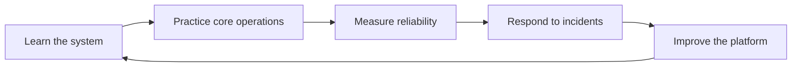

# SRE Academy

SRE Academy is a practical documentation hub for learning how reliable systems are designed, operated, and improved. The catalog is organized around core production technologies, with managed services and supporting tools documented inside the handbooks where they naturally belong.

## Core handbooks

<div class="grid cards" markdown>

- **Enterprise Kubernetes**

    Kubernetes operations, Helm, Kustomize, GitOps, and managed Kubernetes platforms such as EKS, AKS, and GKE.

- **Apache Kafka**

    Kafka operations plus managed Kafka platforms such as Amazon MSK, Azure Event Hubs Kafka protocol, Google Managed Service for Apache Kafka, and Confluent Cloud.

- **Datastores**

    PostgreSQL, MongoDB, Elasticsearch, Redis, and Snowflake.

- **Observability**

    Prometheus and Grafana as flagship observability handbooks, with supporting telemetry tools referenced where appropriate.

- **Platform & Cloud**

    Argo CD, Terraform, AWS, Azure, and GCP.

- **Linux & Networking**

    Linux fundamentals and the Networking handbook for DNS, TCP/IP, HTTP/HTTPS, TLS, load balancing, proxies, ingress, and Gateway API.

</div>

## Operating model



## Documentation standards

Every page should help readers answer three questions quickly:

1. What problem does this solve?
2. What should I do first?
3. How do I know it worked?

!!! tip "Keep pages actionable"
    Prefer checklists, diagrams, commands, examples, and decision notes over long-form theory alone.

## Local preview

Install the documentation dependencies and start the development server:

```bash
pip install -r requirements.txt
mkdocs serve
```

Then open the local URL printed by MkDocs.

## Publishing

Changes merged to `main` are built by GitHub Actions and deployed to GitHub Pages.
