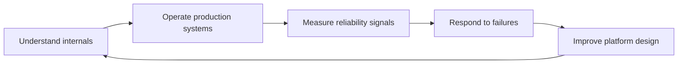

# SRE Academy

SRE Academy is a collection of production-grade SRE and DBRE engineering handbooks.

## Published Handbooks

### PostgreSQL SRE & DBRE Handbook

Production-focused PostgreSQL architecture, reliability engineering, operations, troubleshooting, recovery, and automation guidance.

[Open the PostgreSQL SRE & DBRE Handbook](books/postgresql-sre-dbre-handbook/index.md)

**Published now:** Chapter 1 — PostgreSQL Architecture and Internals, sections 1.1–1.24.

### Kubernetes SRE Engineering Handbook

A professional reference for engineers who design, operate, troubleshoot, and improve Kubernetes platforms in production.

The handbook covers Kubernetes internals, production operations, platform tooling, SRE practices, runbooks, troubleshooting workflows, labs, best practices, and managed Kubernetes platforms.

Use the site navigation to browse the Kubernetes handbook.

### Snowflake Enterprise Handbook

The Snowflake handbook provides enterprise architecture, DBRE and reliability engineering, practical use cases, operational runbooks, and production incident guidance.

Use the site navigation to browse the Snowflake handbook.

## Operating Model

## Publishing

Changes merged to `main` are built by GitHub Actions and deployed to GitHub Pages.
