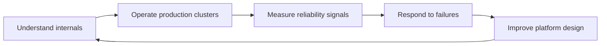

# Kubernetes SRE Engineering Handbook

SRE Academy is now focused on building a production-grade Kubernetes SRE Engineering Handbook.

The goal is to create a professional reference for engineers who design, operate, troubleshoot, and improve Kubernetes platforms in production.

## What This Book Covers

<div class="grid cards" markdown>

- **Kubernetes Internals**

    Control plane architecture, kube-apiserver behavior, scheduling, kubelet operations, etcd interaction, watches, informers, and reconciliation.

- **Production Operations**

    Availability, performance, upgrades, scaling, observability, incident response, failure scenarios, and operational trade-offs.

- **Platform Tooling**

    Helm, Kustomize, GitOps workflows, and managed Kubernetes provider operations for Amazon EKS, Azure AKS, and Google GKE.

- **SRE Practice**

    Runbooks, troubleshooting workflows, labs, best practices, engineering review notes, and interview questions.

</div>

## Book Standard

Every major section should help readers answer these questions:

1. What is this Kubernetes capability?
2. Why does Kubernetes need it?
3. How does it work internally?
4. What happens in production?
5. What breaks under failure or load?
6. How does an SRE detect the problem?
7. How does an SRE fix or mitigate it?
8. How does behavior differ across EKS, AKS, and GKE where relevant?
9. What best practices and trade-offs matter?
10. What labs prove real understanding?

## Current Focus

The active manuscript focus is Chapter 7, the Kubernetes API Server.

Start with the Kubernetes handbook overview or open the Chapter 7 sections from the navigation.

## Operating Model



## Local Preview

Install the documentation dependencies and start the development server:

```bash
pip install -r requirements.txt
mkdocs serve
```

Then open the local URL printed by MkDocs.

## Publishing

Changes merged to `main` are built by GitHub Actions and deployed to GitHub Pages.
