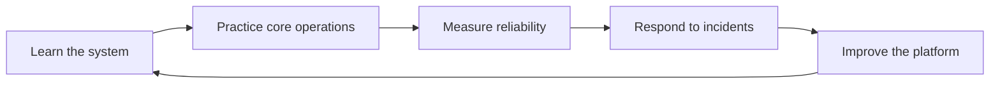

# SRE Academy

SRE Academy is a practical documentation hub for learning how reliable systems are designed, operated, and improved. The handbook catalog is organized by the domains engineers use every day: platforms, observability, messaging, datastores, cloud, delivery, Linux, and networking.

## Handbook domains

<div class="grid cards" markdown>

- **Platform Engineering**

    Kubernetes, Helm, Argo CD, Terraform, and Kustomize.

- **Observability**

    Prometheus, Grafana, OpenTelemetry, Loki, Tempo, and Jaeger.

- **Messaging & Streaming**

    Apache Kafka, Amazon MSK, and future RabbitMQ guidance.

- **Datastores**

    PostgreSQL, MongoDB, Elasticsearch, Redis, Snowflake, MySQL, and future Cassandra guidance.

- **Cloud**

    AWS, Azure, GCP, and Multi-Cloud reliability patterns.

- **DevOps & CI/CD**

    Git, GitHub Actions, Jenkins, Argo Workflows, and future Flux guidance.

- **Linux & Networking**

    Linux, DNS, load balancing, NGINX, and service mesh operations.

</div>

## Operating model



## Documentation standards

Every page should help readers answer three questions quickly:

1. What problem does this solve?
2. What should I do first?
3. How do I know it worked?

!!! tip "Keep pages actionable"
    Prefer checklists, diagrams, commands, examples, and decision notes over long-form theory alone.

## Local preview

Install the documentation dependencies and start the development server:

```bash
pip install -r requirements.txt
mkdocs serve
```

Then open the local URL printed by MkDocs.

## Publishing

Changes merged to `main` are built by GitHub Actions and deployed to GitHub Pages.
